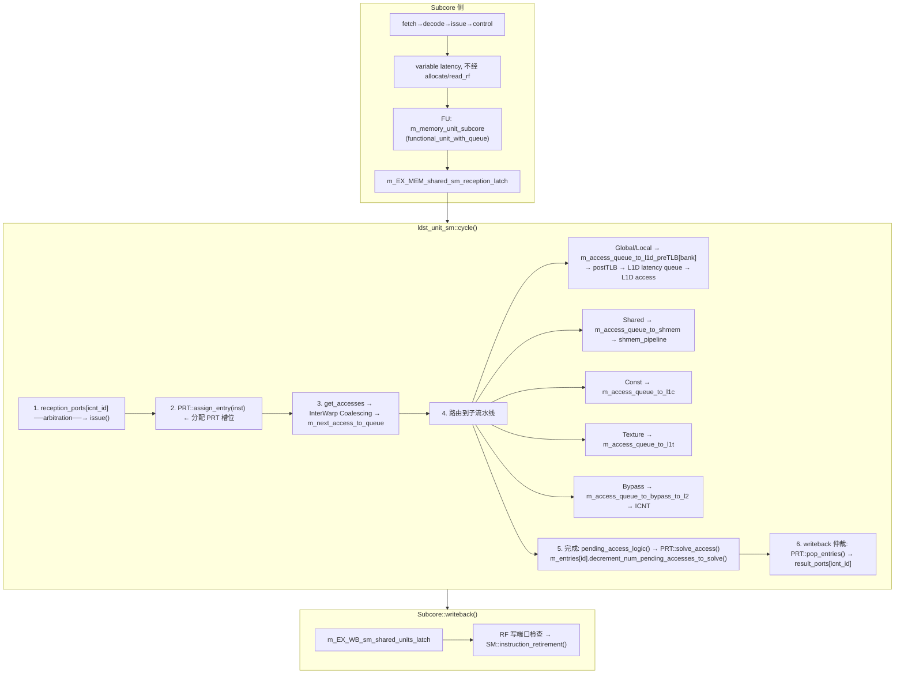
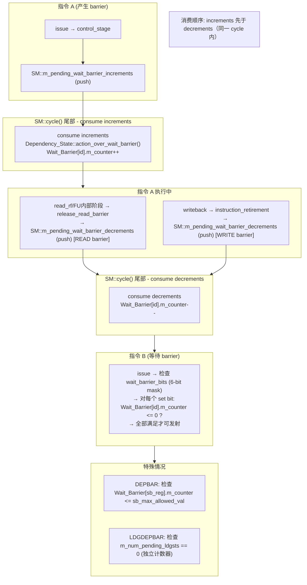

# 第 0 章：关键路径时序图（端到端）

> 本章提供三条核心执行路径的端到端时序图，帮助开发者在深入各模块前建立全局认知。

---

## 术语说明

| 术语 | 英文 | 说明 |
|---|---|---|
| Latch | Latch / Pipeline Register | 流水线级间寄存器，用于在相邻流水级之间传递指令信息。源码中对应 `register_set_uniptr` 类型 |
| Stage | Pipeline Stage | 流水线级，每个 stage 在一个 cycle 内完成特定操作 |
| Pipeline | Pipeline | 多级流水线，指令按序通过各级。Subcore 8 级流水线以逆序执行（writeback → fetch） |
| Stall | Stall | 流水线停顿，当某级条件不满足时指令无法前进。常见原因：FU 占用、barrier 未就绪、RF 端口冲突 |
| Fixed Latency | Fixed Latency | 固定延迟指令路径，经过 allocate/read_rf 阶段，延迟在 issue 时可确定（SP/INT/BRANCH/TENSOR 等） |
| Variable Latency | Variable Latency | 可变延迟指令路径，control 阶段后直接进入 FU，不经过 allocate/read_rf（MEM/SFU/MISC_QUEUE 等） |
| Wait Barrier | Wait Barrier | 基于 control bits 的依赖同步机制，每个 warp 拥有 `num_wait_barriers_per_warp` 个 barrier（默认 6 个），counter 范围 [0, 63] |
| Read Barrier | Read Barrier | 读依赖屏障，在 `release_read_barrier()` 时 decrement，时机取决于 FU 类型 |
| Write Barrier | Write Barrier | 写依赖屏障，在 `instruction_retirement()` 时 decrement |
| PRT | Pending Request Table | 访存指令跟踪表，每条访存指令占一个 entry，跟踪所有 pending memory access |
| Greedy Pointer | Greedy Pointer | Warp 调度中的贪心指针，优先发射上次发射的 warp，然后按 dynamic_warp_id 降序尝试其他 warp |
| Result Queue | RF Write Queue | 固定延迟指令执行完成后的写回队列，分 regular 和 uniform 两种，大小由 `max_size_register_file_write_queue_for_fixed_latency_instructions` 配置 |

---

## 设计规格

### ALU 指令路径延迟规格

| 参数 | 值 | 来源 |
|---|---|---|
| 流水线总级数 | 8 级（fetch → decode → issue → control → allocate → read_rf → execute → writeback）+ retire | `Subcore::cycle()` 逆序调用 |
| read_rf 阶段深度（非 Tensor） | `NO_TENSOR_OP_4REG_PER_OP_LATENCY_READ_FIXED_LATENCY_INST` = 3 cycles | `sm.h` 宏定义 |
| read_rf 阶段深度（Tensor 4-reg） | `MAXIMUM_LATENCY_READ_FIXED_LATENCY_INST` = 6 cycles | `sm.h` 宏定义（3 × 2） |
| issue 到 FU 执行间隔（非 Tensor） | `NUM_INTERMEDIATE_CYCLES_UN_BETWEEN_ISSUE_AND_FU_EXECUTION_FOR_FIXED_LATENCY_INST` = 5 cycles（1 CONTROL + 1 ALLOCATE + 3 READ） | `sm.h` 宏定义 |
| issue 到 FU 执行间隔（Tensor 4-reg） | 8 cycles（1 CONTROL + 1 ALLOCATE + 6 READ） | `sm.h` 宏定义 |
| FU pipeline 深度 | 由 `m_pipeline_depth`（= `max_latency` 参数）决定，SP/INT/BRANCH 等各不相同 | `functional_unit` 构造函数 |
| Predicate 额外级数 | `m_pipeline_extra_predicate_stages_depth` = `config->predicate_latency` | `functional_unit` 构造函数 |
| FU latency 占用位图 | `std::bitset<MAX_ALU_LATENCY>`，`MAX_ALU_LATENCY` = 512 | `functional_unit.h` |

### 访存指令路径延迟规格

| 参数 | 值 | 来源 |
|---|---|---|
| Subcore 侧 FU 类型 | `functional_unit_with_queue`（`m_memory_unit_subcore`） | `Subcore::create_pipeline()` |
| Memory subcore queue 大小 | `config->memory_subcore_queue_size` | `Subcore::create_pipeline()` |
| Memory intermediate stages | `config->memory_intermidiate_stages_subcore_unit` | `Subcore::create_pipeline()` |
| Subcore→SM 共享流水线发射间隔 | `config->num_cycles_to_wait_to_dispatch_another_inst_from_subcore_to_sm_shared_pipeline_when_is_mem_inst` | `functional_unit_with_queue::cycle()` |
| PRT 最大 entry 数 | `m_max_num_entries`（构造时传入） | `PendingRequestTable` 构造函数 |
| PRT 并发处理数 | `m_max_num_entries_to_process_concurrently` | `PendingRequestTable` |
| Writeback 仲裁 | Round-robin，`m_writeback_arb_between_icnt_and_subcores` 每周期 +1 | `ldst_unit_sm::cycle()` |

### Wait-Barrier 同步路径规格

| 参数 | 值 | 来源 |
|---|---|---|
| Barrier 数量/warp | `config->num_wait_barriers_per_warp`（默认 6） | `Dependency_State` 构造函数 |
| Counter 范围 | [0, 63]（`increase_counter()` 中 `assert(m_counter < 63)`） | `warp_dependency_state.cc` |
| Yield 衰减 | `m_yield >>= 1`，初始值 2，1 cycle 后清零 | `Dependency_State::cycle()` |
| Stall counter 衰减 | `m_stall_counter >>= 1`，每 cycle 右移 1 位 | `Dependency_State::cycle()` |
| Pending stack 类型 | `std::stack<Wait_Barrier_Entry_Modifier>`，LIFO 顺序消费 | `sm.h` |
| 消费顺序 | `m_pending_wait_barrier_increments` 先于 `m_pending_wait_barrier_decrements` | `SM::cycle()` 尾部 |

---

## 0.1 ALU 指令路径（fetch → retire）

```mermaid
graph LR
    subgraph CN["Cycle N"]
        F["fetch<br/>───<br/>L0I访问<br/>→IBuffer预分配槽位"]
    end
    subgraph CN1["Cycle N+1"]
        D["decode<br/>───<br/>trace解码 填IBuffer<br/>entry m_valid=true<br/>m_inst=pI"]
    end
    subgraph CN2["Cycle N+2"]
        I["issue<br/>───<br/>检查: stall=0?<br/>yield ready?<br/>barriers ok?<br/>FU可发射?<br/>结果队列有空?"]
    end
    subgraph CN3["Cycle N+3"]
        C["control<br/>───<br/>设置barrier pending<br/>increment →SM stack"]
    end
    subgraph CN4["Cycle N+4"]
        A["allocate<br/>───<br/>RF读端口预留<br/>+FU latency槽位预留"]
    end
    subgraph CN5["Cycle N+5"]
        R["read_rf<br/>───<br/>调用 barrier<br/>release_read_barrier"]
    end
    subgraph CN6["Cycle N+6"]
        E["execute (N cyc)<br/>───<br/>FU pipeline 推进<br/>inst进入 m_pipeline_reg[]"]
    end
    subgraph CN7["Cycle N+7"]
        W["writeback<br/>───<br/>RF写端口检查+写入<br/>→结果队列弹出"]
    end
    subgraph CN8["Cycle N+8+"]
        RT["retire<br/>───<br/>SM::instruction_retirement<br/>write barrier pending dec"]
    end

    F -->|"ifetch_buf →<br/>IBuffer_Entry(deque)"| D
    D -->|"ISSUE_CONTROL_latch"| I
    I -->|"CONTROL_ALLOCATE_latch"| C
    C -->|"pipeline_read_stage<br/>_latency_reg[N-1]"| A
    A -->|"read_stage_aux_latch<br/>→FU dispatch_reg"| R
    R -->|"FU内部 pipeline_reg[]"| E
    E -->|"rf_write_queue"| W
    W --> RT
```

固定延迟 ALU 指令（如 SP/FADD）经过完整的 8 级流水线。关键特征：
- **allocate** 同时预留 RF 读端口和 FU latency 槽位
- **read_rf** 阶段会调用 `release_read_barrier()`；是否实际产生 pending decrement 取决于 guard 条件（trace/control bits/scoreboard 模式）
- **execute** 完成后结果进入 `m_regular_fixed_latency_rf_write_queue`，由 writeback 弹出
- **retire** 在 `SM::instruction_retirement()` 中产生 write barrier pending decrement

### 0.1.1 ALU 路径逐周期信号行为表

| Cycle | Stage | 输入信号 | 操作 | 输出信号 | Stall 条件 |
|---|---|---|---|---|---|
| N | fetch | L0I response ready (`m_L0I->is_first_access_ready()`) | 从 L0I 取出 `mem_fetch`，转换为 `local_pc`，填入 `m_inst_fetch_decode_latch` | `m_inst_fetch_decode_latch.m_valid = true` | `m_inst_fetch_decode_latch.m_valid == true`（上一条未消费） |
| N+1 | decode | `m_inst_fetch_decode_latch.m_valid` | 调用 `get_next_inst()` 获取 trace 指令，`single_decode()` 填充 IBuffer entry：`m_valid=true, m_inst=pI` | IBuffer entry valid | fetch latch 无效 |
| N+2 | issue | `IBuffer.is_next_valid()` | Greedy-then-highest-id 调度；检查 stall=0、yield ready、barriers ok、FU 可发射、result queue 有空 | `m_ISSUE_CONTROL_latch` 写入指令 | 任一就绪条件不满足；`m_ISSUE_CONTROL_latch` 非空 |
| N+3 | control | `m_ISSUE_CONTROL_latch.has_ready()` | 设置 barrier pending increment（push 到 `m_pending_wait_barrier_increments`）；fixed latency 指令移入 `m_CONTROL_ALLOCATE_latch` | `m_CONTROL_ALLOCATE_latch` 写入 | `m_CONTROL_ALLOCATE_latch` 非空（fixed latency）；FU `can_issue()` 失败（variable latency） |
| N+4 | allocate | `m_CONTROL_ALLOCATE_latch.has_ready()` | RF 读端口检查 `is_possible_to_read_cacheable()`；FU latency 槽位检查 `is_latency_available()`；成功则 `allocate_reads()` + `reserve_latency()` | `m_pipeline_read_stage_latency_reg[latency-1]` 写入 | RF bank 端口冲突；FU latency 槽位已占用 |
| N+5~N+7 | read_rf | `m_pipeline_read_stage_latency_reg` 非空 | 3 级移位寄存器推进（Tensor 4-reg 为 6 级）；最后一级调用 `release_read_barrier()` + `fu->issue()` | FU dispatch register 写入 | 无（pipeline 内部推进） |
| N+7+ | execute | FU `m_dispatch_reg` 非空 | `dispatch_delay()` 倒计时后进入 `m_pipeline_reg[start_stage]`；pipeline 逐级推进；stage 0 调用 `instruction_finishing_execution()` | 结果写入 `m_rf_write_queue`（有 dst）或直接 retire（无 dst） | `m_pipeline_reg[start_stage]` 非空；result queue 满 |
| N+8+ | writeback | `m_regular_fixed_latency_rf_write_queue.has_ready()` | `writeback_process_fixed_latency_write_queue()` 弹出最多 `max_pops_per_cycle` 条；检查 RF 写端口可用性 | 调用 `SM::instruction_retirement()` | RF 写端口冲突 |

---

## 0.2 访存指令路径（fetch → PRT → L1D → retire）

> 注：图中 ldst_unit_sm 侧的编号表示逻辑阶段，不代表 `ldst_unit_sm::cycle()` 的单周期调用顺序；精确时序见第 7 章。

访存指令的关键特征：
- **control 阶段后直接进入 FU**，不经过 allocate/read_rf（variable latency 路径）
- **read barrier decrement 由 `functional_unit::release_read_barrier()` 触发**，调用点可能位于 `read_rf` 或 FU 内部阶段（与 FU 类型/路径相关）
- **PRT 是访存指令的核心跟踪结构**，每条指令占一个 entry，跟踪所有 pending access
- **InterWarp Coalescing** 在 access 生成后、路由到子流水线前执行合并
- **writeback 仲裁** 在 subcores 和 icnt 之间轮转

### 0.2.1 访存路径逐周期信号行为表

#### Subcore 侧

| Cycle | Stage | 输入信号 | 操作 | 输出信号 | Stall 条件 |
|---|---|---|---|---|---|
| N~N+2 | fetch→decode→issue | 同 ALU 路径 | 同 ALU 路径 | `m_ISSUE_CONTROL_latch` | 同 ALU 路径 |
| N+3 | control | `m_ISSUE_CONTROL_latch.has_ready()` | Barrier increment push；variable latency 指令直接调用 `fu->issue(m_ISSUE_CONTROL_latch)` | FU `m_dispatch_reg` 写入 | `fu->can_issue()` 失败（`m_dispatch_reg` 非空） |
| N+4+ | FU (functional_unit_with_queue) | `m_dispatch_reg` 非空 | 进入 `m_queue`（`m_current_queue_size++`）；RF 非 cacheable 读检查；进入 `m_intermediate_stages`；`release_read_barrier()` 在 `m_num_cycles_to_wait_to_free_WAR` 倒计时后触发 | 最终级调用 `instruction_finishing_execution()` → `m_result_port`（`m_EX_MEM_shared_sm_reception_latch`） | Queue 满（`m_current_queue_size >= m_max_queue_size`）；RF 端口不可用；intermediate stage 非空 |

#### ldst_unit_sm 侧

| 阶段 | 输入信号 | 操作 | 输出信号 |
|---|---|---|---|
| reception | `m_reception_ports[icnt_id]->has_ready()` | Round-robin 仲裁选择 subcore；调用 `ldst_unit_sm::issue()` | PRT entry 分配 |
| PRT assign | `PendingRequestTable::assign_entry(inst)` | 分配空闲 entry（`m_entries_id_free_list.front()`），记录 `m_assignation_cycle` | entry 加入 `m_entries_id_pending_list_to_process` |
| PRT selection | `management_entries_to_process()` | 按策略选择 entry：OLDEST / SAME_LAST_WARP_ID / SAME_LAST_PC / WARPID_N_CLUSTERS / DEP_COUNT_WAIT | entry 加入 `m_current_entries_id_being_processed` |
| access gen | `get_accesses_to_coalescing()` | 生成 `mem_access_t`；InterWarp Coalescing 合并 | `m_next_access_to_queue` |
| routing | `m_next_access_to_queue` 非空 | 按 memory space 路由：Global/Local→`m_access_queue_to_l1d_preTLB[bank]`；Shared→`m_access_queue_to_shmem`；Const→`m_access_queue_to_l1c`；Texture→`m_access_queue_to_l1t`；Bypass→`m_access_queue_to_bypass_to_l2` | 各子流水线 AccessQueue |
| completion | Cache response / bypass response | `pending_access_logic()` → `PRT::solve_access(id)` → `decrement_num_pending_accesses_to_solve()` | 当 pending=0 时 entry 加入 `m_entries_id_pending_list_to_free[icnt_id]` |
| writeback | `PRT::pop_entries(icnt_id)` | Round-robin 仲裁（`m_writeback_arb_between_icnt_and_subcores` 每周期 +1）；弹出完成的 entry | `m_result_ports[icnt_id]` 或 `m_pending_wbs_per_subcore[icnt_id]` |

---

## 0.3 Wait-Barrier 同步路径

Wait-Barrier 的关键特征：
- **两阶段消费**：increment 和 decrement 都先 push 到 SM 级 pending stack，在 `SM::cycle()` 尾部统一消费
- **消费顺序固定**：同一 cycle 内 increments 先于 decrements
- **Read barrier** 的 decrement 统一由 `release_read_barrier()` 触发；调用时机取决于具体 FU 路径（`read_rf` 或 FU 内部阶段）
- **Write barrier** 在指令退休时释放
- **DEPBAR** 允许检查 counter <= 特定值（不仅仅是 0）
- **LDGDEPBAR** 使用独立的 `m_num_pending_ldgsts` 计数器，与 wait barrier 体系分离

### 0.3.1 Wait-Barrier 逐周期信号行为表

| 时间点 | 触发源 | 操作 | 数据流 |
|---|---|---|---|
| issue (Cycle N+2) | `Subcore::issue()` | 检查 barrier 就绪：`are_wait_barriers_ready()` 对 6-bit mask 中每个 set bit 检查 `Wait_Barrier[id].m_counter <= min_val` | `Dependency_State::are_wait_barriers_ready(vector<Wait_Barrier_Checking>)` |
| control (Cycle N+3) | `Subcore::control_stage()` | 若 control bits 指示 `is_new_read_barrier` 或 `is_new_write_barrier`，push increment 到 SM pending stack | `SM::add_pending_wait_barrier_increment()` → `m_pending_wait_barrier_increments.push(Wait_Barrier_Entry_Modifier(...))` |
| read_rf / FU 内部 | `functional_unit::release_read_barrier()` | 若 `!is_remodeling_scoreboarding_enabled && can_set_wait_barriers && is_new_read_barrier`，push read barrier decrement | `SM::add_pending_wait_barrier_decrement(inst, READ_WAIT_BARRIER, barrier_id)` → `m_pending_wait_barrier_decrements.push(...)` |
| writeback | `SM::instruction_retirement()` | 若 control bits 指示 `is_new_write_barrier`，push write barrier decrement；若 `m_is_ldgsts`，直接 `decrease_num_pending_ldgsts()` | `SM::add_pending_wait_barrier_decrement(inst, WRITE_WAIT_BARRIER, barrier_id)` |
| SM::cycle() 尾部 | `SM::cycle()` | 先消费 `m_pending_wait_barrier_increments`（LIFO），再消费 `m_pending_wait_barrier_decrements`（LIFO） | `consume_pending_wait_barrier_actions()` → `Dependency_State::action_over_wait_barrier()` → `Wait_Barrier::increase_counter()` 或 `decrease_counter()` |
| 每周期 | `Subcore::modify_warp_state()` | 对每个 warp 调用 `Dependency_State::cycle()`：`m_yield >>= 1; m_stall_counter >>= 1` | yield 和 stall counter 指数衰减 |

---

## 关键电路描述

### Writeback 仲裁逻辑

Writeback 阶段存在多个来源竞争 RF 写端口和退休通道：

1. **Subcore 内部 writeback 优先级**（`Subcore::writeback()` 调用顺序）：
   - `writeback_process_fixed_latency_write_queue(m_regular_fixed_latency_rf_write_queue, ...)`：Regular RF 固定延迟结果队列，每周期最多弹出 `max_pops_per_cycle` 条
   - `writeback_process_fixed_latency_write_queue(m_uniform_fixed_latency_rf_write_queue, ...)`：Uniform RF 固定延迟结果队列
   - `writeback_latch_proccess(m_EX_WB_sm_variable_latency_latch, ...)`：Variable latency 指令（SFU/MISC_QUEUE）
   - `writeback_latch_proccess(m_EX_WB_sm_shared_units_latch, ...)`：SM 共享单元返回（ldst_unit_sm/DP shared）

2. **RF 写端口仲裁**（`writeback_latch_proccess()` 内部）：
   - 检查目标寄存器的 bank 写端口是否可用：`dst_rf->is_rf_bank_write_port_available_this_cycle(bank_id)`
   - SM 共享单元返回的指令需要额外的多周期写回：`sm_shared_wb_consumed(can_write, num_cycles_needed_to_write_a_reg_from_sm_struct_to_subcore, ...)`
   - 写端口冲突时指令保留在 latch 中等待下一周期

3. **ldst_unit_sm writeback 仲裁**（`ldst_unit_sm::cycle()` 内部）：
   - Round-robin 仲裁器 `m_writeback_arb_between_icnt_and_subcores` 在所有 subcore + icnt_to_shmem 之间轮转
   - 每周期遍历所有 `m_num_icnt_and_subcores_clients` 个客户端，起始点每周期 +1
   - 对每个 `icnt_id` 调用 `writeback(icnt_id)`：先尝试 `PRT::pop_entries(icnt_id)` 弹出完成的 entry，再处理 pending writeback

### PRT 选择策略仲裁

PRT 通过 `management_entries_to_process()` 选择下一批要处理的 entry，支持 6 种策略（`PRTSelectionPolicies` 枚举）：

| 策略 | 枚举值 | 选择逻辑 |
|---|---|---|
| OLDEST | 0 | 选择 `m_entries_id_pending_list_to_process` 队首（FIFO 最老） |
| SAME_LAST_WARP_ID_THEN_OLDEST | 1 | 优先选择与上次相同 `warp_id` 的 entry，fallback 到 OLDEST |
| SAME_LAST_INST_PC_THEN_OLDEST | 2 | 优先选择与上次相同 `pc` 的 entry，fallback 到 OLDEST |
| WARPID_N_CLUSTERS_WITH_OLDEST | 3 | 将 warp_id 分为 N 个 cluster（`number_of_clusters_for_prt_selection`），优先选择最低 cluster_id 中最老的 entry |
| DEP_COUNT_WAIT_GENERIC_THEN_OLDEST | 4 | 优先选择有 warp 在等待其 write barrier dep counter 的 entry，fallback 到 OLDEST |
| DEP_COUNT_WAIT_CHECKING_WARP_ID_THEN_OLDEST | 5 | 同上但额外检查 warp_id 匹配，fallback 到 OLDEST |

OLDEST 策略中还包含 L1D associativity 安全检查：若 entry 目标为 global memory 且经过 L1D，需检查 `can_entry_be_selected_for_processing()` 以避免 reservation fail 导致的死锁。

### Warp 调度仲裁

Issue 阶段的 warp 选择采用 Greedy-then-Highest-Dynamic-ID 策略（`Subcore::order_greedy_then_highest_id()`）：

1. 首先尝试 `m_greedy_pointer_issue` 指向的 warp（上次成功发射的 warp）
2. 然后按 `dynamic_warp_id` 降序排列其余 warp
3. 对每个候选 warp 检查：`is_not_yield && is_stall_counter_0 && are_wait_barriers_ready && is_fu_available && is_not_warp_waiting_in_programmer_barrier && is_not_warp_waiting_ldgdepbar && are_traditional_scoreaboards_ready && is_write_available_result_queue_for_fixed_latency_available`
4. 额外检查 L1C operand ready（constant cache miss 有 `num_const_cache_cycle_misses_before_switch_to_other_warp` 的容忍窗口）

---

## 源码锚点

| 路径 | 关键函数 |
|---|---|
| `subcore.cc` | `fetch()`, `decode()`, `issue()`, `control_stage()`, `allocate()`, `read_rf()`, `execute()`, `writeback()` |
| `sm.cc` | `SM::cycle()`, `SM::instruction_retirement()`, `SM::consume_pending_wait_barrier_actions()` |
| `functional_unit.cc` | `functional_unit::release_read_barrier()`, `functional_unit::cycle()`, `functional_unit::instruction_finishing_execution()` |
| `ldst_unit_sm.cc` | `ldst_unit_sm::issue()`, `ldst_unit_sm::cycle()`, `ldst_unit_sm::writeback()` |
| `warp_dependency_state.cc` | `Dependency_State::cycle()`, `Dependency_State::action_over_wait_barrier()`, `Dependency_State::are_wait_barriers_ready()` |

---

## 参考文档

| 文档 | 说明 |
|---|---|
| 第 2 章：Subcore 流水线与调度 | Subcore 8 级流水线各阶段详细设计 |
| 第 3 章：功能单元与 read barrier 释放 | FU 类型、pipeline 推进、read barrier 释放时机 |
| 第 4 章：指令供应与 IBuffer | L0I → IBuffer → fetch/decode 路径 |
| 第 5 章：寄存器文件 | RF bank 结构、读写端口仲裁、RF cache |
| 第 7 章：共享访存单元与 PRT | ldst_unit_sm 完整流水线、PRT 生命周期、InterWarp Coalescing |
| 第 8 章：依赖状态对象 | Wait Barrier、yield、stall counter 详细设计 |
| MICRO 2025 Paper | Rodrigo Huerta et al., "Modern GPU Simulator" |
