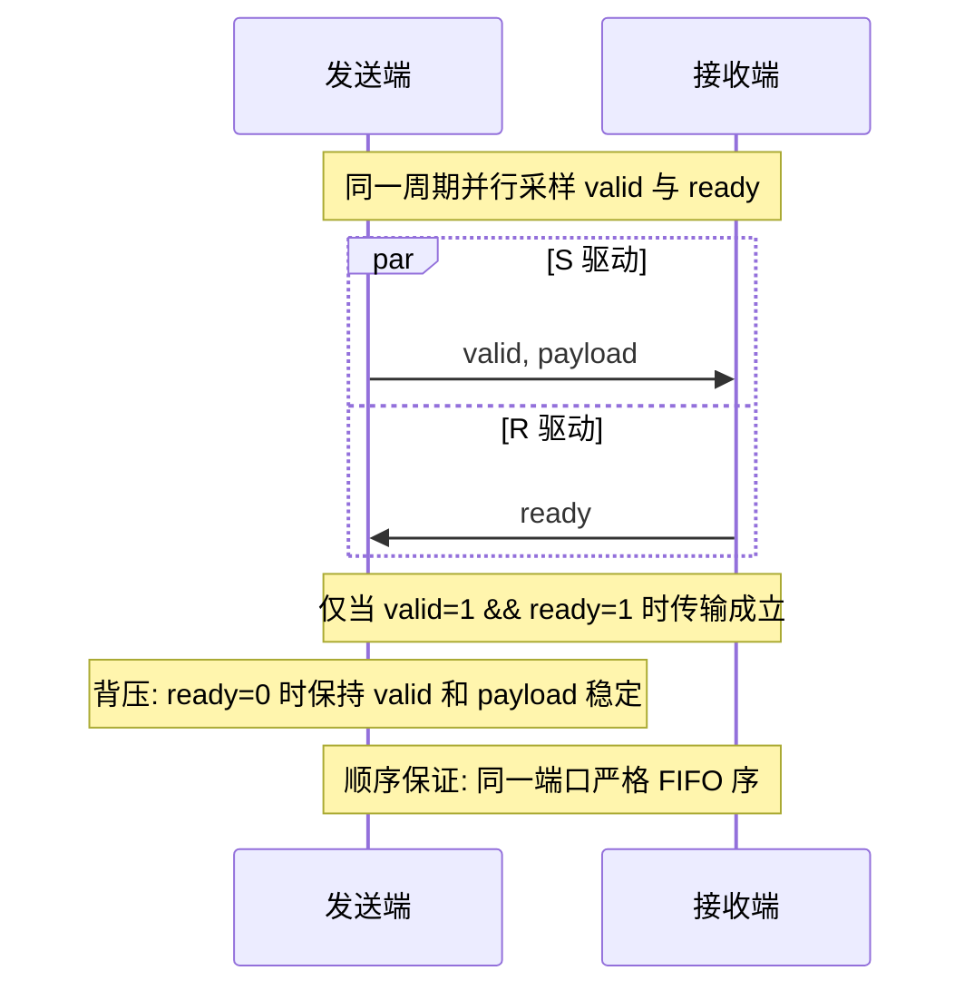
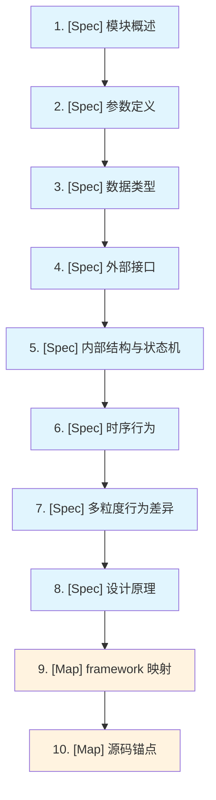

# 第 0A 章：接口规范与映射约定

> 本文档定义硬件手册的写作基线：数据类型、接口协议、多粒度标注、事件映射、以及模块章节模板。所有后续章节必须遵循本规范。

---

## 0A.0 术语说明

| 缩写/术语 | 全称 | 说明 |
|---|---|---|
| CA | Cycle-Accurate | 逐周期精确建模粒度，所有 pipeline stage、仲裁、阻塞点均精确建模 |
| TL | Transaction-Level | 事务级建模粒度，请求/响应对附带可配置延迟参数 |
| FN | Functional | 功能级建模粒度，仅保证功能正确性，零延迟或固定延迟 |
| FIFO | First-In First-Out | 先进先出队列，用于模块间数据缓冲 |
| PRT | Pending Request Table | 待处理请求表，跟踪 SM 级共享访存单元中的在途访存指令 |
| SM | Streaming Multiprocessor | 流多处理器，GPU 核心计算单元 |
| Subcore | Sub-core Partition | SM 内的子核分区，每个 subcore 拥有独立的调度器、RF 和 FU |
| RF | Register File | 寄存器文件，banked 结构，端口有限 |
| RF Cache | Register File Cache | 寄存器文件缓存，缓解 RF bank 冲突 |
| FU | Functional Unit | 功能单元（SP/DP/SFU/Tensor Core/MEM 等） |
| IBuffer | Instruction Buffer | 指令缓冲区，per-warp 的 FIFO 结构（`IBuffer_Remodeled` 使用 `std::deque`） |
| Control Bits | SASS Control Bits | 编译器嵌入 SASS 指令中的调度控制位（stall_count / yield / barrier） |
| Warp | Warp | 32 个线程组成的 SIMT 执行单元（`MAX_WARP_SIZE=32`） |
| CTA | Cooperative Thread Array | 协作线程阵列，即 CUDA block |
| Payload | Payload | 接口传输的数据载荷，如 `warp_inst_core_t`、`mem_req_t` |
| valid/ready | Valid/Ready Handshake | 握手协议，`valid=1 && ready=1` 时传输成立 |
| Barrier | Wait Barrier | 依赖屏障，6 个 slot（id 0~5），每个含 6-bit 计数器（最大值 63） |
| LDGSTS | Load Global Store Shared | 异步全局→共享内存拷贝指令 |
| LOOG | Load Operand Ordering Graph | 操作数排序图，pending write 首键使用 `m_cu_rrs_id` |
| VPREG | Virtual Physical Register | 虚拟物理寄存器，pending write 次键使用 `vpreg_virtual_out` |
| SASS | Shader ASSembly | NVIDIA GPU 原生机器指令格式 |
| PTX | Parallel Thread eXecution | NVIDIA 虚拟指令集架构 |

---

## 0A.0B 设计规格

本规范文档定义以下能力：

| 规格项 | 说明 |
|---|---|
| 核心 Payload 类型数量 | 3 种：`warp_inst_core_t`（指令）、`mem_req_t`/`mem_rsp_t`（访存）、`wait_barrier_mod_t`（barrier 操作） |
| `warp_inst_core_t` 字段数 | 25 个硬件必要信号，从 `warp_inst_t`（~60+ 软件字段）中抽取 |
| `mem_req_t` 字段数 | 8 个核心信号，从 `mem_fetch`（~30+ 软件字段）中抽取 |
| 接口协议 | valid/ready 握手（默认）、参数化深度 FIFO |
| 多粒度标注 | 3 级：CA（逐周期精确）、TL（事务级）、FN（功能级） |
| 事件分类 | 4 类：数据到达、通道可用、组件唤醒、自定义事件 |
| 枚举编码覆盖 | 6 个核心枚举：`uarch_op_t`（37 值）、`operation_pipeline_t`（8 值）、`special_operations_t`（18 值）、`_memory_space_t`（15 值）、`cache_operator_type`（9 值）、`mem_access_type`（15 值） |
| 模块章节模板 | 10 节标准结构：模块概述→参数定义→数据类型→外部接口→内部结构与状态机→时序行为→多粒度行为差异→设计原理→framework 映射→源码锚点 |
| 软件→硬件映射规则 | 6 种映射模式：register_set→端口、函数调用→端口、容器→FIFO、参数→module parameter、枚举→logic 信号 |
| framework 核心抽象 | 5 个类：`GPUChannel`、`GPUComponent`、`GPUSimEngine`、`GPUEvent`、`GPUEventQueue` |

---

## 0A.1 文档约定：规范层 vs 映射层

每个模块章节包含两个视图：

| 视图 | 标题前缀 | 内容定位 | 消费者 |
|---|---|---|---|
| 规范层 | `[Spec]` | 硬件定义：模块、接口、位宽、协议、时序、状态机、约束 | RTL 工程师、微架构设计者 |
| 映射层 | `[Map]` | 规范语义到具体实现（framework / 软件模型）的落地方式 | 模拟器开发者、framework 集成者 |

规则：

- 规范层是主内容，不出现 C++ 指针、容器、函数调用接口作为主描述。
- 映射层是附录性质，说明规范层如何映射到具体实现。
- framework 只是一个映射目标，不是手册主语义来源。

---

## 0A.2 `[Spec]` 核心数据类型规范

以下 payload 结构体是所有模块共用的接口数据类型。定义为硬件最小必要字段集合，从软件模型 `warp_inst_t` / `mem_fetch` 中抽象而来。

### 0A.2.1 `warp_inst_core_t` — 指令 Payload

从 `warp_inst_t`（~60+ 软件字段）中抽取硬件流水线必要的核心信号。

| 字段组 | 信号名 | 位宽 | 编码/取值 | 语义 |
|---|---|---|---|---|
| **标识** | `pc` | 64 | 虚拟地址 | 指令程序计数器。源自 `address_type = unsigned long long` |
| | `warp_id` | 10 | 0 ~ MAX_WARPS_PER_SM-1 | SM 内全局 warp 编号。典型值 ≤ 64，10 bits 足够覆盖 |
| | `uid` | 32 | 单调递增 | 指令唯一标识，用于调试与追踪 |
| **操作码** | `opcode` | 7 | `uarch_op_t` 枚举（37 个有效值，含 NO_OP=-1） | 微架构操作类型 |
| | `op_pipe` | 3 | `operation_pipeline_t`（8 个值：UNKOWN/SP/DP/INT/SFU/TENSOR/MEM/SPEC） | 目标执行流水线 |
| | `sp_op` | 5 | `special_operations_t`（18 个值：OTHER/INT/MUL24/MUL32/...） | 特殊操作子类型 |
| **寄存器** | `src_reg[0:3]` | 4×8 | 寄存器编号 | 源操作数寄存器地址。硬件核心取前 4 个（`MAX_REG_OPERANDS=32` 中仅前 4 路有物理读端口） |
| | `dst_reg[0:3]` | 4×8 | 寄存器编号 | 目的操作数寄存器地址 |
| | `src_count` | 3 | 0~4 | 有效源操作数个数 |
| | `dst_count` | 3 | 0~4 | 有效目的操作数个数 |
| **执行** | `active_mask` | 32 | 每 bit 对应一个 lane | 动态活跃掩码。源自 `active_mask_t = bitset<MAX_WARP_SIZE>`，`MAX_WARP_SIZE=32` |
| | `latency` | 10 | 周期数 | 执行延迟（FU pipeline 深度） |
| | `initiation_interval` | 10 | 周期数 | 发射间隔（FU 吞吐倒数） |
| **Control Bits** | `stall_count` | 4 | 0~15 | 编译器嵌入的 stall 周期数。从 SASS 编码 bits[3:0] 提取 |
| | `is_yield` | 1 | 0/1 | yield 标志。编码 bit[4] 取反 |
| | `is_new_read_barrier` | 1 | 0/1 | 是否设置新的 read barrier |
| | `id_new_read_barrier` | 3 | 0~5（7=无效） | read barrier 编号 |
| | `is_new_write_barrier` | 1 | 0/1 | 是否设置新的 write barrier |
| | `id_new_write_barrier` | 3 | 0~5（7=无效） | write barrier 编号 |
| | `wait_barrier_bits` | 6 | 6-bit mask | 等待 barrier 掩码，每 bit 对应一个 barrier slot |
| **访存** | `mem_op` | 2 | 0=无, 1=LOAD, 2=STORE, 3=ATOMIC | 访存操作类型 |
| | `data_size` | 8 | 字节数 | 访存数据宽度 |
| | `mem_space` | 4 | `_memory_space_t`（16 个值：undefined/reg/local/shared/...） | 目标存储空间 |
| | `cache_op` | 4 | `cache_operator_type`（14 个值：UNDEFINED/ALL/LAST_USE/...） | cache 操作提示 |
| **依赖** | `is_ldgsts` | 1 | 0/1 | 是否为 LDGSTS（异步全局→共享拷贝）指令 |
| **PRT 跟踪** | `prt_assigned` | 1 | 0/1 | 是否已分配 PRT entry |
| | `prt_id` | 8 | PRT entry 编号 | 分配的 PRT 槽位 |

> 注：`src_reg` / `dst_reg` 取 4 路是硬件物理端口限制。软件模型中 `MAX_REG_OPERANDS=32` 是为了覆盖 Tensor Core 等宽操作数指令的逻辑寄存器列表，但硬件 RF 读写端口仅 4 路。

### 0A.2.2 `mem_req_t` / `mem_rsp_t` — 访存请求/响应 Payload

从 `mem_fetch`（~30+ 软件字段）中抽取。

| 信号名 | 位宽 | 语义 |
|---|---|---|
| `addr` | 64 | 访存地址（虚拟或物理，取决于流水线阶段） |
| `size` | 8 | 数据大小（字节） |
| `access_type` | 4 | `mem_access_type`（15 个值：GLOBAL_ACC_R / LOCAL_ACC_R / ...） |
| `mf_type` | 2 | 请求类型（READ / WRITE / READ_REPLY / WRITE_ACK） |
| `sid` | 10 | 源 SM 编号 |
| `warp_id` | 10 | 源 warp 编号 |
| `subcore_id` | 3 | 源 subcore 编号 |
| `inst` | — | 关联的 `warp_inst_core_t`（仅请求方向携带，响应可省略） |

### 0A.2.3 `wait_barrier_mod_t` — Barrier 操作 Payload

| 信号名 | 位宽 | 语义 |
|---|---|---|
| `pc` | 64 | 产生该操作的指令 PC |
| `sm_warp_id` | 10 | SM 内 warp 编号 |
| `barrier_id` | 3 | barrier 槽位编号（0~5） |
| `barrier_type` | 1 | 0=READ_WAIT_BARRIER, 1=WRITE_WAIT_BARRIER |
| `barrier_action` | 1 | 0=INCREASE_COUNTER, 1=DECREASE_COUNTER |

---

## 0A.3 `[Spec]` 接口协议约定

### 0A.3.1 端口表统一列定义

所有模块的外部接口表使用以下列：

| 列名 | 含义 |
|---|---|
| 信号名 | 端口标识符（硬件命名风格） |
| 方向 | I（输入）/ O（输出） |
| Payload 类型 | 引用 §0A.2 中定义的数据类型 |
| 位宽 | payload 总位宽或 "见类型定义" |
| 协议 | valid/ready、FIFO、寄存器等 |
| 来源/去向 | 连接的对端模块 |
| 粒度差异 | CA/TL/FN 下的行为差异摘要 |

### 0A.3.2 valid/ready 握手协议

所有模块间数据传输的默认协议：



- `valid`：发送端驱动，表示 payload 有效。
- `ready`：接收端驱动，表示可以接受数据。
- 当端口为数组形式（如 `subcore_mem_inst[N-1:0]`），每路独立握手。

### 0A.3.3 FIFO 端口

参数化深度的 FIFO，附加信号：

| 信号 | 方向 | 语义 |
|---|---|---|
| `push_valid` | I | 写入请求 |
| `push_ready` | O | FIFO 未满，可接受写入 |
| `pop_valid` | O | FIFO 非空，有数据可读 |
| `pop_ready` | I | 读取确认 |
| `count` | O | 当前占用深度 |

---

## 0A.4 `[Spec]` 多粒度标注约定

### 0A.4.1 粒度定义

| 粒度 | 缩写 | 含义 | 接口行为 |
|---|---|---|---|
| Cycle-Accurate | CA | 逐周期精确 | 每个 pipeline stage 独立建模；valid/ready 逐周期握手；资源占用、仲裁、阻塞点均精确建模 |
| Transaction-Level | TL | 事务级 | 请求/响应对，附带可配置延迟参数；不建模内部 pipeline stage；并发限制通过容量参数控制 |
| Functional | FN | 功能级 | 仅功能正确性；零延迟或固定延迟；无资源竞争建模 |

### 0A.4.2 各粒度最小必要信息

| 粒度 | 必须定义 | 可省略 |
|---|---|---|
| CA | 阶段划分、资源占用、仲裁策略、阻塞点、逐周期状态转移 | — |
| TL | 事务定义（请求/响应）、延迟参数、并发限制（最大 in-flight 数） | 内部 pipeline stage、逐周期仲裁 |
| FN | 输入→输出映射、异常/边界条件 | 延迟、资源竞争、仲裁 |

### 0A.4.3 标注格式

在接口表的"粒度差异"列中，使用如下格式：

```
CA: 逐周期 valid/ready 握手，受 FU 占用阻塞
TL: 请求后 N 周期响应，N 由参数 xxx_latency 配置
FN: 立即完成，无阻塞
```

---

## 0A.5 `[Spec]` Event-Driven 引擎事件分类

规范层定义事件的语义分类（与具体 framework 无关）：

| 事件类别 | 语义 | 典型触发场景 |
|---|---|---|
| 数据到达事件 | 新数据到达某端口，接收端需要处理 | 指令到达、cache 响应返回、访存完成 |
| 通道可用事件 | 之前因背压阻塞的发送端现在可以重试 | FIFO 腾出空间、下游 ready 恢复 |
| 组件唤醒事件 | 组件内部定时器到期或状态变化需要处理 | stall counter 归零、延迟到期、周期推进 |
| 自定义事件 | 模块特有的控制事件 | barrier 满足、CTA 分配完成 |

---

## 0A.6 `[Map]` 事件与握手的语义映射

本节定义规范层协议到 framework 实现的映射关系。

### 0A.6.1 映射规则表

| 规范层概念 | framework 等价物 | 说明 |
|---|---|---|
| `valid=1 && ready=1` 传输成立 | `GPUChannel::try_send()` 返回 `kOk` | 语义等价：数据成功入队 |
| `ready=0` 背压 | `try_send()` 返回 `kAgain` | 发送端必须等待 `kChannelAvailable` 事件后重试 |
| 背压解除通知 | `kChannelAvailable` 事件 → `on_channel_available()` | 由 `GPUChannel::notify_available()` 在 `on_delivery()` 时调度 |
| 数据到达事件 | `kMsgArrive` 事件 → `on_message()` | `GPUSimEngine::dispatch()` 路由到目标组件 |
| 组件唤醒事件 | `kComponentWake` 事件 → `on_event()` | 用于内部定时器、延迟到期等 |
| 自定义事件 | `kCustom` 事件 → `on_event()` | 模块特有控制逻辑 |

### 0A.6.2 关键约束

- 规范层的 `valid/ready` 是语义约束，不要求 framework 实现中存在物理 `ready` 线网。
- `kAgain` → `kChannelAvailable` 是 framework 对背压/恢复的实现策略，语义上等价于 `ready` 从 0 变 1。
- `GPUChannel` 的 `capacity` 参数对应规范层 FIFO 的深度参数。

### 0A.6.3 framework 核心抽象

| framework 类 | 职责 | 规范层对应 |
|---|---|---|
| `GPUChannel` | 组件间数据传输通道 | 端口 + FIFO |
| `GPUComponent` | 可调度的硬件模块基类 | 模块实例 |
| `GPUSimEngine` | 事件调度引擎 | 全局时钟/事件驱动器 |
| `GPUEvent` | 事件描述（time, type, msg, channel） | 事件 |
| `GPUEventQueue` | 双队列优先级事件队列 | 事件调度器内部 |

---

## 0A.7 `[Spec]` 软件接口到硬件接口映射规则

| 软件结构 | 规范层硬件表示 | framework 映射策略 |
|---|---|---|
| `register_set_uniptr`（1 inst 宽度） | `{valid, ready, warp_inst_core_t payload}` 端口 | `GPUChannel`（capacity=1），`try_send(warp_inst_core_t)` |
| `accept_xxx(mem_fetch*)` 函数调用（输入） | `{valid, ready, mem_req_t payload}` 输入端口 | `on_message()` 处理 `kMsgArrive` 事件 |
| `push(mem_fetch*)` 函数调用（输出） | `{valid, ready, mem_req_t payload}` 输出端口 | `try_send()` 到输出 `GPUChannel` |
| `stack<T>` / `queue<T>` | 深度参数化 FIFO，带 full/empty 信号 | `GPUChannel`（capacity=深度）或组件内部 `std::deque` |
| 配置参数 `unsigned int` | module parameter（编译期或初始化期确定） | 构造函数参数 / 配置结构体 |
| C++ 枚举（如 `op_type`） | 编码后的 logic 信号，附枚举值表 | 直接使用枚举值，序列化时编码 |

---

## 0A.8 `[Spec]` 模块章节标准模板

每个模块章节按以下结构组织：



各节内容要求：

| 节 | 内容 |
|---|---|
| 1. 模块概述 | 一段话说明功能、在 GPU 微架构中的位置与职责边界 |
| 2. 参数定义 | 参数名、含义、取值范围、对位宽/资源规模的影响 |
| 3. 数据类型 | 模块特有的 payload 类型（如果有）；通用类型引用 §0A.2 |
| 4. 外部接口 | Input/Output 端口表，按 §0A.3 列定义；每个端口标注 CA/TL/FN 粒度差异 |
| 5. 内部结构与状态机 | 子模块结构图（硬件术语）；关键状态机定义与转移条件 |
| 6. 时序行为 | CA 模式下的阶段划分与执行顺序；各阶段的输入前提、状态更新、输出结果 |
| 7. 多粒度行为差异 | CA/TL/FN 三种粒度下的行为裁剪规则 |
| 8. 设计原理 | 为什么这样设计（不只是"是什么"）；与真实 GPU 的对应关系（只讲可验证共性） |
| 9. framework 映射 | 每个外部接口的 framework 落地方式；背压与恢复路径；framework 锚点示例 |
| 10. 源码锚点 | 微架构源码锚点（主锚点）；framework 锚点（实现参考锚点，单独标注） |

---

## 0A.9 枚举编码参考

以下枚举的完整值表供各章节引用。

### `uarch_op_t`（op_type）— 37 个值，7 bits

| 值 | 名称 | 值 | 名称 |
|---|---|---|---|
| -1 | NO_OP | 1 | ALU_OP |
| 2 | SFU_OP | 3 | TENSOR_CORE_OP |
| 4 | DP_OP | 5 | SP_OP |
| 6 | INTP_OP | 7 | ALU_SFU_OP |
| 8 | LOAD_OP | 9 | TENSOR_CORE_LOAD_OP |
| 10 | TENSOR_CORE_STORE_OP | 11 | STORE_OP |
| 12 | BRANCH_OP | 13 | BARRIER_OP |
| 14 | MEMORY_BARRIER_OP | 15 | GRID_BARRIER_OP |
| 16 | CALL_OPS | 17 | RET_OPS |
| 18 | EXIT_OPS | 19 | TEXTURE_OP |
| 20 | SURFACE_OP | 21 | HALF_OP |
| 22 | UNIFORM_OP | 23 | PREDICATE_OP |
| 24 | DEPBAR_OP | 25 | LDGDEPBAR_OP |
| 26 | MEMORY_MISCELLANEOUS_OP | 27 | MISCELLANEOUS_NO_QUEUE_OP |
| 28 | MISCELLANEOUS_QUEUE_OP | 100+ | SPECIALIZED_UNIT_1~8_OP |

### `operation_pipeline_t` — 8 个值，3 bits

| 值 | 名称 | 说明 |
|---|---|---|
| 0 | UNKOWN_OP | 未知/未分类 |
| 1 | SP__OP | 单精度/整数流水线 |
| 2 | DP__OP | 双精度流水线 |
| 3 | INTP__OP | 整数流水线（unified 模式下合并到 SP） |
| 4 | SFU__OP | 特殊函数单元 |
| 5 | TENSOR_CORE__OP | Tensor Core |
| 6 | MEM__OP | 访存流水线 |
| 7 | SPECIALIZED__OP | 专用单元 |

### `special_operations_t` — 18 个值，5 bits

| 值 | 名称 | 值 | 名称 |
|---|---|---|---|
| 0 | OTHER_OP | 1 | INT__OP |
| 2 | INT_MUL24_OP | 3 | INT_MUL32_OP |
| 4 | INT_MUL_OP | 5 | INT_DIV_OP |
| 6 | FP_MUL_OP | 7 | FP_DIV_OP |
| 8 | FP__OP | 9 | FP_SQRT_OP |
| 10 | FP_LG_OP | 11 | FP_SIN_OP |
| 12 | FP_EXP_OP | 13 | DP_MUL_OP |
| 14 | DP_DIV_OP | 15 | DP___OP |
| 16 | TENSOR__OP | 17 | TEX__OP |

### `_memory_space_t` — 16 个值，4 bits

| 值 | 名称 | 值 | 名称 |
|---|---|---|---|
| 0 | undefined_space | 1 | reg_space |
| 2 | local_space | 3 | shared_space |
| 4 | sstarr_space | 5 | param_space_unclassified |
| 6 | param_space_kernel | 7 | param_space_local |
| 8 | const_space | 9 | tex_space |
| 10 | surf_space | 11 | global_space |
| 12 | generic_space | 13 | instruction_space |
| 14 | miscellaneous_space | | |

### `cache_operator_type` — 14 个值，4 bits

| 值 | 名称 | SASS 后缀 |
|---|---|---|
| 0 | CACHE_UNDEFINED | — |
| 1 | CACHE_ALL | .ca |
| 2 | CACHE_LAST_USE | .lu |
| 3 | CACHE_VOLATILE | .cv |
| 4 | CACHE_L1 | .nc |
| 5 | CACHE_STREAMING | .cs |
| 6 | CACHE_GLOBAL | .cg |
| 7 | CACHE_WRITE_BACK | .wb |
| 8 | CACHE_WRITE_THROUGH | .wt |

### `mem_access_type` — 15 个值，4 bits

| 值 | 名称 | 值 | 名称 |
|---|---|---|---|
| 0 | GLOBAL_ACC_R | 1 | LOCAL_ACC_R |
| 2 | CONST_ACC_R | 3 | TEXTURE_ACC_R |
| 4 | GLOBAL_ACC_W | 5 | LOCAL_ACC_W |
| 6 | L1_WRBK_ACC | 7 | L2_WRBK_ACC |
| 8 | INST_ACC_R | 9 | L1_WR_ALLOC_R |
| 10 | L2_WR_ALLOC_R | 11 | GRID_BARRIER_ACC |
| 12 | TLB_MISS_ACC_DATA | 13 | TLB_MISS_ACC_INST |
| 14 | NUM_MEM_ACCESS_TYPE | | |

---

## 源码锚点

| 文件 | 关键定义 |
|---|---|
| `abstract_hardware_model.h` | `warp_inst_t`、`register_set`、`address_type`、`active_mask_t`、`MAX_WARP_SIZE`、`MAX_REG_OPERANDS`、枚举定义 |
| `operation_type.h` | `uarch_op_t`（op_type）完整枚举 |
| `mem_fetch.h` | `mem_fetch` 类定义 |
| `warp_dependency_state.h` | `Wait_Barrier_Entry_Modifier`、`Wait_Barrier_Type`、`Wait_Barrier_Action` |
| `control_bits.h` | `control_bits` 类（stall_count / yield / barrier 编码） |
| `HopperArchSim/framework/src/channel/GPUChannel.h` | `GPUChannelStatus`、`try_send()`、`notify_available()` |
| `HopperArchSim/framework/src/engine/GPUEvent.h` | `GPUEventType`（kMsgArrive / kChannelAvailable / kComponentWake / kCustom） |
| `HopperArchSim/framework/src/engine/GPUSimEngine.h` | `dispatch()`、`schedule()`、`run()` |
| `HopperArchSim/framework/src/component/GPUComponent.h` | `on_message()`、`on_channel_available()`、`on_event()` |

---

## 参考文档

| 编号 | 文档 | 说明 |
|---|---|---|
| [1] | NVIDIA Turing Architecture Whitepaper (2018) | Turing SM 微架构参考，sub-core 分区、8 级流水线结构 |
| [2] | NVIDIA Ampere Architecture Whitepaper (2020) | Ampere SM 微架构参考，与 Turing 核心流水线一致性验证 |
| [3] | R. Huerta et al., "Modeling Modern GPU Microarchitecture with SASS and Control Flow Analysis," MICRO 2025 | 本模拟器的核心论文，定义 control-bit 依赖模型、banked RF、L0I 指令缓存、InterWarp Coalescing 等关键设计 |
| [4] | NVIDIA PTX ISA Reference, v8.x | PTX 虚拟指令集参考，操作码语义定义 |
| [5] | NVIDIA CUDA C++ Programming Guide | CUDA 编程模型参考，CTA/warp/thread 层次结构 |
| [6] | Accel-Sim: An Extensible Simulation Framework for Validated GPU Modeling (ISCA 2020) | 基线模拟器参考，本项目在其基础上进行微架构重建 |
| [7] | 香山 BPU 文档规范 | 文档结构参考：术语说明→设计规格→功能描述→接口时序→参考文档 |
| [8] | `abstract_hardware_model.h` | 核心数据类型定义源文件：`warp_inst_t`、枚举、常量（`MAX_WARP_SIZE=32`、`MAX_REG_OPERANDS=32`、`MAX_CTA_PER_SHADER=32`、`MAX_THREAD_PER_SM=4096`） |
| [9] | `control_bits.h` | SASS control bits 解析类：`stall_count`、`is_yield`、`read/write barrier`、`wait_barrier_bits` |
| [10] | `traced_constants.h` | Trace 增强常量定义：`RZ=255`、`PT=7`、`URZ=63`、`TraceEnhancedOperandType` 枚举（15 种操作数类型） |
