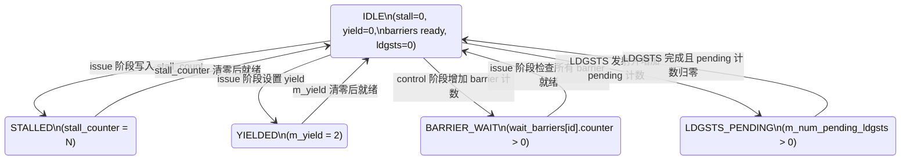

# 第 1 章：总览与假设集合

---

## 1.0 术语说明

| 缩写/术语 | 全称 | 说明 |
|---|---|---|
| True-Path | True Execution Path | 本文档定义的唯一有效执行路径，由 13 个布尔配置参数联合确定 |
| Control Bits | SASS Control Bits | 编译器（`ptxas`）嵌入 SASS 指令中的调度控制位，包含 stall_count（4-bit）、yield（1-bit）、read/write barrier（各 1+3 bit）、wait_barrier_bits（6-bit） |
| Scoreboard | Hardware Scoreboard | 传统硬件记分板，动态检测 RAW/WAW 冒险。在 True-Path 下被禁用（`is_remodeling_scoreboarding_enabled=false`） |
| Dependency_State | Warp Dependency State | 每个 warp 的依赖状态机，包含 stall_counter、yield、6 个 wait barrier（每个含 6-bit 计数器，最大值 63）、LDGSTS pending 计数 |
| Wait Barrier | Wait Barrier | 依赖屏障机制，6 个 slot（id 0~5），支持 READ/WRITE 两种类型，INCREASE/DECREASE 两种操作 |
| IBuffer | Instruction Buffer | 指令缓冲区，per-warp 的 `std::deque` 结构，深度由 `ibuffer_remodeled_size` 配置（典型值 3） |
| L0I | Level-0 Instruction Cache | Subcore 私有的零级指令缓存，配合 stream buffer 预取 |
| L0C | Level-0 Constant Cache | Subcore 私有的零级常量缓存 |
| InterWarp Coalescing | Inter-Warp Memory Coalescing | 跨 warp 访存合并，将多个 warp 的相同地址访存请求合并为一次 cache 访问 |
| PRT | Pending Request Table | 待处理请求表，跟踪 SM 级共享访存单元中的在途访存指令（典型深度 128） |
| Subcore | Sub-core Partition | SM 内的子核分区（典型 4 个），每个拥有独立调度器、RF、FU 集合 |
| RF Cache | Register File Cache | 寄存器文件缓存，按 operand position x bank 组织，缓解 banked RF 的端口冲突 |
| LDGSTS | Load Global Store Shared | 异步全局→共享内存拷贝指令，经历 LOAD_STAGE 和 STORE_STAGE 两个阶段 |
| LOOG | Load Operand Ordering Graph | 操作数排序图，pending write 首键使用 `m_cu_rrs_id` |
| VPREG | Virtual Physical Register | 虚拟物理寄存器映射，pending write 次键使用 `vpreg_virtual_out` |
| MAPE | Mean Absolute Percentage Error | 平均绝对百分比误差，用于评估模拟器精度 |
| SASS | Shader ASSembly | NVIDIA GPU 原生机器指令格式 |
| PTX | Parallel Thread eXecution | NVIDIA 虚拟指令集架构 |

---

## 1.1 文档定位

本文档是 `remodeling/` 模块的开发者实现指南，严格描述 True-Path 假设集合下的单一有效执行路径。所有数据结构、接口契约、时序约束均以源码为准。

---

## 1.1B 设计规格

本模拟器的整体能力规格如下：

| 规格项 | 值 | 源码依据 |
|---|---|---|
| 目标 GPU 架构 | Turing (SM75) / Ampere (SM86) / Ada (SM89) / Blackwell (SM120) | `configs/tested-cfgs/` 目录 |
| SM 内 Subcore 数量 | 4（可配置） | `num_subcores_in_SM` 配置参数 |
| 最大 Warp 数/SM | 48（SM86 典型值，`1536/32`） | `gpgpu_shader_core_pipeline 1536:32` |
| Warp 宽度 | 32 线程 | `MAX_WARP_SIZE=32`（`abstract_hardware_model.h:449`） |
| 最大 CTA 数/SM | 32 | `MAX_CTA_PER_SHADER=32`（`abstract_hardware_model.h:71`） |
| 最大线程数/SM | 4096（`1<<12`） | `MAX_THREAD_PER_SM`（`abstract_hardware_model.h:528`） |
| 最大寄存器操作数 | 32（逻辑），硬件物理读写端口 4 路 | `MAX_REG_OPERANDS=32`（`abstract_hardware_model.h:1070`） |
| 流水线级数 | 8 级逆序：Fetch→Decode→Issue→Control→Allocate→Read RF→Execute→Writeback | `subcore.cc` 中 `cycle()` 调用顺序 |
| 依赖模型 | Control-bit 驱动（非 scoreboard），每 warp 41 bits 状态 | `Dependency_State` 类（`warp_dependency_state.h`） |
| Wait Barrier 数量 | 6 个/warp（id 0~5），每个 6-bit 计数器（最大值 63） | `num_wait_barriers_per_warp` 配置；`Wait_Barrier::increase_counter()` 中 `assert(m_counter < 63)` |
| Control Bits 编码 | stall_count[3:0] + yield[4] + read barrier[1+3 bit] + write barrier[1+3 bit] + wait_barrier_bits[5:0] | `control_bits.h` 类定义 |
| 寄存器文件 | Banked 结构（典型 8 banks/SM，2 banks/subcore），支持 RF Cache | `gpgpu_num_reg_banks 8`；`Register_file` 类 |
| 指令缓存层次 | L0I（per-subcore）→ L0-L1 互连 → L1I（per-SM 共享） | `first_level_instruction_cache.h`、`l0_icnt.h` |
| 访存子系统 | Subcore MEM pipeline → PRT → InterWarp Coalescing → L1D/L1C/L1T/SMEM/Bypass 子流水线 | `ldst_unit_sm.h` |
| 支持的 FU 类型 | 10 种：SP/INT/DP/SFU/Tensor/Uniform/Branch/MISC_QUEUE/MISC_NO_QUEUE/MEM | `subcore_dispatch_latch_name_t` 枚举（`sm.h:68-79`） |
| 操作数类型 | 15 种：REG/PRED/UREG/UPRED/CBANK/MREF/BREG/SR/SB/DESC/IMM 等 | `TraceEnhancedOperandType` 枚举（`traced_constants.h`） |
| 精度目标 | MAPE 13.98%~18%（4 张 Ampere GPU），90th percentile 31.47% | 论文 Table 评估结果 |

---

## 1.2 设计背景与论文动机

### 1.2.1 为什么需要重新建模

Accel-Sim 是当前学术界使用最广泛的 GPU 模拟器，但其微架构模型与真实现代 GPU（Turing/Ampere/Blackwell）存在显著偏差。论文对 143 个 benchmark（来自 12 个 suite、83 个独立应用）的评估显示：

| 指标 | Accel-Sim | 本模型 |
|---|---|---|
| MAPE（4 张 Ampere GPU 平均） | 26.67%–32.22% | 13.98%–18% |
| 90th percentile 绝对误差 | 82.64% | 31.47% |
| 最大绝对误差 | **543%** | 62% |

误差的核心来源集中在以下几个子系统，也是本模拟器重点重建的模块：

1. **依赖模型**：Accel-Sim 使用传统 scoreboard 推测依赖关系，而真实硬件通过编译器嵌入的 control bits 指导调度。两者在 stall/yield 时机上存在系统性偏差。
2. **寄存器文件模型**：Accel-Sim 假设无限读写端口，真实硬件的 RF 是 banked 结构、端口有限，且配有 RF cache 缓解冲突——这对计算密集型 workload（如 sgemm）影响显著。
3. **指令供给**：Accel-Sim 缺少 L0I 指令缓存和 stream buffer 预取，对控制流复杂的 benchmark（如 dwt2d, lud, nw）产生较大误差。
4. **访存流水线**：缺少跨 warp 合并（InterWarp Coalescing）和精确的子流水线路由模型。

### 1.2.2 核心设计思想：硬件-编译器协同

论文揭示的一个关键架构洞察：**现代 NVIDIA GPU 是硬件-编译器协同设计（Hardware-Compiler Codesign）**。

传统 CPU/GPU 模拟器假设硬件独立负责检测数据冒险（通过 scoreboard 或 reservation station），但自 Kepler 起，NVIDIA 将依赖信息编码到 SASS 指令的 control bits 中，由编译器（`ptxas`）静态分析并嵌入。硬件只需执行这些 control bits 指定的动作（设置 stall counter、yield、设置/等待 barrier），无需动态检测依赖。

这一设计的硬件开销极低：每个 warp 仅需 41 bits（6 个 barrier × 6-bit counter + 5-bit stall counter + yield）= 寄存器文件容量的 0.09%。相比之下，传统 scoreboard 需要 2324 bits/warp（332 个寄存器 × 7-bit counter）= 寄存器文件容量的 5.32%。

**这一洞察直接决定了本模拟器的核心假设集合**：`is_captured_from_binary=true` + `is_remodeling_scoreboarding_enabled=false`，即信任编译器嵌入的 control bits 而非模拟硬件 scoreboard。

### 1.2.3 架构代际一致性

论文验证了 Turing（RTX 2080 Ti）和 Ampere（RTX 3070/3080/3090/A6000）的 SM 核心微架构高度一致。自 Volta 以来，NVIDIA 的代际变化主要集中在 Tensor Core、光追单元等专用加速器，SM 核心流水线结构（sub-core 分区、8 级流水线、control-bit 依赖模型、banked RF）保持不变。这意味着本模型的设计在多代 GPU 上具有可移植性。

---

## 1.3 True-Path 假设集合

| 参数 | 值 | 实现影响 |
|---|---|---|
| `is_trace_mode` | `true` | 指令来源于 trace 文件，`get_next_trace_inst(pc)` 获取指令 |
| `is_captured_from_binary` | `true` | control bits 有效，依赖走 control-bit 路径 |
| `is_SM_remodeling_enabled` | `true` | 入口选择 `SM` 而非 legacy shader_core_ctx |
| `is_remodeling_scoreboarding_enabled` | `false` | **唯一例外**。禁用传统 scoreboard，issue/retire 不调用 Scoreboard::checkCollision/releaseRegisters |
| `is_ibuffer_remodeled_enabled` | `true` | 使用 `IBuffer_Remodeled`（deque 结构），不回退旧 IBuffer |
| `is_interwarp_coalescing_enabled` | `true` | 访存经 `InterWarpCoalescingUnit` 合并后再进入子流水线 |
| `is_instruction_prefetching_enabled` | `true` | L0I stream buffer 预取开启 |
| `is_fp32_and_int_unified_pipeline` | `true` | INT/PREDICATE 指令走 SP pipeline，不创建独立 INT FU |
| `is_fp32ops_allowed_in_int_pipeline` | `true` | 该项仅在存在独立 INT pipeline 时有意义；unified 配置下应视为无效并避免触发 INT pipeline 路径 |
| `is_dp_pipeline_shared_for_subcores` | `true` | DP 指令经 subcore 的 `m_dp_pipeline` 送入 SM 共享 `m_shared_dp_unit` |
| `is_rf_cache_enabled` | `true` | regular RF 使用 cacheable 读路径 `is_possible_to_read_cacheable()` |
| `is_loog_enabled` | `true` | pending writes first key 使用 `m_cu_rrs_id` |
| `is_vpreg_enabled` | `true` | pending writes second key 使用 `vpreg_virtual_out[idx]` |

### 1.3.1 True-Path 假设矩阵存储结构

以下表格将 True-Path 假设集合形式化为位宽表示，描述每个配置位在硬件/软件中的存储形式：

| 配置参数 | 存储类型 | 位宽 | True-Path 值 | 编码 | 影响的模块 |
|---|---|---|---|---|---|
| `is_trace_mode` | `bool` | 1 | `1` | 0=exec-driven, 1=trace-driven | SM、Subcore（指令获取路径选择） |
| `is_captured_from_binary` | `bool` | 1 | `1` | 0=PTX 推断, 1=SASS 二进制提取 | Subcore control_stage（control-bit 路径使能） |
| `is_SM_remodeling_enabled` | `bool` | 1 | `1` | 0=legacy shader_core_ctx, 1=SM 类 | 顶层入口选择 |
| `is_remodeling_scoreboarding_enabled` | `bool` | 1 | `0` | 0=禁用传统 scoreboard, 1=启用 | Subcore issue/SM retire（依赖检测路径） |
| `is_ibuffer_remodeled_enabled` | `bool` | 1 | `1` | 0=旧 IBuffer, 1=IBuffer_Remodeled（deque） | Subcore fetch/decode/issue |
| `is_interwarp_coalescing_enabled` | `bool` | 1 | `1` | 0=直接进入子流水线, 1=经 InterWarpCoalescingUnit | ldst_unit_sm（访存合并路径） |
| `is_instruction_prefetching_enabled` | `bool` | 1 | `1` | 0=按需取指, 1=stream buffer 预取 | L0I（stream_buffer） |
| `is_fp32_and_int_unified_pipeline` | `bool` | 1 | `1` | 0=独立 INT FU, 1=INT/PRED 共享 SP pipeline | Subcore issue（FU 选择逻辑） |
| `is_fp32ops_allowed_in_int_pipeline` | `bool` | 1 | `1` | unified 模式下无效 | Subcore issue |
| `is_dp_pipeline_shared_for_subcores` | `bool` | 1 | `1` | 0=subcore 私有 DP, 1=SM 共享 DP | Subcore→SM shared DP unit |
| `is_rf_cache_enabled` | `bool` | 1 | `1` | 0=non-cacheable RF 读, 1=cacheable RF 读 | Register_file（读路径选择） |
| `is_loog_enabled` | `bool` | 1 | `1` | 0=默认首键, 1=`m_cu_rrs_id` 首键 | ldst_unit_sm（pending write 排序） |
| `is_vpreg_enabled` | `bool` | 1 | `1` | 0=默认次键, 1=`vpreg_virtual_out` 次键 | ldst_unit_sm（pending write 排序） |

> 总计 13 个布尔配置位，True-Path 下 12 个为 `true`，仅 `is_remodeling_scoreboarding_enabled` 为 `false`。

---

## 1.4 三条特殊约束的联合效果

`is_trace_mode=true` + `is_captured_from_binary=true` + `is_remodeling_scoreboarding_enabled=false` 三者联合决定了：

- **issue 阶段**：`use_traditional_scoreboarding = false`，就绪判定走 `Dependency_State`（stall/yield/wait barrier）
- **control 阶段**：识别 control bits 中的 read/write barrier 并产生 pending increment
- **retire 阶段**：不调用 `Scoreboard::releaseRegisters_remodeling()`，改为产生 write barrier pending decrement

判定逻辑在源码中的 guard condition：

```cpp
// subcore.cc issue()
use_traditional_scoreboarding = false;  // line 389

// subcore.cc control_stage()
if (is_trace_mode && !((!is_captured_from_binary) || is_remodeling_scoreboarding_enabled))

// sm.cc instruction_retirement()
if (use_traditional_scoreboarding || is_remodeling_scoreboarding_enabled || !is_trace_mode)
  // → 传统路径，本文不涉及
else
  // → control-bit 路径，本文描述的路径
```

### 1.4.1 Dependency_State 状态机

每个 warp 拥有一个 `Dependency_State` 实例，管理 control-bit 驱动的依赖状态。以下描述其内部状态和转移逻辑：

**内部存储结构：**

| 状态变量 | 类型 | 位宽 | 复位值 | 说明 |
|---|---|---|---|---|
| `m_stall_counter` | `unsigned int` | 32（逻辑 4-bit 有效） | 0 | 编译器嵌入的 stall 周期数，每周期右移 1 位（`>>=1`） |
| `m_yield` | `unsigned int` | 32（逻辑 2-bit 有效） | 0 | yield 标志，`set_yield()` 设为 2，每周期右移 1 位 |
| `m_wait_barriers[0:5]` | `Wait_Barrier[6]` | 6 x 32（逻辑 6-bit 有效） | 全 0 | 6 个 wait barrier 计数器，每个最大值 63 |
| `m_num_pending_ldgsts` | `unsigned int` | 32 | 0 | LDGSTS 在途计数 |

**状态转移：**



> 注：`cycle()` 方法中 `m_yield >>= 1` 和 `m_stall_counter >>= 1` 的右移操作意味着 yield 持续 1 个额外周期（从 2→1→0），stall_counter 按二进制衰减。

---

## 1.5 运行时拓扑

```mermaid
graph TD
    SM["SM (core_t, shader_core_ctx_wrapper)"]

    SM --> SUBCORES["m_subcores[0..N-1]<br/>Subcore 阵列"]
    SUBCORES --> PIPE["8 级逆序流水线"]
    SUBCORES --> L0I["m_L0I (私有 L0 指令缓存)"]
    SUBCORES --> L0C["m_L0C_cache (私有 L0 常量缓存)"]
    SUBCORES --> RF["m_regular_rf + m_uniform_rf (私有寄存器文件)"]
    SUBCORES --> WARPS["m_warps_of_subcore[] (归属 warp)"]
    SUBCORES --> FU["FU 集合: SP/UNIFORM/TENSOR/BRANCH/<br/>SFU/MISC_QUEUE/MISC_NO_QUEUE/MEM/DP"]

    SM --> LDST["m_ldst_unit_shared_of_sm<br/>SM 级共享访存单元"]
    LDST --> PRT["PRT (PendingRequestTable)"]
    LDST --> IWC["InterWarpCoalescingUnit"]
    LDST --> L1["L1D / L1T / L1C / SMEM"]
    LDST --> AQ["AccessQueue 子流水线"]

    SM --> DPUNIT["m_shared_dp_unit<br/>SM 级共享 DP 单元"]
    SM --> L0ICNT["m_L0_icnt<br/>L0 ↔ L1I 互连"]
    SM --> L1I["m_L1I_L1_half_C_cache<br/>L1 指令缓存"]
    SM --> PWARP["m_physical_warp[]<br/>全局 warp 数组"]
    SM --> BARRIER["barrier_set_t<br/>programmer barrier"]
    SM --> PENDING["m_pending_wait_barrier_&#123;increments,decrements&#125;<br/>pending barrier stacks"]
```



Warp 映射规则：
- 归属 subcore：`warp_id % num_subcores`
- subcore 内本地序号：`warp_id / num_subcores`

---

## 源码锚点

| 文件 | 关键定义 |
|---|---|
| `sm.h` | `SM` 类定义，`m_subcores`、`m_physical_warp`、`m_ldst_unit_shared_of_sm`、`m_shared_dp_unit` |
| `subcore.h` | `Subcore` 类定义，FU 成员、RF 成员、pipeline latch 成员 |
| `sm.cc` | `SM::cycle()` 顶层调度入口 |

---

## 参考文档

| 编号 | 文档 | 说明 |
|---|---|---|
| [1] | R. Huerta et al., "Modeling Modern GPU Microarchitecture with SASS and Control Flow Analysis," MICRO 2025 | 核心论文，定义 True-Path 设计动机、control-bit 依赖模型、精度评估（143 benchmarks, 12 suites） |
| [2] | NVIDIA PTX ISA Reference, v8.x | PTX 指令语义参考，操作码到 `uarch_op_t` 的映射依据 |
| [3] | NVIDIA SASS Encoding Documentation | SASS 二进制编码参考，control bits 位域定义（`CCPos_arch_7x_8x=41`，见 `traced_constants.h:31`） |
| [4] | NVIDIA Turing Architecture Whitepaper (2018) | SM75 微架构参考：4 个 sub-core、每 sub-core 含独立 warp scheduler/RF/FU |
| [5] | NVIDIA Ampere Architecture Whitepaper (2020) | SM86 微架构参考：与 Turing 核心流水线结构一致，验证代际可移植性 |
| [6] | Accel-Sim: An Extensible Simulation Framework for Validated GPU Modeling (ISCA 2020) | 基线模拟器，本项目在其 trace-driven 框架上重建微架构模型 |
| [7] | `warp_dependency_state.h` / `.cc` | `Dependency_State` 类实现：stall_counter/yield 右移衰减、6 个 Wait_Barrier（计数器最大 63）、LDGSTS pending 计数 |
| [8] | `control_bits.h` | SASS control bits 解析：`m_stall_count`（int）、`m_is_yield`（bool）、`m_is_new_read/write_barrier`（bool）、`m_id_new_read/write_barrier`（int）、`m_wait_barrier_bits`（int, 6-bit mask） |
| [9] | `abstract_hardware_model.h` | 核心常量：`MAX_WARP_SIZE=32`、`MAX_CTA_PER_SHADER=32`、`MAX_THREAD_PER_SM=4096`、`MAX_REG_OPERANDS=32` |
| [10] | `constants.h` | 扩展常量：`WARP_PER_CTA_MAX=128`、`MAX_DST=1`、`MAX_SRC=5`、`FIRST_PRED_REG=10000`、`RESERVED_RZ=256` |
