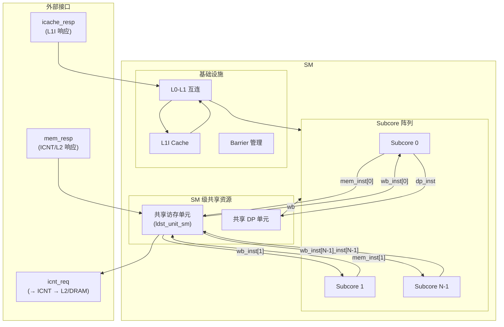
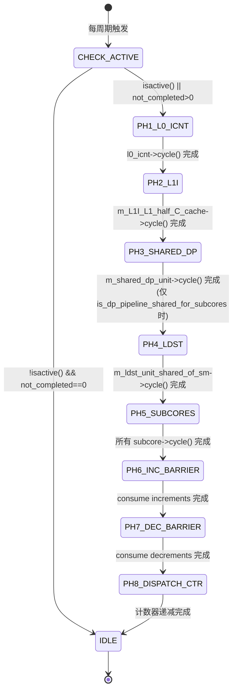
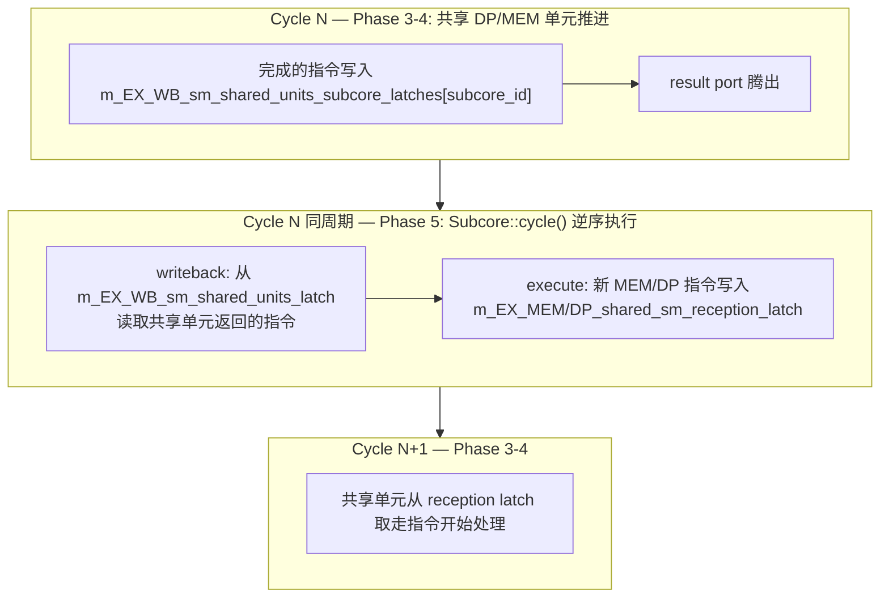
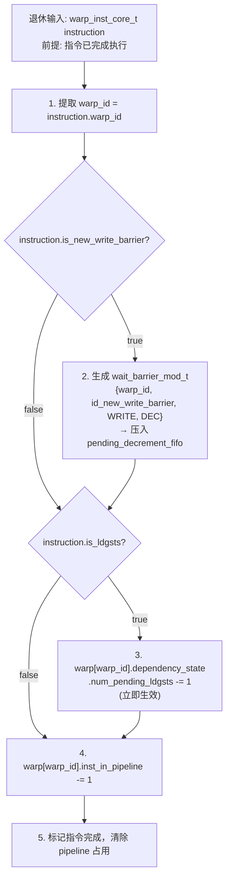
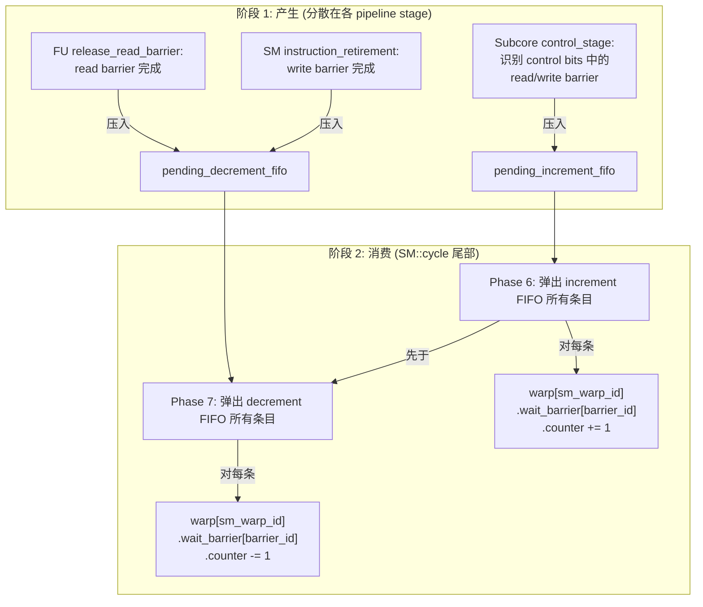
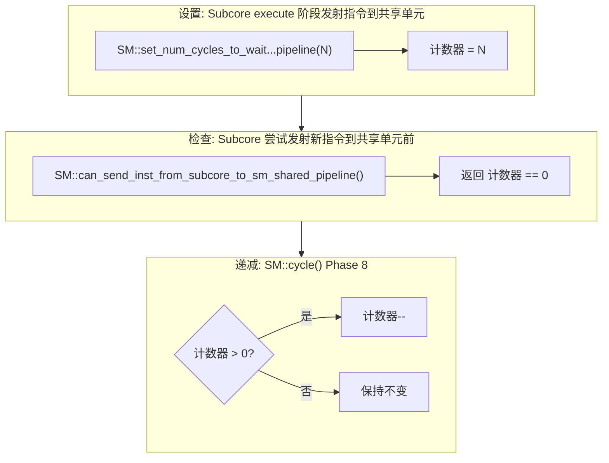

# 第 2 章：SM 顶层设计

---

## 术语说明

| 缩写/术语 | 全称 | 说明 |
|---|---|---|
| SM | Streaming Multiprocessor | GPU 核心计算单元，包含多个 Subcore 和共享资源 |
| Subcore | Sub-core / Processing Block | SM 内的独立调度分区，拥有私有流水线、RF 和 L0 缓存 |
| CTA | Cooperative Thread Array | 线程块（CUDA Block），SM 上并发执行的基本调度单位 |
| Warp | Warp | 32 个线程组成的 SIMT 执行单元，SM 内调度的最小粒度 |
| Barrier | Programmer Barrier | CTA 级同步原语（`__syncthreads()`），由 `barrier_set_t` 管理 |
| Wait-Barrier | Wait Barrier | 编译器嵌入的依赖 barrier，每 warp 6 个槽位，用于覆盖可变延迟依赖 |
| PRT | Pending Request Table | 共享访存单元中跟踪未完成访存请求的表 |
| IWC | InterWarp Coalescing | 跨 warp 访存合并单元，合并来自不同 warp 的相同 cache line 请求 |
| ICNT | Interconnection Network | 互连网络，SM 与 L2/DRAM 之间的通信通道 |
| L0I / L0C | Level-0 Instruction / Constant Cache | Subcore 私有的一级指令/常量缓存 |
| L1I | Level-1 Instruction Cache | SM 级共享的指令缓存 |
| RF | Register File | 寄存器文件，分 Regular RF 和 Uniform RF |
| LDGSTS | Load Global Store Shared | 全局内存到共享内存的异步拷贝指令 |
| DEPBAR | Dependency Barrier | 检查特定 barrier counter 是否 <= 指定值的特殊指令 |
| LDGDEPBAR | LDGSTS Dependency Barrier | 检查 pending LDGSTS 计数是否为 0 的特殊指令 |
| DP | Double Precision | 双精度浮点执行单元，SM 级共享 |

---

## 2.1 [Spec] 模块概述

Streaming Multiprocessor（SM）是 GPU 的核心计算单元。每个 SM 包含多个 Subcore（子核心），共享一组 SM 级执行资源和访存单元，并通过互连网络与片外存储层次通信。

SM 的职责边界：
- 向下管理 N 个 Subcore，每个 Subcore 拥有独立的 8 级流水线、私有 L0 指令/常量缓存、私有寄存器文件。
- 向上通过互连网络（ICNT）与 L2 cache / DRAM 交互。
- 内部提供共享访存单元（ldst_unit_sm）和共享 DP 执行单元，供所有 Subcore 共用。
- 管理 programmer barrier（CTA 级同步）和 wait-barrier（编译器嵌入的依赖 barrier）。
- 管理共享 L1I 指令缓存，通过 L0-L1 互连为各 Subcore 的 L0I 提供填充。

与周边模块的关系：



---

## 2.2 [Spec] 设计规格

以下规格参数从源码 `sm.h`、`shader.h`、`abstract_hardware_model.h` 中提取：

| 规格项 | 值 / 范围 | 源码定义 |
|---|---|---|
| Subcore 数量 | 可配置（典型 4） | `shader_core_config::num_subcores_in_SM` |
| 每 SM 最大线程数 | 4096（`1 << 12`） | `MAX_THREAD_PER_SM`（`abstract_hardware_model.h:528`） |
| 每 SM 最大 warp 数 | `n_thread_per_shader / warp_size`（典型 48/64） | `shader_core_config::max_warps_per_shader` |
| 每 SM 最大 warp 数硬限制 | 128（`1 << 7`） | `MAX_WARP_PER_SM`（`abstract_hardware_model.h:530`） |
| 每 SM 最大 CTA 数硬限制 | 32 | `MAX_CTA_PER_SHADER`（`abstract_hardware_model.h:71`） |
| 每 CTA 最大 programmer barrier 数 | 16 | `MAX_BARRIERS_PER_CTA`（`abstract_hardware_model.h:72`） |
| 每 warp wait-barrier 数量 | 可配置（典型 6） | `shader_core_config::num_wait_barriers_per_warp` |
| Wait-barrier counter 范围 | 0-63（6-bit） | `Wait_Barrier::increase_counter()` 中 `assert(m_counter < 63)` |
| SM 级寄存器总数 | 可配置 | `shader_core_config::gpgpu_shader_registers` |
| SM 级 RF bank 总数 | 可配置 | `shader_core_config::gpgpu_num_reg_banks` |
| 共享内存最大容量 | 96 KB | `SHARED_MEM_SIZE_MAX`（`abstract_hardware_model.h:522`） |
| 共享 DP 单元发射间隔 | 可配置 | `num_cycles_to_wait_to_dispatch_another_inst_from_subcore_to_sm_shared_pipeline_when_is_dp_inst` |
| 共享 MEM 单元发射间隔 | 可配置 | `num_cycles_to_wait_to_dispatch_another_inst_from_subcore_to_sm_shared_pipeline_when_is_mem_inst` |
| Warp 到 Subcore 映射 | `warp_id % NUM_SUBCORES` | `translate_warp_id_of_sm_to_subcore()` |

---

## 2.2B 存储结构位宽表

### SM 级资源跟踪结构

以下字段定义于 `sm.h` 的 `SM` 类（private 成员）：

| 字段名 | C++ 类型 | 位宽/大小 | 说明 |
|---|---|---|---|
| `m_sm_id` | `unsigned int` | 32-bit | SM 编号 |
| `m_tpc_id` | `unsigned int` | 32-bit | TPC 编号 |
| `m_num_subcores` | `unsigned int` | 32-bit | Subcore 数量（典型 4） |
| `m_num_cycles_to_wait_to_dispatch_another_inst_from_subcore_to_sm_shared_pipeline` | `unsigned int` | 32-bit | 共享流水线发射间隔计数器 |
| `m_subcores` | `vector<Subcore*>` | 动态，大小 = `m_num_subcores` | Subcore 指针数组 |
| `m_physical_warp` | `vector<shd_warp_t*>` | 动态，大小 = `max_warps_per_shader` | per-warp 信息数组 |
| `m_scoreboard` | `shared_ptr<Scoreboard>` | 指针 | RAW/WAW 冒险检测（兼容模式） |
| `m_scoreboard_WAR` | `shared_ptr<Scoreboard_reads>` | 指针 | WAR 冒险检测（兼容模式） |
| `m_pending_wait_barrier_increments` | `stack<Wait_Barrier_Entry_Modifier>` | 动态 | 待消费的 barrier increment 操作栈 |
| `m_pending_wait_barrier_decrements` | `stack<Wait_Barrier_Entry_Modifier>` | 动态 | 待消费的 barrier decrement 操作栈 |
| `m_barriers` | `barrier_set_t` | 动态 | Programmer barrier 集合 |

### SM 占用率跟踪结构

| 字段名 | C++ 类型 | 位宽/大小 | 说明 |
|---|---|---|---|
| `m_active_warps` | `int` | 32-bit | 当前活跃 warp 数 |
| `m_active_threads` | `bitset<MAX_THREAD_PER_SM>` | 4096-bit | 活跃线程位图（`MAX_THREAD_PER_SM = 1 << 12`） |
| `m_occupied_n_threads` | `unsigned int` | 32-bit | 已占用线程数 |
| `m_occupied_shmem` | `unsigned int` | 32-bit | 已占用共享内存（bytes） |
| `m_occupied_regs` | `unsigned int` | 32-bit | 已占用寄存器数 |
| `m_occupied_ctas` | `unsigned int` | 32-bit | 已占用 CTA 数 |
| `m_occupied_hwtid` | `bitset<MAX_THREAD_PER_SM>` | 4096-bit | 已占用硬件线程 ID 位图 |
| `m_occupied_cta_to_hwtid` | `map<unsigned, unsigned>` | 动态 | CTA ID → 起始硬件线程 ID 映射 |
| `m_cta_status[MAX_CTA_PER_SHADER]` | `unsigned int[32]` | 32 × 32-bit | CTA 状态数组（`MAX_CTA_PER_SHADER = 32`） |
| `m_not_completed` | `unsigned int` | 32-bit | 未完成线程数（== 0 时所有线程完成） |
| `m_n_active_cta` | `unsigned int` | 32-bit | 当前活跃 CTA 数 |

### SM 级共享单元结构

| 字段名 | C++ 类型 | 位宽/大小 | 说明 |
|---|---|---|---|
| `m_EX_WB_sm_shared_units_subcore_latches` | `vector<register_set_uniptr*>` | 动态，大小 = `num_subcores` | 共享单元→Subcore 写回 latch |
| `m_EX_MEM_reception_latches_per_subcore` | `vector<register_set_uniptr*>` | 动态，大小 = `num_subcores` | Subcore→共享 MEM 单元接收 latch |
| `m_EX_DP_shared_sm_reception_latch` | `register_set_uniptr` | 1 slot | 共享 DP 单元接收 latch |
| `m_shared_dp_unit` | `functional_unit*` | 指针 | SM 级共享 DP 功能单元 |
| `m_ldst_unit_shared_of_sm` | `ldst_unit_sm*` | 指针 | SM 级共享访存单元 |
| `m_L1I_L1_half_C_cache` | `shared_ptr<read_only_cache>` | 指针 | L1I / L1C 共享缓存 |
| `m_subcore_req_fetch_L1I_priority` | `unsigned int` | 32-bit | L1I 取指优先级轮转指针 |
| `m_dynamic_warp_id` | `unsigned int` | 32-bit | 动态 warp ID 分配计数器 |

---

## 2.3 [Spec] 参数定义

| 参数 | 含义 | 典型值 | 位宽影响 |
|---|---|---|---|
| `NUM_SUBCORES` | Subcore 数量，决定 reception/result 端口数 | 4 | 端口索引 2 bits |
| `MAX_WARPS_PER_SM` | SM 内最大 warp 数 | 48 / 64 | warp_id 需 6~7 bits |
| `MAX_CTA_PER_SM` | SM 内最大 CTA 数 | 8 / 16 | CTA 管理表深度 |
| `MAX_BARRIERS_PER_CTA` | 每 CTA 最大 programmer barrier 数 | 16 | barrier_id 4 bits |
| `NUM_WAIT_BARRIERS` | 每 warp 的 wait-barrier 数量 | 6 | wait_barrier_bits 6 bits |
| `SHARED_DP_DISPATCH_INTERVAL` | 共享 DP 单元的最小发射间隔（周期） | 可配置 | 调度计数器位宽 |

---

## 2.3 [Spec] 外部接口

### 2.3.1 输入端口

| 信号名 | 方向 | Payload 类型 | 位宽 | 协议 | 来源 | 粒度差异 |
|---|---|---|---|---|---|---|
| `subcore_mem_inst[N-1:0]` | I | `warp_inst_core_t` | 见 §0A.2.1 | valid/ready | 各 Subcore 的 MEM FU 输出 | **CA**: 每周期至多 1 条/端口，ready 由 ldst_unit_sm 的 reception port 空闲决定。**TL**: 事务请求，附带路由延迟。**FN**: 直接传递。 |
| `ldgsts_reentry_inst` | I | `warp_inst_core_t` | 见 §0A.2.1 | valid/ready | LDGSTS 内部通路（ICNT 返回后重入） | **CA**: 占用 reception_ports[N]（第 N+1 个端口），与 subcore 端口共享仲裁。**TL**: 同上，事务级。**FN**: 直接传递。 |
| `subcore_dp_inst` | I | `warp_inst_core_t` | 见 §0A.2.1 | valid/ready | 各 Subcore 的 DP pipeline 输出 | **CA**: 受 `SHARED_DP_DISPATCH_INTERVAL` 约束，多 subcore 竞争时需仲裁。**TL**: 事务请求。**FN**: 直接传递。 |
| `icache_resp` | I | `mem_rsp_t` | 见 §0A.2.2 | valid/ready | L1I / L0-L1 互连 | **CA**: 响应到达后由 SM 分发到目标 Subcore 的 L0I。**TL**: 响应事务。**FN**: 立即填充。 |
| `mem_resp` | I | `mem_rsp_t` | 见 §0A.2.2 | valid/ready | ICNT / L2 | **CA**: 响应到达后路由到 ldst_unit_sm 内部处理。**TL**: 响应事务。**FN**: 立即完成。 |

### 2.3.2 输出端口

| 信号名 | 方向 | Payload 类型 | 位宽 | 协议 | 去向 | 粒度差异 |
|---|---|---|---|---|---|---|
| `subcore_wb_inst[N-1:0]` | O | `warp_inst_core_t` | 见 §0A.2.1 | valid/ready | 各 Subcore 的 WB latch | **CA**: SM 共享单元完成后写回，每周期至多 1 条/端口，ready 由 Subcore WB latch 空闲决定。**TL**: 完成事务。**FN**: 直接传递。 |
| `icnt_req` | O | `mem_req_t` | 见 §0A.2.2 | valid/ready | 互连网络 | **CA**: 访存请求经 ldst_unit_sm 处理后发往 ICNT，受 ICNT 背压。**TL**: 请求事务。**FN**: 直接发送。 |

---

## 2.4 [Spec] 内部结构与关键数据流

### 2.4.1 子模块结构

```mermaid
graph TD
    SM["SM"] --> SubArr["Subcore 阵列 [0..N-1]"]
    SM --> LDST["共享访存单元 (ldst_unit_sm)"]
    SM --> SharedDP["共享 DP 执行单元"]
    SM --> InstrSupply["指令供给"]
    SM --> BarMgmt["Barrier 管理"]
    SM --> WarpState["Warp 状态"]

    SubArr --> Pipeline["8 级逆序流水线<br/>fetch→decode→issue→control→<br/>allocate→read_rf→execute→writeback"]
    SubArr --> L0I["L0I 私有指令缓存"]
    SubArr --> L0C["L0C 私有常量缓存"]
    SubArr --> RF["Regular RF + Uniform RF<br/>(banked 结构)"]
    SubArr --> Warps["Warp 集合<br/>(warp_id % N == subcore_id)"]
    SubArr --> FUs["FU 集合: SP / UNIFORM / TENSOR /<br/>BRANCH / SFU / MISC_QUEUE /<br/>MISC_NO_QUEUE / MEM / DP"]

    LDST --> RecPorts["Reception ports:<br/>NUM_SUBCORES + 1 个输入"]
    LDST --> ResPorts["Result ports:<br/>NUM_SUBCORES 个输出"]
    LDST --> PRT["PRT (Pending Request Table)"]
    LDST --> IWC["InterWarp Coalescing Unit"]
    LDST --> SubPipe["子流水线:<br/>L1D / L1T / L1C / SMEM / Bypass-to-L2"]

    SharedDP --> DPRec["Reception: 各 subcore DP pipeline"]
    SharedDP --> DPRes["Result: 各 subcore WB latch"]

    InstrSupply --> L0ICN["L0-L1 互连 (L0_icnt)"]
    InstrSupply --> L1I["共享 L1I 指令缓存"]

    BarMgmt --> ProgBar["Programmer barrier (barrier_set_t)"]
    BarMgmt --> IncFIFO["Pending wait-barrier increment FIFO"]
    BarMgmt --> DecFIFO["Pending wait-barrier decrement FIFO"]

    WarpState --> PhyWarp["Physical warp 数组 [0..MAX_WARPS-1]"]
    PhyWarp --> DepState["每 warp: Dependency_State<br/>(stall counter, yield,<br/>6 个 wait-barrier counter,<br/>ldgsts pending counter)"]
```



### 2.4.2 Warp 映射规则

- 归属 subcore：`warp_id % NUM_SUBCORES`
- Subcore 内本地序号：`warp_id / NUM_SUBCORES`

### 2.4.3 SM 级资源跟踪存储结构

以下结构定义于 `sm.h` 的 `SM` 类私有成员，用于跟踪 SM 级资源占用：

| 字段名 | C++ 类型 | 等效位宽 | 说明 |
|---|---|---|---|
| `m_sm_id` | `unsigned int` | 32-bit | SM 编号 |
| `m_num_subcores` | `unsigned int` | 32-bit | Subcore 数量 |
| `m_n_active_cta` | `unsigned int` | 32-bit | 当前活跃 CTA 数 |
| `m_cta_status[MAX_CTA_PER_SHADER]` | `unsigned int[32]` | 32×32-bit | 每 CTA 的线程状态 |
| `m_not_completed` | `unsigned int` | 32-bit | 未完成线程计数 |
| `m_active_warps` | `int` | 32-bit | 当前活跃 warp 数 |
| `m_active_threads` | `bitset<MAX_THREAD_PER_SM>` | 4096-bit | 活跃线程位图 |
| `m_occupied_n_threads` | `unsigned int` | 32-bit | 已占用线程数 |
| `m_occupied_shmem` | `unsigned int` | 32-bit | 已占用共享内存（bytes） |
| `m_occupied_regs` | `unsigned int` | 32-bit | 已占用寄存器数 |
| `m_occupied_ctas` | `unsigned int` | 32-bit | 已占用 CTA 数 |
| `m_occupied_hwtid` | `bitset<MAX_THREAD_PER_SM>` | 4096-bit | 已占用硬件线程 ID 位图 |
| `m_occupied_cta_to_hwtid` | `map<uint, uint>` | 动态 | CTA ID 到硬件线程 ID 的映射 |
| `m_dynamic_warp_id` | `unsigned int` | 32-bit | 动态 warp ID 分配计数器 |
| `m_physical_warp` | `vector<shd_warp_t*>` | 指针数组 | 物理 warp 数组，大小 = `max_warps_per_shader` |

Barrier 管理存储结构：

| 字段名 | C++ 类型 | 说明 |
|---|---|---|
| `m_barriers` | `barrier_set_t` | Programmer barrier 管理器，容量 = `MAX_CTA_PER_SHADER` × `MAX_BARRIERS_PER_CTA` |
| `m_pending_wait_barrier_increments` | `stack<Wait_Barrier_Entry_Modifier>` | 待消费的 wait-barrier increment 操作栈 |
| `m_pending_wait_barrier_decrements` | `stack<Wait_Barrier_Entry_Modifier>` | 待消费的 wait-barrier decrement 操作栈 |

共享单元调度控制：

| 字段名 | C++ 类型 | 说明 |
|---|---|---|
| `m_num_cycles_to_wait_to_dispatch_another_inst_from_subcore_to_sm_shared_pipeline` | `unsigned int` | 共享单元发射间隔倒计时器，> 0 时阻止新指令发往共享 DP/MEM 单元 |

---

## 2.5 [Spec] 时序行为

### 2.5.1 CA 模式：逐阶段执行序列

SM 的顶层时序由 8 个有序阶段（Phase）组成，每个时钟周期按固定顺序执行：

| Phase | 操作 | 输入前提 | 状态更新 | 输出结果 |
|---|---|---|---|---|
| 1 | L0-L1 互连推进 | L1I 响应就绪 | L0_icnt 内部状态更新 | Subcore L0I 可见新的 cache line |
| 2 | L1I cache 推进 | L0_icnt 请求到达 | L1I tag/data 更新 | 产生 hit/miss 响应 |
| 3 | 共享 DP 单元推进 | DP 指令在 pipeline 中 | DP pipeline stage 前进 | 完成的 DP 指令写入 result port |
| 4 | 共享访存单元推进 | 访存指令在子流水线中 | PRT/cache/queue 状态更新 | 完成的访存指令写入 result port；新请求发往 ICNT |
| 5 | 各 Subcore 推进 | result port 已腾出 | Subcore 8 级流水线各 stage 推进 | 新的访存/DP 指令写入 reception port |
| 6 | 消费 wait-barrier increments | pending increment FIFO 非空 | Wait_Barrier[id].counter++ | barrier 计数器更新 |
| 7 | 消费 wait-barrier decrements | pending decrement FIFO 非空 | Wait_Barrier[id].counter-- | barrier 计数器更新 |
| 8 | 递减共享单元调度间隔计数器 | 计数器 > 0 | 计数器 -= 1 | 计数器归零后允许下一次共享单元发射 |

阶段顺序的设计约束：
- Phase 1-2 先于 Phase 5：指令互连与 L1I 响应先推进，确保 Subcore fetch 阶段能看到最新的 cache 状态。
- Phase 3-4 先于 Phase 5：共享执行资源先推进，腾出 result port 供 Subcore writeback 消费。
- Phase 6 先于 Phase 7：同一周期内 increment 先于 decrement 消费，保证 barrier 计数器的正确性（见 §2.7）。
- Phase 5 中各 Subcore 顺序执行：Subcore 之间通过共享资源（ldst_unit_sm、shared_dp_unit）隐式交互。

### 2.5.2 TL 模式：事务级简化

- Phase 1-4 简化为：共享资源处理事务，附带可配置延迟参数。
- Phase 5 简化为：各 Subcore 处理事务，pipeline 不逐级建模。
- Phase 6-7 保留语义：barrier 操作仍需正确的 increment/decrement 顺序。
- Phase 8 简化为：调度间隔由参数控制。

### 2.5.3 FN 模式：功能级直通

- 所有 Phase 合并为单次处理：输入直接映射到输出。
- Barrier 操作仍需正确执行（保证功能正确性）。
- 无时序约束，无资源竞争。

### 2.5.4 SM::cycle() 8-Phase 执行状态机

SM 的顶层 `cycle()` 函数（`sm.cc:232`）实现了一个固定顺序的 8-phase 状态机。以下为形式化描述：



各 Phase 对应源码位置（`sm.cc:232-271`）：

| Phase | 源码调用 | 行号 |
|---|---|---|
| 1 | `l0_icnt->cycle()` | ~247 |
| 2 | `m_L1I_L1_half_C_cache->cycle()` | ~248 |
| 3 | `m_shared_dp_unit->cycle()` | ~251 |
| 4 | `m_ldst_unit_shared_of_sm->cycle()` | ~254 |
| 5 | `for (auto subcore : m_subcores) subcore->cycle()` | ~262-264 |
| 6 | `consume_pending_wait_barrier_actions(m_pending_wait_barrier_increments)` | ~266 |
| 7 | `consume_pending_wait_barrier_actions(m_pending_wait_barrier_decrements)` | ~267 |
| 8 | `m_num_cycles_to_wait_to_dispatch_another_inst_from_subcore_to_sm_shared_pipeline--` | ~268-270 |

### 2.5.5 接口时序：SM 与 Subcore 握手

SM 与 Subcore 之间的数据交互通过 latch 实现，以下为关键握手时序：



关键约束：
- 共享单元 result port → Subcore WB latch：同周期内 Phase 3-4 写入，Phase 5 读取（逆序保证无冲突）
- Subcore execute → 共享单元 reception latch：Phase 5 写入，下周期 Phase 3-4 读取
- 共享单元发射间隔：`can_send_inst_from_subcore_to_sm_shared_pipeline()` 检查 `m_num_cycles_to_wait_to_dispatch_another_inst_from_subcore_to_sm_shared_pipeline == 0`

---

## 2.6 [Spec] 指令退休与 Wait-Barrier

### 2.6.1 指令退休流程

指令退休在 Subcore writeback 阶段触发，SM 级执行以下操作：



关键约束：
- Write barrier decrement 不立即生效，而是压入 pending FIFO，在 Phase 7 统一消费。
- LDGSTS pending 计数递减是立即生效的（独立于 wait-barrier 体系）。
- `inst_in_pipeline` 递减是立即生效的。

### 2.6.2 Wait-Barrier 消费机制

Wait-barrier 采用两阶段延迟消费：



Barrier 操作的产生点汇总：

| 产生点 | 操作类型 | 触发条件 |
|---|---|---|
| Subcore control_stage | INCREMENT | 指令 control bits 中 `is_new_read_barrier == true` |
| Subcore control_stage | INCREMENT | 指令 control bits 中 `is_new_write_barrier == true` |
| FU release_read_barrier | DECREMENT | 在 read_rf 或 FU 内部阶段调用；是否真正释放由 guard 条件决定 |
| SM instruction_retirement | DECREMENT | 指令退休时释放 write barrier |

Warp 发射时的 barrier 检查：
- 检查 `wait_barrier_bits`（6-bit 掩码），对每个置位的 bit：`wait_barrier[id].counter <= 0` 必须成立。
- 特殊指令 DEPBAR：检查 `wait_barrier[sb_reg].counter <= sb_max_allowed_val`。
- 特殊指令 LDGDEPBAR：检查 `num_pending_ldgsts == 0`（独立计数器，与 wait-barrier 体系分离）。

---

## 2.7 [Spec] 设计原理

### 2.7.1 为什么 SM 需要共享访存单元

每个 Subcore 独立拥有 L1D cache 会导致：
- 面积开销：L1D 是 SM 内最大的 SRAM 结构，复制 N 份不可接受。
- 一致性复杂度：多份 L1D 需要 Subcore 间一致性协议。
- 合并效率：跨 warp 的访存合并（InterWarp Coalescing）需要看到所有 Subcore 的访存请求。

因此，真实 GPU 采用 SM 级共享访存单元：所有 Subcore 的访存指令汇聚到共享 ldst_unit_sm，经统一的 PRT 跟踪、InterWarp Coalescing 合并后，路由到共享的 L1D/SMEM/L1T/L1C 子流水线。代价是需要 N+1 个 reception port 的仲裁逻辑和 N 个 result port 的写回路由。

### 2.7.2 为什么 Barrier 消费分两阶段

直接在产生点修改 barrier 计数器会导致：
- 时序竞争：同一周期内多个 pipeline stage 可能同时修改同一 barrier 的计数器（例如 control_stage 的 increment 和 retirement 的 decrement）。
- 顺序依赖：increment 必须先于 decrement 生效，否则计数器可能出现瞬态负值，导致等待该 barrier 的 warp 被错误唤醒。

两阶段延迟消费的解决方案：
- 所有产生点只负责将操作压入 pending FIFO（零冲突）。
- SM::cycle() 尾部统一消费，先 increment 后 decrement（固定顺序）。
- 这保证了同一周期内 barrier 计数器的更新是原子且有序的。

### 2.7.3 与真实 GPU 的对应关系

本设计基于论文对 Turing/Ampere 微架构的逆向分析，以下共性已通过微基准测试验证：
- Sub-core 分区结构：4 个 Subcore 共享 SM 级资源（Turing/Ampere 均为 4 sub-partition）。
- Control-bit 依赖模型：编译器（ptxas）将依赖信息编码到 SASS 指令的 control bits 中，硬件仅执行 stall/yield/barrier 动作，不动态检测依赖。每 warp 仅需 41 bits 的 barrier 状态（6 barrier × 6-bit counter + 5-bit stall + yield），相比传统 scoreboard 的 2324 bits/warp 节省 98%。
- 共享访存单元：L1D/SMEM 在 SM 级共享，所有 sub-partition 的访存请求汇聚后统一处理。
- 8 级流水线：fetch → decode → issue → control → allocate → read_rf → execute → writeback，自 Volta 以来保持不变。

---

## 2.8 [Map] Framework 映射

### 2.8.1 外部接口映射

| 规范层接口 | 规范层语义 | Framework 通道 | 背压处理 |
|---|---|---|---|
| `subcore_mem_inst[i]` | valid/ready, payload=warp_inst_core_t | `GPUChannel` (容量=1), Subcore → ldst_unit_sm | `try_send()` 返回 `kAgain` 时，Subcore MEM FU 保持指令不前进；`kChannelAvailable` 事件触发重试 |
| `ldgsts_reentry_inst` | valid/ready, payload=warp_inst_core_t | `GPUChannel` (容量=1), ICNT 返回路径 → ldst_unit_sm | 同上 |
| `subcore_dp_inst` | valid/ready, payload=warp_inst_core_t | `GPUChannel` (容量=1), Subcore DP → shared_dp_unit | `try_send()` 返回 `kAgain` 时，Subcore DP pipeline 保持；受 `SHARED_DP_DISPATCH_INTERVAL` 额外约束 |
| `icache_resp` | valid/ready, payload=mem_rsp_t | `GPUChannel`, L1I → SM | `on_message()` 回调接收，分发到目标 Subcore 的 L0I |
| `mem_resp` | valid/ready, payload=mem_rsp_t | `GPUChannel`, ICNT → SM | `on_message()` 回调接收，路由到 ldst_unit_sm |
| `subcore_wb_inst[i]` | valid/ready, payload=warp_inst_core_t | `GPUChannel` (容量=1), ldst_unit_sm/shared_dp → Subcore | `try_send()` 返回 `kAgain` 时，共享单元 result port 保持；`kChannelAvailable` 事件触发重试 |
| `icnt_req` | valid/ready, payload=mem_req_t | `GPUChannel`, ldst_unit_sm → ICNT | `try_send()` 返回 `kAgain` 时，请求在 ldst_unit_sm 内排队等待 |

### 2.8.2 时序映射

| 规范层 Phase | Framework 事件驱动等价 |
|---|---|
| Phase 1-4（共享资源推进） | SM 组件收到 `kComponentWake` 事件 → 依次调用各共享子组件的处理逻辑 |
| Phase 5（Subcore 推进） | 各 Subcore 组件收到 `kComponentWake` 事件 → 执行 pipeline 推进 |
| Phase 6-7（barrier 消费） | SM 组件在 `kComponentWake` 处理尾部执行 barrier 消费 |
| Phase 8（计数器递减） | SM 组件在 `kComponentWake` 处理尾部递减调度间隔计数器 |

### 2.8.3 Framework 锚点示例

| 概念 | Framework 对应 |
|---|---|
| valid/ready 握手 | `GPUChannel::try_send()` → `kOk` / `kAgain` |
| 背压恢复 | `GPUChannel::notify_available()` → `kChannelAvailable` 事件 |
| 消息到达 | `GPUChannel::on_delivery()` → `kMsgArrive` 事件 |
| 周期推进 | `GPUSimEngine::schedule()` 调度 `kComponentWake` 事件 |
| 组件回调 | `GPUComponent::on_message()`, `on_channel_available()`, `on_event()` |

---

## 2.9 [Map] 源码锚点

### 微架构源码锚点（主锚点）

| 文件 | 函数/定义 | 行号参考 |
|---|---|---|
| `sm.h` | `SM` 类定义，成员变量 | — |
| `sm.cc` | `SM::cycle()` | ~232 |
| `sm.cc` | `SM::instruction_retirement()` | ~302 |
| `sm.cc` | `SM::consume_pending_wait_barrier_actions()` | ~281 |
| `sm.cc` | `SM::add_pending_wait_barrier_increment()` | ~295 |
| `sm.cc` | `SM::add_pending_wait_barrier_decrement()` | ~299 |
| `sm.cc` | `SM::issue_warp()` | ~346 |

### Framework 实现参考锚点

> 以下锚点为 framework 映射参考，不是规范定义来源。

| 文件 | 定义 |
|---|---|
| `HopperArchSim/framework/src/channel/GPUChannel.h` | `GPUChannelStatus`, `try_send()`, `on_delivery()`, `notify_available()` |
| `HopperArchSim/framework/src/engine/GPUSimEngine.cpp` | `dispatch()` 事件路由逻辑 |
| `HopperArchSim/framework/src/engine/GPUEvent.h` | `GPUEventType` 枚举 |
| `HopperArchSim/framework/src/component/GPUComponent.h` | `on_message()`, `on_channel_available()`, `on_event()` 虚函数 |

---

## 2.10 [Spec] 关键电路描述

### 2.10.1 Barrier 消费逻辑（Increment 先于 Decrement）

`SM::consume_pending_wait_barrier_actions()`（`sm.cc:281-287`）实现了 barrier 计数器的统一消费。关键设计是 SM::cycle() 中先调用 increment 栈消费，再调用 decrement 栈消费：

```cpp
// sm.cc:266-267
consume_pending_wait_barrier_actions(m_pending_wait_barrier_increments);  // Phase 6: 先消费 increment
consume_pending_wait_barrier_actions(m_pending_wait_barrier_decrements);  // Phase 7: 再消费 decrement
```

消费函数的实现：

```cpp
// sm.cc:281-287
void SM::consume_pending_wait_barrier_actions(stack<Wait_Barrier_Entry_Modifier> &actions) {
  while (!actions.empty()) {
    Wait_Barrier_Entry_Modifier current_action = actions.top();
    m_physical_warp[current_action.sm_warp_id]
      ->get_dependency_state()
      ->action_over_wait_barrier(&current_action);
    actions.pop();
  }
}
```

正确性保证：
- 使用 `std::stack`（LIFO），同一周期内所有产生点的操作在 Phase 6/7 统一弹出
- Increment 先于 decrement 消费，避免计数器出现瞬态负值
- `increase_counter()` 中 `assert(m_counter < 63)` 防止溢出
- `decrease_counter()` 中 `assert(m_counter > 0)` 防止下溢

### 2.10.2 共享单元发射间隔控制逻辑

SM 通过 `m_num_cycles_to_wait_to_dispatch_another_inst_from_subcore_to_sm_shared_pipeline` 计数器控制共享 DP/MEM 单元的发射间隔：



该机制确保多个 Subcore 不会在连续周期内同时向共享单元发射指令，模拟真实硬件中共享单元的仲裁延迟。

---

## 2.11 参考文档

| 文档 | 说明 |
|---|---|
| MICRO 2025 论文 | 本设计的理论基础，包含 Turing/Ampere 微架构逆向分析结果 |
| `sm.h` / `sm.cc` | SM 类定义与实现，8-phase cycle 逻辑 |
| `subcore.h` / `subcore.cc` | Subcore 类定义与实现，8 级流水线 |
| `warp_dependency_state.h` / `warp_dependency_state.cc` | Wait-barrier 和 Dependency_State 实现 |
| `abstract_hardware_model.h` | 硬件模型常量定义（MAX_CTA_PER_SHADER、MAX_THREAD_PER_SM 等） |
| `shader.h` | `shader_core_config` 配置参数定义 |
| 第 3 章：Subcore 流水线设计 | Subcore 内部 8 级流水线详细设计 |
| 第 4 章：依赖模型设计 | Control-bit 依赖模型详细设计 |
