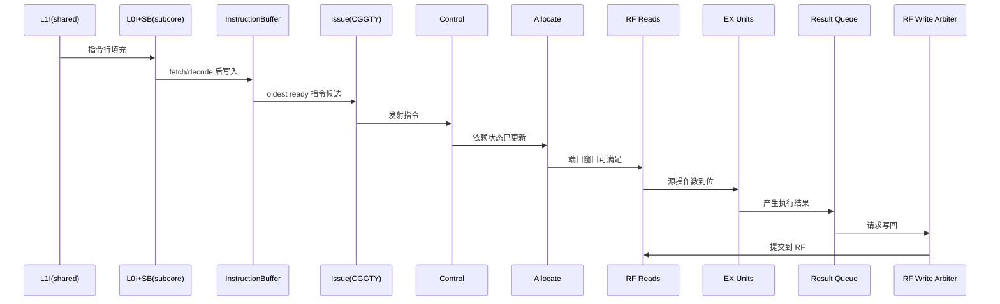

# 02A：SM 论文对齐架构图详解（前端与执行）

---

## 1. 文档目标与依据

本文件是 `02-SM顶层设计.md` 中 §2.1A 的分册详解，聚焦论文 `modern-gpu.pdf` 第 5 章里与“前端、发射、依赖、寄存器、执行与写回”相关的结构。

范围边界：
- 包含：`L1I/L0I/Stream Buffer`、`Instruction Buffer`、`CGGTY issue`、`Control/Allocate`、`RF/RFC`、`Result Queue`、`RF write arbiter`。
- 不展开：共享访存后段（`L1D/SMEM/Texture/Shared memory unit`），该部分见 `02B-SM论文对齐架构图详解-访存与共享路径.md`。

---

## 2. 论文图到本设计图的主映射

| 论文 Figure 3 组件 | 本设计术语 | 作用 |
|---|---|---|
| `L1 Icache/Ccache` | SM 共享指令/常量缓存 | 多个 subcore 共享上层取指源 |
| `Arbiter`（前端） | 前端仲裁器 | 处理多个 subcore 对共享 L1I 的请求竞争 |
| `L0 Icache + Stream Buffer` | Subcore 私有 L0I + 流式预取 | 降低取指 miss 对 issue 连续性的影响 |
| `Instruction Buffer` | per-warp 指令缓冲 | fetch/decode 与 issue 解耦 |
| `CGGTY Issue` | 编译器引导的贪婪-再选最年轻调度 | 决定每周期发射 warp |
| `Sw-Hw dependence handler` | stall/yield/wait-barrier 机制 | 用控制位管理依赖，减少传统 scoreboard 负担 |
| `Control` | 控制阶段 | 更新/检查依赖状态，衔接 issue 与后续资源分配 |
| `Allocate` | 分配阶段 | 检查并预留 RF 读取端口，固定延迟路径在此阻塞 |
| `Register file + Regular RFC + Uniform` | RF + RFC + uniform RF | 承担操作数读写与缓存复用 |
| `Result queue` | 结果队列 | 写回冲突缓冲，支撑固定延迟语义 |
| `RF write priority arbiter` | 写回优先仲裁 | 多结果源竞争 RF 写端口时保证顺序/优先级 |

---

## 3. 前端路径详解（L1I 到 Issue）

### 3.1 结构分层

前端可分三层：
- SM 共享层：`L1 Icache/Ccache`
- Subcore 私有层：`L0 Icache + Stream Buffer`
- Warp 私有层：`Instruction Buffer`

该分层对应“共享容量 + 本地带宽 + warp 解耦”的组合：
- 共享层降低总面积；
- 私有层降低请求冲突与平均取指延迟；
- warp 缓冲层保障 issue 的连续候选供给。

### 3.2 关键数据流

### 3.3 与论文语义一致的设计要点

- 4 个 subcore 同构，warp 通常按 `warp_id % 4` 分配。
- 取指调度与 issue 策略协同，目标是降低“IB 无有效指令”概率。
- stream-buffer 预取适合 GPU 的顺序代码区段，简化硬件复杂度。

---

## 4. Issue 与 Warp Readiness

### 4.1 候选 warp 的就绪条件

候选 warp 在 issue 周期需同时满足：
- 对应 `Instruction Buffer` 存在有效最老指令；
- 该最老指令依赖条件满足（由控制位与依赖计数管理）；
- 对固定延迟指令，可保证后续关键资源（如执行与读端口）按时可用。

### 4.2 CGGTY 策略落地

调度策略核心：
- 优先保持同一 warp 贪婪发射（提高局部性与吞吐）；
- 必须切换时，在满足条件的 warp 中选择“最年轻”者；
- 由编译器编码控制位（stall/yield/dependence mask）辅助硬件调度决策。

### 4.3 与传统 GTO 差异

相比传统 GTO + 双 scoreboard 模型，本设计强调：
- 依赖判断更多由编译器预编码；
- 硬件重点做快速检查与计数更新；
- 减少每 warp 动态硬件依赖追踪状态。

---

## 5. Control / Allocate 两级语义

### 5.1 为什么必须拆成两级

`Issue -> Control -> Allocate -> RF Reads` 的拆分主要为了解决两类约束：
- 依赖状态更新与可见性约束；
- RF 读端口冲突下的固定延迟指令时序保证。

### 5.2 Control 阶段职责

- 对新发射指令进行依赖计数更新（如 wait-barrier 相关状态变化）；
- 处理 stall/yield 等控制位对后续发射可见性的影响；
- 为后续阶段提供“依赖已决策”的稳定输入。

### 5.3 Allocate 阶段职责

- 只对固定延迟路径做端口可用性检查与预留；
- 无法满足读端口窗口时，在 Allocate 阶段背压上游；
- 避免进入读阶段后发生不可恢复冲突，保证固定延迟语义。

---

## 6. RF / RFC / 写回路径

### 6.1 RF 组织（面向本模型）

- `Regular RF`：按 bank 组织，承担线程私有寄存器值；
- `Uniform RF`：warp 级共享值，减少重复地址/常量读开销；
- 读路径在 `Allocate` 决策后进入 `RF Reads`；
- 写路径经过 `Result Queue` 与写回仲裁后提交到 RF。

### 6.2 RFC 的角色

`Regular RFC` 的本质是“编译器可控的短期操作数复用缓存”：
- 缓解 RF bank 冲突；
- 降低读端口压力与能耗；
- 对固定延迟路径稳定性有实质帮助。

### 6.3 Result Queue + 写回仲裁

将结果先放入 `Result Queue` 再写 RF 的价值：
- 分离执行完成时刻与实际写端口可用时刻；
- 在多执行来源同时完成时提供缓冲；
- 配合写回优先仲裁保证行为稳定。

---

## 7. 前端到执行的完整时序视图

---

## 8. 与主文档章节的对照

| 本文主题 | 主文档位置 |
|---|---|
| 前端分层与图示 | `02-SM顶层设计.md` §2.1A、§2.4.1 |
| Issue/依赖总体语义 | `02-SM顶层设计.md` §2.5、§2.6、§2.7 |
| RF/共享单元接口 | `02-SM顶层设计.md` §2.3、§2.4 |
| 时序状态机 | `02-SM顶层设计.md` §2.5.4 |

---

## 9. 供 Claude Review 的检查清单

1. 图中是否完整出现 `Issue -> Control -> Allocate -> RF Reads` 路径。
2. 是否明确区分 `L0 FL` 与 `L0 VL` 两条常量访问语义。
3. 是否体现 `Result Queue` 与 `RF write priority arbiter` 的写回缓冲/仲裁职责。
4. 是否将前端、执行、访存共享边界拆分清楚（访存共享细节在 `02B`）。
5. 与 `02-SM顶层设计.md` 的引用是否可双向跳转与核对。

---
