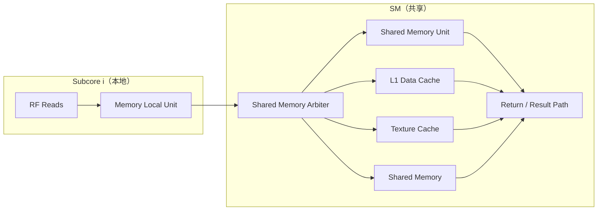
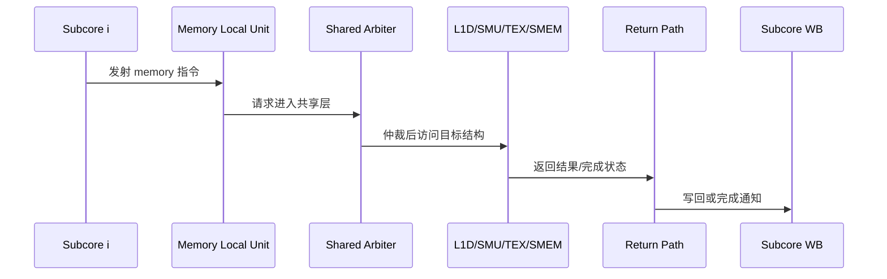

# 02B：SM 论文对齐架构图详解（访存与共享路径）

---

## 1. 文档目标与依据

本文件对应 `02-SM顶层设计.md` 的 §2.1A 分册，聚焦论文 `modern-gpu.pdf` 第 5.4 节（Memory Pipeline）以及 Figure 3 中与访存相关的结构路径。

本文解决三个问题：
- Subcore 本地访存前段与 SM 共享访存后段如何分层；
- 共享结构的吞吐约束如何影响多 subcore 并发；
- 访存延迟、常量路径与 LDGSTS 在架构图中如何落位。

---

## 2. 访存路径总览

论文语义下，访存是“本地前段 + 共享后段”的两段式：
- 本地前段（per subcore）：`Memory Local Unit`，负责早期流水与请求形成；
- 共享后段（per SM）：`Shared Memory Unit / L1D / Texture / Shared Memory`，四个 subcore 共同竞争访问。

---

## 3. 本地与共享边界（架构职责）

| 层级 | 组件 | 主要职责 |
|---|---|---|
| Subcore 本地 | `Memory Local Unit` | 接收访存类指令，执行本地前段处理并向共享层发请求 |
| SM 共享 | `Shared Memory Arbiter` | 处理来自 4 个 subcore 的访存请求竞争 |
| SM 共享 | `Shared Memory Unit` | 共享路径处理单元（含共享结构访问前后控制） |
| SM 共享 | `L1 Data Cache` | 全局/数据路径的主要缓存层 |
| SM 共享 | `Texture Cache` | 纹理路径缓存 |
| SM 共享 | `Shared Memory` | CTA 共享 scratchpad 空间 |

这一定义与 “每个 subcore 自带完整 L1D” 的老模型不同，核心优势是：
- 容量与面积更集中；
- 允许跨 warp / 跨 subcore 的统一请求处理；
- 与论文描述的现代 NVIDIA 共享资源组织一致。

---

## 4. 吞吐与队列约束（来自论文实验结论）

### 4.1 关键观测

论文微基准给出的主要结论可归纳为：
- 每个 subcore 可连续每周期 issue 约 5 条 memory 指令；
- 第 6 条开始受限并出现周期级间隔；
- 共享结构总体吞吐近似“每 2 周期接收 1 条请求（SM 级）”；
- 多 subcore 并发时，共享层成为瓶颈并决定每 subcore 有效吞吐。

### 4.2 建模含义

在本设计文档中，建议将访存吞吐约束建模成两级：
- 一级（subcore 本地）：短队列吸收突发，保持 issue 连续性；
- 二级（SM 共享）：统一仲裁与节流，决定长期稳态吞吐。

### 4.3 多 subcore 并发下的直觉

- 当活跃 subcore 数上升时，单 subcore 平均发射间隔会被共享仲裁拉大；
- 即便本地流水可继续推进，最终仍受共享端可接纳速率约束；
- 这解释了“单 subcore 与四 subcore”测试下的明显吞吐差异。

---

## 5. 延迟语义（WAR 与 RAW/WAW）

论文对访存延迟区分为两类：
- `WAR latency`：从访存指令 issue 到“可覆盖其源寄存器”的最早时间；
- `RAW/WAW latency`：从 load issue 到“可消费其目的寄存器或可覆盖其目的寄存器”的最早时间。

本章落地时的建议：
- 在延迟表中保留“地址来源（uniform/regular）”维度；
- 对 load/store 区分“数据位宽”维度（32/64/128 bit）；
- 将共享内存与全局内存路径分开记录，不混用单一延迟常量。

这与 `02-SM顶层设计.md` 中“接口 + 时序 + 共享单元仲裁”章节形成互补：该文档强调机制，这里强调参数化约束来源。

---

## 6. 常量路径：L0 FL 与 L0 VL 的双通路语义

论文把常量路径区分为两类：
- `L0 FL constant cache`：固定延迟指令相关常量访问路径；
- `L0 VL constant cache`：可变延迟常量访问路径（如 load constant 类）。

对架构图的意义：
- 常量访问不是单一路径；
- issue 就绪性（固定延迟）与 memory pipeline（可变延迟）需要分别处理；
- 文档中必须在图上分开两条路径，否则会混淆延迟模型与依赖释放时机。

---

## 7. LDGSTS 在共享路径中的位置

`LDGSTS` 语义是“global -> shared 的直接搬运”，关键点：
- 数据不经常规寄存器目的写回链路；
- 可降低 RF 压力并减少中间指令；
- 在 SM 共享访存后段中与普通 load/store 共享仲裁/通道资源。

结合主文档建议：
- 在 `02-SM顶层设计.md` 的接口章节中保留 `ldgsts_reentry_inst`；
- 在时序章节明确其重入与完成路径；
- 在依赖章节保持其与 wait-barrier/专用计数器语义分离。

---

## 8. 访存路径的时序化解读

时序重点：
- `MLU -> Arbiter` 是本地到共享边界；
- `Arbiter -> G` 体现共享资源竞争；
- 返回路径可能受 result port 与下游可用性背压影响。

---

## 9. 与主文档章节的对照关系

| 本文主题 | 主文档位置 |
|---|---|
| 访存分层与共享边界 | `02-SM顶层设计.md` §2.1A、§2.4.1、§2.7.1 |
| 外部接口与信号定义 | `02-SM顶层设计.md` §2.3 |
| 时序推进与握手 | `02-SM顶层设计.md` §2.5.1、§2.5.5 |
| LDGSTS / barrier 语义关系 | `02-SM顶层设计.md` §2.6 |

---

## 10. 供 Claude Review 的检查清单

1. 图中是否明确存在 `Memory Local Unit -> Shared Arbiter -> Shared Structures` 三段。
2. 是否清晰区分本地前段与共享后段职责，而非“每 subcore 一套完整 L1D”。
3. 是否保留 `L0 FL` 与 `L0 VL` 双常量路径并说明语义差异。
4. 是否交代吞吐约束对多 subcore 并发性能的影响（共享层为瓶颈）。
5. 是否给出 LDGSTS 在共享路径中的位置与依赖语义边界。

---
