# 第 3 章：Subcore 流水线设计

---

> **文档拆分说明**：本章原始单文件超过 500 行，已按“总览 + 分卷详解”重构：
> - **03-Subcore流水线设计.md**（本文件）：总体设计、规格、类结构与统一入口
> - **03A-Subcore前端流水与调度设计.md**：Fetch / Decode / Issue / Control 详细实现
> - **03B-Subcore后端执行与写回设计.md**：Allocate / Read_RF / Execute / Writeback 详细实现
> - **03C-Subcore后端补充细节与诊断.md**：后端端口窗口、执行语义、节流与回压诊断补充
>
> 阅读顺序建议：先读本文件，再读 [03A-Subcore前端流水与调度设计.md](./03A-Subcore前端流水与调度设计.md)，然后读 [03B-Subcore后端执行与写回设计.md](./03B-Subcore后端执行与写回设计.md)，最后读 [03C-Subcore后端补充细节与诊断.md](./03C-Subcore后端补充细节与诊断.md)。

---

## 术语说明

| 缩写/术语 | 全称 | 说明 |
|---|---|---|
| Fetch | 取指阶段 | 从 L0I 指令缓存获取指令，预分配 IBuffer 槽位 |
| Decode | 解码阶段 | 从 trace 获取指令并解码，填入 IBuffer 预分配槽位 |
| Issue | 发射阶段 | 从 IBuffer 选择就绪指令发射，包含 warp 调度和依赖检查 |
| Control | 控制阶段 | 处理 barrier 设置，固定/可变延迟指令分流点 |
| Allocate | 分配阶段 | 为固定延迟指令预留 RF 读端口和 FU latency 槽位 |
| Read_RF | 寄存器读取阶段 | 完成 RF 读取，将指令送入 FU dispatch register |
| Execute | 执行阶段 | 驱动所有 FU 内部流水线推进 |
| Writeback | 写回阶段 | 将执行结果写回 RF 并触发指令退休 |
| IBuffer | Instruction Buffer | 每 warp 私有的指令缓冲区，基于 `deque<IBuffer_Entry>` 实现 |
| Latch | 流水线锁存器 | 相邻流水级之间的数据传递寄存器，基于 `register_set_uniptr` 实现 |
| FU | Functional Unit | 功能单元（SP/SFU/TENSOR/BRANCH/UNIFORM/MISC/MEM/DP） |
| Greedy Pointer | 贪心指针 | 指向上次成功发射的 warp，用于 greedy-then-oldest 调度 |
| RF Cache | Register File Cache | RF 读端口缓存，命中时不消耗读端口 |
| Fixed Latency | 固定延迟 | SP/BRANCH/TENSOR/UNIFORM/MISC_NO_QUEUE 类指令，经 allocate→read_rf→FU 路径 |
| Variable Latency | 可变延迟 | SFU/MISC_QUEUE/MEM/DP 类指令，从 control 阶段直接进入 FU 内部队列 |

---

## 3.1 设计思路

### 3.1.1 Sub-core 分区架构

自 Volta 起，NVIDIA 将 SM 划分为多个 sub-core（亦称 processing block / partition）。每个 sub-core 拥有独立的 warp 调度器、寄存器文件、执行单元和私有 L0 缓存，仅在访存单元（L1D/SMEM）和 DP 单元上共享资源。

论文通过微基准测试验证了这一分区结构：
- **独立调度**：不同 sub-core 的 warp 可以完全独立发射，不存在跨 sub-core 的调度仲裁
- **私有 RF**：每个 sub-core 的寄存器文件容量 = 总 RF / num_subcores，RF bank 也按 sub-core 均分
- **共享访存**：所有 sub-core 共享 L1D cache、shared memory 和 ICNT 端口，通过 PRT + 仲裁机制管理竞争

这与 Accel-Sim 的模型有本质区别——Accel-Sim 将 SM 视为单一调度域，所有 warp 共享同一组资源，无法反映 sub-core 间的独立性和资源隔离。

### 3.1.2 8 级流水线的来源

论文通过控制变量实验（改变 stall count 观察指令延迟变化）确定了 sub-core 内部的流水线级数和各级功能：


关键发现：
- **control 阶段**是固定延迟指令和可变延迟指令的**分流点**：固定延迟指令继续经过 allocate → read_rf → FU，可变延迟指令在 control 阶段直接进入 FU 内部队列。这一分流设计使得访存指令不需要预留 RF 读端口和 FU latency 槽位，降低了资源争用。
- **allocate 阶段**同时预留 RF 读端口和 FU latency 槽位，是一种**静态调度**策略：一旦 allocate 成功，后续 read_rf 和 execute 阶段不再产生结构冒险，简化了流水线控制逻辑。
- **逆序驱动**（writeback → fetch）确保后级先腾出 latch，前级再写入，避免同一 cycle 内覆盖数据。这是硬件流水线的标准做法。

### 3.1.3 Warp 调度策略：Greedy-then-Oldest

论文通过微基准测试确认了调度策略为 **CGGTY（Current-Greedy-then-Greatest-To-Youngest）**：
1. 优先尝试上次成功发射的 warp（greedy / temporal locality）
2. 若该 warp 不就绪，按 warp ID 降序遍历其余 warp

这一策略的直觉是：
- **Greedy 优先**：刚发射过的 warp 更可能有后续指令就绪（stall count 通常较小），保持同一 warp 的指令流可提高 ILP
- **高 ID 优先**：在 warp 间切换时选择 ID 最大的，这是一种简单的公平策略，避免低 ID warp 饥饿

---

## 3.2 设计规格

以下规格参数从源码 `subcore.h`、`subcore.cc`、`sm.h`、`shader.h` 中提取：

### 3.2.1 流水线规格

| 规格项 | 值 | 源码定义 |
|---|---|---|
| 流水线级数 | 8 级（fetch→decode→issue→control→allocate→read_rf→execute→writeback） | `Subcore::cycle()`（`subcore.cc:99-116`） |
| 驱动顺序 | 逆序（writeback 先执行，fetch 最后） | `Subcore::cycle()` 调用顺序 |
| 每周期最大发射数 | 1 条指令 / Subcore | `issue()` 找到第一条就绪指令即停止 |
| 读流水线级数（普通指令） | 3 级 | `NO_TENSOR_OP_4REG_PER_OP_LATENCY_READ_FIXED_LATENCY_INST = 3`（`sm.h:48`） |
| 读流水线级数（Tensor 4-reg） | 6 级 | `MAXIMUM_LATENCY_READ_FIXED_LATENCY_INST = 3×2 = 6`（`sm.h:50`） |
| Issue 到 FU 执行间隔（普通） | 5 周期（1 control + 1 allocate + 3 read） | `NUM_INTERMEDIATE_CYCLES_UN_BETWEEN_ISSUE_AND_FU_EXECUTION_FOR_FIXED_LATENCY_INST = 3+2`（`sm.h:51`） |
| Issue 到 FU 执行间隔（Tensor 4-reg） | 8 周期（1 control + 1 allocate + 6 read） | `sm.h:52` |

### 3.2.2 调度策略规格

| 规格项 | 值 | 说明 |
|---|---|---|
| Warp 调度策略 | Greedy-then-Highest-ID（CGGTY） | 先尝试 greedy warp，再按 dynamic warp ID 降序遍历 |
| Greedy pointer 更新时机 | 发射成功后 | `m_greedy_pointer_issue` 指向当前成功发射的 warp |
| Fetch greedy pointer 同步 | 每周期末尾 | `m_greedy_pointer_fetch = m_greedy_pointer_issue`（`subcore.cc:109`） |

### 3.2.3 缓冲区规格

| 规格项 | 值 | 源码定义 |
|---|---|---|
| IBuffer 深度（per warp） | 可配置 | `shader_core_config::ibuffer_remodeled_size` |
| Fetch/Decode 宽度 | 可配置 | `shader_core_config::fetch_decode_width` |
| 固定延迟结果队列深度 | 可配置 | `shader_core_config::max_size_register_file_write_queue_for_fixed_latency_instructions` |
| 结果队列每周期弹出数 | 可配置 | `shader_core_config::max_pops_per_cycle_register_file_write_queue_for_fixed_latency_instructions` |
| Regular RF bank 数 / Subcore | `gpgpu_num_reg_banks / num_subcores` | `shader_core_config::gpgpu_num_reg_banks` |
| Regular RF 每 bank 读端口数 | 可配置 | `shader_core_config::num_regular_register_file_read_ports_per_bank` |
| Regular RF 每 bank 写端口数 | 可配置 | `shader_core_config::num_regular_register_file_write_ports_per_bank` |
| Uniform RF 读端口数 | MAX_SRC（无限制） | Uniform RF 始终返回 true |
| Uniform RF 写端口数 | MAX_DST（无限制） | Uniform RF 始终返回 true |

---

## 3.3 模块接口概览

### Input Ports

| 端口名 | 类型 | 宽度 | 来源 | 说明 |
|---|---|---|---|---|
| `m_EX_WB_sm_shared_units_latch` | `register_set_uniptr` | 1 inst | SM 共享单元（DP/MEM）的 result_ports | 接收 SM 级共享单元完成的指令 |
| `m_EX_WB_sm_variable_latency_latch` | `register_set_uniptr` | 1 inst | SFU/MISC_QUEUE FU 的 result_port | 接收 variable latency FU 完成的指令 |
| L0I cache 响应 | 通过 `m_L0I` | - | L0_icnt | 指令 cache 命中/填充响应 |
| L0C cache 响应 | 通过 `m_L0C_cache` | - | L0_icnt | 常量 cache 响应 |

### Output Ports

| 端口名 | 类型 | 宽度 | 去向 | 说明 |
|---|---|---|---|---|
| `m_EX_MEM_shared_sm_reception_latch` | `register_set_uniptr*` | 1 inst | SM 的 `m_EX_MEM_reception_latches_per_subcore[subcore_id]` | 访存指令发往 SM 共享访存单元 |
| `m_EX_DP_shared_sm_reception_latch` | `register_set_uniptr*` | 1 inst | SM 的 `m_EX_DP_shared_sm_reception_latch` | DP 指令发往 SM 共享 DP 单元 |
| L0I miss 请求 | 通过 `m_L0I` | - | L0_icnt → L1I | 指令 cache miss 请求 |

### 内部 Pipeline Latch

| Latch 名 | 类型 | 宽度 | 连接 |
|---|---|---|---|
| `m_inst_fetch_decode_latch` | `ifetch_buffer_t` | 1 | fetch → decode |
| IBuffer entries（per warp） | `deque<IBuffer_Entry>` | `ibuffer_remodeled_size` | decode → issue |
| `m_ISSUE_CONTROL_latch` | `register_set_uniptr` | 1 | issue → control |
| `m_CONTROL_ALLOCATE_latch` | `register_set_uniptr` | 1 | control → allocate（仅固定延迟指令） |
| `m_pipeline_read_stage_latency_reg[0..N-1]` | `unique_ptr<warp_inst_t>` | N 级（普通 3 级，tensor 4-reg 6 级） | allocate → read_rf |
| `m_read_stage_aux_latch` | `register_set_uniptr` | 1 | read_rf → FU dispatch |
| `m_regular_fixed_latency_rf_write_queue` | `register_set_uniptr` | `max_size_rf_write_queue` | FU → writeback（regular RF 目标） |
| `m_uniform_fixed_latency_rf_write_queue` | `register_set_uniptr` | `max_size_rf_write_queue` | FU → writeback（uniform RF 目标） |

### 关键配置参数

| 参数 | 说明 |
|---|---|
| `ibuffer_remodeled_size` | IBuffer 深度（per warp） |
| `fetch_decode_width` | 每次 fetch/decode 的指令数 |
| `max_size_register_file_write_queue_for_fixed_latency_instructions` | 固定延迟结果队列深度 |
| `max_pops_per_cycle_register_file_write_queue_for_fixed_latency_instructions` | 每周期从结果队列弹出的最大数量 |
| `gpgpu_num_reg_banks / num_subcores` | 每 subcore 的 RF bank 数 |
| `num_regular_register_file_read_ports_per_bank` | regular RF 每 bank 读端口数 |
| `num_regular_register_file_write_ports_per_bank` | regular RF 每 bank 写端口数 |

### 存储结构位宽表

#### Per-Stage Latch 位宽

以下 latch 定义于 `subcore.h` 的 `Subcore` 类私有成员：

| Latch 名 | C++ 类型 | 容量 | 位宽说明 |
|---|---|---|---|
| `m_inst_fetch_decode_latch` | `ifetch_buffer_t` | 1 | `m_valid`(1-bit) + `m_pc`(64-bit `address_type`) + `m_nbytes`(32-bit) + `m_warp_id`(32-bit) = 129 bits |
| `m_ISSUE_CONTROL_latch` | `register_set_uniptr(1)` | 1 条指令 | 容纳完整 `warp_inst_t`，包含 opcode、操作数、control bits 等 |
| `m_CONTROL_ALLOCATE_latch` | `register_set_uniptr(1)` | 1 条指令 | 同上，仅固定延迟指令经过 |
| `m_pipeline_read_stage_latency_reg[0..N-1]` | `vector<unique_ptr<warp_inst_t>>` | N 级（普通 3 级，Tensor 4-reg 6 级） | 每级容纳 1 条 `warp_inst_t` |
| `m_read_stage_aux_latch` | `register_set_uniptr(1)` | 1 条指令 | read_rf → FU dispatch 的中转 latch |
| `m_EX_WB_sm_shared_units_latch` | `register_set_uniptr(1)` | 1 条指令 | SM 共享单元（DP/MEM）返回的指令 |
| `m_EX_WB_sm_variable_latency_latch` | `register_set_uniptr(1)` | 1 条指令 | SFU/MISC_QUEUE FU 完成的指令 |
| `m_EX_DP_shared_sm_reception_latch` | `register_set_uniptr*` | 1 条指令 | 指向 SM 的 DP reception latch（输出端口） |
| `m_EX_MEM_shared_sm_reception_latch` | `register_set_uniptr*` | 1 条指令 | 指向 SM 的 MEM reception latch（输出端口） |

#### 结果队列位宽

| 队列名 | C++ 类型 | 深度 | 说明 |
|---|---|---|---|
| `m_regular_fixed_latency_rf_write_queue` | `register_set_uniptr` | `max_size_register_file_write_queue_for_fixed_latency_instructions` | Regular RF 目标的固定延迟指令结果队列 |
| `m_uniform_fixed_latency_rf_write_queue` | `register_set_uniptr` | 同上 | Uniform RF 目标的固定延迟指令结果队列 |
| `m_reserved_slots_regular_fixed_latency_rf_write_queue` | `int` | 32-bit | Regular 结果队列已预留槽位计数 |
| `m_reserved_slots_uniform_fixed_latency_rf_write_queue` | `int` | 32-bit | Uniform 结果队列已预留槽位计数 |

#### IBuffer_Entry 结构位宽

定义于 `ibuffer_remodeled.h:49-58`：

| 字段名 | C++ 类型 | 等效位宽 | 说明 |
|---|---|---|---|
| `m_valid` | `bool` | 1-bit | 该 entry 是否已解码完成 |
| `m_pc` | `address_type` | 64-bit（`unsigned long long`） | 指令 PC 地址 |
| `m_inst` | `warp_inst_t*` | 64-bit（指针） | 指向解码后的指令对象 |

IBuffer_Remodeled 内部状态（`ibuffer_remodeled.h:213-281`）：

| 字段名 | C++ 类型 | 说明 |
|---|---|---|
| `m_is_enabled` | `bool` | 是否启用 remodeled IBuffer |
| `m_num_entries` | `unsigned int` | 当前已填充的 entry 数 |
| `m_num_max_entries` | `unsigned int` | IBuffer 最大容量（= `ibuffer_remodeled_size`） |
| `m_fetch_decode_width` | `unsigned int` | 每次 fetch/decode 的指令数（= `fetch_decode_width`） |
| `m_remodeled_ibuffer` | `deque<IBuffer_Entry>` | 存储所有 entry 的双端队列 |
| `m_next_pc_to_fetch_request` | `address_type` | 下一次 fetch 请求的 PC 地址 |
| `m_is_ret_reached` | `bool` | 是否已到达 return 指令 |

---

## 3.4 Subcore 类结构

```mermaid
graph TD
    SC["Subcore"]

    SC --> WM["Warp 管理"]
    WM --> WARPS["m_warps_of_subcore: vector shd_warp_t*<br/>归属本 subcore 的 warp<br/>映射: sm_warp_id = subcore_warp_id * num_subcores + subcore_id"]

    SC --> REG["寄存器文件"]
    REG --> RRF["m_regular_rf: Register_file*"]
    RRF --> RRF_B["banks: gpgpu_num_reg_banks / num_subcores"]
    RRF --> RRF_R["read_ports/bank: num_regular_register_file_read_ports_per_bank"]
    RRF --> RRF_W["write_ports/bank: num_regular_register_file_write_ports_per_bank"]
    RRF --> RRF_C["RF cache: 启用（is_rf_cache_enabled=true）"]
    REG --> URF["m_uniform_rf: Register_file*"]
    URF --> URF_B["banks: gpgpu_num_reg_banks / num_subcores"]
    URF --> URF_R["read_ports/bank: MAX_SRC（无限制）"]
    URF --> URF_W["write_ports/bank: MAX_DST（无限制）"]

    SC --> CACHE["私有 Cache"]
    CACHE --> L0I["m_L0I: first_level_instruction_cache*"]
    CACHE --> L0C["m_L0C_cache: read_only_cache*"]

    SC --> FUS["Functional Units"]
    FUS --> SP["m_sp_pipeline: functional_unit* (FP32+INT/PRED unified)"]
    FUS --> UNI["m_uniform_pipeline: functional_unit* (Uniform 指令)"]
    FUS --> TEN["m_tensor_pipeline: functional_unit* (Tensor Core)"]
    FUS --> BR["m_branch_pipeline: functional_unit* (分支)"]
    FUS --> SFU["m_sfu_pipeline: functional_unit_sfu* (SFU variable latency)"]
    FUS --> MQ["m_miscellaneous_with_queue_pipeline: functional_unit_with_queue* (MISC 带队列)"]
    FUS --> MNQ["m_miscellaneous_no_queue_pipeline: functional_unit* (MISC 无队列)"]
    FUS --> MEM["m_memory_unit_subcore: functional_unit_with_queue* (访存→SM 共享)"]
    FUS --> DP["m_dp_pipeline: functional_unit_with_queue* (DP→SM 共享)"]

    SC --> PL["Pipeline Latches（见 3.1 表格）"]
```



---

## 3.4 8 级逆序流水线详解

`Subcore::cycle()` 在活跃 warp 数 > 0 时按逆序驱动流水线：

```cpp
Subcore::cycle() {
  writeback(m_sm);      // ⑧ 写回 + 退休
  execute();            // ⑦ FU 推进
  read_rf(m_sm);        // ⑥ 寄存器读取
  allocate(m_sm);       // ⑤ RF 端口 + FU latency 预留
  control_stage(m_sm);  // ④ Barrier 设置 + latch 转移
  issue(m_sm);          // ③ Warp 调度 + 发射
  decode(m_sm);         // ② Trace 解码 + IBuffer 填充
  fetch(m_sm);          // ① L0I 访问 + IBuffer 槽位预分配

  m_L0C_cache->cycle(); // L0C cache 推进
  m_L0I->cycle();       // L0I cache 推进
}
```

逆序驱动的设计意图：后级先执行，腾出 latch 空间供前级写入，避免同一 cycle 内数据覆盖。

---
