# 第 3 章：Subcore 流水线设计

---

## 术语说明

| 缩写/术语 | 全称 | 说明 |
|---|---|---|
| Fetch | 取指阶段 | 从 L0I 指令缓存获取指令，预分配 IBuffer 槽位 |
| Decode | 解码阶段 | 从 trace 获取指令并解码，填入 IBuffer 预分配槽位 |
| Issue | 发射阶段 | 从 IBuffer 选择就绪指令发射，包含 warp 调度和依赖检查 |
| Control | 控制阶段 | 处理 barrier 设置，固定/可变延迟指令分流点 |
| Allocate | 分配阶段 | 为固定延迟指令预留 RF 读端口和 FU latency 槽位 |
| Read_RF | 寄存器读取阶段 | 完成 RF 读取，将指令送入 FU dispatch register |
| Execute | 执行阶段 | 驱动所有 FU 内部流水线推进 |
| Writeback | 写回阶段 | 将执行结果写回 RF 并触发指令退休 |
| IBuffer | Instruction Buffer | 每 warp 私有的指令缓冲区，基于 `deque<IBuffer_Entry>` 实现 |
| Latch | 流水线锁存器 | 相邻流水级之间的数据传递寄存器，基于 `register_set_uniptr` 实现 |
| FU | Functional Unit | 功能单元（SP/SFU/TENSOR/BRANCH/UNIFORM/MISC/MEM/DP） |
| Greedy Pointer | 贪心指针 | 指向上次成功发射的 warp，用于 greedy-then-oldest 调度 |
| RF Cache | Register File Cache | RF 读端口缓存，命中时不消耗读端口 |
| Fixed Latency | 固定延迟 | SP/BRANCH/TENSOR/UNIFORM/MISC_NO_QUEUE 类指令，经 allocate→read_rf→FU 路径 |
| Variable Latency | 可变延迟 | SFU/MISC_QUEUE/MEM/DP 类指令，从 control 阶段直接进入 FU 内部队列 |

---

## 3.1 设计思路

### 3.1.1 Sub-core 分区架构

自 Volta 起，NVIDIA 将 SM 划分为多个 sub-core（亦称 processing block / partition）。每个 sub-core 拥有独立的 warp 调度器、寄存器文件、执行单元和私有 L0 缓存，仅在访存单元（L1D/SMEM）和 DP 单元上共享资源。

论文通过微基准测试验证了这一分区结构：
- **独立调度**：不同 sub-core 的 warp 可以完全独立发射，不存在跨 sub-core 的调度仲裁
- **私有 RF**：每个 sub-core 的寄存器文件容量 = 总 RF / num_subcores，RF bank 也按 sub-core 均分
- **共享访存**：所有 sub-core 共享 L1D cache、shared memory 和 ICNT 端口，通过 PRT + 仲裁机制管理竞争

这与 Accel-Sim 的模型有本质区别——Accel-Sim 将 SM 视为单一调度域，所有 warp 共享同一组资源，无法反映 sub-core 间的独立性和资源隔离。

### 3.1.2 8 级流水线的来源

论文通过控制变量实验（改变 stall count 观察指令延迟变化）确定了 sub-core 内部的流水线级数和各级功能：


关键发现：
- **control 阶段**是固定延迟指令和可变延迟指令的**分流点**：固定延迟指令继续经过 allocate → read_rf → FU，可变延迟指令在 control 阶段直接进入 FU 内部队列。这一分流设计使得访存指令不需要预留 RF 读端口和 FU latency 槽位，降低了资源争用。
- **allocate 阶段**同时预留 RF 读端口和 FU latency 槽位，是一种**静态调度**策略：一旦 allocate 成功，后续 read_rf 和 execute 阶段不再产生结构冒险，简化了流水线控制逻辑。
- **逆序驱动**（writeback → fetch）确保后级先腾出 latch，前级再写入，避免同一 cycle 内覆盖数据。这是硬件流水线的标准做法。

### 3.1.3 Warp 调度策略：Greedy-then-Oldest

论文通过微基准测试确认了调度策略为 **CGGTY（Current-Greedy-then-Greatest-To-Youngest）**：
1. 优先尝试上次成功发射的 warp（greedy / temporal locality）
2. 若该 warp 不就绪，按 warp ID 降序遍历其余 warp

这一策略的直觉是：
- **Greedy 优先**：刚发射过的 warp 更可能有后续指令就绪（stall count 通常较小），保持同一 warp 的指令流可提高 ILP
- **高 ID 优先**：在 warp 间切换时选择 ID 最大的，这是一种简单的公平策略，避免低 ID warp 饥饿

---

## 3.2 设计规格

以下规格参数从源码 `subcore.h`、`subcore.cc`、`sm.h`、`shader.h` 中提取：

### 3.2.1 流水线规格

| 规格项 | 值 | 源码定义 |
|---|---|---|
| 流水线级数 | 8 级（fetch→decode→issue→control→allocate→read_rf→execute→writeback） | `Subcore::cycle()`（`subcore.cc:99-116`） |
| 驱动顺序 | 逆序（writeback 先执行，fetch 最后） | `Subcore::cycle()` 调用顺序 |
| 每周期最大发射数 | 1 条指令 / Subcore | `issue()` 找到第一条就绪指令即停止 |
| 读流水线级数（普通指令） | 3 级 | `NO_TENSOR_OP_4REG_PER_OP_LATENCY_READ_FIXED_LATENCY_INST = 3`（`sm.h:48`） |
| 读流水线级数（Tensor 4-reg） | 6 级 | `MAXIMUM_LATENCY_READ_FIXED_LATENCY_INST = 3×2 = 6`（`sm.h:50`） |
| Issue 到 FU 执行间隔（普通） | 5 周期（1 control + 1 allocate + 3 read） | `NUM_INTERMEDIATE_CYCLES_UN_BETWEEN_ISSUE_AND_FU_EXECUTION_FOR_FIXED_LATENCY_INST = 3+2`（`sm.h:51`） |
| Issue 到 FU 执行间隔（Tensor 4-reg） | 8 周期（1 control + 1 allocate + 6 read） | `sm.h:52` |

### 3.2.2 调度策略规格

| 规格项 | 值 | 说明 |
|---|---|---|
| Warp 调度策略 | Greedy-then-Highest-ID（CGGTY） | 先尝试 greedy warp，再按 dynamic warp ID 降序遍历 |
| Greedy pointer 更新时机 | 发射成功后 | `m_greedy_pointer_issue` 指向当前成功发射的 warp |
| Fetch greedy pointer 同步 | 每周期末尾 | `m_greedy_pointer_fetch = m_greedy_pointer_issue`（`subcore.cc:109`） |

### 3.2.3 缓冲区规格

| 规格项 | 值 | 源码定义 |
|---|---|---|
| IBuffer 深度（per warp） | 可配置 | `shader_core_config::ibuffer_remodeled_size` |
| Fetch/Decode 宽度 | 可配置 | `shader_core_config::fetch_decode_width` |
| 固定延迟结果队列深度 | 可配置 | `shader_core_config::max_size_register_file_write_queue_for_fixed_latency_instructions` |
| 结果队列每周期弹出数 | 可配置 | `shader_core_config::max_pops_per_cycle_register_file_write_queue_for_fixed_latency_instructions` |
| Regular RF bank 数 / Subcore | `gpgpu_num_reg_banks / num_subcores` | `shader_core_config::gpgpu_num_reg_banks` |
| Regular RF 每 bank 读端口数 | 可配置 | `shader_core_config::num_regular_register_file_read_ports_per_bank` |
| Regular RF 每 bank 写端口数 | 可配置 | `shader_core_config::num_regular_register_file_write_ports_per_bank` |
| Uniform RF 读端口数 | MAX_SRC（无限制） | Uniform RF 始终返回 true |
| Uniform RF 写端口数 | MAX_DST（无限制） | Uniform RF 始终返回 true |

---

## 3.3 模块接口概览

### Input Ports

| 端口名 | 类型 | 宽度 | 来源 | 说明 |
|---|---|---|---|---|
| `m_EX_WB_sm_shared_units_latch` | `register_set_uniptr` | 1 inst | SM 共享单元（DP/MEM）的 result_ports | 接收 SM 级共享单元完成的指令 |
| `m_EX_WB_sm_variable_latency_latch` | `register_set_uniptr` | 1 inst | SFU/MISC_QUEUE FU 的 result_port | 接收 variable latency FU 完成的指令 |
| L0I cache 响应 | 通过 `m_L0I` | - | L0_icnt | 指令 cache 命中/填充响应 |
| L0C cache 响应 | 通过 `m_L0C_cache` | - | L0_icnt | 常量 cache 响应 |

### Output Ports

| 端口名 | 类型 | 宽度 | 去向 | 说明 |
|---|---|---|---|---|
| `m_EX_MEM_shared_sm_reception_latch` | `register_set_uniptr*` | 1 inst | SM 的 `m_EX_MEM_reception_latches_per_subcore[subcore_id]` | 访存指令发往 SM 共享访存单元 |
| `m_EX_DP_shared_sm_reception_latch` | `register_set_uniptr*` | 1 inst | SM 的 `m_EX_DP_shared_sm_reception_latch` | DP 指令发往 SM 共享 DP 单元 |
| L0I miss 请求 | 通过 `m_L0I` | - | L0_icnt → L1I | 指令 cache miss 请求 |

### 内部 Pipeline Latch

| Latch 名 | 类型 | 宽度 | 连接 |
|---|---|---|---|
| `m_inst_fetch_decode_latch` | `ifetch_buffer_t` | 1 | fetch → decode |
| IBuffer entries（per warp） | `deque<IBuffer_Entry>` | `ibuffer_remodeled_size` | decode → issue |
| `m_ISSUE_CONTROL_latch` | `register_set_uniptr` | 1 | issue → control |
| `m_CONTROL_ALLOCATE_latch` | `register_set_uniptr` | 1 | control → allocate（仅固定延迟指令） |
| `m_pipeline_read_stage_latency_reg[0..N-1]` | `unique_ptr<warp_inst_t>` | N 级（普通 3 级，tensor 4-reg 6 级） | allocate → read_rf |
| `m_read_stage_aux_latch` | `register_set_uniptr` | 1 | read_rf → FU dispatch |
| `m_regular_fixed_latency_rf_write_queue` | `register_set_uniptr` | `max_size_rf_write_queue` | FU → writeback（regular RF 目标） |
| `m_uniform_fixed_latency_rf_write_queue` | `register_set_uniptr` | `max_size_rf_write_queue` | FU → writeback（uniform RF 目标） |

### 关键配置参数

| 参数 | 说明 |
|---|---|
| `ibuffer_remodeled_size` | IBuffer 深度（per warp） |
| `fetch_decode_width` | 每次 fetch/decode 的指令数 |
| `max_size_register_file_write_queue_for_fixed_latency_instructions` | 固定延迟结果队列深度 |
| `max_pops_per_cycle_register_file_write_queue_for_fixed_latency_instructions` | 每周期从结果队列弹出的最大数量 |
| `gpgpu_num_reg_banks / num_subcores` | 每 subcore 的 RF bank 数 |
| `num_regular_register_file_read_ports_per_bank` | regular RF 每 bank 读端口数 |
| `num_regular_register_file_write_ports_per_bank` | regular RF 每 bank 写端口数 |

### 存储结构位宽表

#### Per-Stage Latch 位宽

以下 latch 定义于 `subcore.h` 的 `Subcore` 类私有成员：

| Latch 名 | C++ 类型 | 容量 | 位宽说明 |
|---|---|---|---|
| `m_inst_fetch_decode_latch` | `ifetch_buffer_t` | 1 | `m_valid`(1-bit) + `m_pc`(64-bit `address_type`) + `m_nbytes`(32-bit) + `m_warp_id`(32-bit) = 129 bits |
| `m_ISSUE_CONTROL_latch` | `register_set_uniptr(1)` | 1 条指令 | 容纳完整 `warp_inst_t`，包含 opcode、操作数、control bits 等 |
| `m_CONTROL_ALLOCATE_latch` | `register_set_uniptr(1)` | 1 条指令 | 同上，仅固定延迟指令经过 |
| `m_pipeline_read_stage_latency_reg[0..N-1]` | `vector<unique_ptr<warp_inst_t>>` | N 级（普通 3 级，Tensor 4-reg 6 级） | 每级容纳 1 条 `warp_inst_t` |
| `m_read_stage_aux_latch` | `register_set_uniptr(1)` | 1 条指令 | read_rf → FU dispatch 的中转 latch |
| `m_EX_WB_sm_shared_units_latch` | `register_set_uniptr(1)` | 1 条指令 | SM 共享单元（DP/MEM）返回的指令 |
| `m_EX_WB_sm_variable_latency_latch` | `register_set_uniptr(1)` | 1 条指令 | SFU/MISC_QUEUE FU 完成的指令 |
| `m_EX_DP_shared_sm_reception_latch` | `register_set_uniptr*` | 1 条指令 | 指向 SM 的 DP reception latch（输出端口） |
| `m_EX_MEM_shared_sm_reception_latch` | `register_set_uniptr*` | 1 条指令 | 指向 SM 的 MEM reception latch（输出端口） |

#### 结果队列位宽

| 队列名 | C++ 类型 | 深度 | 说明 |
|---|---|---|---|
| `m_regular_fixed_latency_rf_write_queue` | `register_set_uniptr` | `max_size_register_file_write_queue_for_fixed_latency_instructions` | Regular RF 目标的固定延迟指令结果队列 |
| `m_uniform_fixed_latency_rf_write_queue` | `register_set_uniptr` | 同上 | Uniform RF 目标的固定延迟指令结果队列 |
| `m_reserved_slots_regular_fixed_latency_rf_write_queue` | `int` | 32-bit | Regular 结果队列已预留槽位计数 |
| `m_reserved_slots_uniform_fixed_latency_rf_write_queue` | `int` | 32-bit | Uniform 结果队列已预留槽位计数 |

#### IBuffer_Entry 结构位宽

定义于 `ibuffer_remodeled.h:49-58`：

| 字段名 | C++ 类型 | 等效位宽 | 说明 |
|---|---|---|---|
| `m_valid` | `bool` | 1-bit | 该 entry 是否已解码完成 |
| `m_pc` | `address_type` | 64-bit（`unsigned long long`） | 指令 PC 地址 |
| `m_inst` | `warp_inst_t*` | 64-bit（指针） | 指向解码后的指令对象 |

IBuffer_Remodeled 内部状态（`ibuffer_remodeled.h:213-281`）：

| 字段名 | C++ 类型 | 说明 |
|---|---|---|
| `m_is_enabled` | `bool` | 是否启用 remodeled IBuffer |
| `m_num_entries` | `unsigned int` | 当前已填充的 entry 数 |
| `m_num_max_entries` | `unsigned int` | IBuffer 最大容量（= `ibuffer_remodeled_size`） |
| `m_fetch_decode_width` | `unsigned int` | 每次 fetch/decode 的指令数（= `fetch_decode_width`） |
| `m_remodeled_ibuffer` | `deque<IBuffer_Entry>` | 存储所有 entry 的双端队列 |
| `m_next_pc_to_fetch_request` | `address_type` | 下一次 fetch 请求的 PC 地址 |
| `m_is_ret_reached` | `bool` | 是否已到达 return 指令 |

---

## 3.4 Subcore 类结构

```mermaid
graph TD
    SC["Subcore"]

    SC --> WM["Warp 管理"]
    WM --> WARPS["m_warps_of_subcore: vector shd_warp_t*<br/>归属本 subcore 的 warp<br/>映射: sm_warp_id = subcore_warp_id * num_subcores + subcore_id"]

    SC --> REG["寄存器文件"]
    REG --> RRF["m_regular_rf: Register_file*"]
    RRF --> RRF_B["banks: gpgpu_num_reg_banks / num_subcores"]
    RRF --> RRF_R["read_ports/bank: num_regular_register_file_read_ports_per_bank"]
    RRF --> RRF_W["write_ports/bank: num_regular_register_file_write_ports_per_bank"]
    RRF --> RRF_C["RF cache: 启用（is_rf_cache_enabled=true）"]
    REG --> URF["m_uniform_rf: Register_file*"]
    URF --> URF_B["banks: gpgpu_num_reg_banks / num_subcores"]
    URF --> URF_R["read_ports/bank: MAX_SRC（无限制）"]
    URF --> URF_W["write_ports/bank: MAX_DST（无限制）"]

    SC --> CACHE["私有 Cache"]
    CACHE --> L0I["m_L0I: first_level_instruction_cache*"]
    CACHE --> L0C["m_L0C_cache: read_only_cache*"]

    SC --> FUS["Functional Units"]
    FUS --> SP["m_sp_pipeline: functional_unit* (FP32+INT/PRED unified)"]
    FUS --> UNI["m_uniform_pipeline: functional_unit* (Uniform 指令)"]
    FUS --> TEN["m_tensor_pipeline: functional_unit* (Tensor Core)"]
    FUS --> BR["m_branch_pipeline: functional_unit* (分支)"]
    FUS --> SFU["m_sfu_pipeline: functional_unit_sfu* (SFU variable latency)"]
    FUS --> MQ["m_miscellaneous_with_queue_pipeline: functional_unit_with_queue* (MISC 带队列)"]
    FUS --> MNQ["m_miscellaneous_no_queue_pipeline: functional_unit* (MISC 无队列)"]
    FUS --> MEM["m_memory_unit_subcore: functional_unit_with_queue* (访存→SM 共享)"]
    FUS --> DP["m_dp_pipeline: functional_unit_with_queue* (DP→SM 共享)"]

    SC --> PL["Pipeline Latches（见 3.1 表格）"]
```

---

## 3.4 8 级逆序流水线详解

`Subcore::cycle()` 在活跃 warp 数 > 0 时按逆序驱动流水线：

```cpp
Subcore::cycle() {
  writeback(m_sm);      // ⑧ 写回 + 退休
  execute();            // ⑦ FU 推进
  read_rf(m_sm);        // ⑥ 寄存器读取
  allocate(m_sm);       // ⑤ RF 端口 + FU latency 预留
  control_stage(m_sm);  // ④ Barrier 设置 + latch 转移
  issue(m_sm);          // ③ Warp 调度 + 发射
  decode(m_sm);         // ② Trace 解码 + IBuffer 填充
  fetch(m_sm);          // ① L0I 访问 + IBuffer 槽位预分配

  m_L0C_cache->cycle(); // L0C cache 推进
  m_L0I->cycle();       // L0I cache 推进
}
```

逆序驱动的设计意图：后级先执行，腾出 latch 空间供前级写入，避免同一 cycle 内数据覆盖。

---

## 3.5 Fetch 阶段

该流水级负责从 L0I 指令缓存获取指令，并在 IBuffer 中预分配槽位。

在正常状态下（`m_inst_fetch_decode_latch.m_valid == false`，即 fetch-decode latch 空闲）：

* 首先检查 L0I 是否有 pending 的 cache 响应（之前 miss 的请求已被 L1I 填充），若有则处理响应并填充 latch
* 若无 pending 响应，则按 greedy 调度顺序遍历本 subcore 的所有 warp：
  * 检查该 warp 的 IBuffer 是否有空间：`can_fetch() = (m_num_entries + m_fetch_decode_width <= m_num_max_entries)`
  * 若有空间，调用 `get_next_pc_to_fetch_request()` 获取下一个 fetch PC，该调用同时在 IBuffer 尾部预分配 `fetch_decode_width` 个槽位（`m_valid=false, m_pc=base_pc+16*i, m_inst=NULL`）
  * 向 L0I 发起访问：`m_L0I->access(pc, ...)`
    * **HIT**：填充 `m_inst_fetch_decode_latch`（PC、warp_id、size），设置 `m_valid = true`，本周期 fetch 完成
    * **MISS**：请求进入 L0_icnt 队列等待 L1I 响应，本周期 fetch 未完成，latch 保持无效
    * **RESERVATION_FAIL**：MSHR 满，本周期不 fetch，latch 保持无效
  * 一旦找到第一个可 fetch 的 warp 并发起 L0I 访问（无论 HIT/MISS/RESERVATION_FAIL），即停止遍历

在 latch 被占用状态下（`m_inst_fetch_decode_latch.m_valid == true`）：

该流水级什么都不做，等待 decode 阶段消费 latch 后释放。

Stall 条件：
* `m_inst_fetch_decode_latch.m_valid == true`（decode 未消费上一次 fetch 结果）
* 所有 warp 的 IBuffer 均满（无 warp 可 fetch）
* 首个可 fetch warp 的 L0I 访问返回 MISS 或 RESERVATION_FAIL（本周期不产出新 fetch 结果）

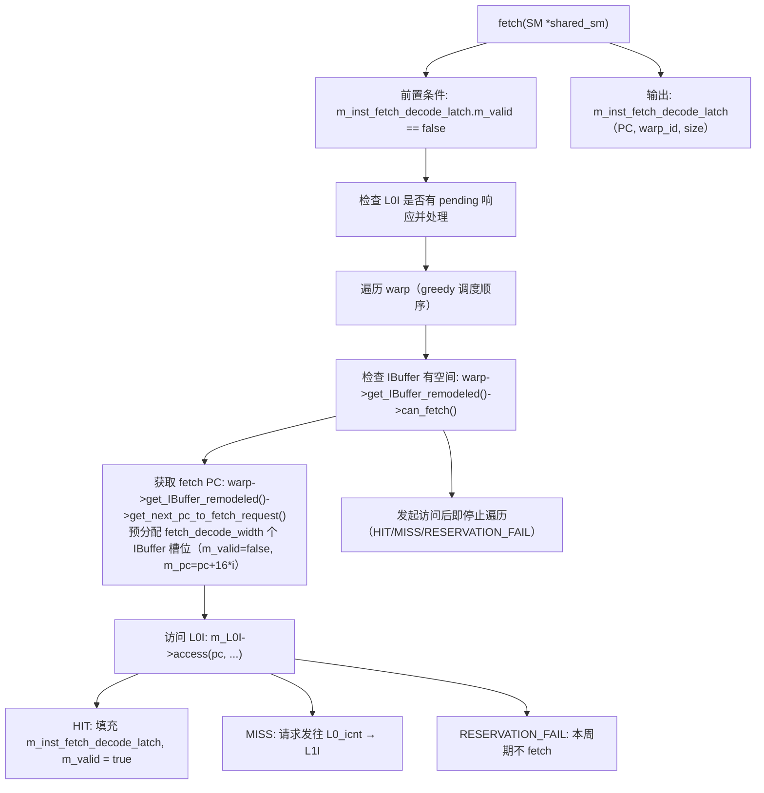

---

## 3.6 Decode 阶段

该流水级负责从 trace 获取指令并解码，将结果填入 IBuffer 中 fetch 阶段预分配的槽位。

在正常状态下（`m_inst_fetch_decode_latch.m_valid == true`）：

* 从 latch 获取 PC 和 warp_id
* 在目标 warp 的 IBuffer deque 中查找匹配的 entry（PC 匹配且 `m_valid == false`）
* 对每个匹配 entry 执行 `single_decode()`：
  * 从 trace 获取指令：`m_trace_warp->get_next_trace_inst(pc)`
  * 设置 warp ID 到指令中
  * 生成常量 cache 访问请求（如果指令有常量操作数）
  * 递增 warp 的 in-pipeline 指令计数：`warp->inc_inst_in_pipeline()`
  * 根据指令类型和 trace 信息生成执行 latency
  * 设置 `ibuffer_entry.m_valid = true`，`ibuffer_entry.m_inst = pI`
  * 若 interwarp coalescing 启用，记录该指令的依赖信息供后续合并决策使用
* 处理完所有匹配 entry 后，清除 `m_inst_fetch_decode_latch.m_valid = false`，释放 latch 供 fetch 阶段使用

在 latch 无效状态下（`m_inst_fetch_decode_latch.m_valid == false`）：

该流水级什么都不做，等待 fetch 阶段填充 latch。

Stall 条件：
* `m_inst_fetch_decode_latch.m_valid == false`（fetch 未产出新指令）

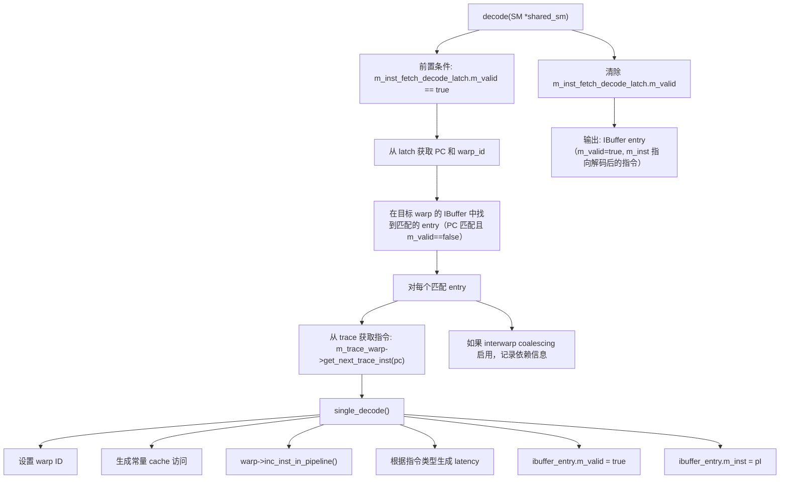

---

## 3.7 Issue 阶段

该流水级负责从各 warp 的 IBuffer 中选择一条就绪指令发射到下级流水线。这是 Subcore 流水线中逻辑最复杂的阶段，涉及 warp 调度、依赖检查、资源可用性检查。

在正常状态下（`m_ISSUE_CONTROL_latch.has_free()` 且 `m_num_pending_cycles_with_issue_port_busy == 0`）：

* 首先调用 `modify_warp_state()`，对本 subcore 的每个 warp 调用 `Dependency_State::cycle()`（stall/yield 位移衰减）
* 按 `order_greedy_then_highest_id` 顺序遍历 warp：先尝试 greedy warp（上次成功发射的 warp），再按 dynamic warp id 降序遍历其余 warp
* 对每个候选 warp，执行以下检查：
  * **IBuffer 就绪**：`warp->get_IBuffer_remodeled()->is_next_valid()` — 队首 entry 必须已解码
  * **依赖就绪**（True-Path，`use_traditional_scoreboarding = false`）：
    * `dependency_state->is_stall_counter_0()` — stall counter 必须为 0
    * `dependency_state->is_yield_ready()` — yield 必须就绪
    * `is_wait_barriers_ready_entry_point(pI, subcore_warp_id)` — 指令 control bits 中指定的所有 wait barrier 必须满足
    * `!is_waiting_ldgdepbar(pI, subcore_warp_id)` — 若为 LDGDEPBAR 指令，pending LDGSTS 计数必须为 0
    * `!warp->waiting()` — 不在 programmer barrier 等待中
  * **资源就绪**：
    * `fu->can_issue(pI)` — 目标 FU 可接受新指令（initiation interval 满足）
    * `are_l1c_operands_ready(shared_sm, pI)` — 常量操作数已就绪
    * 结果队列有空间（仅固定延迟指令）：对应的 `rf_write_queue.has_free()`
* 若所有条件满足，执行 `issue_warp()`：
  * `pI->set_fu_assigned(fu)` — 记录分配的 FU
  * `SM::issue_warp()` — 将指令移入 `m_ISSUE_CONTROL_latch`，调用 `IBuffer::issued()` 弹出队首，执行功能模拟 `func_exec_inst()`，设置 stall counter 和 yield
  * 预留结果队列槽位（固定延迟指令）
  * `fu->reserve_unit()` — 预留 FU
* 发射成功后更新 greedy pointer 指向当前 warp
* 每周期最多发射 1 条指令

在 issue port 繁忙状态下（`m_num_pending_cycles_with_issue_port_busy > 0`）：

该流水级仅执行 `modify_warp_state()` 更新依赖状态，不尝试发射。该 busy 计数主要由 `set_num_pending_cycles_with_issue_port_busy()` 设置（例如 IMAD.WIDE 场景）。

在下级 latch 被占用状态下（`!m_ISSUE_CONTROL_latch.has_free()`）：

该流水级仅执行 `modify_warp_state()`，不尝试发射。等待 control 阶段消费 latch。

Stall 条件：
* `m_ISSUE_CONTROL_latch` 被占用（control 阶段未消费）
* `m_num_pending_cycles_with_issue_port_busy > 0`（issue port 自身 busy 计数，如 IMAD.WIDE）
* 所有 warp 均不满足就绪条件（依赖未解除、FU 不可用、结果队列满等）

### 调度顺序

采用 `order_greedy_then_highest_id`：
1. 先调度 greedy warp（上次成功发射的 warp）
2. 再按 dynamic warp id 降序遍历

### 就绪条件检查（True-Path）

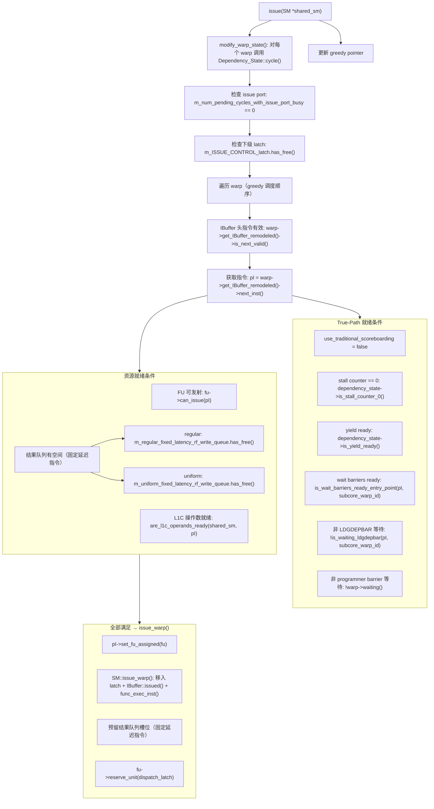

### Warp 调度状态机（Greedy-then-Oldest）

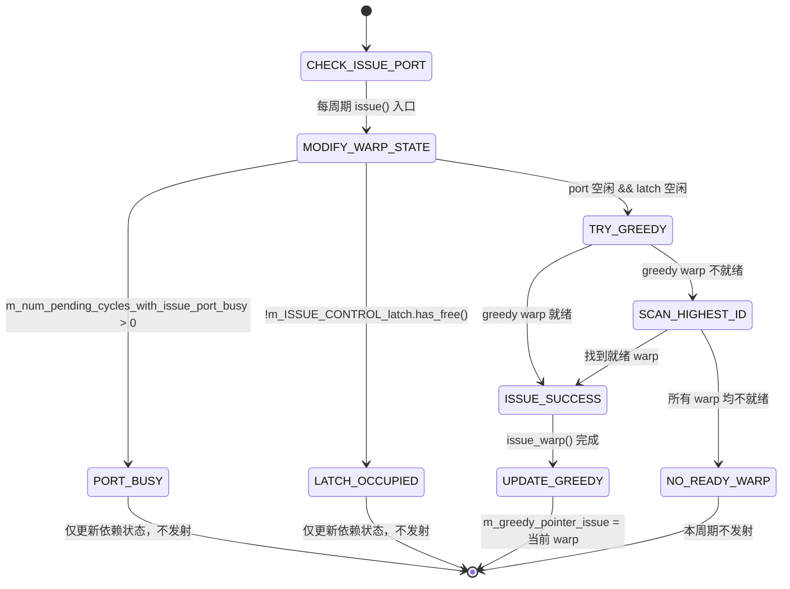

### 指令发射决策状态机（Issue Decision）

对每个候选 warp，按以下顺序检查就绪条件：

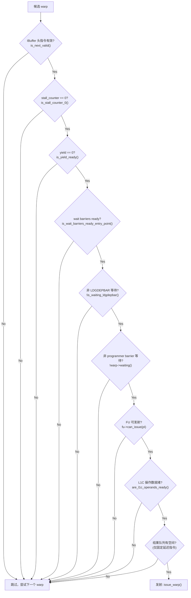

---

## 3.8 Control 阶段

该流水级负责处理 wait barrier 的设置，并根据指令类型将指令分流到不同的下级路径。这是固定延迟指令和可变延迟指令的分流点。

在正常状态下（`m_ISSUE_CONTROL_latch.has_ready()`）：

* 获取指令和已分配的 FU
* 判断指令类型：`fu->is_fixed_latency_unit()`
* **Barrier 设置**（True-Path）：
  * 若指令 control bits 中标记了 `new_read_barrier`，调用 `SM::add_pending_wait_barrier_increment(inst, READ_WAIT_BARRIER, barrier_id)`，将 read barrier increment 推入 SM 的 pending stack
  * 若指令 control bits 中标记了 `new_write_barrier`，调用 `SM::add_pending_wait_barrier_increment(inst, WRITE_WAIT_BARRIER, barrier_id)`，将 write barrier increment 推入 SM 的 pending stack
  * 设置 `inst->m_has_perform_control_stage = true`
* **固定延迟指令**（SP/BRANCH/TENSOR/UNIFORM/MISC_NO_QUEUE）：
  * 检查 `m_CONTROL_ALLOCATE_latch.has_free()`
  * 若空闲，将指令从 `m_ISSUE_CONTROL_latch` 移动到 `m_CONTROL_ALLOCATE_latch`
  * 若被占用，指令停留在 `m_ISSUE_CONTROL_latch`，下周期重试
* **可变延迟指令**（SFU/MISC_QUEUE/MEM/DP）：
  * 检查 `fu->can_issue(inst)`（FU 内部队列未满）
  * 若可接受，直接调用 `fu->issue(m_ISSUE_CONTROL_latch)`，指令进入 FU 内部队列，跳过 allocate 和 read_rf 阶段
  * 若 FU 队列满，指令停留在 `m_ISSUE_CONTROL_latch`，下周期重试

在 latch 无指令状态下（`!m_ISSUE_CONTROL_latch.has_ready()`）：

该流水级什么都不做。

Stall 条件：
* 固定延迟指令：`m_CONTROL_ALLOCATE_latch` 被占用
* 可变延迟指令：FU 内部队列满（`!fu->can_issue(inst)`）

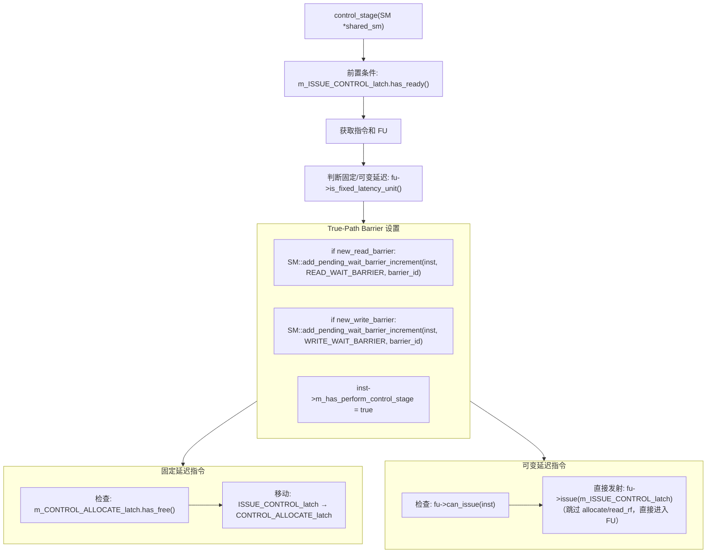

关键分流点：
- **固定延迟指令**（SP/INT/BRANCH/TENSOR/UNIFORM/MISC_NO_QUEUE）→ `m_CONTROL_ALLOCATE_latch` → allocate → read_rf → FU
- **可变延迟指令**（SFU/MISC_QUEUE/MEM/DP）→ 直接 `fu->issue()` 进入 FU 内部队列

---

## 3.9 Allocate 阶段（仅固定延迟指令）

该流水级负责为固定延迟指令预留寄存器文件读端口和 FU 执行槽位。可变延迟指令不经过此阶段。

在正常状态下（`m_CONTROL_ALLOCATE_latch.has_ready()`）：

* 获取指令和 FU
* 确定读流水线延迟：
  * Tensor Core 4-reg-per-operand 指令：`MAXIMUM_LATENCY_READ_FIXED_LATENCY_INST = 6` 周期
  * 其他固定延迟指令：`NO_TENSOR_OP_4REG_PER_OP_LATENCY_READ_FIXED_LATENCY_INST = 3` 周期
* 检查读流水线入口是否空闲：`m_pipeline_read_stage_latency_reg[read_latency - 1]->empty()`
* 检查 RF 读端口可用性：
  * `m_regular_rf->is_possible_to_read_cacheable(inst, warp_id, read_cycles)` — 检查 regular RF 各 bank 的读端口，RF cache 命中的操作数不消耗读端口
  * `m_uniform_rf->is_possible_to_read_cacheable(inst, warp_id, read_cycles)` — uniform RF 读端口无限制，始终返回 true
  * `rf_requests.is_possible_to_read()` — 所有 RF 类型的读端口均可用
* 计算目标 FU latency：`target_latency = read_latency + inst->latency + inst->initiation_interval`
* 检查 FU latency 槽位：`fu->is_latency_available(target_latency)` — 使用 `occupied` bitset 检查
* 若所有条件满足：
  * `allocate_reads()` — 预留 RF 读端口，更新 RF cache（miss 时分配新 entry）
  * `fu->reserve_latency(target_latency)` — 在 `occupied` bitset 中标记目标槽位
  * 将指令从 `m_CONTROL_ALLOCATE_latch` 移入 `m_pipeline_read_stage_latency_reg[read_latency - 1]`
* 若任一条件不满足，指令停留在 `m_CONTROL_ALLOCATE_latch`，下周期重试

在 latch 无指令状态下：

该流水级什么都不做。

Stall 条件：
* 读流水线入口被占用
* RF 读端口不足（regular RF bank 冲突）
* FU 目标 latency 槽位已被占用

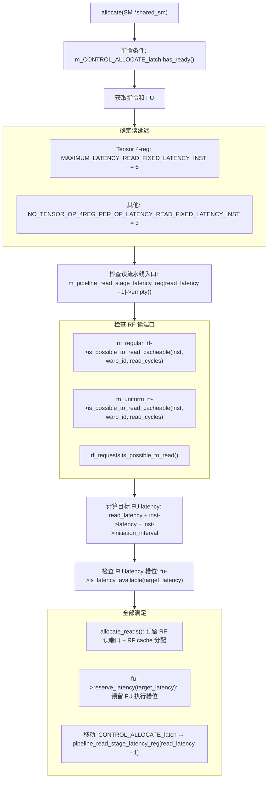

---

## 3.10 Read_RF 阶段

该流水级负责完成寄存器文件读取，将指令从读流水线头部送入 FU 的 dispatch register。同时负责推进多级读流水线。

在正常状态下（`!m_pipeline_read_stage_latency_reg[0]->empty()`，即读流水线头部有指令）：

* 获取指令已分配的 FU
* 调用 `fu->release_read_barrier(pipe_reg)`：
  * 固定延迟路径会在此调用 `release_read_barrier()`
  * 是否实际产生 pending decrement 由 `release_read_barrier()` 内 guard 条件决定（trace/captured/scoreboard/control bits）
* 将指令移入辅助 latch：`m_read_stage_aux_latch.move_in(pipe_reg)`
* 发射到 FU：`fu->issue(m_read_stage_aux_latch)` — 指令进入 FU 的 `m_dispatch_reg`
* 推进读流水线：`pipeline_read_stage_latency_reg[i]` 的内容移动到 `pipeline_read_stage_latency_reg[i-1]`，逐级前移
* 推进 RF 状态：`m_regular_rf->cycle()` 和 `m_uniform_rf->cycle()` — 推进 bank 端口预留状态的时间窗口

在读流水线头部为空时：

仅执行读流水线推进和 RF cycle，不发射指令。

Stall 条件：
* 该阶段本身不产生 stall（读流水线头部有指令时必定能发射到 FU，因为 FU latency 已在 allocate 阶段预留）

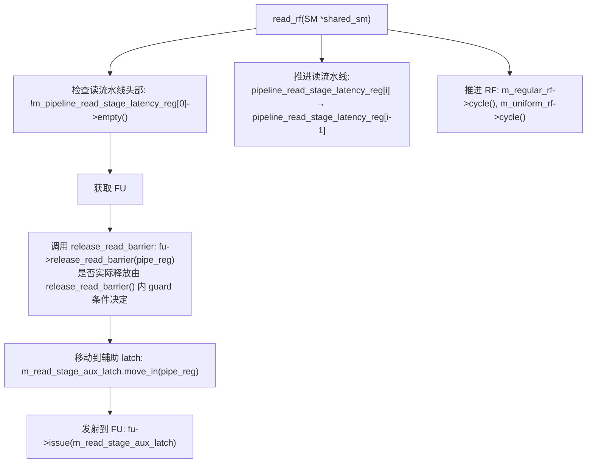

---

## 3.11 Execute 阶段

该流水级负责驱动所有 FU 的内部流水线推进。每个 FU 独立执行 `cycle()`，互不干扰。

在每个周期：

* 遍历 `m_all_subcore_ex_pipelines` 中的所有 FU，对每个 FU 调用 `fu->cycle()`
* 每个 FU 的 `cycle()` 行为（基类 `functional_unit::cycle()`）：
  1. 递减 `m_dispatch_pending_reserved_cycles`（dispatch 延迟计数器）
  2. 检查 predicate 流水线头部（`m_pipeline_extra_predicate_stages_reg[0]`）：若非空，调用 `instruction_finishing_execution()` 完成指令
  3. 推进 predicate 流水线：各级前移
  4. 检查主执行流水线头部（`m_pipeline_reg[0]`）：
     * 若指令有额外 predicate latency：移入 predicate 流水线尾部
     * 否则：调用 `instruction_finishing_execution()` 完成指令
  5. 推进主执行流水线：各级前移
  6. Dispatch 新指令（从 `m_dispatch_reg`）：
     * 检查 `m_dispatch_reg` 非空且 `!dispatch_delay()`
     * 计算起始 stage：`start_stage = latency - 1`
     * 若 `m_pipeline_reg[start_stage]` 为空：移入该 stage
     * 对非固定延迟且非队列型 FU（如 SFU）：此时调用 `release_read_barrier()`
     * `m_active_insts_in_pipeline++`

* 对于带队列的 FU（`functional_unit_with_queue::cycle()`），额外执行：
  1. 推进中间级（intermediate stages）：递减 `remaining_cycles`，完成时移入 result port
  2. `m_num_cycles_to_wait_to_free_WAR` 递减到 0 时调用 `release_read_barrier()`
  3. 从队列取指令到中间级尾部
  4. 从 `m_dispatch_reg` 入队（若队列未满）
  5. 对于 SM 共享 FU（MEM/DP）：中间级完成时检查 SM 调度间隔，满足后移入 SM reception latch

`instruction_finishing_execution()` 行为：
* **固定延迟指令**（有目标寄存器）：将结果移入 `m_rf_write_queue`（regular 或 uniform），标记 `retired = true`
* **可变延迟指令**（有目标寄存器）：将结果移入 `m_result_port`（variable latency latch）
* **无目标寄存器的指令**：直接标记完成
* 递减 `m_active_insts_in_pipeline`

Stall 条件：
* Dispatch 阶段：`m_pipeline_reg[start_stage]` 被占用（指令堆积在 dispatch_reg）
* 带队列 FU：队列满时新指令无法入队
* SM 共享 FU：SM 调度间隔未满足时中间级完成的指令无法移入 reception latch

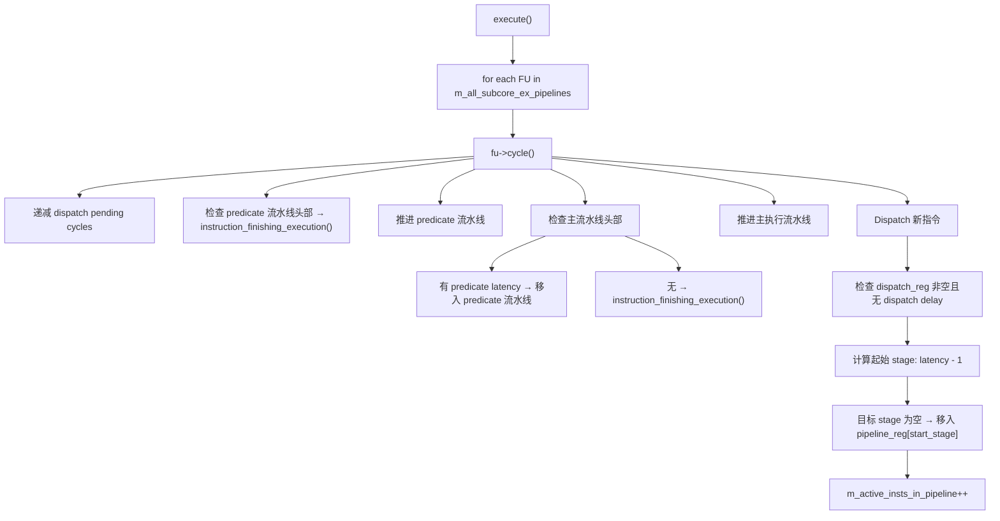

`instruction_finishing_execution()` 对固定延迟指令：
- 将结果移入 `m_rf_write_queue`（regular 或 uniform）
- 标记 `retired = true`

---

## 3.12 Writeback 阶段

该流水级负责将执行完成的指令写回寄存器文件并触发退休。需要检查 RF 写端口可用性，不可用时指令停留在 latch 等待。

在每个周期，按以下顺序处理三个来源：

**1. 固定延迟写回队列**（优先级最高）：
* 处理 `m_regular_fixed_latency_rf_write_queue`：每周期最多弹出 `max_pops_per_cycle` 条指令
* 处理 `m_uniform_fixed_latency_rf_write_queue`：同上
* 对每条弹出的指令调用 `writeback_latch_proccess()`
* 若成功退休，释放结果队列槽位

**2. Variable latency latch**：
* 处理 `m_EX_WB_sm_variable_latency_latch`（SFU/MISC_QUEUE 完成的指令）
* 调用 `writeback_latch_proccess(latch, is_from_shared=false)`

**3. SM 共享单元返回 latch**：
* 处理 `m_EX_WB_sm_shared_units_latch`（DP/MEM 从 SM 共享单元返回的指令）
* 调用 `writeback_latch_proccess(latch, is_from_shared=true)`

`writeback_latch_proccess()` 的行为：
* 获取 latch 中的就绪指令
* 若指令有目标寄存器，检查每个目标寄存器对应 RF bank 的写端口：
  * `rf->is_rf_bank_write_port_available_this_cycle(bank_id)`
  * bank 由 `reg_id % num_banks` 计算
  * 需要区分目标寄存器类型（REG → regular RF，UREG → uniform RF）
* 若所有写端口可用：
  * 分配写端口：`rf->allocate_rf_bank_write_port_this_cycle(bank_id)`
  * 调用 `SM::instruction_retirement(inst)` 触发退休（write barrier decrement、LDGSTS 计数递减、warp 计数更新等）
  * 清除指令
* 若任一写端口不可用：
  * 指令停留在 latch，下周期重试
  * 这会反压上游（FU 无法将新结果写入 latch）

Stall 条件：
* RF 写端口冲突（多条指令同时写同一 bank）
* 固定延迟写回队列满（反压 FU 的 `instruction_finishing_execution()`）

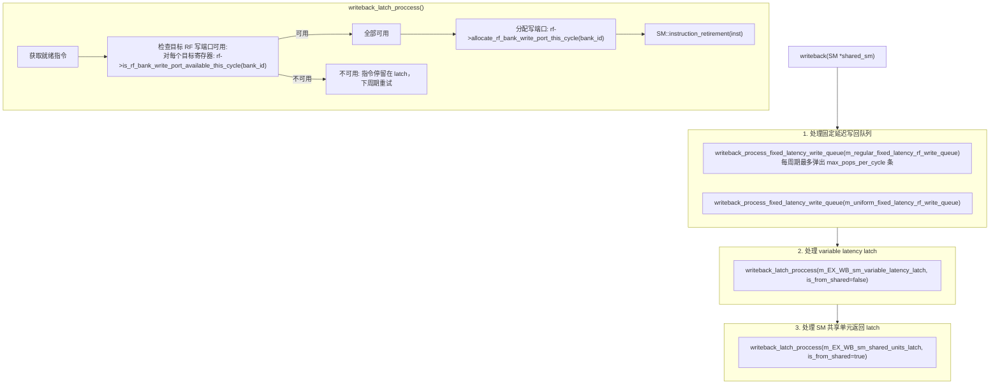

---

## 源码锚点

| 文件 | 函数 | 说明 |
|---|---|---|
| `subcore.cc` | `Subcore::cycle()` | 8 级逆序流水线入口 |
| `subcore.cc` | `Subcore::fetch()` | L0I 访问 + IBuffer 预分配 |
| `subcore.cc` | `Subcore::decode()` | Trace 解码 + IBuffer 填充 |
| `subcore.cc` | `Subcore::issue()` | Warp 调度 + 就绪判定 |
| `subcore.cc` | `Subcore::control_stage()` | Barrier 设置 + latch 分流 |
| `subcore.cc` | `Subcore::allocate()` | RF 端口 + FU latency 预留 |
| `subcore.cc` | `Subcore::read_rf()` | RF 读取 + read barrier 释放 |
| `subcore.cc` | `Subcore::execute()` | FU cycle 驱动 |
| `subcore.cc` | `Subcore::writeback()` | RF 写回 + 退休 |
| `subcore.cc` | `Subcore::issue_warp()` | 发射执行 |
| `subcore.cc` | `Subcore::is_wait_barriers_ready_entry_point()` | Barrier 就绪检查入口 |
| `subcore.cc` | `Subcore::create_pipeline()` | FU 创建与配置 |

---

## 接口时序

### Fetch → Decode Latch 传递时序

```
Cycle N (fetch 阶段):
  条件: m_inst_fetch_decode_latch.m_valid == false
  动作: 遍历 warp，找到可 fetch 的 warp
    → L0I::access(pc)
    → HIT: m_inst_fetch_decode_latch = {m_valid=true, m_pc=pc, m_nbytes=size, m_warp_id=wid}
    → MISS: latch 保持无效，等待 L1I 响应

Cycle N+1 (decode 阶段):
  条件: m_inst_fetch_decode_latch.m_valid == true
  动作: 从 latch 获取 PC 和 warp_id
    → 在 IBuffer 中找到匹配 entry（PC 匹配且 m_valid==false）
    → single_decode() 填充 entry
    → 清除 m_inst_fetch_decode_latch.m_valid = false

Cycle N+1 (fetch 阶段，同周期逆序):
  由于逆序驱动，decode 先执行释放 latch，fetch 后执行可立即使用
  → 理想情况下每周期可完成一次 fetch-decode 传递
```

### Issue → Control → Allocate 流水线时序

```
Cycle N (issue 阶段):
  条件: m_ISSUE_CONTROL_latch.has_free() && 就绪条件满足
  动作: issue_warp() → 指令移入 m_ISSUE_CONTROL_latch

Cycle N+1 (control 阶段):
  条件: m_ISSUE_CONTROL_latch.has_ready()
  动作:
    → 固定延迟: 检查 m_CONTROL_ALLOCATE_latch.has_free()
      → 空闲: 移入 m_CONTROL_ALLOCATE_latch
    → 可变延迟: 检查 fu->can_issue()
      → 可接受: fu->issue() 直接进入 FU 队列

Cycle N+2 (allocate 阶段，仅固定延迟):
  条件: m_CONTROL_ALLOCATE_latch.has_ready()
  动作: 检查 RF 读端口 + FU latency 槽位
    → 全部满足: 移入 m_pipeline_read_stage_latency_reg[read_latency-1]

Cycle N+2+read_latency (read_rf 阶段):
  条件: m_pipeline_read_stage_latency_reg[0] 非空
  动作: fu->issue() → 指令进入 FU dispatch_reg
```

### Execute → Writeback 结果返回时序

```
固定延迟路径:
  Cycle N: FU 执行完成 → instruction_finishing_execution()
    → 结果移入 m_regular/uniform_fixed_latency_rf_write_queue
  Cycle N+1: writeback 阶段从队列弹出（每周期最多 max_pops_per_cycle 条）
    → 检查 RF 写端口 → SM::instruction_retirement()

可变延迟路径（Subcore 内 FU，如 SFU/MISC_QUEUE）:
  Cycle N: FU 执行完成 → 结果移入 m_EX_WB_sm_variable_latency_latch
  Cycle N+1: writeback 阶段处理 variable latency latch
    → 检查 RF 写端口 → SM::instruction_retirement()

可变延迟路径（SM 共享 FU，如 MEM/DP）:
  Cycle N: SM 共享单元完成 → 结果移入 m_EX_WB_sm_shared_units_latch
  Cycle N (同周期 Phase 5): writeback 阶段处理 SM 共享单元返回 latch
    → 检查 RF 写端口 → SM::instruction_retirement()
```

---

## 关键电路描述

### Greedy Rotation Pointer 逻辑

Greedy pointer 实现了 warp 调度的时间局部性优化：

```
数据结构:
  m_greedy_pointer_issue: unsigned int  // issue 阶段的 greedy 指针
  m_greedy_pointer_fetch: unsigned int  // fetch 阶段的 greedy 指针

调度顺序生成 (order_greedy_then_highest_id):
  1. 将 greedy_pointer 指向的 warp 放在遍历序列首位
  2. 其余 warp 按 dynamic_warp_id 降序排列
  3. 返回排序后的 warp 索引序列

更新逻辑:
  issue 成功时: m_greedy_pointer_issue = 当前成功发射的 warp 索引
  每周期末尾: m_greedy_pointer_fetch = m_greedy_pointer_issue (subcore.cc:109)
```

### Issue 条件决策组合逻辑

Issue 阶段的就绪判定是一个多条件 AND 组合逻辑，所有条件必须同时满足：

```
issue_ready = ibuffer_valid
            && stall_counter == 0
            && yield == 0
            && wait_barriers_ready
            && !ldgdepbar_waiting
            && !programmer_barrier_waiting
            && fu_can_issue
            && l1c_operands_ready
            && result_queue_has_space (仅固定延迟指令)
```

其中 `result_queue_has_space` 的检查逻辑（`subcore.cc`）：

```cpp
// 固定延迟指令需要检查对应结果队列
if (is_fixed_latency_inst && has_dst_reg) {
  if (dst_type == REG)  → has_regular_fixed_latency_rf_result_queue_space()
  if (dst_type == UREG) → has_uniform_fixed_latency_rf_result_queue_space()
}
// 检查实现: m_reserved_slots < max_size_register_file_write_queue_for_fixed_latency_instructions
```

### 固定延迟 vs 可变延迟路径分流逻辑

Control 阶段根据 `fu->is_fixed_latency_unit()` 将指令分流到两条不同路径：

```
固定延迟 FU (is_fixed_latency_unit() == true):
  SP / INT / BRANCH / TENSOR / UNIFORM / MISC_NO_QUEUE
  路径: control → m_CONTROL_ALLOCATE_latch → allocate → read_rf → FU pipeline
  特点: 需要预留 RF 读端口和 FU latency 槽位

可变延迟 FU (is_fixed_latency_unit() == false):
  SFU / MISC_QUEUE / MEM / DP
  路径: control → fu->issue() → FU 内部队列
  特点: 跳过 allocate 和 read_rf，直接进入 FU 内部队列
  原因: 可变延迟指令无法在 allocate 时确定 FU latency 槽位
```

---

## 参考文档

| 文档 | 说明 |
|---|---|
| MICRO 2025 论文 | 8 级流水线结构和 CGGTY 调度策略的理论来源 |
| `subcore.h` / `subcore.cc` | Subcore 类定义与实现 |
| `sm.h` / `sm.cc` | SM 类定义，包含 `issue_warp()` 和 `instruction_retirement()` |
| `ibuffer_remodeled.h` | IBuffer_Entry 和 IBuffer_Remodeled 定义 |
| `warp_dependency_state.h` / `warp_dependency_state.cc` | Dependency_State 实现 |
| `shader.h` | `shader_core_config` 配置参数、`ifetch_buffer_t` 定义 |
| `abstract_hardware_model.h` | 硬件模型常量和基础类型定义 |
| 第 2 章：SM 顶层设计 | SM 级 8-phase 执行序列 |
| 第 4 章：依赖模型设计 | Control-bit 依赖模型详细设计 |
