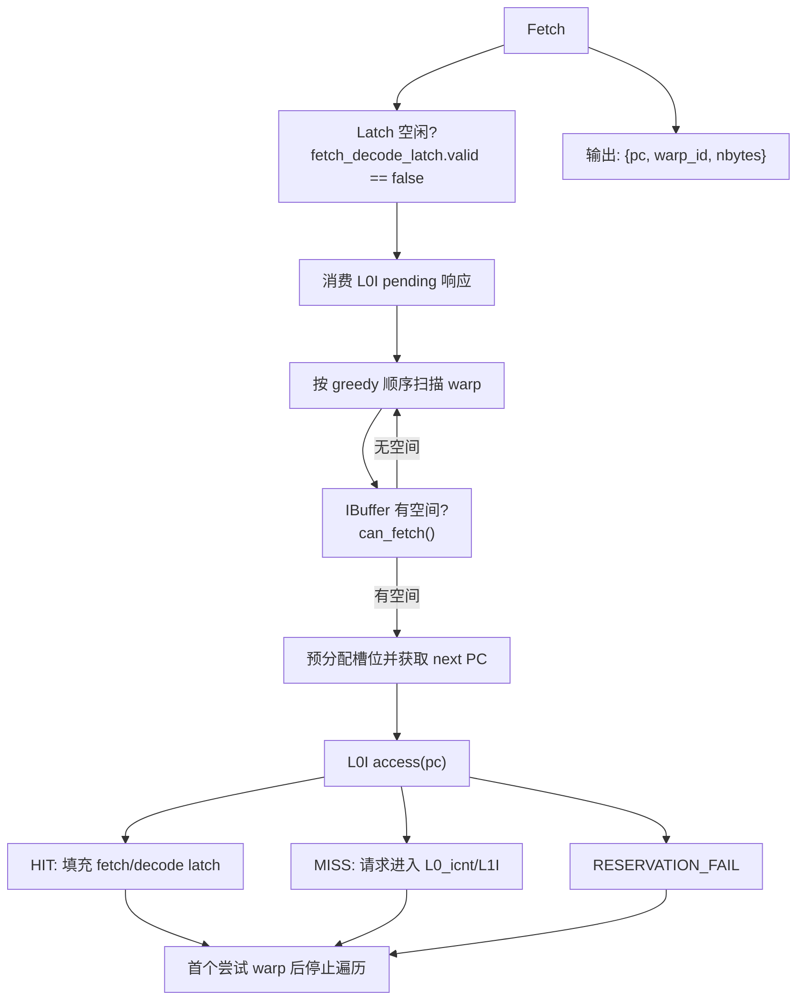
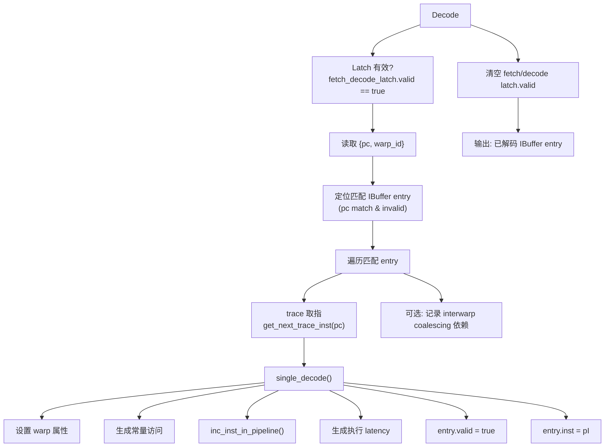
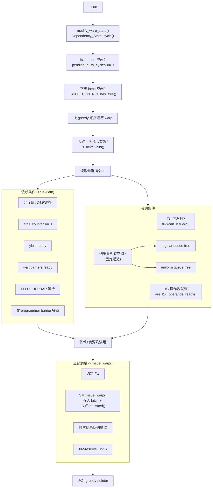
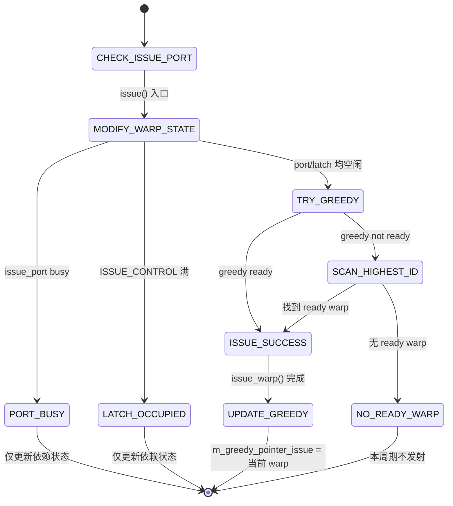
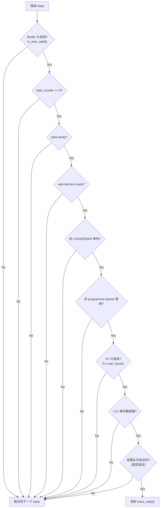
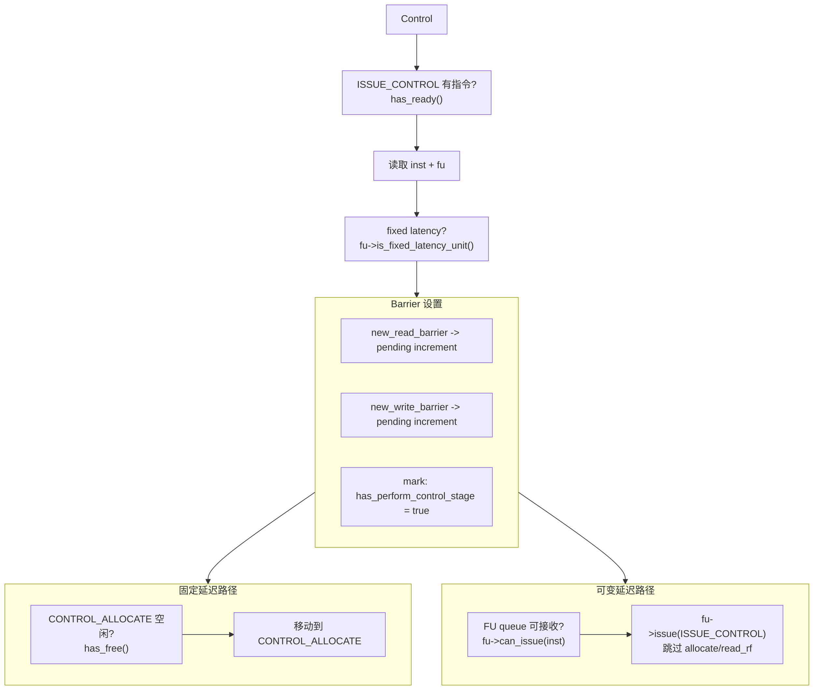

# 第 3 章（续A）：Subcore 前端流水与调度设计

---

> **本文件是第 3 章的前端续篇**，覆盖 Fetch / Decode / Issue / Control 四个阶段的实现细节、状态机与停顿传播。
> - 前文见 [03-Subcore流水线设计.md](./03-Subcore流水线设计.md)
> - 后文见 [03B-Subcore后端执行与写回设计.md](./03B-Subcore后端执行与写回设计.md)

---

## 3.5 Fetch 阶段

该流水级负责从 L0I 指令缓存获取指令，并在 IBuffer 中预分配槽位。

在正常状态下（`m_inst_fetch_decode_latch.m_valid == false`，即 fetch-decode latch 空闲）：

* 首先检查 L0I 是否有 pending 的 cache 响应（之前 miss 的请求已被 L1I 填充），若有则处理响应并填充 latch
* 若无 pending 响应，则按 greedy 调度顺序遍历本 subcore 的所有 warp：
  * 检查该 warp 的 IBuffer 是否有空间：`can_fetch() = (m_num_entries + m_fetch_decode_width <= m_num_max_entries)`
  * 若有空间，调用 `get_next_pc_to_fetch_request()` 获取下一个 fetch PC，该调用同时在 IBuffer 尾部预分配 `fetch_decode_width` 个槽位（`m_valid=false, m_pc=base_pc+16*i, m_inst=NULL`）
  * 向 L0I 发起访问：`m_L0I->access(pc, ...)`
    * **HIT**：填充 `m_inst_fetch_decode_latch`（PC、warp_id、size），设置 `m_valid = true`，本周期 fetch 完成
    * **MISS**：请求进入 L0_icnt 队列等待 L1I 响应，本周期 fetch 未完成，latch 保持无效
    * **RESERVATION_FAIL**：MSHR 满，本周期不 fetch，latch 保持无效
  * 一旦找到第一个可 fetch 的 warp 并发起 L0I 访问（无论 HIT/MISS/RESERVATION_FAIL），即停止遍历

在 latch 被占用状态下（`m_inst_fetch_decode_latch.m_valid == true`）：

该流水级什么都不做，等待 decode 阶段消费 latch 后释放。

Stall 条件：
* `m_inst_fetch_decode_latch.m_valid == true`（decode 未消费上一次 fetch 结果）
* 所有 warp 的 IBuffer 均满（无 warp 可 fetch）
* 首个可 fetch warp 的 L0I 访问返回 MISS 或 RESERVATION_FAIL（本周期不产出新 fetch 结果）



---

## 3.6 Decode 阶段

该流水级负责从 trace 获取指令并解码，将结果填入 IBuffer 中 fetch 阶段预分配的槽位。

在正常状态下（`m_inst_fetch_decode_latch.m_valid == true`）：

* 从 latch 获取 PC 和 warp_id
* 在目标 warp 的 IBuffer deque 中查找匹配的 entry（PC 匹配且 `m_valid == false`）
* 对每个匹配 entry 执行 `single_decode()`：
  * 从 trace 获取指令：`m_trace_warp->get_next_trace_inst(pc)`
  * 设置 warp ID 到指令中
  * 生成常量 cache 访问请求（如果指令有常量操作数）
  * 递增 warp 的 in-pipeline 指令计数：`warp->inc_inst_in_pipeline()`
  * 根据指令类型和 trace 信息生成执行 latency
  * 设置 `ibuffer_entry.m_valid = true`，`ibuffer_entry.m_inst = pI`
  * 若 interwarp coalescing 启用，记录该指令的依赖信息供后续合并决策使用
* 处理完所有匹配 entry 后，清除 `m_inst_fetch_decode_latch.m_valid = false`，释放 latch 供 fetch 阶段使用

在 latch 无效状态下（`m_inst_fetch_decode_latch.m_valid == false`）：

该流水级什么都不做，等待 fetch 阶段填充 latch。

Stall 条件：
* `m_inst_fetch_decode_latch.m_valid == false`（fetch 未产出新指令）



---

## 3.7 Issue 阶段
<!-- anchor:cggty-scheduling -->

该流水级负责从各 warp 的 IBuffer 中选择一条就绪指令发射到下级流水线。这是 Subcore 流水线中逻辑最复杂的阶段，涉及 warp 调度、依赖检查、资源可用性检查。

在正常状态下（`m_ISSUE_CONTROL_latch.has_free()` 且 `m_num_pending_cycles_with_issue_port_busy == 0`）：

* 首先调用 `modify_warp_state()`，对本 subcore 的每个 warp 调用 `Dependency_State::cycle()`（stall/yield 位移衰减）
* 按 `order_greedy_then_highest_id` 顺序遍历 warp：先尝试 greedy warp（上次成功发射的 warp），再按 dynamic warp id 降序遍历其余 warp
* 对每个候选 warp，执行以下检查：
  * **IBuffer 就绪**：`warp->get_IBuffer_remodeled()->is_next_valid()` — 队首 entry 必须已解码
  * **依赖就绪**（True-Path，`use_traditional_scoreboarding = false`）：
    * `dependency_state->is_stall_counter_0()` — stall counter 必须为 0
    * `dependency_state->is_yield_ready()` — yield 必须就绪
    * `is_wait_barriers_ready_entry_point(pI, subcore_warp_id)` — 指令 control bits 中指定的所有 wait barrier 必须满足
    * `!is_waiting_ldgdepbar(pI, subcore_warp_id)` — 若为 LDGDEPBAR 指令，pending LDGSTS 计数必须为 0
    * `!warp->waiting()` — 不在 programmer barrier 等待中
  * **资源就绪**：
    * `fu->can_issue(pI)` — 目标 FU 可接受新指令（initiation interval 满足）
    * `are_l1c_operands_ready(shared_sm, pI)` — 常量操作数已就绪
    * 结果队列有空间（仅固定延迟指令）：对应的 `rf_write_queue.has_free()`
* 若所有条件满足，执行 `issue_warp()`：
  * `pI->set_fu_assigned(fu)` — 记录分配的 FU
  * `SM::issue_warp()` — 将指令移入 `m_ISSUE_CONTROL_latch`，调用 `IBuffer::issued()` 弹出队首，执行功能模拟 `func_exec_inst()`，设置 stall counter 和 yield
  * 预留结果队列槽位（固定延迟指令）
  * `fu->reserve_unit()` — 预留 FU
* 发射成功后更新 greedy pointer 指向当前 warp
* 每周期最多发射 1 条指令

在 issue port 繁忙状态下（`m_num_pending_cycles_with_issue_port_busy > 0`）：

该流水级仅执行 `modify_warp_state()` 更新依赖状态，不尝试发射。该 busy 计数主要由 `set_num_pending_cycles_with_issue_port_busy()` 设置（例如 IMAD.WIDE 场景）。

在下级 latch 被占用状态下（`!m_ISSUE_CONTROL_latch.has_free()`）：

该流水级仅执行 `modify_warp_state()`，不尝试发射。等待 control 阶段消费 latch。

Stall 条件：
* `m_ISSUE_CONTROL_latch` 被占用（control 阶段未消费）
* `m_num_pending_cycles_with_issue_port_busy > 0`（issue port 自身 busy 计数，如 IMAD.WIDE）
* 所有 warp 均不满足就绪条件（依赖未解除、FU 不可用、结果队列满等）

### 调度顺序

采用 `order_greedy_then_highest_id`：
1. 先调度 greedy warp（上次成功发射的 warp）
2. 再按 dynamic warp id 降序遍历

### 就绪条件检查（True-Path）



### Warp 调度状态机（Greedy-then-Oldest）



### 指令发射决策状态机（Issue Decision）

对每个候选 warp，按以下顺序检查就绪条件：



---

## 3.8 Control 阶段
<!-- anchor:fixed-variable-latency-routing -->

该流水级负责处理 wait barrier 的设置，并根据指令类型将指令分流到不同的下级路径。这是固定延迟指令和可变延迟指令的分流点。

在正常状态下（`m_ISSUE_CONTROL_latch.has_ready()`）：

* 获取指令和已分配的 FU
* 判断指令类型：`fu->is_fixed_latency_unit()`
* **Barrier 设置**（True-Path）：
  * 若指令 control bits 中标记了 `new_read_barrier`，调用 `SM::add_pending_wait_barrier_increment(inst, READ_WAIT_BARRIER, barrier_id)`，将 read barrier increment 推入 SM 的 pending stack
  * 若指令 control bits 中标记了 `new_write_barrier`，调用 `SM::add_pending_wait_barrier_increment(inst, WRITE_WAIT_BARRIER, barrier_id)`，将 write barrier increment 推入 SM 的 pending stack
  * 设置 `inst->m_has_perform_control_stage = true`
* **固定延迟指令**（SP/BRANCH/TENSOR/UNIFORM/MISC_NO_QUEUE）：
  * 检查 `m_CONTROL_ALLOCATE_latch.has_free()`
  * 若空闲，将指令从 `m_ISSUE_CONTROL_latch` 移动到 `m_CONTROL_ALLOCATE_latch`
  * 若被占用，指令停留在 `m_ISSUE_CONTROL_latch`，下周期重试
* **可变延迟指令**（SFU/MISC_QUEUE/MEM/DP）：
  * 检查 `fu->can_issue(inst)`（FU 内部队列未满）
  * 若可接受，直接调用 `fu->issue(m_ISSUE_CONTROL_latch)`，指令进入 FU 内部队列，跳过 allocate 和 read_rf 阶段
  * 若 FU 队列满，指令停留在 `m_ISSUE_CONTROL_latch`，下周期重试

在 latch 无指令状态下（`!m_ISSUE_CONTROL_latch.has_ready()`）：

该流水级什么都不做。

Stall 条件：
* 固定延迟指令：`m_CONTROL_ALLOCATE_latch` 被占用
* 可变延迟指令：FU 内部队列满（`!fu->can_issue(inst)`）



关键分流点：
- **固定延迟指令**（SP/INT/BRANCH/TENSOR/UNIFORM/MISC_NO_QUEUE）→ `m_CONTROL_ALLOCATE_latch` → allocate → read_rf → FU
- **可变延迟指令**（SFU/MISC_QUEUE/MEM/DP）→ 直接 `fu->issue()` 进入 FU 内部队列

---

## 3.A 前端补充细节

### 3.A.1 Stage Entry/Exit 契约矩阵

| 阶段 | Entry 条件（必须满足） | Exit 保证（成功路径） | 失败/停顿时保持 |
|---|---|---|---|
| Fetch | `!m_inst_fetch_decode_latch.m_valid` | 写入 `ifetch_buffer_t` 或在 IBuffer 中完成 fetch 预分配 | 不覆盖已有 latch；`RESERVATION_FAIL` 时撤销本次预分配 entry |
| Decode | `m_inst_fetch_decode_latch.m_valid` | 命中 entry 的 `m_valid` 置 true，`m_inst` 写入解码后指令 | latch 保持直到 decode 结束；无 fetch 结果时完全空转 |
| Issue | `m_ISSUE_CONTROL_latch.has_free()` 且 issue-port 不 busy | 最多发射 1 条指令，更新 `m_greedy_pointer_issue` | 若下级占用或条件不满足，仅衰减依赖状态 |
| Control | `m_ISSUE_CONTROL_latch.has_ready()` | 固定延迟指令转入 `m_CONTROL_ALLOCATE_latch`；可变延迟指令进入 FU queue | 指令保持在 `m_ISSUE_CONTROL_latch`，等待下周期重试 |

实现对照（源码）：
- `Subcore::fetch()`：`subcore.cc:941-1034`
- `Subcore::decode()`：`subcore.cc:891-927`
- `Subcore::issue()`：`subcore.cc:351-527`
- `Subcore::control_stage()`：`subcore.cc:317-349`

### 3.A.2 Issue 阶段常量缓存切换抑制逻辑

Issue 不只做“是否 ready”的静态判断，还会对 greedy warp 的 L0C miss 施加短期“继续等待”策略，避免过于频繁切换 warp：

```cpp
if (m_greedy_pointer_issue == subcore_warp_id) {
  if (is_l1c_ready) {
    m_num_pending_cycles_constant_cache_misses_before_switch_to_other_warp =
      cfg->num_const_cache_cycle_misses_before_switch_to_other_warp;
  } else if (counter > 0) {
    counter--;
  }
  if (counter > 0) can_l1c_switch_warp = false;
}
```

语义要点：
- 只对“当前 greedy warp”生效，不影响非 greedy warp 的就绪判定。
- 当 greedy warp 的常量操作数短期不可用时，策略允许继续等待若干周期，而不是立刻切到其他 warp。
- 该策略与 `are_switch_warp_conditions_ready` 并行存在：即使其它条件满足，也可能因为该抑制窗口而不切换。

### 3.A.3 Wait Barrier 生效时序边界

前端路径中 barrier 的关键不是“是否设置”，而是“何时可见”：

1. `control_stage()` 内调用 `SM::add_pending_wait_barrier_increment(...)` 只会把 action 压入 SM 的 pending stack。  
2. 当前 cycle 的 `subcore->cycle()` 结束后，`SM::cycle()` 末尾统一执行 `consume_pending_wait_barrier_actions(...)`。  
3. 因此，issue 阶段对 barrier 计数变化的可见性是“下一轮 SM 周期”。

该边界解释了为什么某些 trace 中看起来“本条指令刚设置 barrier，下一条仍可观察到旧值”：这不是 bug，而是设计上的 phase 顺序结果。

### 3.A.4 依赖状态衰减机制与调度影响

`Dependency_State::cycle()` 采用右移衰减：

```cpp
m_yield >>= 1;
m_stall_counter >>= 1;
```

影响：
- `yield` 本质是 1-bit/2-bit 级短脉冲，通常 1-2 周期即可衰减到可发射。
- `stall_counter` 的衰减速度为指数级（按位右移），与“每周期减一”模型不同，这会改变长 stall 的分布尾部。
- `modify_warp_state()` 在 issue 阶段最开始执行，意味着同一周期内先衰减，再做就绪判断。

### 3.A.5 停顿传播路径（Front-end Backpressure Map）

前端停顿不是孤立事件，典型传播链如下：

1. `m_CONTROL_ALLOCATE_latch` 满  
2. `control_stage()` 无法将 fixed-latency 指令从 `m_ISSUE_CONTROL_latch` 推进  
3. `issue()` 看到 `m_ISSUE_CONTROL_latch` 非空，`is_next_stage_available = false`  
4. issue 统计计入 `total_num_cycles_issue_stage_stall_next_stage_not_available`  
5. 上游 decode/fetch 继续推进但 IBuffer 逐步填满，最终反压到 fetch

这条链路是调优 `max_size_register_file_write_queue_for_fixed_latency_instructions`、RF 端口和 FU initiation interval 时最常见的观测路径。

### 3.A.6 前端关键统计计数器

`issue()` 内已内建可诊断统计（`subcore.cc:506-525`）：

| 计数器 | 含义 | 对应问题 |
|---|---|---|
| `total_num_cycles_issue_stage_issuing` | issue 成功发射 | 有效吞吐 |
| `total_num_cycles_issue_stage_stall_next_stage_not_available` | 下级 latch 不可写 | control/allocate 回压 |
| `total_num_cycles_issue_stage_stall_issue_port_busy` | issue port 自身 busy | IMAD.WIDE 等特殊指令后效 |
| `total_num_cycles_issue_stage_stall_no_valid_instruction` | 无可发射头指令 | decode/fetch 供给不足 |
| `total_num_cycles_issue_stage_stall_no_warps_ready` | 有指令但均不 ready | 依赖、barrier、FU、L1C 或结果队列约束 |

### 3.A.7 源码锚点（前端补充）

| 文件 | 函数 | 关键点 |
|---|---|---|
| `subcore.cc` | `Subcore::fetch()` | 先消费 L0I 响应，再发起新请求；`RESERVATION_FAIL` 撤销 entry |
| `subcore.cc` | `Subcore::single_decode()` | latency 生成、unique id、常量访问生成 |
| `subcore.cc` | `Subcore::issue()` | True-Path 与传统 scoreboarding 双路径判定 |
| `subcore.cc` | `Subcore::is_wait_barriers_ready_entry_point()` | generic wait bits + DEPBAR 扩展检查 |
| `sm.cc` | `SM::consume_pending_wait_barrier_actions()` | barrier action 的统一提交点 |
| `warp_dependency_state.cc` | `Dependency_State::cycle()` | `yield/stall_counter` 右移衰减 |
