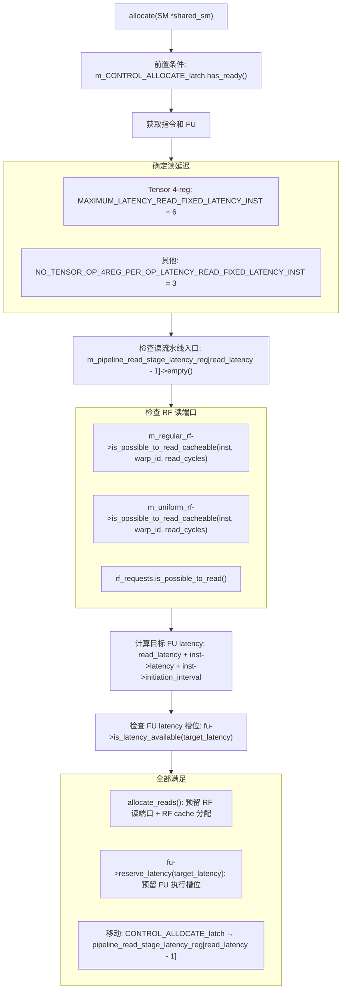
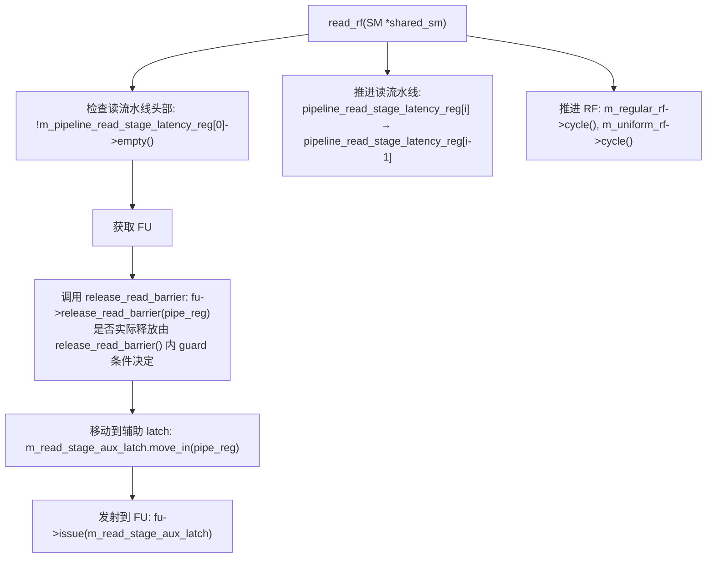
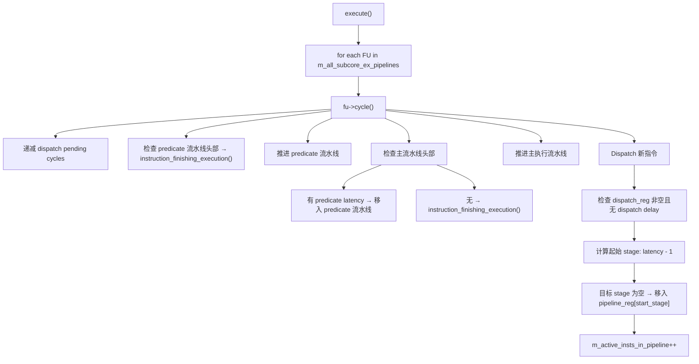
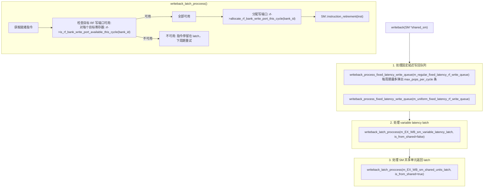

# 第 3 章（续B）：Subcore 后端执行与写回设计

---

> **本文件是第 3 章的后端续篇**，覆盖 Allocate / Read_RF / Execute / Writeback 的资源建模、执行语义与回压路径。
> - 前文见 [03-Subcore流水线设计.md](./03-Subcore流水线设计.md)
> - 前端详解见 [03A-Subcore前端流水与调度设计.md](./03A-Subcore前端流水与调度设计.md)
> - 后端补充细节见 [03C-Subcore后端补充细节与诊断.md](./03C-Subcore后端补充细节与诊断.md)

---

## 3.9 Allocate 阶段（仅固定延迟指令）

该流水级负责为固定延迟指令预留寄存器文件读端口和 FU 执行槽位。可变延迟指令不经过此阶段。

在正常状态下（`m_CONTROL_ALLOCATE_latch.has_ready()`）：

* 获取指令和 FU
* 确定读流水线延迟：
  * Tensor Core 4-reg-per-operand 指令：`MAXIMUM_LATENCY_READ_FIXED_LATENCY_INST = 6` 周期
  * 其他固定延迟指令：`NO_TENSOR_OP_4REG_PER_OP_LATENCY_READ_FIXED_LATENCY_INST = 3` 周期
* 检查读流水线入口是否空闲：`m_pipeline_read_stage_latency_reg[read_latency - 1]->empty()`
* 检查 RF 读端口可用性：
  * `m_regular_rf->is_possible_to_read_cacheable(inst, warp_id, read_cycles)` — 检查 regular RF 各 bank 的读端口，RF cache 命中的操作数不消耗读端口
  * `m_uniform_rf->is_possible_to_read_cacheable(inst, warp_id, read_cycles)` — uniform RF 读端口无限制，始终返回 true
  * `rf_requests.is_possible_to_read()` — 所有 RF 类型的读端口均可用
* 计算目标 FU latency：`target_latency = read_latency + inst->latency + inst->initiation_interval`
* 检查 FU latency 槽位：`fu->is_latency_available(target_latency)` — 使用 `occupied` bitset 检查
* 若所有条件满足：
  * `allocate_reads()` — 预留 RF 读端口，更新 RF cache（miss 时分配新 entry）
  * `fu->reserve_latency(target_latency)` — 在 `occupied` bitset 中标记目标槽位
  * 将指令从 `m_CONTROL_ALLOCATE_latch` 移入 `m_pipeline_read_stage_latency_reg[read_latency - 1]`
* 若任一条件不满足，指令停留在 `m_CONTROL_ALLOCATE_latch`，下周期重试

在 latch 无指令状态下：

该流水级什么都不做。

Stall 条件：
* 读流水线入口被占用
* RF 读端口不足（regular RF bank 冲突）
* FU 目标 latency 槽位已被占用



---

## 3.10 Read_RF 阶段

该流水级负责完成寄存器文件读取，将指令从读流水线头部送入 FU 的 dispatch register。同时负责推进多级读流水线。

在正常状态下（`!m_pipeline_read_stage_latency_reg[0]->empty()`，即读流水线头部有指令）：

* 获取指令已分配的 FU
* 调用 `fu->release_read_barrier(pipe_reg)`：
  * 固定延迟路径会在此调用 `release_read_barrier()`
  * 是否实际产生 pending decrement 由 `release_read_barrier()` 内 guard 条件决定（trace/captured/scoreboard/control bits）
* 将指令移入辅助 latch：`m_read_stage_aux_latch.move_in(pipe_reg)`
* 发射到 FU：`fu->issue(m_read_stage_aux_latch)` — 指令进入 FU 的 `m_dispatch_reg`
* 推进读流水线：`pipeline_read_stage_latency_reg[i]` 的内容移动到 `pipeline_read_stage_latency_reg[i-1]`，逐级前移
* 推进 RF 状态：`m_regular_rf->cycle()` 和 `m_uniform_rf->cycle()` — 推进 bank 端口预留状态的时间窗口

在读流水线头部为空时：

仅执行读流水线推进和 RF cycle，不发射指令。

Stall 条件：
* 该阶段本身不产生 stall（读流水线头部有指令时必定能发射到 FU，因为 FU latency 已在 allocate 阶段预留）



---

## 3.11 Execute 阶段

该流水级负责驱动所有 FU 的内部流水线推进。每个 FU 独立执行 `cycle()`，互不干扰。

在每个周期：

* 遍历 `m_all_subcore_ex_pipelines` 中的所有 FU，对每个 FU 调用 `fu->cycle()`
* 每个 FU 的 `cycle()` 行为（基类 `functional_unit::cycle()`）：
  1. 递减 `m_dispatch_pending_reserved_cycles`（dispatch 延迟计数器）
  2. 检查 predicate 流水线头部（`m_pipeline_extra_predicate_stages_reg[0]`）：若非空，调用 `instruction_finishing_execution()` 完成指令
  3. 推进 predicate 流水线：各级前移
  4. 检查主执行流水线头部（`m_pipeline_reg[0]`）：
     * 若指令有额外 predicate latency：移入 predicate 流水线尾部
     * 否则：调用 `instruction_finishing_execution()` 完成指令
  5. 推进主执行流水线：各级前移
  6. Dispatch 新指令（从 `m_dispatch_reg`）：
     * 检查 `m_dispatch_reg` 非空且 `!dispatch_delay()`
     * 计算起始 stage：`start_stage = latency - 1`
     * 若 `m_pipeline_reg[start_stage]` 为空：移入该 stage
     * 对非固定延迟且非队列型 FU（如 SFU）：此时调用 `release_read_barrier()`
     * `m_active_insts_in_pipeline++`

* 对于带队列的 FU（`functional_unit_with_queue::cycle()`），额外执行：
  1. 推进中间级（intermediate stages）：递减 `remaining_cycles`，完成时移入 result port
  2. `m_num_cycles_to_wait_to_free_WAR` 递减到 0 时调用 `release_read_barrier()`
  3. 从队列取指令到中间级尾部
  4. 从 `m_dispatch_reg` 入队（若队列未满）
  5. 对于 SM 共享 FU（MEM/DP）：中间级完成时检查 SM 调度间隔，满足后移入 SM reception latch

`instruction_finishing_execution()` 行为：
* **固定延迟指令**（有目标寄存器）：将结果移入 `m_rf_write_queue`（regular 或 uniform），标记 `retired = true`
* **可变延迟指令**（有目标寄存器）：将结果移入 `m_result_port`（variable latency latch）
* **无目标寄存器的指令**：直接标记完成
* 递减 `m_active_insts_in_pipeline`

Stall 条件：
* Dispatch 阶段：`m_pipeline_reg[start_stage]` 被占用（指令堆积在 dispatch_reg）
* 带队列 FU：队列满时新指令无法入队
* SM 共享 FU：SM 调度间隔未满足时中间级完成的指令无法移入 reception latch



`instruction_finishing_execution()` 对固定延迟指令：
- 将结果移入 `m_rf_write_queue`（regular 或 uniform）
- 标记 `retired = true`

---

## 3.12 Writeback 阶段

该流水级负责将执行完成的指令写回寄存器文件并触发退休。需要检查 RF 写端口可用性，不可用时指令停留在 latch 等待。

在每个周期，按以下顺序处理三个来源：

**1. 固定延迟写回队列**（优先级最高）：
* 处理 `m_regular_fixed_latency_rf_write_queue`：每周期最多弹出 `max_pops_per_cycle` 条指令
* 处理 `m_uniform_fixed_latency_rf_write_queue`：同上
* 对每条弹出的指令调用 `writeback_latch_proccess()`
* 若成功退休，释放结果队列槽位

**2. Variable latency latch**：
* 处理 `m_EX_WB_sm_variable_latency_latch`（SFU/MISC_QUEUE 完成的指令）
* 调用 `writeback_latch_proccess(latch, is_from_shared=false)`

**3. SM 共享单元返回 latch**：
* 处理 `m_EX_WB_sm_shared_units_latch`（DP/MEM 从 SM 共享单元返回的指令）
* 调用 `writeback_latch_proccess(latch, is_from_shared=true)`

`writeback_latch_proccess()` 的行为：
* 获取 latch 中的就绪指令
* 若指令有目标寄存器，检查每个目标寄存器对应 RF bank 的写端口：
  * `rf->is_rf_bank_write_port_available_this_cycle(bank_id)`
  * bank 由 `reg_id % num_banks` 计算
  * 需要区分目标寄存器类型（REG → regular RF，UREG → uniform RF）
* 若所有写端口可用：
  * 分配写端口：`rf->allocate_rf_bank_write_port_this_cycle(bank_id)`
  * 调用 `SM::instruction_retirement(inst)` 触发退休（write barrier decrement、LDGSTS 计数递减、warp 计数更新等）
  * 清除指令
* 若任一写端口不可用：
  * 指令停留在 latch，下周期重试
  * 这会反压上游（FU 无法将新结果写入 latch）

Stall 条件：
* RF 写端口冲突（多条指令同时写同一 bank）
* 固定延迟写回队列满（反压 FU 的 `instruction_finishing_execution()`）



---

## 源码锚点

| 文件 | 函数 | 说明 |
|---|---|---|
| `subcore.cc` | `Subcore::cycle()` | 8 级逆序流水线入口 |
| `subcore.cc` | `Subcore::fetch()` | L0I 访问 + IBuffer 预分配 |
| `subcore.cc` | `Subcore::decode()` | Trace 解码 + IBuffer 填充 |
| `subcore.cc` | `Subcore::issue()` | Warp 调度 + 就绪判定 |
| `subcore.cc` | `Subcore::control_stage()` | Barrier 设置 + latch 分流 |
| `subcore.cc` | `Subcore::allocate()` | RF 端口 + FU latency 预留 |
| `subcore.cc` | `Subcore::read_rf()` | RF 读取 + read barrier 释放 |
| `subcore.cc` | `Subcore::execute()` | FU cycle 驱动 |
| `subcore.cc` | `Subcore::writeback()` | RF 写回 + 退休 |
| `subcore.cc` | `Subcore::issue_warp()` | 发射执行 |
| `subcore.cc` | `Subcore::is_wait_barriers_ready_entry_point()` | Barrier 就绪检查入口 |
| `subcore.cc` | `Subcore::create_pipeline()` | FU 创建与配置 |

---

## 接口时序

### Fetch → Decode Latch 传递时序

```
Cycle N (fetch 阶段):
  条件: m_inst_fetch_decode_latch.m_valid == false
  动作: 遍历 warp，找到可 fetch 的 warp
    → L0I::access(pc)
    → HIT: m_inst_fetch_decode_latch = {m_valid=true, m_pc=pc, m_nbytes=size, m_warp_id=wid}
    → MISS: latch 保持无效，等待 L1I 响应

Cycle N+1 (decode 阶段):
  条件: m_inst_fetch_decode_latch.m_valid == true
  动作: 从 latch 获取 PC 和 warp_id
    → 在 IBuffer 中找到匹配 entry（PC 匹配且 m_valid==false）
    → single_decode() 填充 entry
    → 清除 m_inst_fetch_decode_latch.m_valid = false

Cycle N+1 (fetch 阶段，同周期逆序):
  由于逆序驱动，decode 先执行释放 latch，fetch 后执行可立即使用
  → 理想情况下每周期可完成一次 fetch-decode 传递
```

### Issue → Control → Allocate 流水线时序

```
Cycle N (issue 阶段):
  条件: m_ISSUE_CONTROL_latch.has_free() && 就绪条件满足
  动作: issue_warp() → 指令移入 m_ISSUE_CONTROL_latch

Cycle N+1 (control 阶段):
  条件: m_ISSUE_CONTROL_latch.has_ready()
  动作:
    → 固定延迟: 检查 m_CONTROL_ALLOCATE_latch.has_free()
      → 空闲: 移入 m_CONTROL_ALLOCATE_latch
    → 可变延迟: 检查 fu->can_issue()
      → 可接受: fu->issue() 直接进入 FU 队列

Cycle N+2 (allocate 阶段，仅固定延迟):
  条件: m_CONTROL_ALLOCATE_latch.has_ready()
  动作: 检查 RF 读端口 + FU latency 槽位
    → 全部满足: 移入 m_pipeline_read_stage_latency_reg[read_latency-1]

Cycle N+2+read_latency (read_rf 阶段):
  条件: m_pipeline_read_stage_latency_reg[0] 非空
  动作: fu->issue() → 指令进入 FU dispatch_reg
```

### Execute → Writeback 结果返回时序

```
固定延迟路径:
  Cycle N: FU 执行完成 → instruction_finishing_execution()
    → 结果移入 m_regular/uniform_fixed_latency_rf_write_queue
  Cycle N+1: writeback 阶段从队列弹出（每周期最多 max_pops_per_cycle 条）
    → 检查 RF 写端口 → SM::instruction_retirement()

可变延迟路径（Subcore 内 FU，如 SFU/MISC_QUEUE）:
  Cycle N: FU 执行完成 → 结果移入 m_EX_WB_sm_variable_latency_latch
  Cycle N+1: writeback 阶段处理 variable latency latch
    → 检查 RF 写端口 → SM::instruction_retirement()

可变延迟路径（SM 共享 FU，如 MEM/DP）:
  Cycle N: SM 共享单元完成 → 结果移入 m_EX_WB_sm_shared_units_latch
  Cycle N (同周期 Phase 5): writeback 阶段处理 SM 共享单元返回 latch
    → 检查 RF 写端口 → SM::instruction_retirement()
```

---

## 关键电路描述

### Greedy Rotation Pointer 逻辑

Greedy pointer 实现了 warp 调度的时间局部性优化：

```
数据结构:
  m_greedy_pointer_issue: unsigned int  // issue 阶段的 greedy 指针
  m_greedy_pointer_fetch: unsigned int  // fetch 阶段的 greedy 指针

调度顺序生成 (order_greedy_then_highest_id):
  1. 将 greedy_pointer 指向的 warp 放在遍历序列首位
  2. 其余 warp 按 dynamic_warp_id 降序排列
  3. 返回排序后的 warp 索引序列

更新逻辑:
  issue 成功时: m_greedy_pointer_issue = 当前成功发射的 warp 索引
  每周期末尾: m_greedy_pointer_fetch = m_greedy_pointer_issue (subcore.cc:109)
```

### Issue 条件决策组合逻辑

Issue 阶段的就绪判定是一个多条件 AND 组合逻辑，所有条件必须同时满足：

```
issue_ready = ibuffer_valid
            && stall_counter == 0
            && yield == 0
            && wait_barriers_ready
            && !ldgdepbar_waiting
            && !programmer_barrier_waiting
            && fu_can_issue
            && l1c_operands_ready
            && result_queue_has_space (仅固定延迟指令)
```

其中 `result_queue_has_space` 的检查逻辑（`subcore.cc`）：

```cpp
// 固定延迟指令需要检查对应结果队列
if (is_fixed_latency_inst && has_dst_reg) {
  if (dst_type == REG)  → has_regular_fixed_latency_rf_result_queue_space()
  if (dst_type == UREG) → has_uniform_fixed_latency_rf_result_queue_space()
}
// 检查实现: m_reserved_slots < max_size_register_file_write_queue_for_fixed_latency_instructions
```

### 固定延迟 vs 可变延迟路径分流逻辑

Control 阶段根据 `fu->is_fixed_latency_unit()` 将指令分流到两条不同路径：

```
固定延迟 FU (is_fixed_latency_unit() == true):
  SP / INT / BRANCH / TENSOR / UNIFORM / MISC_NO_QUEUE
  路径: control → m_CONTROL_ALLOCATE_latch → allocate → read_rf → FU pipeline
  特点: 需要预留 RF 读端口和 FU latency 槽位

可变延迟 FU (is_fixed_latency_unit() == false):
  SFU / MISC_QUEUE / MEM / DP
  路径: control → fu->issue() → FU 内部队列
  特点: 跳过 allocate 和 read_rf，直接进入 FU 内部队列
  原因: 可变延迟指令无法在 allocate 时确定 FU latency 槽位
```

---

## 参考文档

| 文档 | 说明 |
|---|---|
| MICRO 2025 论文 | 8 级流水线结构和 CGGTY 调度策略的理论来源 |
| `subcore.h` / `subcore.cc` | Subcore 类定义与实现 |
| `sm.h` / `sm.cc` | SM 类定义，包含 `issue_warp()` 和 `instruction_retirement()` |
| `ibuffer_remodeled.h` | IBuffer_Entry 和 IBuffer_Remodeled 定义 |
| `warp_dependency_state.h` / `warp_dependency_state.cc` | Dependency_State 实现 |
| `shader.h` | `shader_core_config` 配置参数、`ifetch_buffer_t` 定义 |
| `abstract_hardware_model.h` | 硬件模型常量和基础类型定义 |
| 第 2 章：SM 顶层设计 | SM 级 8-phase 执行序列 |
| 第 4 章：依赖模型设计 | Control-bit 依赖模型详细设计 |

---
