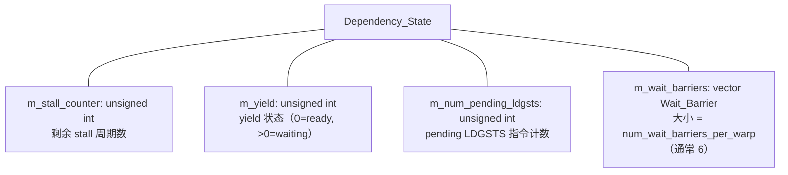
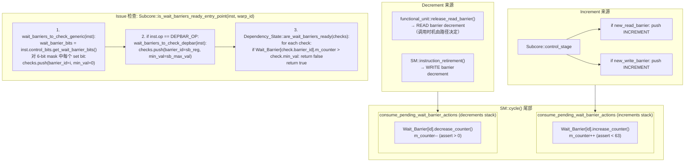
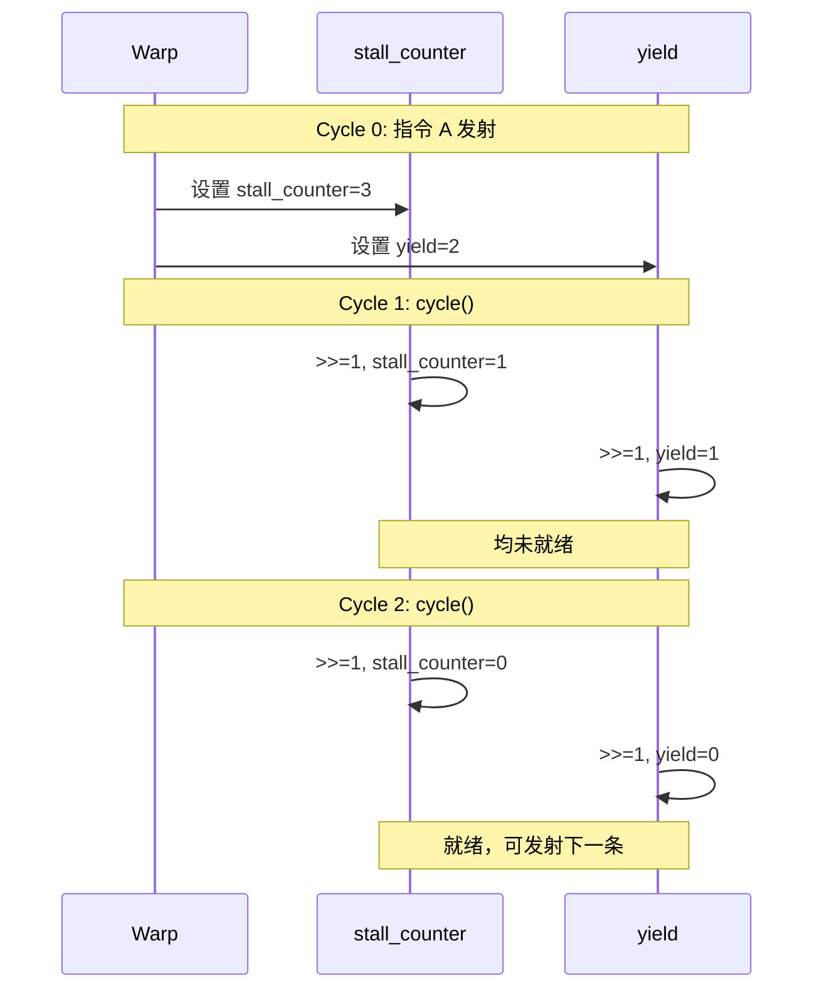
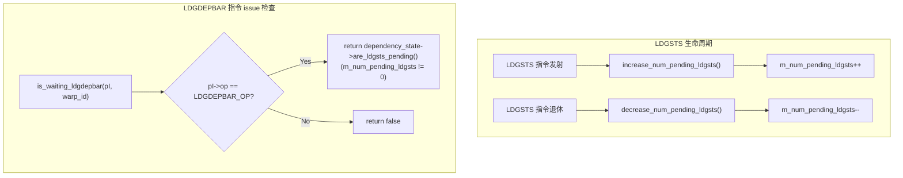
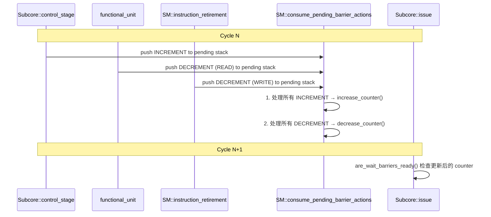
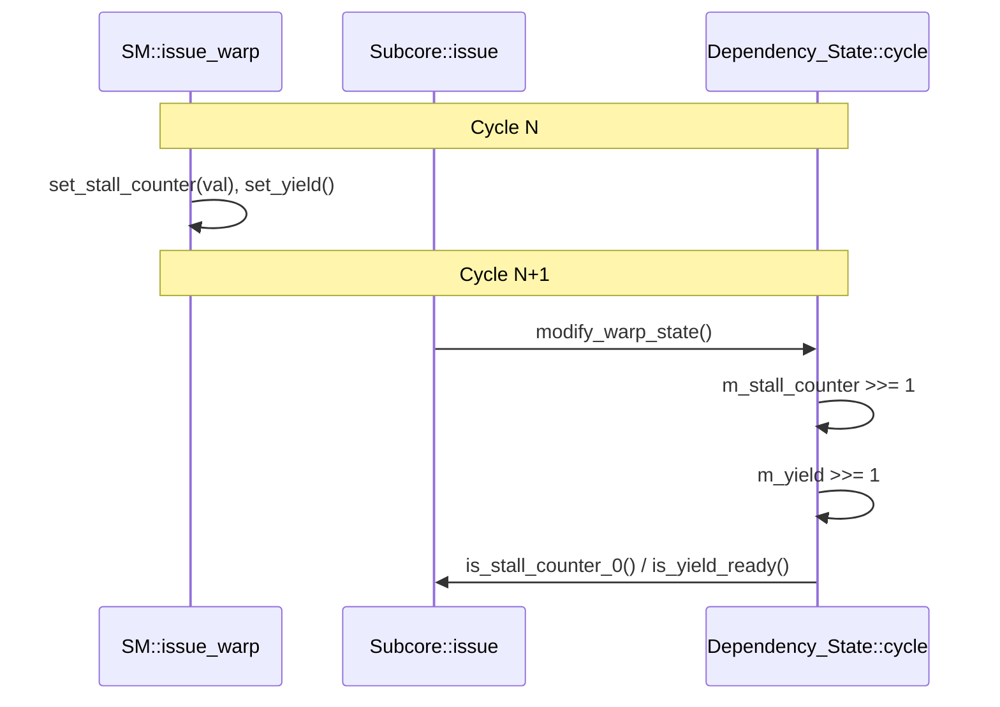
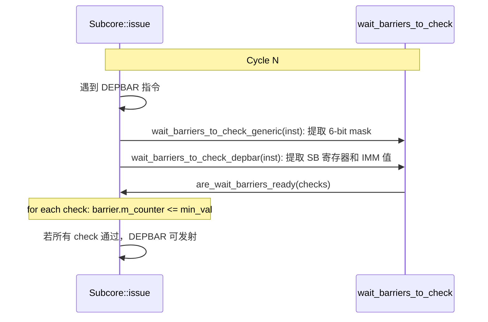

# 第 4 章：依赖模型设计（Control-Bit）

---

## 术语说明

| 缩写/术语 | 全称 | 说明 |
|---|---|---|
| Control Bits | 控制位 | SASS 指令中编译器嵌入的调度控制信息，包含 stall count、yield、barrier 等 |
| Stall Count | 停顿计数 | 4-bit 值，发射后强制等待的周期数，覆盖固定延迟 RAW 依赖 |
| Yield | 让出标志 | 1-bit 标志，让出调度优先级允许其他 warp 执行 |
| Wait Barrier | 等待屏障 | 每 warp 6 个槽位的计数器机制，覆盖可变延迟依赖 |
| Wait Barrier Bits | 等待屏障掩码 | 6-bit 掩码，指定需要等待的 barrier ID 集合 |
| Read Barrier | 读屏障 | 标记指令为某 barrier 的生产者（读相关阶段），在 `release_read_barrier()` 时递减 |
| Write Barrier | 写屏障 | 标记指令为某 barrier 的生产者（写阶段），在指令退休时递减 |
| DEPBAR | Dependency Barrier | 特殊指令，检查指定 barrier counter 是否 <= 指定值 |
| LDGDEPBAR | LDGSTS Dependency Barrier | 特殊指令，检查 pending LDGSTS 计数是否为 0 |
| LDGSTS | Load Global Store Shared | 全局内存到共享内存的异步拷贝指令 |
| Scoreboard | 记分板 | 传统硬件依赖检测机制（本设计中作为备选/兼容模式） |
| Dependency_State | 依赖状态 | 每 warp 一个实例，管理 stall/yield/barrier/ldgsts 状态 |
| SASS | Shader Assembly | NVIDIA GPU 的原生指令集 |
| ptxas | PTX Assembler | NVIDIA 编译器后端，负责生成 SASS 指令及其 control bits |

---

## 4.1 设计思路

### 4.1.1 为什么放弃 Scoreboard
<!-- anchor:hw-overhead-comparison -->

传统 GPU 模拟器（包括 Accel-Sim）使用硬件 scoreboard 动态检测 RAW/WAW/WAR 冒险。然而论文通过逆向工程发现，自 Kepler 起 NVIDIA 采用了截然不同的方案：**编译器在 SASS 指令中嵌入 control bits，硬件仅执行 control bits 指定的调度动作**。

两种方案的硬件开销对比（以 Ampere 为例，每个 warp 最多 232 个 32-bit 寄存器 + 100 个 predicate/uniform 寄存器 = 332 个寄存器）：

| 方案 | 每 warp 开销 | 占 RF 容量比 |
|---|---|---|
| **Scoreboard**（332 个寄存器 × 7-bit counter） | 2324 bits | 5.32% |
| **Control bits**（6 barrier × 6-bit + stall 5-bit + yield 1-bit） | 41 bits | **0.09%** |

Control bits 方案的硬件开销仅为 scoreboard 的 **1.7%**，这解释了为什么 NVIDIA 选择了编译器辅助的方案。

### 4.1.2 Control Bits 如何保证正确性

论文指出 control bits **不仅优化性能，更保证正确性**——它们是防止数据冒险的唯一机制（硬件中没有 scoreboard 作为备份）。

每条 SASS 指令包含以下 control bits：
- **Stall count**（4 bits）：发射后强制等待的周期数，覆盖 pipeline latency 引起的 RAW 依赖
- **Yield flag**（1 bit）：让出调度优先级，允许其他 warp 利用空闲的 FU 资源
- **Wait barrier mask**（6 bits）：指定需要等待的 barrier ID 集合，覆盖可变延迟操作（访存、SFU）的依赖
- **Read barrier ID**：标记该指令为某个 barrier 的生产者（读相关阶段），计数器由 `release_read_barrier()` 在对应路径触发递减
- **Write barrier ID**：标记该指令为某个 barrier 的生产者（写阶段），计数器在指令退休时递减

这一机制的正确性依赖于编译器（`ptxas`）能正确分析指令间的依赖关系并生成合适的 control bits。论文验证了 `ptxas` 生成的 control bits 在所有测试中均能保证正确执行。

### 4.1.3 Stall Count 与 Yield 的设计直觉

**Stall count** 用于覆盖**固定延迟**依赖：如果指令 B 的源操作数是指令 A 的目标寄存器，且 A 的 FU latency 为 N 周期，编译器会在 A 上设置 stall count ≥ N，使得 B 在 A 完成前不会被调度。

**Yield** 用于**主动让出**：当编译器判断当前 warp 接下来几条指令存在长延迟依赖时，设置 yield 让调度器优先切换到其他 warp，提高 FU 利用率。这是一种编译器驱动的 latency hiding 策略。

### 4.1.4 Wait Barrier 的设计直觉

**Wait barrier** 用于覆盖**可变延迟**依赖（主要是访存指令）：编译器无法在编译时确定 cache hit/miss 的延迟，因此使用 barrier 机制——生产者指令在 control bits 中标记 read/write barrier ID，消费者指令在 wait barrier mask 中标记需要等待的 barrier ID。硬件在生产者完成相应阶段时递减计数器，消费者在计数器归零后才可发射。

6 个 barrier 的容量足以覆盖 NVIDIA GPU 上典型的并发访存操作数（通常不超过 6 条未完成的访存指令同时存在依赖关系）。

---

## 4.2 设计规格

以下规格参数从源码 `warp_dependency_state.h`、`warp_dependency_state.cc`、`shader.h` 中提取：

| 规格项 | 值 | 源码依据 |
|---|---|---|
| Wait barrier 槽位数 / warp | 可配置（典型 6） | `shader_core_config::num_wait_barriers_per_warp` |
| Wait barrier counter 范围 | 0-63 | `increase_counter()` 中 `assert(m_counter < 63)`；`decrease_counter()` 中 `assert(m_counter > 0)` |
| Wait barrier counter 位宽 | 6-bit（等效） | 范围 0-63 需要 6 bits |
| Stall counter 位宽 | `unsigned int`（32-bit 存储，有效值 4-bit） | `m_stall_counter` 类型为 `unsigned int`，control bits 中 stall_count 为 4-bit |
| Stall counter 衰减方式 | 右移 1 位（`>>= 1`） | `Dependency_State::cycle()` 中 `m_stall_counter >>= 1` |
| Yield 位宽 | `unsigned int`（32-bit 存储，有效值 2-bit） | `set_yield()` 设置为 2，`>>= 1` 衰减 |
| Yield 初始值 | 2 | `Dependency_State::set_yield()` 中 `m_yield = 2` |
| Yield 衰减方式 | 右移 1 位（`>>= 1`） | `Dependency_State::cycle()` 中 `m_yield >>= 1` |
| LDGSTS pending 计数 | `unsigned int`（无上限） | `m_num_pending_ldgsts`，issue 时 +1，retire 时 -1 |
| 每 warp 总依赖状态开销 | 约 41 bits（6×6 + 4 + 1） | 6 barrier × 6-bit counter + stall 4-bit + yield 1-bit |
| 传统 Scoreboard 每 warp 开销 | 2324 bits | 332 寄存器 × 7-bit counter |
| 节省比例 | 98.2% | 41 / 2324 = 1.76% |
| Wait barrier bits 掩码宽度 | 6-bit | 对应 6 个 barrier 槽位 |
| DEPBAR 操作数 0 | SB 寄存器（barrier ID） | `operand[0].get_operand_reg_number()` |
| DEPBAR 操作数 1 | IMM_UINT64（允许的最大 counter 值） | `operand[1].get_operands_inmediates()[0]` |

---

## 4.2B 存储结构位宽表

### Dependency_State 完整字段表

以下字段定义于 `warp_dependency_state.h` 的 `Dependency_State` 类：

| 字段名 | C++ 类型 | 等效位宽 | 说明 |
|---|---|---|---|
| `m_yield` | `unsigned int` | 32-bit 存储，有效 2-bit | yield 状态（初始值 2，`>>= 1` 衰减，0 表示就绪） |
| `m_stall_counter` | `unsigned int` | 32-bit 存储，有效 4-bit | stall 计数器（来自 control bits 的 4-bit stall_count，`>>= 1` 衰减） |
| `m_num_pending_ldgsts` | `unsigned int` | 32-bit | pending LDGSTS 指令计数（无上限） |
| `m_wait_barriers` | `vector<Wait_Barrier>` | 大小 = `num_wait_barriers_per_warp`（典型 6） | 每 warp 的 barrier 数组 |
| `m_stats` | `shader_core_stats*` | 64-bit 指针 | 统计信息指针 |

### Wait_Barrier 完整字段表

以下字段定义于 `warp_dependency_state.h` 的 `Wait_Barrier` 类：

| 字段名 | C++ 类型 | 等效位宽 | 说明 |
|---|---|---|---|
| `m_counter` | `unsigned int` | 32-bit 存储，有效 6-bit | barrier 计数器（范围 0-63，`assert(m_counter < 63)` / `assert(m_counter > 0)`） |
| `m_barrier_id` | `unsigned int` | 32-bit 存储，有效 3-bit | barrier 编号（0-5） |

### Wait_Barrier_Entry_Modifier（传递结构）位宽表

以下字段定义于 `warp_dependency_state.h` 的 `Wait_Barrier_Entry_Modifier` 结构体：

| 字段名 | C++ 类型 | 等效位宽 | 说明 |
|---|---|---|---|
| `pc` | `new_addr_type` | 64-bit | 产生该 action 的指令 PC（调试用） |
| `sm_warp_id` | `unsigned int` | 32-bit 存储，有效 7-bit | 目标 warp 的 SM 级 ID（最大 128） |
| `barrier_id` | `unsigned int` | 32-bit 存储，有效 3-bit | 目标 barrier 编号（0-5） |
| `barrier_type` | `Wait_Barrier_Type` | enum（2 值） | `READ_WAIT_BARRIER` / `WRITE_WAIT_BARRIER` |
| `barrier_action` | `Wait_Barrier_Action` | enum（2 值） | `INCREASE_COUNTER` / `DECREASE_COUNTER` |

### Wait_Barrier_Checking（查询结构）位宽表

| 字段名 | C++ 类型 | 等效位宽 | 说明 |
|---|---|---|---|
| `barrier_id` | `unsigned int` | 32-bit 存储，有效 3-bit | 要检查的 barrier 编号 |
| `min_val` | `unsigned int` | 32-bit 存储，有效 6-bit | 允许的最大 counter 值（普通指令为 0，DEPBAR 可 > 0） |

---

## 4.3 模块接口概览

### Dependency_State（per warp）

| 端口/接口 | 方向 | 调用者 | 说明 |
|---|---|---|---|
| `cycle()` | Input | `Subcore::issue()` 中的 `modify_warp_state()` | 每周期更新 stall/yield 时间行为（位移衰减） |
| `set_stall_counter(val)` | Input | `SM::issue_warp()` | 发射时设置 stall counter |
| `set_yield()` | Input | `SM::issue_warp()` | 发射时设置 yield |
| `action_over_wait_barrier(modifier)` | Input | `SM::consume_pending_wait_barrier_actions()` | 增减 barrier 计数器 |
| `increase_num_pending_ldgsts()` | Input | `SM::issue_warp()`（LDGSTS 指令） | LDGSTS pending 计数 +1 |
| `decrease_num_pending_ldgsts()` | Input | `SM::instruction_retirement()`（LDGSTS 指令） | LDGSTS pending 计数 -1 |
| `is_stall_counter_0()` | Output | `Subcore::issue()` | stall counter 是否为 0 |
| `is_yield_ready()` | Output | `Subcore::issue()` | yield 是否就绪 |
| `are_wait_barriers_ready(checks)` | Output | `Subcore::is_wait_barriers_ready()` | 所有指定 barrier 是否满足 |
| `are_ldgsts_pending()` | Output | `Subcore::is_waiting_ldgdepbar()` | 是否有 pending LDGSTS |

### Wait_Barrier（per barrier per warp）

| 字段 | 类型 | 范围 | 说明 |
|---|---|---|---|
| `m_counter` | `unsigned int` | 0-63 | barrier 计数器 |
| `m_barrier_id` | `unsigned int` | 0-5 | barrier 编号 |

### Wait_Barrier_Entry_Modifier（传递结构）

| 字段 | 类型 | 说明 |
|---|---|---|
| `sm_warp_id` | `unsigned int` | 目标 warp 的 SM 级 ID |
| `barrier_id` | `unsigned int` | 目标 barrier 编号 |
| `barrier_type` | `Wait_Barrier_Type` | READ_WAIT_BARRIER / WRITE_WAIT_BARRIER |
| `barrier_action` | `Wait_Barrier_Action` | INCREASE_COUNTER / DECREASE_COUNTER |
| `pc` | `address_type` | 产生该 action 的指令 PC（调试用） |

---

## 4.3 Dependency_State 状态机
<!-- anchor:dependency-state-machine -->

每个 warp 拥有一个 `Dependency_State` 实例，包含以下状态：



### cycle() 行为

每个 issue 周期开始时，`modify_warp_state()` 对每个 warp 调用 `Dependency_State::cycle()`：

```cpp
void Dependency_State::cycle() {
  // stall counter 右移 1 位
  m_stall_counter >>= 1;

  // yield 右移 1 位
  m_yield >>= 1;
}
```

### 状态设置时机

| 状态 | 设置时机 | 设置值 |
|---|---|---|
| `m_stall_counter` | `SM::issue_warp()` 发射指令时 | 指令 control bits 中的 `stall_count` |
| `m_yield` | `SM::issue_warp()` 发射指令时 | 若 `yield_flag=true` 调用 `set_yield()`，当前实现设为 2 |
| `m_wait_barriers[id]` | `SM::consume_pending_wait_barrier_actions()` | increment/decrement |
| `m_num_pending_ldgsts` | issue 时 +1，retire 时 -1 | 累计值 |

---

## 4.4 Wait_Barrier 生命周期
<!-- anchor:wait-barrier-lifecycle -->

### 完整生命周期图



### Barrier 就绪条件

```cpp
bool Wait_Barrier::is_ready(unsigned int min_val) {
  return m_counter <= min_val;
}
```

- 普通指令：`min_val = 0`，即 counter 必须归零
- DEPBAR 指令：`min_val = sb_max_allowed_val`，允许 counter 不完全归零

---

## 4.5 Stall/Yield 时间行为
<!-- anchor:stall-yield-behavior -->

### Stall Counter

- **设置**：指令发射时从 control bits 读取 `stall_count`，写入 `m_stall_counter`
- **更新**：每周期 `cycle()` 中执行 `m_stall_counter >>= 1`
- **检查**：`is_stall_counter_0()` 返回 `m_stall_counter == 0`
- **语义**：发射后强制等待 N 个周期再发射下一条指令（同一 warp）

### Yield

- **设置**：指令发射时如果 control bits 中 yield flag 为 true，调用 `set_yield()`（当前实现写入 2）
- **更新**：每周期 `cycle()` 中执行 `m_yield >>= 1`
- **检查**：`is_yield_ready()` 返回 `m_yield == 0`
- **语义**：让出调度优先级，允许其他 warp 先执行

### 时序关系



---

## 4.6 DEPBAR / LDGDEPBAR 特殊处理

### DEPBAR

DEPBAR 指令允许检查特定 barrier 的 counter 是否 <= 某个值（不仅仅是 0）。

操作数结构：
- 操作数 0：`SB` 寄存器（barrier ID）
- 操作数 1：`IMM_UINT64`（允许的最大 counter 值）
- 操作数 2+：额外 barrier ID（必须检查 counter <= 0）

```cpp
wait_barriers_to_check_depbar(inst):
  // 第一个 barrier: 允许 counter <= sb_max_allowed_val
  sb_reg = operand[0].get_operand_reg_number()
  sb_max_val = operand[1].get_operands_inmediates()[0]
  checks.push(barrier_id=sb_reg, min_val=sb_max_val)

  // 额外 barrier: 必须 counter <= 0
  for i in 2..num_operands:
    sb_reg = operand[i].get_operands_inmediates()[0]
    checks.push(barrier_id=sb_reg, min_val=0)
```

### LDGDEPBAR

LDGDEPBAR 使用独立的 `m_num_pending_ldgsts` 计数器，与 wait barrier 体系完全分离。



LDGDEPBAR 阻塞条件：只要有任何 pending LDGSTS 指令未退休，LDGDEPBAR 就不能发射。

---

## 接口时序

### Barrier Increment/Decrement 消费时序

Barrier 的 increment 和 decrement 操作在 `SM::cycle()` 尾部的 `consume_pending_wait_barrier_actions()` 中统一消费。关键时序约束：**increment 先于 decrement 处理**，防止 counter 出现负值。



### Stall/Yield 衰减时序



### DEPBAR 检查时序



---

## 关键电路描述

### Barrier Counter 递增/递减逻辑

```cpp
// warp_dependency_state.cc
void Wait_Barrier::increase_counter() {
    assert(m_counter < 63);  // 6-bit 上限保护
    m_counter++;
}

void Wait_Barrier::decrease_counter() {
    assert(m_counter > 0);   // 下溢保护
    m_counter--;
}
```

硬件等效：6-bit 加法器/减法器，带溢出/下溢断言。

### Wait_Barrier_Bits 6-bit Mask 检查逻辑

```cpp
// subcore.cc: wait_barriers_to_check_generic()
unsigned int wait_barrier_bits = inst->get_control_bits().get_wait_barrier_bits();
for (unsigned int i = 0; i < num_wait_barriers_per_warp; i++) {
    if (wait_barrier_bits & (1 << i)) {
        checks.push_back(Wait_Barrier_Checking(i, 0));
    }
}
```

硬件等效：6-bit 掩码的逐位检测，每个 set bit 生成一个 barrier 就绪检查请求。

### DEPBAR 比较逻辑

```cpp
// Wait_Barrier::is_ready()
bool is_ready(unsigned int min_val) {
    return m_counter <= min_val;
}
```

- 普通指令：`min_val = 0`，即 `m_counter == 0`（counter 必须归零）
- DEPBAR 指令：`min_val = sb_max_allowed_val`，允许 counter 不完全归零

硬件等效：6-bit 比较器（`<=`），输入为 counter 当前值和允许阈值。

### Stall/Yield 右移衰减逻辑

```cpp
// warp_dependency_state.cc: Dependency_State::cycle()
m_stall_counter >>= 1;  // 等效于除以 2（向下取整）
m_yield >>= 1;          // 等效于除以 2（向下取整）
```

硬件等效：1-bit 右移寄存器。stall_counter 初始值来自 4-bit control bits（最大 15），经过 4 个周期衰减到 0。yield 初始值为 2，经过 2 个周期衰减到 0。

---

## 参考文档

- [1] NVIDIA CUDA Binary Utilities — Control Codes 章节（SASS control bits 格式定义）
- [2] Rodrigo Huerta et al., "Demystifying NVIDIA GPU Internals to Enable Reliable GPU Simulation," MICRO 2025
- [3] NVIDIA PTX ISA Reference — DEPBAR / BAR 指令语义
- [4] 本项目 `docs/detailed-design/03-Subcore流水线设计.md` — Issue 阶段依赖检查流程

---

## 源码锚点

| 文件 | 函数/类 | 说明 |
|---|---|---|
| `warp_dependency_state.h` | `Wait_Barrier` | barrier 数据结构 |
| `warp_dependency_state.h` | `Dependency_State` | per-warp 依赖状态 |
| `warp_dependency_state.h` | `Wait_Barrier_Entry_Modifier` | barrier 修改传递结构 |
| `warp_dependency_state.cc` | `Dependency_State::cycle()` | stall/yield 位移衰减 |
| `warp_dependency_state.cc` | `Dependency_State::action_over_wait_barrier()` | barrier 增减 |
| `warp_dependency_state.cc` | `Dependency_State::are_wait_barriers_ready()` | barrier 就绪检查 |
| `subcore.cc` | `Subcore::is_wait_barriers_ready_entry_point()` | barrier 检查入口 |
| `subcore.cc` | `Subcore::wait_barriers_to_check_generic()` | 通用 barrier 提取 |
| `subcore.cc` | `Subcore::wait_barriers_to_check_depbar()` | DEPBAR 特殊提取 |
| `subcore.cc` | `Subcore::is_waiting_ldgdepbar()` | LDGDEPBAR 检查 |
| `functional_unit.cc` | `functional_unit::release_read_barrier()` | read barrier 释放 |
| `sm.cc` | `SM::instruction_retirement()` | write barrier 释放 |
