# 第 5 章：指令供给子系统设计

---

## 术语说明

| 缩写/术语 | 全称 | 说明 |
|---|---|---|
| IBuffer | Instruction Buffer | 每个 warp 私有的指令缓冲队列，解耦 fetch 与 issue 阶段 |
| L0I | Level-0 Instruction Cache | 每个 subcore 私有的一级指令缓存（`first_level_instruction_cache`） |
| L1I | Level-1 Instruction Cache | SM 级共享的二级指令缓存（`read_only_cache`） |
| L0_icnt | L0-to-L1 Interconnect | 连接各 subcore L0I 与 SM 共享 L1I 的互连网络 |
| Stream Buffer | Stream Buffer Prefetcher | L0I 内部的顺序预取器，按 cache line 粒度预取后续指令 |
| MSHR | Miss Status Holding Register | 缓存未命中状态保持寄存器，跟踪 outstanding miss 请求 |
| IB Coalescing | IBuffer Coalescing | 多个 warp 对同一指令地址的 L0I 请求合并机制 |
| SASS | Shader ASSembly | NVIDIA GPU 原生指令集，每条指令 16 字节 |
| `fetch_decode_width` | Fetch/Decode Width | 每次 fetch 操作获取的指令数量 |
| `cache_request_status` | Cache Request Status | 缓存访问结果枚举：HIT / MISS / RESERVATION_FAIL / IN_L0I_RESPONSE_QUEUE |

---

## 设计规格

| 规格项 | 参数名 | 类型/来源 | 说明 |
|---|---|---|---|
| IBuffer 最大深度 | `ibuffer_remodeled_size` | `shader_core_config` | 每个 warp 的 IBuffer 最大 entry 数 |
| Fetch/Decode 宽度 | `fetch_decode_width` | `shader_core_config` | 每次 fetch 预分配的指令槽位数，约束：`<= ibuffer_remodeled_size` |
| SASS 指令大小 | 固定 16 字节 | 硬编码 | PC 增量 = `16 * fetch_decode_width` |
| L0I 缓存配置 | `cache_config` | 继承 `read_only_cache` | 包含 `m_nset`（set 数）、`m_assoc`（关联度）、`m_line_sz`（行大小） |
| L0I 实例化 | per-subcore | `first_level_instruction_cache` | 命名格式：`L0I_<SM_ID>_<SUBCORE_ID>` |
| L1I 实例化 | per-SM 共享 | `read_only_cache` | 命名格式：`L1I_<SM_ID>` |
| L0_icnt 请求端口数 | `max_request_allowed_to_L1I` | `shader_core_config` | L0 到 L1 方向最大在途请求数 |
| L0_icnt 响应端口数 | `max_reply_allowed_from_L1I` | `shader_core_config` | L1 到 L0 方向最大在途响应数 |
| L0→L1 延迟 | `latency_L0_to_L1` | `shader_core_config` | 请求方向传输延迟（周期数） |
| L1→L0 延迟 | `latency_L1_to_L0` | `shader_core_config` | 响应方向传输延迟（周期数） |
| Stream Buffer 数量 | `prefetch_num_stream_buffers` | `shader_core_config` | 每个 L0I 的 stream buffer 数量 |
| 每 Stream Buffer 大小 | `prefetch_per_stream_buffer_size` | `shader_core_config` | 每个 stream buffer 的最大 entry 数 |
| 每周期最大预取数 | `num_instruction_prefetches_per_cycle` | `shader_core_config` | 每周期允许发出的最大预取请求数 |
| 预取使能 | `is_instruction_prefetching_enabled` | `shader_core_config` | 是否启用指令预取 |
| IB Coalescing 使能 | `ibuffer_coalescing` | `shader_core_config` | 是否启用 IBuffer 级请求合并 |

---

## 5.1 设计思路

### 5.1.1 指令缓存层次的必要性

论文发现，Accel-Sim 对指令供给的建模过于简化——假设指令总是可以立即获取。然而真实硬件存在多级指令缓存层次（L0I → L0_icnt → L1I），指令 cache miss 会引入显著的 fetch stall。

对于控制流复杂的 benchmark（如 dwt2d、lud、nw），指令 cache miss 率较高，Accel-Sim 因忽略 fetch stall 而产生显著的性能低估。引入 L0I + L1I 缓存层次后，模拟精度在这些 benchmark 上有明显改善。

### 5.1.2 为什么 Stream Buffer 预取有效

论文评估了多种指令预取策略，发现**简单的 stream buffer 预取器**即可接近完美指令缓存的效果。原因在于 GPU 工作负载的两个特性：

1. **同一 sub-core 内的多个 warp 通常执行相同代码区域**：GPU 的 SIMT 执行模型使得同一 CTA 内的 warp 在大部分时间执行同一 kernel 的相同代码路径。一个 warp 的指令 miss 触发的 cache line 填充可以被其他 warp 命中。

2. **GPU 不做分支预测**：GPU 不使用复杂的分支预测器（如 CPU 上的 TAGE），而是依靠多 warp 切换来隐藏分支惩罚。因此 Fetch Directed Instruction Prefetcher (FDIP) 等依赖分支预测的高级预取方案在 GPU 上不适用。

3. **顺序预取的局部性好**：SASS 指令在地址空间中连续排列，且 kernel 代码的空间局部性好（循环体通常在连续地址），stream buffer 的顺序预取能有效覆盖。

论文的最优配置为 **stream buffer size = 16**。

### 5.1.3 IBuffer 的设计动机

每个 warp 拥有独立的 IBuffer（指令缓冲），采用 deque 结构。这一设计的目的是**解耦 fetch 和 issue**：
- Fetch 可以在 warp 不被调度时提前获取指令，填充 IBuffer
- Issue 从 IBuffer 头部取指令，不依赖 fetch 的时序
- 当 L0I miss 发生时，IBuffer 中已缓存的指令仍可继续发射，不会立即 stall

IBuffer 的深度（`ibuffer_remodeled_size`）决定了 fetch 和 issue 之间的解耦程度。

---

## 5.2 模块接口概览

### IBuffer_Remodeled（per warp）

| 端口/接口 | 方向 | 类型 | 宽度 | 说明 |
|---|---|---|---|---|
| `get_next_pc_to_fetch_request()` | Output | `address_type` | 1 PC | 返回下一个 fetch PC，同时预分配 `fetch_decode_width` 个槽位 |
| `get_remodeled_ibuffer()` | Input/Output | `deque<IBuffer_Entry>&` | `ibuffer_remodeled_size` | decode 阶段填充 entry（设 m_valid=true） |
| `next_inst()` | Output | `warp_inst_t*` | 1 inst | 返回队首有效指令 |
| `issued()` | Input | void | - | 弹出队首 entry |
| `flush(reset_pc)` | Input | void | - | 清空 buffer（分支跳转时） |
| `can_fetch()` | Output | bool | - | `m_num_entries + fetch_decode_width <= m_num_max_entries` |
| `is_next_valid()` | Output | bool | - | 队首 entry 的 `m_valid == true` |

### 关键配置参数

| 参数 | 说明 | 约束 |
|---|---|---|
| `ibuffer_remodeled_size` | IBuffer 最大深度 | `>= fetch_decode_width` |
| `fetch_decode_width` | 每次 fetch/decode 的指令数 | `<= ibuffer_remodeled_size` |

### IBuffer_Entry 结构

```cpp
struct IBuffer_Entry {
  bool m_valid;          // 是否已解码
  address_type m_pc;     // 指令 PC
  warp_inst_t *m_inst;   // 解码后的指令指针（m_valid=true 时有效）
};
```

### 存储结构位宽表

#### IBuffer_Entry 完整字段表

| 字段 | C++ 类型 | 位宽 | 说明 |
|---|---|---|---|
| `m_valid` | `bool` | 1 bit | 该 entry 是否已完成 decode 填充 |
| `m_pc` | `address_type`（`unsigned long long`） | 64 bit | 指令的 PC 地址 |
| `m_inst` | `warp_inst_t*` | 64 bit（指针） | 指向解码后指令对象的指针，`m_valid=false` 时为 NULL |

#### IBuffer_Remodeled 内部状态字段表

| 字段 | C++ 类型 | 位宽/大小 | 说明 |
|---|---|---|---|
| `m_is_enabled` | `bool` | 1 bit | IBuffer remodeled 功能是否启用 |
| `m_num_entries` | `unsigned int` | 32 bit | 当前已占用的 entry 数量 |
| `m_num_max_entries` | `unsigned int` | 32 bit | IBuffer 最大容量，来自 `ibuffer_remodeled_size` |
| `m_fetch_decode_width` | `unsigned int` | 32 bit | 每次 fetch 预分配的指令数，来自 `fetch_decode_width` |
| `m_remodeled_ibuffer` | `std::deque<IBuffer_Entry>` | 动态 | 底层 FIFO 容器，最大 `m_num_max_entries` 个 entry |
| `m_is_init_next_pc` | `bool` | 1 bit | 下一个 fetch PC 是否已初始化 |
| `m_next_pc_to_fetch_request` | `address_type` | 64 bit | 下一次 fetch 请求的起始 PC |
| `m_is_ret_reached` | `bool` | 1 bit | 是否已遇到 return 指令 |

#### L0I（first_level_instruction_cache）关键字段表

| 字段 | C++ 类型 | 位宽/大小 | 说明 |
|---|---|---|---|
| `m_sm_id` | `unsigned int` | 32 bit | 所属 SM 的 ID |
| `m_subcore_id` | `unsigned int` | 32 bit | 所属 subcore 的 ID |
| `m_is_prefetching_enabled` | `bool` | 1 bit | 是否启用 stream buffer 预取 |
| `m_is_IB_coalescing_enabled` | `bool` | 1 bit | 是否启用 IBuffer 级请求合并 |
| `m_num_stream_buffers` | `unsigned int` | 32 bit | stream buffer 数量 |
| `m_size_per_stream_buffer` | `unsigned int` | 32 bit | 每个 stream buffer 的容量 |
| `m_max_num_prefetches_per_cycle` | `unsigned int` | 32 bit | 每周期最大预取请求数 |
| `m_next_response` | `unique_ptr<response_element>` | 指针 | 当前周期待返回的响应（单 entry） |
| `m_regular_access_status_with_IB_coalescing` | `map<new_addr_type, status_element>` | 动态 | IB coalescing 模式下的请求状态表（地址 → 状态） |
| `m_regular_access_status_without_IB_coalescing` | `map<uint, map<addr, status_element>>` | 动态 | 非 coalescing 模式下的请求状态表（warp_id → 地址 → 状态） |

L0I 缓存参数继承自 `cache_config`：

| 参数 | 字段 | 说明 |
|---|---|---|
| Set 数量 | `m_nset` | 缓存 set 数，由配置字符串解析 |
| 关联度 | `m_assoc` | 每 set 的 way 数 |
| Cache Line 大小 | `m_line_sz` | 每行字节数 |
| Tag 宽度 | 由 `m_line_sz_log2 + m_nset_log2` 决定 | tag = addr >> (line_sz_log2 + nset_log2) |

#### response_element 字段表

| 字段 | C++ 类型 | 位宽 | 说明 |
|---|---|---|---|
| `addr` | `new_addr_type`（`unsigned long long`） | 64 bit | 请求地址 |
| `mf` | `mem_fetch*` | 64 bit（指针） | 关联的 mem_fetch 对象 |
| `original_warp_id` | `unsigned int` | 32 bit | 发起请求的 warp ID |
| `mf_will_be_erased` | `bool` | 1 bit | mem_fetch 是否会被释放 |

#### status_element 字段表

| 字段 | C++ 类型 | 位宽 | 说明 |
|---|---|---|---|
| `cache_status` | `cache_request_status`（enum） | 32 bit | 缓存访问状态：HIT / MISS / RESERVATION_FAIL / IN_L0I_RESPONSE_QUEUE |
| `mf` | `mem_fetch*` | 64 bit（指针） | 关联的 mem_fetch 对象 |
| `mf_erased` | `bool` | 1 bit | mem_fetch 是否已被释放 |

#### Stream Buffer 关键字段表

**single_stream_buffer：**

| 字段 | C++ 类型 | 位宽/大小 | 说明 |
|---|---|---|---|
| `m_is_enabled` | `bool` | 1 bit | 该 stream buffer 是否启用 |
| `m_is_currently_prefetching` | `bool` | 1 bit | 是否正在进行预取 |
| `m_stream_buffer_id` | `unsigned int` | 32 bit | stream buffer 编号 |
| `m_max_size` | `unsigned int` | 32 bit | 最大预取 entry 数 |
| `m_line_size` | `unsigned int` | 32 bit | cache line 大小（字节） |
| `m_next_addr_to_prefetch` | `new_addr_type` | 64 bit | 下一个预取地址 |
| `m_current_unique_function_id` | `unsigned int` | 32 bit | 当前关联的 function ID |
| `m_first_sm_warp_id_reserved` | `unsigned int` | 32 bit | 首次触发预取的 warp ID |
| `gpu_cycle_hit` | `unsigned long long` | 64 bit | 命中时的 GPU 周期数 |
| `m_queue_ordered_prefetches` | `queue<new_addr_type>` | 动态 | 有序预取地址队列 |
| `m_all_prefetches` | `map<addr, prefetch_element>` | 动态 | 所有预取 entry 的地址映射 |

**prefetch_element：**

| 字段 | C++ 类型 | 位宽/大小 | 说明 |
|---|---|---|---|
| `sm_warp_id` | `unsigned int` | 32 bit | 触发预取的 warp ID |
| `unique_function_id` | `unsigned int` | 32 bit | 关联的 function ID |
| `is_ready` | `bool` | 1 bit | 预取数据是否已就绪 |
| `is_request_to_cache` | `bool` | 1 bit | 是否已请求填充到 cache |
| `waiting_warp_ids_and_its_addrs` | `map<uint, set<addr>>` | 动态 | 等待该预取完成的 warp 及其地址集合 |
| `waiting_addrs_of_the_block` | `set<new_addr_type>` | 动态 | 等待该 block 的地址集合（IB coalescing 模式） |

**multiple_stream_buffers：**

| 字段 | C++ 类型 | 位宽/大小 | 说明 |
|---|---|---|---|
| `m_is_enabled` | `bool` | 1 bit | stream buffer 子系统是否启用 |
| `m_num_stream_buffers` | `unsigned int` | 32 bit | stream buffer 总数 |
| `m_max_size_per_stream_buffer` | `unsigned int` | 32 bit | 每个 buffer 的最大容量 |
| `m_max_num_prefetches_per_cycle` | `unsigned int` | 32 bit | 每周期最大预取数 |
| `m_line_size` | `unsigned int` | 32 bit | cache line 大小 |
| `m_next_sb_send_request` | `unsigned int` | 32 bit | 下一个发送请求的 stream buffer 索引（round-robin） |
| `m_stream_buffers` | `vector<single_stream_buffer*>` | 动态 | stream buffer 实例数组 |

#### L0_icnt 关键字段表

| 字段 | C++ 类型 | 位宽/大小 | 说明 |
|---|---|---|---|
| `m_max_num_L1_request_ports_allowed` | `int` | 32 bit | 每周期最大 L0→L1 请求端口数 |
| `m_max_num_L1_reply_ports_allowed` | `int` | 32 bit | 每周期最大 L1→L0 响应端口数 |
| `m_latency_of_L0s_icnt_to_L1_queue` | `int` | 32 bit | L0→L1 方向延迟（周期数） |
| `m_latency_of_L1_to_L0s_icnt_queue` | `int` | 32 bit | L1→L0 方向延迟（周期数） |
| `m_icnt_to_L1_queue` | `vector<vector<mem_fetch*>>` | 动态 | L0→L1 延迟队列，维度：[latency][max_requests] |
| `m_L1_to_icnt_queue` | `vector<deque<mem_fetch*>>` | 动态 | L1→L0 延迟队列，维度：[latency][deque] |
| `m_L0` | `vector<read_only_cache*>` | 动态 | 所有 subcore 的 L0I 指针数组 |

---

## 5.3 IBuffer_Remodeled 队列协议

### 数据结构

- 底层容器：`std::deque<IBuffer_Entry>`
- FIFO 语义：push_back 入队，front 出队
- PC 增量：每条指令 16 字节（SASS 指令大小）

### 生命周期

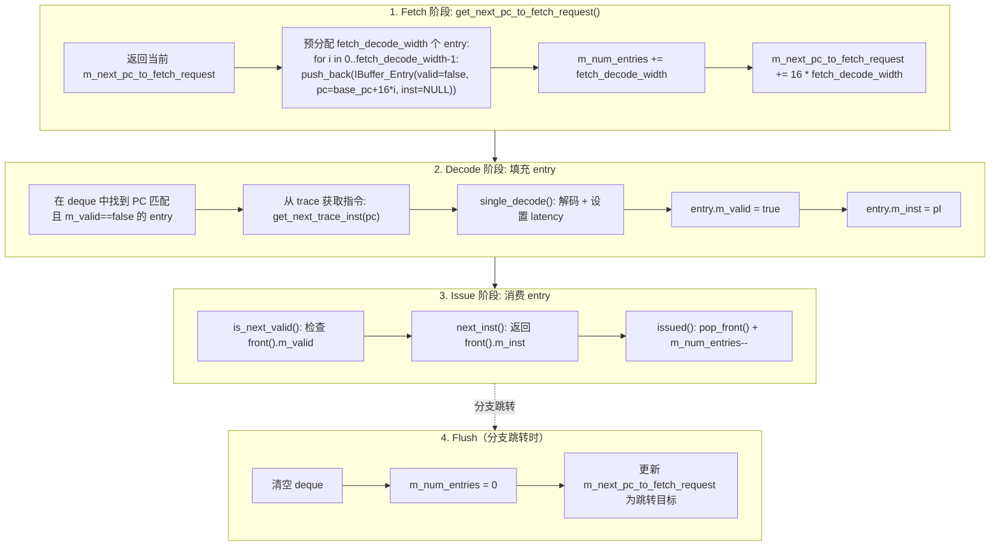

### 容量控制

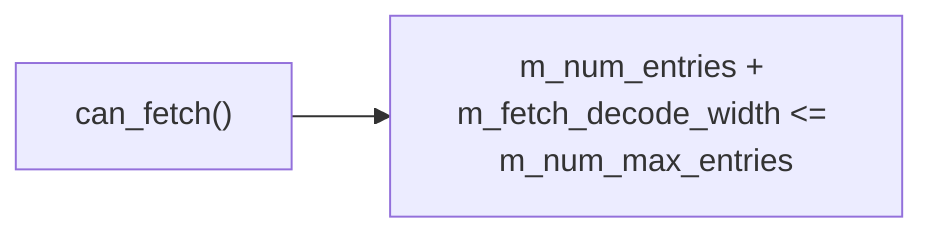

fetch 阶段在调用 `get_next_pc_to_fetch_request()` 前必须检查 `can_fetch()`，确保不会超出 buffer 容量。

### 状态机描述

#### IBuffer Entry 生命周期状态机

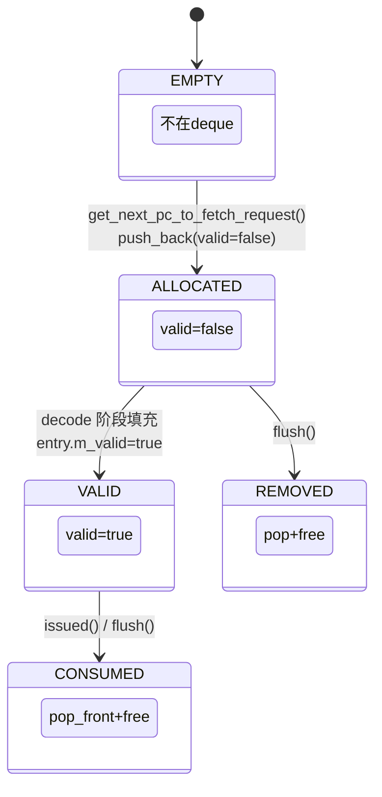

状态转换条件：

| 源状态 | 目标状态 | 触发条件 | 源码位置 |
|---|---|---|---|
| EMPTY | ALLOCATED | `get_next_pc_to_fetch_request()` 调用，`push_back(IBuffer_Entry(false, pc, NULL))` | `ibuffer_remodeled.cc:90-93` |
| ALLOCATED | VALID | decode 阶段设置 `entry.m_valid = true`，`entry.m_inst = pI` | `subcore.cc` decode 逻辑 |
| VALID | CONSUMED | `issued()` 调用，`pop_front()` + `m_num_entries--` | `ibuffer_remodeled.cc:119-131` |
| VALID | CONSUMED | `issued()` 检测到分支跳转（`next_not_taken_pc != next_traced_pc`），触发 `flush()` | `ibuffer_remodeled.cc:125-129` |
| ALLOCATED/VALID | REMOVED | `flush(reset_pc_to_0)` 清空整个 deque | `ibuffer_remodeled.cc:133-162` |

#### L0I Cache 访问状态机

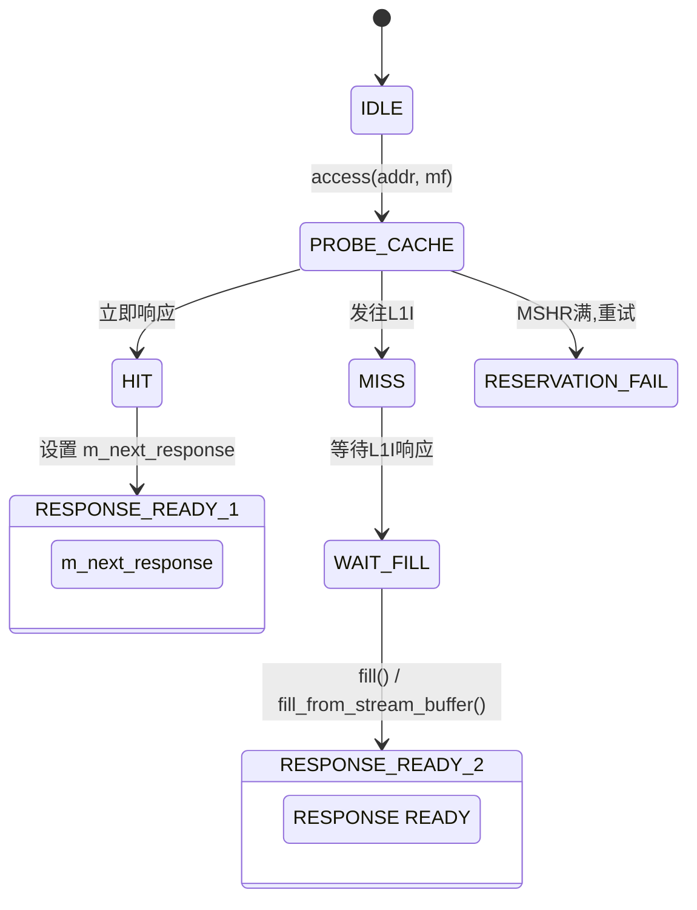

L0I 访问结果枚举（`cache_request_status`）：

| 状态值 | 含义 | 后续动作 |
|---|---|---|
| `HIT` | tag 命中，数据可用 | 设置 `m_next_response`，下周期返回给 subcore |
| `MISS` | tag 未命中 | 请求通过 `m_memport->push(mf)` 发往 L0_icnt → L1I |
| `RESERVATION_FAIL` | MSHR 满或端口冲突 | 不记录状态，下周期重试 |
| `IN_L0I_RESPONSE_QUEUE` | stream buffer 命中 | 等待 stream buffer 填充到 cache 后响应 |

---

## 5.4 L0I 指令缓存

### 模块接口

| 端口/接口 | 方向 | 来源/去向 | 说明 |
|---|---|---|---|
| `access(pc, ...)` | Input | `Subcore::fetch()` | 指令 fetch 请求 |
| cache 响应 | Output | `Subcore::fetch()` | HIT/MISS/RESERVATION_FAIL |
| miss 请求 | Output | `L0_icnt` | L0I miss 转发到 L1I |
| fill 响应 | Input | `L0_icnt` | L1I 响应填充 L0I |

### 访问流程

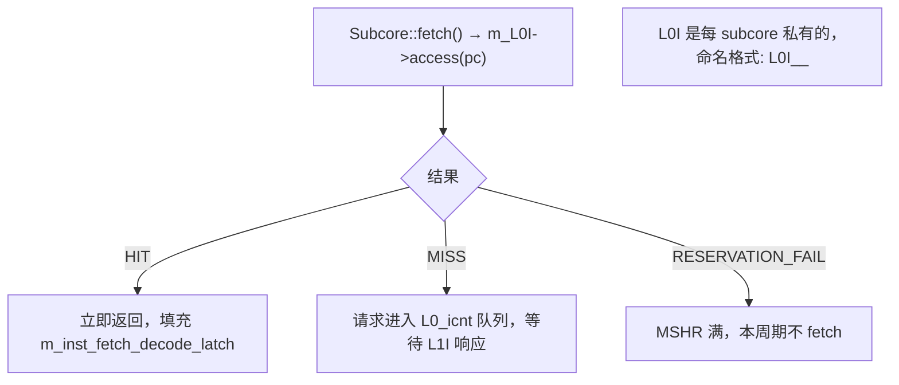

---

## 5.5 L0_icnt 互连

### 模块接口

| 端口/接口 | 方向 | 宽度 | 说明 |
|---|---|---|---|
| L0 → L1 请求队列 | Input | `max_request_allowed_to_L1I` | 各 subcore 的 L0I/L0C miss 请求 |
| L1 → L0 响应队列 | Input | `max_reply_allowed_from_L1I` | L1I 响应返回各 subcore |
| 延迟参数 | - | - | `latency_L0_to_L1`（请求延迟），`latency_L1_to_L0`（响应延迟） |

### 关键配置参数

| 参数 | 说明 |
|---|---|
| `max_request_allowed_to_L1I` | L0→L1 方向最大在途请求数 |
| `max_reply_allowed_from_L1I` | L1→L0 方向最大在途响应数 |
| `latency_L0_to_L1` | 请求方向延迟（周期数） |
| `latency_L1_to_L0` | 响应方向延迟（周期数） |

### 执行流程

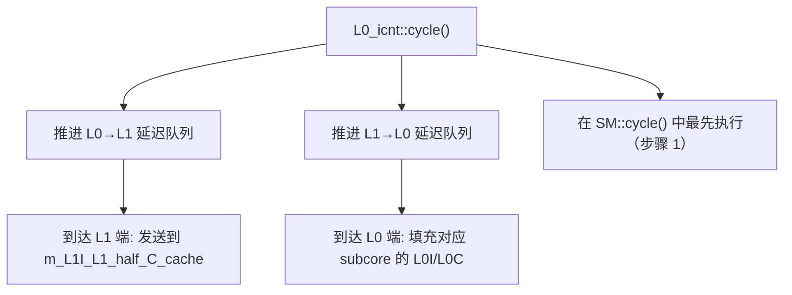

---

## 5.6 L1I + Stream Buffer 预取

### L1I 缓存

- 类型：`read_only_cache`（共享于所有 subcore）
- 命名：`L1I_<SM_ID>`
- 在 `SM::cycle()` 步骤 2 中推进

### Stream Buffer 预取

在 `is_instruction_prefetching_enabled=true` 下：
- L0I 支持 stream buffer 预取
- 预取逻辑在 L0I 内部实现，对 subcore 透明
- 预取请求同样经过 L0_icnt 到达 L1I

---

## 5.7 接口时序

### Fetch 请求 → L0I Hit/Miss → L1I 访问时序

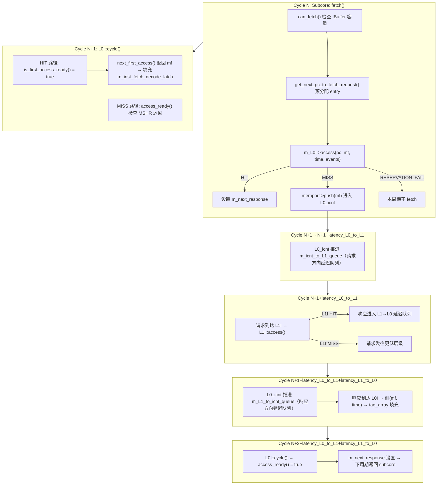

总延迟（L0I miss + L1I hit）：`2 + latency_L0_to_L1 + latency_L1_to_L0` 周期

### IBuffer Fill → Consume 时序

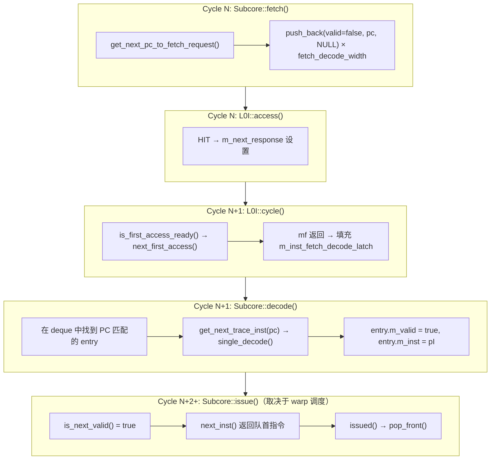

### Stream Buffer 预取时序

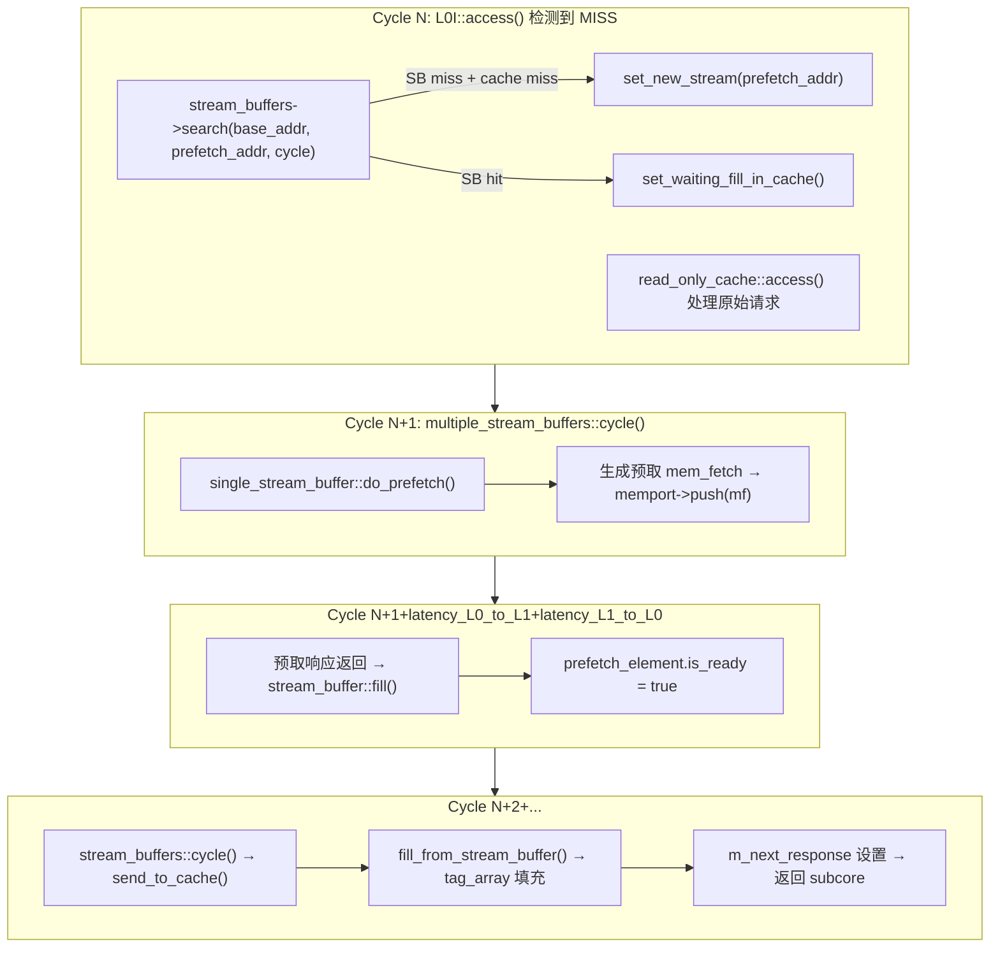

---

## 5.8 关键电路描述

### L0I Tag 比较逻辑

L0I 的 tag 比较继承自 `read_only_cache` → `baseline_cache` → `tag_array::probe()`：

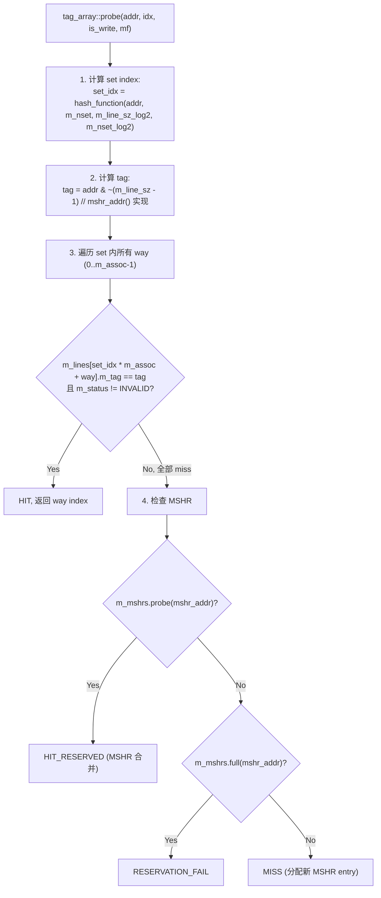

### Stream Buffer 预取触发逻辑

预取触发在 `first_level_instruction_cache::access()` 中实现：

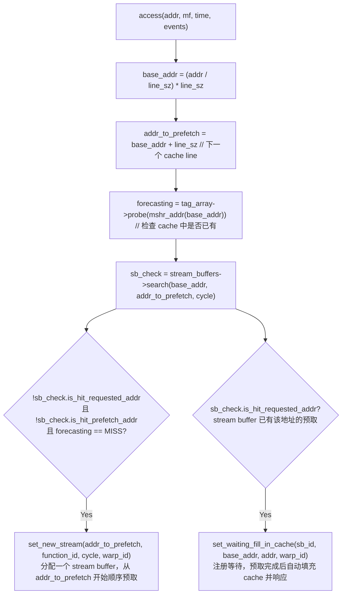

### Stream Buffer 搜索逻辑

`multiple_stream_buffers::search()` 在所有 stream buffer 中查找：

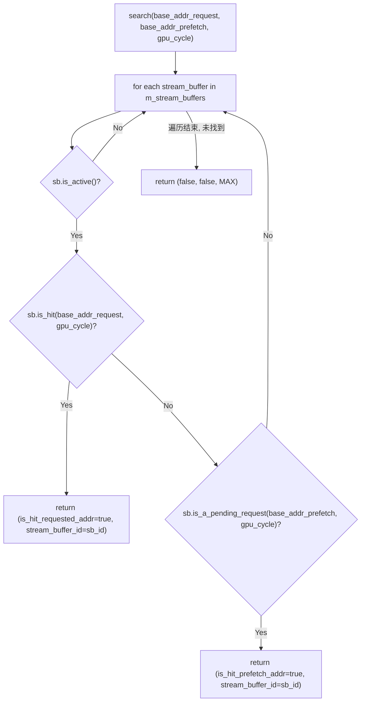

### IBuffer Coalescing 逻辑

当 `is_IB_coalescing_enabled=true` 时，L0I 使用地址级合并：

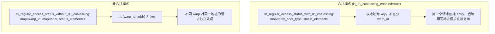

---

## 参考文档

| 文档/资源 | 说明 |
|---|---|
| MICRO 2025 论文 | GPU 指令缓存层次与预取策略的逆向工程分析 |
| `ibuffer_remodeled.h` / `ibuffer_remodeled.cc` | IBuffer_Remodeled 类实现 |
| `first_level_instruction_cache.h` / `first_level_instruction_cache.cc` | L0I 指令缓存实现 |
| `stream_buffer.h` / `stream_buffer.cc` | Stream Buffer 预取器实现 |
| `l0_icnt.h` / `l0_icnt.cc` | L0↔L1 互连实现 |
| `gpu-cache.h` / `gpu-cache.cc` | 通用缓存基类（`read_only_cache`、`tag_array`、`cache_config`） |
| `shader.h` | `shader_core_config` 配置参数定义 |
| `abstract_hardware_model.h` | `address_type`、`new_addr_type`、`cache_request_status` 等基础类型定义 |

---

## 源码锚点

| 文件 | 函数/类 | 说明 |
|---|---|---|
| `ibuffer_remodeled.h` | `IBuffer_Remodeled` | IBuffer 类定义 |
| `ibuffer_remodeled.h` | `IBuffer_Entry` | entry 结构 |
| `ibuffer_remodeled.cc` | `IBuffer_Remodeled::get_next_pc_to_fetch_request()` | fetch 预分配 |
| `ibuffer_remodeled.cc` | `IBuffer_Remodeled::issued()` | issue 弹出 |
| `ibuffer_remodeled.cc` | `IBuffer_Remodeled::flush()` | 分支 flush |
| `first_level_instruction_cache.h/cc` | `first_level_instruction_cache` | L0I 实现 |
| `l0_icnt.h/cc` | `L0_icnt` | L0↔L1 互连 |
| `stream_buffer.h/cc` | stream buffer | 预取实现 |
| `subcore.cc` | `Subcore::fetch()` | fetch 阶段 |
| `subcore.cc` | `Subcore::decode()` | decode 阶段 |
