# 第 5 章：指令供给子系统设计

---

> **文档拆分说明**：本章内容因篇幅较大，拆分为三个文件：
> - **05-指令供给子系统设计.md**（本文件）：子系统总览、IBuffer 与 L0I 详细设计
> - **05A-L0互连与流式预取子系统设计.md**：L0_icnt 互连四阶段流水线、Stream Buffer 预取子系统
> - **05B-Fetch-Decode实现与源码锚点.md**：Subcore Fetch/Decode 阶段实现、关键电路、停顿条件汇总、源码锚点

---

## 术语说明

| 缩写/术语 | 全称 | 说明 |
|---|---|---|
| IBuffer | Instruction Buffer | 每个 warp 私有的指令缓冲队列，解耦 fetch 与 issue 阶段 |
| L0I | Level-0 Instruction Cache | 每个 subcore 私有的一级指令缓存（`first_level_instruction_cache`） |
| L1I | Level-1 Instruction Cache | SM 级共享的二级指令缓存（`read_only_cache`） |
| L0_icnt | L0-to-L1 Interconnect | 连接各 subcore L0I 与 SM 共享 L1I 的互连网络 |
| Stream Buffer | Stream Buffer Prefetcher | L0I 内部的顺序预取器，按 cache line 粒度预取后续指令 |
| MSHR | Miss Status Holding Register | 缓存未命中状态保持寄存器，跟踪 outstanding miss 请求 |
| IB Coalescing | IBuffer Coalescing | 多个 warp 对同一指令地址的 L0I 请求合并机制 |
| SASS | Shader ASSembly | NVIDIA GPU 原生指令集，每条指令 16 字节 |
| `fetch_decode_width` | Fetch/Decode Width | 每次 fetch 操作获取的指令数量 |
| `cache_request_status` | Cache Request Status | 缓存访问结果枚举：HIT / MISS / RESERVATION_FAIL / IN_L0I_RESPONSE_QUEUE |
| `PROGRAM_MEM_START` | Program Memory Start | 指令地址空间起始偏移，固定值 `0xF0000000` |
| `INST_ACC_R` | Instruction Access Read | 指令读取访问类型，用于标记 `mem_fetch` 的访问类型 |
| `ifetch_buffer_t` | Instruction Fetch Buffer | Fetch-to-Decode 流水线锁存器，连接 L0I 响应与 decode 阶段 |

---

## 设计规格

| 规格项 | 参数名 | 类型/来源 | 说明 |
|---|---|---|---|
| IBuffer 最大深度 | `ibuffer_remodeled_size` | `shader_core_config` | 每个 warp 的 IBuffer 最大 entry 数 |
| Fetch/Decode 宽度 | `fetch_decode_width` | `shader_core_config` | 每次 fetch 预分配的指令槽位数，约束：`<= ibuffer_remodeled_size` |
| SASS 指令大小 | 固定 16 字节 | 硬编码 | PC 增量 = `16 * fetch_decode_width` |
| L0I 缓存配置 | `m_L0I_config` | `shader_core_config` → `cache_config` | 包含 `m_nset`、`m_assoc`、`m_line_sz` |
| L0I 实例化 | per-subcore | `first_level_instruction_cache` | 命名格式：`L0I_<SM_ID>_<SUBCORE_ID>` |
| L1I 实例化 | per-SM 共享 | `read_only_cache` | 命名格式：`L1I_<SM_ID>` |
| L0_icnt 请求端口数 | `max_request_allowed_to_L1I` | `shader_core_config` | L0 到 L1 方向最大在途请求数 |
| L0_icnt 响应端口数 | `max_reply_allowed_from_L1I` | `shader_core_config` | L1 到 L0 方向最大在途响应数 |
| L0→L1 延迟 | `latency_L0_to_L1` | `shader_core_config` | 请求方向传输延迟（周期数） |
| L1→L0 延迟 | `latency_L1_to_L0` | `shader_core_config` | 响应方向传输延迟（周期数） |
| Stream Buffer 数量 | `prefetch_num_stream_buffers` | `shader_core_config` | 每个 L0I 的 stream buffer 数量 |
| 每 Stream Buffer 大小 | `prefetch_per_stream_buffer_size` | `shader_core_config` | 每个 stream buffer 的最大 entry 数 |
| 每周期最大预取数 | `num_instruction_prefetches_per_cycle` | `shader_core_config` | 每周期允许发出的最大预取请求数 |
| 预取使能 | `is_instruction_prefetching_enabled` | `shader_core_config` | 是否启用指令预取 |
| IB Coalescing 使能 | `ibuffer_coalescing` | `shader_core_config` | 是否启用 IBuffer 级请求合并 |
| 完美指令缓存 | `perfect_instruction_cache` | `shader_core_config` | 所有 fetch 强制 HIT，跳过 L0I 访问 |
| 完美指令+常量缓存 | `perfect_inst_const_cache` | `shader_core_config` | 指令缓存和常量缓存均强制 HIT |
| Kernel 结束时失效 | `invalidate_instruction_caches_at_kernel_end` | `shader_core_config` | 是否在 kernel 切换时清空指令缓存 |

---

## 5.1 设计思路

### 5.1.1 指令缓存层次的必要性

论文发现，Accel-Sim 对指令供给的建模过于简化——假设指令总是可以立即获取。然而真实硬件存在多级指令缓存层次（L0I → L0_icnt → L1I），指令 cache miss 会引入显著的 fetch stall。

对于控制流复杂的 benchmark（如 dwt2d、lud、nw），指令 cache miss 率较高，Accel-Sim 因忽略 fetch stall 而产生显著的性能低估。引入 L0I + L1I 缓存层次后，模拟精度在这些 benchmark 上有明显改善。

### 5.1.2 为什么 Stream Buffer 预取有效

论文评估了多种指令预取策略，发现**简单的 stream buffer 预取器**即可接近完美指令缓存的效果。原因在于 GPU 工作负载的两个特性：

1. **同一 sub-core 内的多个 warp 通常执行相同代码区域**：GPU 的 SIMT 执行模型使得同一 CTA 内的 warp 在大部分时间执行同一 kernel 的相同代码路径。一个 warp 的指令 miss 触发的 cache line 填充可以被其他 warp 命中。

2. **GPU 不做分支预测**：GPU 不使用复杂的分支预测器（如 CPU 上的 TAGE），而是依靠多 warp 切换来隐藏分支惩罚。因此 Fetch Directed Instruction Prefetcher (FDIP) 等依赖分支预测的高级预取方案在 GPU 上不适用。

3. **顺序预取的局部性好**：SASS 指令在地址空间中连续排列，且 kernel 代码的空间局部性好（循环体通常在连续地址），stream buffer 的顺序预取能有效覆盖。

论文的最优配置为 **stream buffer size = 16**。

### 5.1.3 IBuffer 的设计动机

每个 warp 拥有独立的 IBuffer（指令缓冲），采用 deque 结构。这一设计的目的是**解耦 fetch 和 issue**：
- Fetch 可以在 warp 不被调度时提前获取指令，填充 IBuffer
- Issue 从 IBuffer 头部取指令，不依赖 fetch 的时序
- 当 L0I miss 发生时，IBuffer 中已缓存的指令仍可继续发射，不会立即 stall

IBuffer 的深度（`ibuffer_remodeled_size`）决定了 fetch 和 issue 之间的解耦程度。相比 Accel-Sim 的 2-entry 固定 IBuffer，remodeled IBuffer 支持可配置深度，且支持提前预分配槽位（ahead-of-time slot reservation），使 fetch 可以在指令数据到达前就预留 buffer 空间。

### 5.1.4 IB Coalescing 的设计动机

同一 subcore 内的多个 warp 经常执行同一 kernel 的同一代码区域。当 warp A 和 warp B 同时请求同一 PC 对应的 cache line 时：
- **无 coalescing**：每个 warp 独立发起 L0I 请求，可能产生冗余的 miss 请求
- **有 coalescing**：以地址为 key 合并请求，第一个 warp 的 miss 触发的 fill 同时服务所有等待的 warp

IB Coalescing 在 decode 阶段也起作用：当一条 cache line 的数据返回时，所有等待该 PC 的 warp 的 IBuffer entry 都可以被同时填充。

---

## 5.2 子系统总体架构

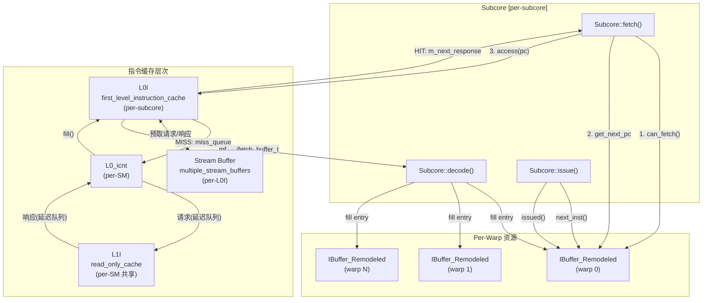

**数据流概述**：

1. `Subcore::fetch()` 从当前优先级最高的 warp 的 IBuffer 获取下一个 fetch PC
2. 将 PC 发送到 L0I 进行 tag 查找
3. L0I HIT 时立即设置 `m_next_response`；MISS 时请求进入 `L0_icnt` 延迟队列
4. 请求经过 L0_icnt 到达 L1I，L1I 响应沿反方向返回
5. L0I 收到 fill 后通过 `is_first_access_ready()` 通知 subcore
6. `Subcore::fetch()` 下周期消费响应，填充 `ifetch_buffer_t` 锁存器
7. `Subcore::decode()` 从锁存器读取数据，在 IBuffer 中找到对应 PC 的 entry 进行解码填充
8. `Subcore::issue()` 从 IBuffer 队首消费已解码的指令

---

## 5.3 IBuffer_Remodeled 详细设计

### 5.3.1 数据结构

#### IBuffer_Entry 结构

```cpp
struct IBuffer_Entry {
  bool m_valid;          // 是否已解码填充
  address_type m_pc;     // 指令 PC（64 bit）
  warp_inst_t *m_inst;   // 解码后的指令指针（m_valid=true 时有效，否则为 NULL）
};
```

| 字段 | C++ 类型 | 位宽 | 说明 |
|---|---|---|---|
| `m_valid` | `bool` | 1 bit | 该 entry 是否已完成 decode 填充 |
| `m_pc` | `address_type`（`unsigned long long`） | 64 bit | 指令的 PC 地址 |
| `m_inst` | `warp_inst_t*` | 64 bit（指针） | 指向解码后指令对象的指针 |

#### IBuffer_Remodeled 内部状态

| 字段 | C++ 类型 | 位宽/大小 | 说明 |
|---|---|---|---|
| `m_is_enabled` | `bool` | 1 bit | IBuffer remodeled 功能是否启用 |
| `m_num_entries` | `unsigned int` | 32 bit | 当前已占用的 entry 数量（含已分配但未解码的） |
| `m_num_max_entries` | `unsigned int` | 32 bit | IBuffer 最大容量，来自 `ibuffer_remodeled_size` |
| `m_fetch_decode_width` | `unsigned int` | 32 bit | 每次 fetch 预分配的指令数 |
| `m_remodeled_ibuffer` | `std::deque<IBuffer_Entry>` | 动态 | 底层 FIFO 容器 |
| `m_is_init_next_pc` | `bool` | 1 bit | 下一个 fetch PC 是否已初始化 |
| `m_next_pc_to_fetch_request` | `address_type` | 64 bit | 下一次 fetch 请求的起始 PC |
| `m_is_ret_reached` | `bool` | 1 bit | 是否已遇到 RET 指令（停止后续 fetch） |
| `m_shd_warp` | `shd_warp_t*` | 64 bit（指针） | 所属 warp 的指针 |
| `m_config` | `const shader_core_config*` | 64 bit（指针） | 配置参数 |
| `m_stats` | `shader_core_stats*` | 64 bit（指针） | 统计计数器 |

### 5.3.2 构造与初始化

```cpp
IBuffer_Remodeled(const shader_core_config* config, shd_warp_t *shd_warp, shader_core_stats *stats)
```

**构造断言**：`assert(fetch_decode_width <= ibuffer_remodeled_size)` — fetch 宽度不得超过 buffer 总容量。

**初始化值**：
- `m_is_enabled = config->is_ibuffer_remodeled_enabled`
- `m_num_entries = 0`
- `m_num_max_entries = config->ibuffer_remodeled_size`
- `m_fetch_decode_width = config->fetch_decode_width`
- `m_is_init_next_pc = false`（延迟到首次 fetch 时从 warp PC 读取）
- `m_is_ret_reached = false`
- `m_next_pc_to_fetch_request = 0`

**设计要点**：PC 不在构造时初始化，而是延迟到首次 `get_next_pc_to_fetch_request()` 调用时从 warp 的当前 PC 读取。这是因为 warp 的初始 PC 在构造时可能尚未设置。

### 5.3.3 模块接口

| 端口/接口 | 方向 | 类型 | 说明 |
|---|---|---|---|
| `can_fetch()` | Output | `bool` | 检查是否有足够空间进行一次完整 fetch |
| `get_next_pc_to_fetch_request()` | Output | `address_type` | 返回下一个 fetch PC，同时预分配槽位 |
| `remove_entry(pc)` | Input | `void` | 撤销最后一次预分配（RESERVATION_FAIL 时使用） |
| `get_remodeled_ibuffer()` | Output | `deque<IBuffer_Entry>&` | 返回底层 deque 引用，供 decode 阶段访问 |
| `is_next_valid()` | Output | `bool` | 检查队首 entry 是否已解码 |
| `next_inst()` | Output | `warp_inst_t*` | 返回队首已解码指令 |
| `get_next_pc_to_issue()` | Output | `address_type` | 返回队首 entry 的 PC |
| `issued()` | Input | `void` | 弹出队首 entry，检测分支跳转 |
| `flush(reset_pc)` | Input | `void` | 清空 buffer（分支跳转/kernel 结束时） |
| `set_ret_reached()` | Input | `void` | 标记已遇到 RET 指令 |

### 5.3.4 容量控制：can_fetch()

```cpp
bool can_fetch() {
    return (m_num_max_entries - m_num_entries) >= m_fetch_decode_width
           && !m_is_ret_reached;
}
```

两个必要条件：
1. **空间充足**：剩余槽位 >= `fetch_decode_width`，确保一次完整的预分配不会溢出
2. **未到达 RET**：warp 的指令流尚未结束。遇到 RET 后不再发起新的 fetch 请求

### 5.3.5 Fetch 预分配：get_next_pc_to_fetch_request()

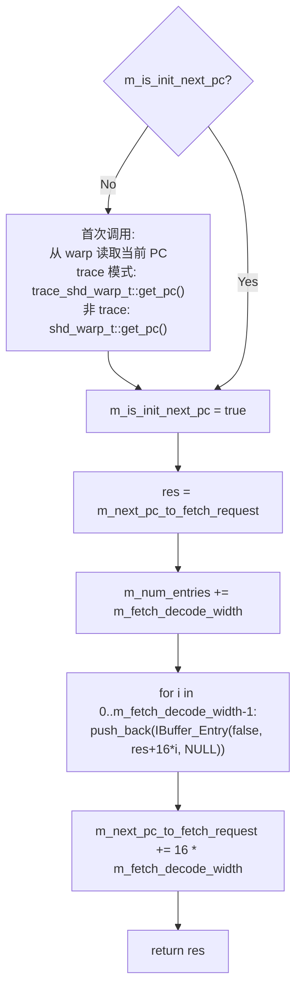

**关键行为**：
- 预分配是**原子操作**：一次调用批量预留 `fetch_decode_width` 个 entry
- 每条 SASS 指令占 16 字节，因此连续 entry 的 PC 间隔为 16
- `m_num_entries` 在预分配时**立即增加**，而非等到 decode 完成
- 所有预分配的 entry 初始状态为 `m_valid = false, m_inst = NULL`

### 5.3.6 预分配撤销：remove_entry()

当 L0I 返回 `RESERVATION_FAIL` 时，fetch 阶段需要撤销刚刚的预分配：

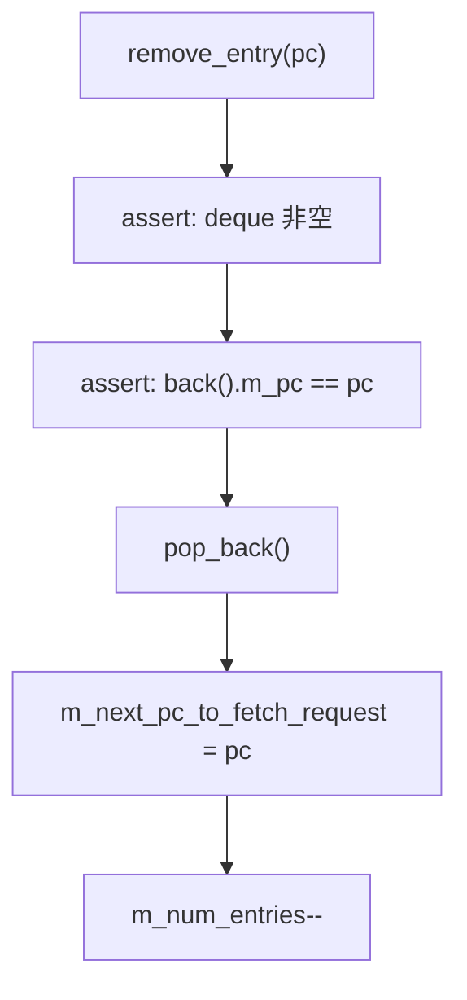

**注意**：只撤销**最后一个** entry（deque 尾部），而非撤销整个批次。这意味着当 `fetch_decode_width > 1` 时，`RESERVATION_FAIL` 后只撤销最后一条预分配指令。实际实现中，fetch 阶段逐条发送 L0I 请求（见 05B 第 5.8 节），因此每次 RESERVATION_FAIL 只需撤销一条。

### 5.3.7 Issue 消费与分支检测：issued()

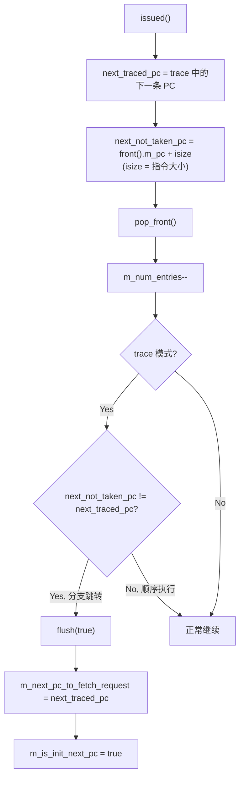

**分支检测机制**（trace 模式）：
- 比较 fall-through PC（`current_pc + instruction_size`）与 trace 中实际的下一条 PC
- 若不同，说明发生了分支跳转（taken branch）
- 此时必须 flush 整个 IBuffer 并将 `m_next_pc_to_fetch_request` 重定向到跳转目标
- 这确保后续 fetch 从正确的分支目标开始

### 5.3.8 Flush 机制

`flush(bool reset_pc_to_0)` 执行完整的 buffer 清空：

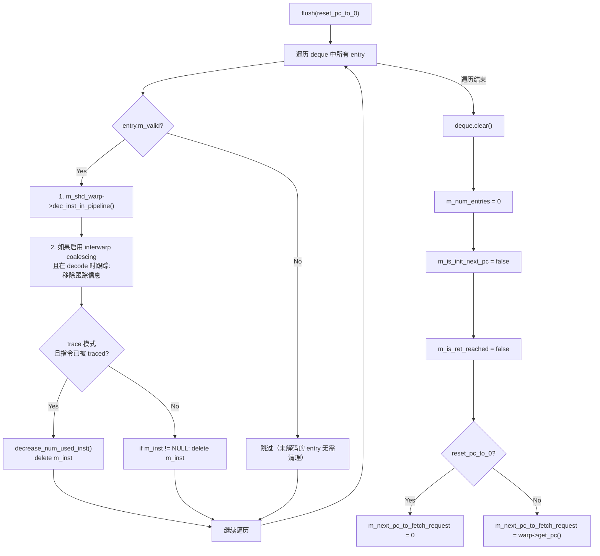

**Flush 的三种触发场景**：
1. **分支跳转**：`issued()` 检测到 taken branch，调用 `flush(true)`
2. **Kernel 结束**：warp 完成执行时调用 `flush(true)`
3. **CTA 重分配**：warp 被重新分配到新的 CTA 时调用

**关键清理操作**：
- 对已解码的 entry 调用 `dec_inst_in_pipeline()` 以维护流水线内指令计数的正确性
- trace 模式下需要调用 `decrease_num_used_inst()` 归还 trace 指令引用计数
- 所有动态分配的 `warp_inst_t` 对象必须在 flush 时释放

### 5.3.9 IBuffer Entry 生命周期状态机

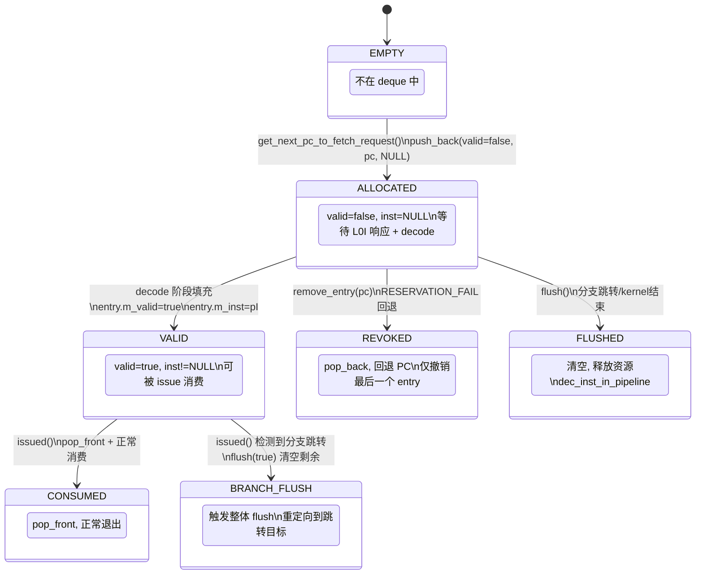

**状态转换条件汇总**：

| 源状态 | 目标状态 | 触发条件 | 说明 |
|---|---|---|---|
| EMPTY | ALLOCATED | `get_next_pc_to_fetch_request()` | 批量预分配 `fetch_decode_width` 个 |
| ALLOCATED | VALID | `Subcore::decode()` 填充 | L0I 数据返回后进行解码 |
| ALLOCATED | REVOKED | `remove_entry(pc)` | L0I 返回 RESERVATION_FAIL |
| ALLOCATED | FLUSHED | `flush()` | 分支跳转时清空未解码的 entry |
| VALID | CONSUMED | `issued()` 正常弹出 | 顺序执行时消费队首 |
| VALID | BRANCH_FLUSH | `issued()` 检测到分支 | taken branch 触发全 buffer flush |

### 5.3.10 IBuffer 停顿条件

IBuffer 可能导致 fetch 停顿的条件：

| 停顿条件 | 检查表达式 | 说明 |
|---|---|---|
| Buffer 满 | `m_num_max_entries - m_num_entries < m_fetch_decode_width` | 无法容纳一次完整的 fetch 批次 |
| RET 已到达 | `m_is_ret_reached == true` | warp 指令流结束，不再 fetch |
| 队首未解码 | `front().m_valid == false` | decode 尚未完成（L0I miss 延迟中），issue 阻塞 |

---

## 5.4 L0I 指令缓存详细设计

### 5.4.1 类继承关系

```
baseline_cache
  └─ read_only_cache
       └─ first_level_instruction_cache (L0I)
```

L0I 继承 `read_only_cache` 的 tag_array、MSHR、miss_queue 和 bandwidth_management 能力，在此基础上扩展了：
- Stream Buffer 预取集成
- IB Coalescing 请求合并
- 单 entry 响应端口（`m_next_response`）

### 5.4.2 存储结构位宽表

**L0I 扩展字段：**

| 字段 | C++ 类型 | 位宽/大小 | 说明 |
|---|---|---|---|
| `m_sm_id` | `unsigned int` | 32 bit | 所属 SM 的 ID |
| `m_subcore_id` | `unsigned int` | 32 bit | 所属 subcore 的 ID |
| `m_is_prefetching_enabled` | `bool` | 1 bit | 是否启用 stream buffer 预取 |
| `m_is_IB_coalescing_enabled` | `bool` | 1 bit | 是否启用 IBuffer 级请求合并 |
| `m_stream_buffers` | `multiple_stream_buffers*` | 64 bit（指针） | 预取器实例 |
| `m_num_stream_buffers` | `unsigned int` | 32 bit | stream buffer 数量 |
| `m_size_per_stream_buffer` | `unsigned int` | 32 bit | 每个 stream buffer 的容量 |
| `m_max_num_prefetches_per_cycle` | `unsigned int` | 32 bit | 每周期最大预取请求数 |
| `m_next_response` | `unique_ptr<response_element>` | 指针 | 当前待返回的响应（单 entry 输出端口） |
| `m_regular_access_status_with_IB_coalescing` | `map<new_addr_type, status_element>` | 动态 | coalescing 模式请求跟踪 |
| `m_regular_access_status_without_IB_coalescing` | `map<uint, map<addr, status_element>>` | 动态 | 非 coalescing 模式请求跟踪 |
| `m_sm` | `SM*` | 64 bit（指针） | 父 SM 指针 |

**继承自 `baseline_cache` 的关键字段：**

| 字段 | C++ 类型 | 说明 |
|---|---|---|
| `m_tag_array` | `tag_array*` | tag 比较和状态管理 |
| `m_mshrs` | `mshr_table` | 未命中状态保持寄存器表 |
| `m_miss_queue` | `list<mem_fetch*>` | 待发送到下级的 miss 请求队列 |
| `m_memport` | `mem_fetch_interface*` | 到 L0_icnt 的发送端口 |
| `m_bandwidth_management` | `bandwidth_management` | 数据端口和 fill 端口带宽管理 |
| `m_extra_mf_fields` | `extra_mf_fields_lookup` | 在途 `mem_fetch` 的元数据跟踪 |

**L0I 缓存参数（继承自 `cache_config`）：**

| 参数 | 字段 | 说明 |
|---|---|---|
| Set 数量 | `m_nset` | 缓存 set 数 |
| 关联度 | `m_assoc` | 每 set 的 way 数 |
| Cache Line 大小 | `m_line_sz` | 每行字节数 |
| Tag 宽度 | `addr >> (m_line_sz_log2 + m_nset_log2)` | tag 提取方式 |

**辅助结构：**

`response_element`：

| 字段 | C++ 类型 | 位宽 | 说明 |
|---|---|---|---|
| `addr` | `new_addr_type` | 64 bit | 请求地址 |
| `mf` | `mem_fetch*` | 64 bit | 关联的 `mem_fetch` 对象 |
| `original_warp_id` | `unsigned int` | 32 bit | 发起请求的 warp ID |
| `mf_will_be_erased` | `bool` | 1 bit | `mem_fetch` 是否会被释放 |

`status_element`：

| 字段 | C++ 类型 | 位宽 | 说明 |
|---|---|---|---|
| `cache_status` | `cache_request_status` | 32 bit | 初始值 `RESERVATION_FAIL` |
| `mf` | `mem_fetch*` | 64 bit | 关联的 `mem_fetch` 对象 |
| `mf_erased` | `bool` | 1 bit | 初始值 `true` |

### 5.4.3 模块接口

| 端口/接口 | 方向 | 来源/去向 | 说明 |
|---|---|---|---|
| `access(addr, mf, time, events)` | Input | `Subcore::fetch()` | 指令 fetch 请求，返回 `cache_request_status` |
| `cycle()` | - | 每周期调用 | 推进 miss queue、MSHR 响应、stream buffer |
| `fill(mf, time)` | Input | `L0_icnt` | L1I 响应填充 L0I（区分普通请求和预取） |
| `fill_from_stream_buffer(...)` | Input | `stream_buffer` | 从 stream buffer 填充到 tag_array |
| `is_first_access_ready()` | Output | `Subcore::fetch()` | 是否有待返回的响应 |
| `next_first_access()` | Output | `Subcore::fetch()` | 取出响应 `mem_fetch`，清空 `m_next_response` |
| `invalidate()` | Input | kernel 切换 | 清空全部缓存状态 |
| `initiate_stream_buffers()` | - | 构造后调用 | 创建 `multiple_stream_buffers` 实例 |

### 5.4.4 access() 详细流程

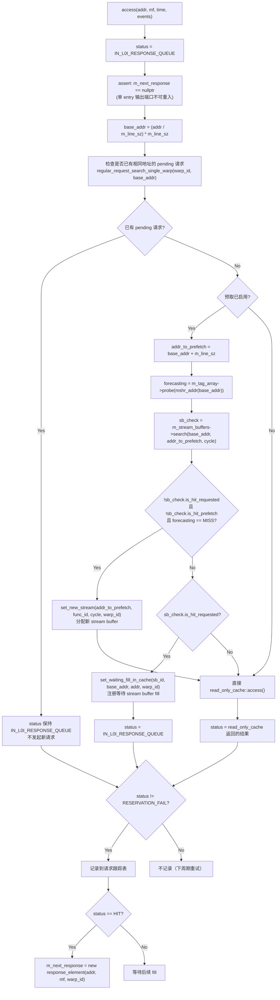

**关键设计点**：
- `m_next_response` 是**单 entry 输出端口**：每周期最多设置一个响应，下周期由 `Subcore::fetch()` 消费
- **已有 pending 请求**的检查避免对同一地址重复发起 cache 访问
- 预取触发条件：请求地址在 cache 和 stream buffer 中均未找到时，启动新的 stream
- Stream buffer 命中时，请求不经过 `read_only_cache::access()`，而是注册等待

### 5.4.5 cycle() 详细流程

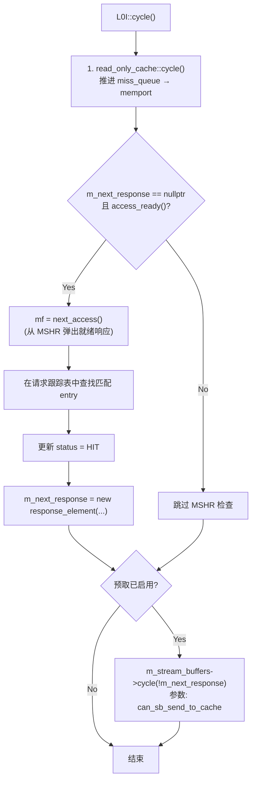

**`can_sb_send_to_cache` 参数的含义**：
- 当 `m_next_response` 已被占用时，stream buffer 不可调用 `fill_from_stream_buffer()`
- 因为 `fill_from_stream_buffer()` 会设置 `m_next_response`，两者冲突
- 因此 `can_sb_send_to_cache = !m_next_response`，仅在输出端口空闲时允许 stream buffer 发送

### 5.4.6 fill() 路由

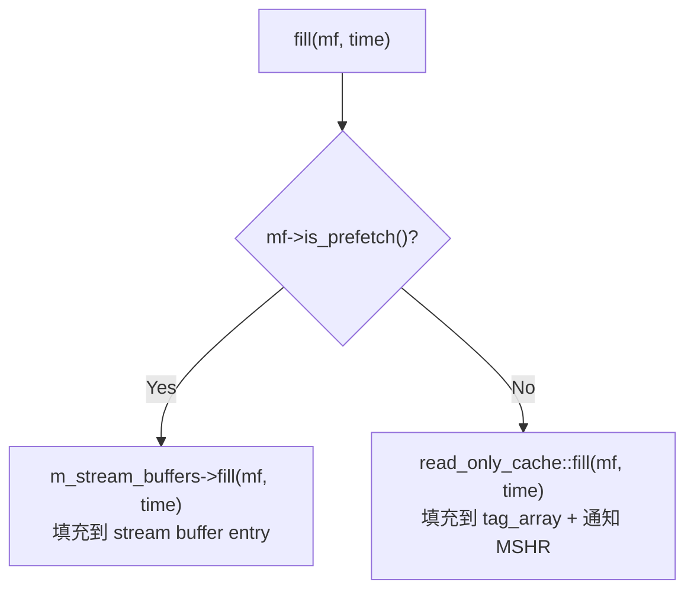

### 5.4.7 fill_from_stream_buffer() 详细流程

当 stream buffer 中预取的数据就绪，且有 demand 请求在等待时调用：

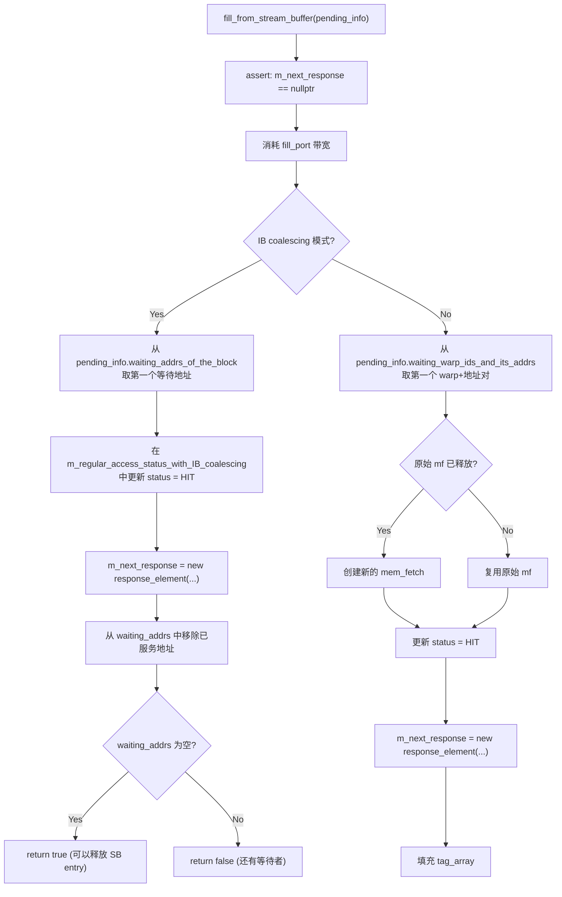

**设计要点**：
- 每次调用只服务**一个**等待者（单 entry 输出端口约束）
- 返回值指示 stream buffer entry 是否可以安全释放
- IB coalescing 模式下以地址为粒度服务，非 coalescing 以 (warp, addr) 为粒度

### 5.4.8 响应传递协议：is_first_access_ready() / next_first_access()

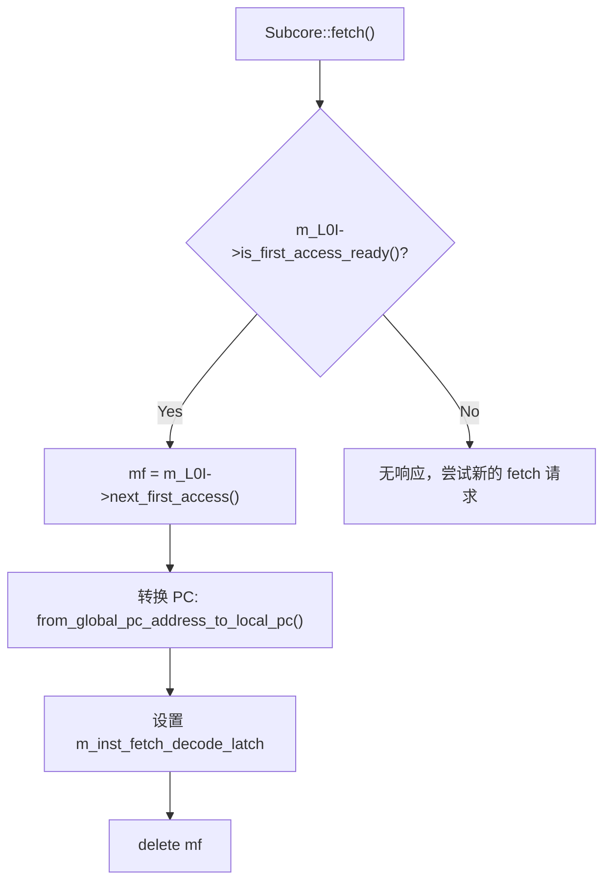

`is_first_access_ready()` 内部检查：
1. `m_next_response` 不为空
2. 对应的请求跟踪 entry 的 `cache_status == HIT`

`next_first_access()` 内部操作：
1. 取出 `m_next_response->mf`
2. 从请求跟踪表中**删除**已完成的 entry
3. 重置 `m_next_response = nullptr`（释放输出端口）

### 5.4.9 IB Coalescing 详细比较

| 特性 | Coalescing 模式 | 非 Coalescing 模式 |
|---|---|---|
| 跟踪表结构 | `map<addr, status_element>` | `map<warp_id, map<addr, status_element>>` |
| 键值粒度 | 地址 | (warp_id, 地址) |
| 请求合并 | 同一地址只发一次 cache 访问 | 每个 warp 独立访问 |
| Decode 行为 | 一条 cache line 返回时，所有 warp 的 IBuffer 中匹配 PC 的 entry 均被填充 | 仅填充发起请求的 warp |
| Stream buffer 等待 | `waiting_addrs_of_the_block` | `waiting_warp_ids_and_its_addrs` |
| 适用场景 | 多 warp 执行同一代码 | warp 执行不同代码路径 |

### 5.4.10 invalidate() 与 clear_cache()

**invalidate()**（kernel 切换时调用）：
1. `read_only_cache::invalidate()` — 清空 tag_array 所有行
2. `clear_cache()` — 清空 L0I 扩展状态
3. 清空 `m_extra_mf_fields` — 丢弃所有在途请求元数据
4. 清理 MSHR entries

**clear_cache()**：
1. 清空 `m_regular_access_status_without_IB_coalescing`
2. 重置 `m_next_response = nullptr`
3. 如果预取已启用：`m_stream_buffers->flush()` — 清空所有 stream buffer

### 5.4.11 L0I 停顿条件

| 停顿条件 | 表现 | 说明 |
|---|---|---|
| MSHR 满 | `access()` 返回 `RESERVATION_FAIL` | 所有 MSHR entry 被占用，无法记录新的 miss |
| 输出端口忙 | `m_next_response != nullptr` | 上一个响应尚未被 subcore 消费 |
| Fill 端口忙 | `m_bandwidth_management.fill_port_busy()` | 带宽管理限制，无法接收 fill |
| Miss queue 满 | `m_miss_queue.size() >= limit` | 待发送到 L0_icnt 的请求队列满 |
| memport 满 | `m_memport->full()` | L0_icnt 接收端口满，miss 请求无法发出 |

---

> **续见** [05A-L0互连与流式预取子系统设计.md](./05A-L0互连与流式预取子系统设计.md)
