# 第 5 章（续A）：L0 互连与流式预取子系统设计

---

> **本文件是第 5 章的续篇**，覆盖 L0_icnt 互连、Stream Buffer 预取子系统和接口时序。
> - 前文见 [05-指令供给子系统设计.md](./05-指令供给子系统设计.md)
> - 后文见 [05B-Fetch-Decode实现与源码锚点.md](./05B-Fetch-Decode实现与源码锚点.md)

---

## 5.5 L0_icnt 互连详细设计

### 5.5.1 设计概述

`L0_icnt` 实现 `mem_fetch_interface` 接口，作为所有 subcore 的 L0 缓存（L0I + L0C）与 SM 共享 L1I 之间的互连网络。其核心是两组**移位寄存器（shift register）**流水线，分别模拟请求方向和响应方向的传输延迟。

### 5.5.2 存储结构位宽表

| 字段 | C++ 类型 | 位宽/大小 | 说明 |
|---|---|---|---|
| `m_gpu` | `gpgpu_sim*` | 64 bit | 全局 GPU 模拟状态 |
| `m_L0` | `vector<read_only_cache*>` | 动态 | 所有 L0 缓存指针数组（L0I + L0C） |
| `m_L1` | `read_only_cache*` | 64 bit | 共享 L1I 缓存 |
| `m_shader` | `shader_core_ctx_wrapper*` | 64 bit | 父 shader core wrapper |
| `m_max_num_L1_request_ports_allowed` | `int` | 32 bit | 请求方向端口数 |
| `m_max_num_L1_reply_ports_allowed` | `int` | 32 bit | 响应方向端口数 |
| `m_latency_of_L0s_icnt_to_L1_queue` | `int` | 32 bit | L0→L1 流水线深度 |
| `m_latency_of_L1_to_L0s_icnt_queue` | `int` | 32 bit | L1→L0 流水线深度 |
| `m_icnt_to_L1_queue` | `vector<vector<mem_fetch*>>` | [ports][latency] | 请求方向移位寄存器 |
| `m_L1_to_icnt_queue` | `vector<deque<mem_fetch*>>` | [ports][latency] | 响应方向移位寄存器 |
| `m_icnt_L1_TLB_to_cache` | `queue<mem_fetch*>` | 动态 | TLB→cache 缓冲（最大 1 entry） |
| `m_max_size_icnt_L1_TLB_to_cache` | `unsigned int` | 32 bit | TLB 缓冲最大大小（硬编码 = 1） |

### 5.5.3 构造与初始化

```cpp
L0_icnt(read_only_cache *L1, gpgpu_sim *gpu, shader_core_ctx_wrapper* shader,
        int max_num_L1_reply_ports, int max_num_L1_request_ports,
        int latency_L0_to_L1, int latency_L1_to_L0)
```

**构造断言**：
- `latency_L0_to_L1 > 0`
- `latency_L1_to_L0 > 0`
- `max_num_L1_request_ports > 0`
- `max_num_L1_reply_ports > 0`

**初始化**：
- 请求流水线 `m_icnt_to_L1_queue`：维度 `[max_request_ports][latency_L0_to_L1]`，所有槽初始化为 `nullptr`
- 响应流水线 `m_L1_to_icnt_queue`：维度 `[max_reply_ports][latency_L1_to_L0]`，所有槽初始化为 `nullptr`
- TLB 缓冲最大大小硬编码为 1

### 5.5.4 mem_fetch_interface 实现

#### full()

```cpp
bool full(unsigned size, bool write) {
    for (int i = 0; i < m_max_num_L1_request_ports_allowed; i++) {
        if (m_icnt_to_L1_queue[i][latency - 1] == nullptr)
            return false;  // 找到空闲端口
    }
    return true;  // 所有端口尾部均被占用
}
```

检查请求流水线**所有端口的尾部 stage**（入口端）。只要有一个端口的尾部为空，就返回 `false`。

#### push()

```cpp
void push(mem_fetch *mf) {
    for (int i = 0; i < m_max_num_L1_request_ports_allowed; i++) {
        if (m_icnt_to_L1_queue[i][latency - 1] == nullptr) {
            m_icnt_to_L1_queue[i][latency - 1] = mf;
            // 更新 fetch 优先级：round-robin
            update_fetch_priority((mf->get_subcore() + 1) % num_subcores);
            return;
        }
    }
    assert(false);  // 不应在 full() 后仍调用 push()
}
```

**关键行为**：插入 mf 后，更新 subcore 的 fetch 优先级为 round-robin 下一个 subcore，防止单个 subcore 独占请求端口。

### 5.5.5 辅助函数

#### num_bytes_cache_req()

计算 cache 请求覆盖的字节数，处理 cache line 边界对齐：

```cpp
unsigned num_bytes_cache_req(unsigned line_size, address_type pc) {
    assert(line_size % 8 == 0);
    unsigned nbytes = line_size / 8;
    // 如果请求跨越 cache line 边界，截断到行末
    unsigned offset_in_line = pc % line_size;
    if (offset_in_line + nbytes > line_size)
        nbytes = line_size - offset_in_line;
    return nbytes;
}
```

#### get_pc_of_request()

将全局 PC 地址转换为局部 PC 地址：

```cpp
address_type get_pc_of_request(address_type pc) {
    return pc - PROGRAM_MEM_START;  // PROGRAM_MEM_START = 0xF0000000
}
```

### 5.5.6 cycle() 四阶段流水线

`L0_icnt::cycle()` 是整个互连的核心，每周期执行四个阶段，**严格按顺序执行**：

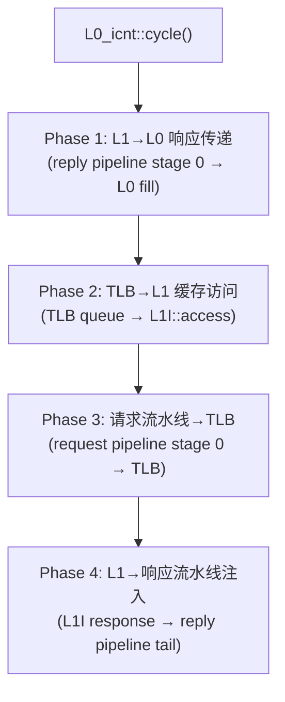

#### Phase 1：L1→L0 响应传递

从响应流水线的 stage 0（出口端）取出就绪的响应，填充到对应的 L0 缓存：

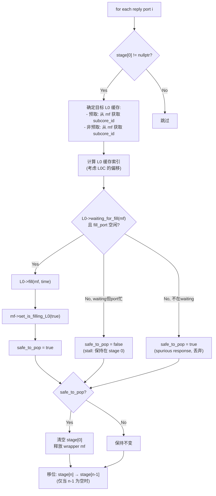

**关键设计**：
- 如果 fill port 忙，响应会**停留在 stage 0**（back-pressure），阻塞整个响应流水线
- wrapper `mem_fetch` 是在 Phase 2 创建的用于 L1I 访问的封装对象，需要在这里释放

#### Phase 2：TLB→L1 缓存访问

从 TLB 缓冲中取出请求，访问 L1I：

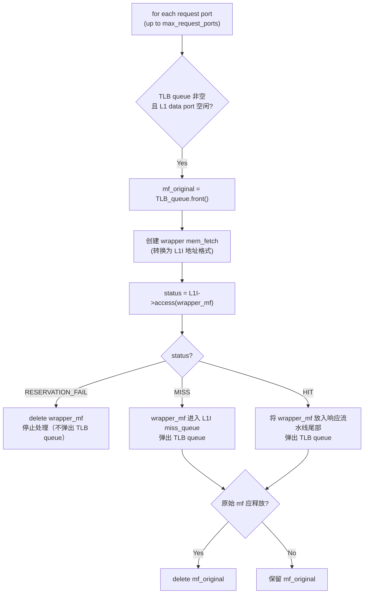

**关键设计**：
- 为 L1I 访问创建新的 wrapper `mem_fetch`（因为 L1I 的地址格式可能不同）
- `RESERVATION_FAIL` 时不弹出 TLB queue，下周期重试
- L1I HIT 时，wrapper mf 直接注入响应流水线，跳过 L1I 的 miss 路径

#### Phase 3：请求流水线→TLB

从请求流水线的 stage 0（出口端）取出请求，进行 TLB 访问：

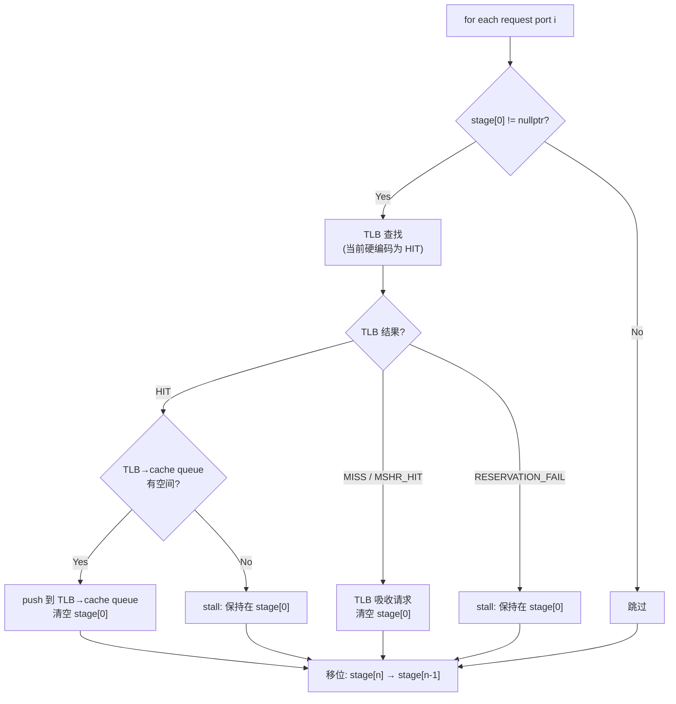

**注意**：TLB 当前硬编码为 HIT（源码中有 TODO 注释），即所有请求都直接通过 TLB 进入 L1I 访问阶段。

#### Phase 4：L1→响应流水线注入

将 L1I 的就绪响应注入响应流水线：

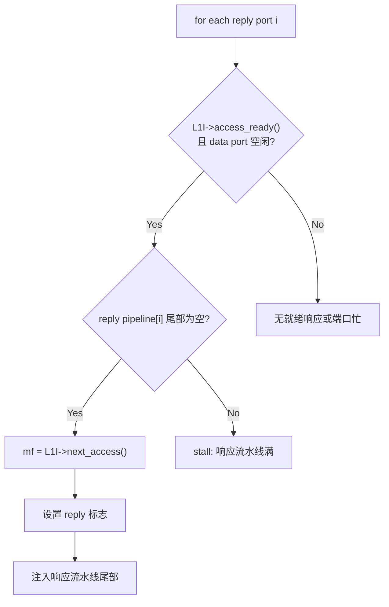

### 5.5.7 L0_icnt 数据流总览

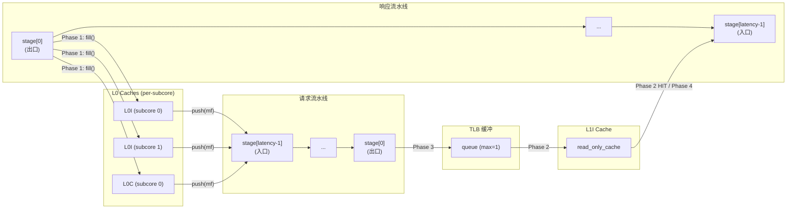

### 5.5.8 flush()

清空所有流水线状态：
- 遍历请求流水线所有 stage，delete 所有非空 `mem_fetch`
- 遍历响应流水线所有 stage，delete 所有非空 `mem_fetch`（包括 wrapper 和 original）
- 清空 TLB 缓冲

### 5.5.9 L0_icnt 停顿条件

| 停顿条件 | 阶段 | 表现 |
|---|---|---|
| 所有请求端口尾部满 | L0 push | `full()` 返回 true，L0I miss 请求无法发出 |
| TLB 缓冲满 | Phase 3 | 请求到达 stage 0 但无法进入 TLB queue |
| L1I RESERVATION_FAIL | Phase 2 | TLB queue 不弹出，下周期重试 |
| L1I data port 忙 | Phase 2 | 无法发起 L1I 访问 |
| 响应流水线尾部满 | Phase 4 | L1I 响应无法注入 |
| L0 fill port 忙 | Phase 1 | 响应停留在 stage 0，阻塞整个响应流水线 |

---

## 5.6 Stream Buffer 预取子系统详细设计

### 5.6.1 设计概述

Stream Buffer 是 L0I 内部集成的顺序预取器。每个 L0I 拥有 N 个独立的 `single_stream_buffer`，由 `multiple_stream_buffers` 统一管理。预取器的目标是在 L0I miss 发生前，提前将后续 cache line 加载到 stream buffer 中。

### 5.6.2 single_stream_buffer 详细设计

#### 存储结构

| 字段 | C++ 类型 | 位宽/大小 | 说明 |
|---|---|---|---|
| `m_is_enabled` | `bool` | 1 bit | 预取功能总开关 |
| `m_is_currently_prefetching` | `bool` | 1 bit | 当前是否有活跃的预取流 |
| `m_stream_buffer_id` | `unsigned int` | 32 bit | 本 stream buffer 编号 |
| `m_max_size` | `unsigned int` | 32 bit | 最大预取 entry 数 |
| `m_line_size` | `unsigned int` | 32 bit | cache line 大小（字节） |
| `m_sm_id` | `unsigned int` | 32 bit | 所属 SM ID |
| `m_subcore_id` | `unsigned int` | 32 bit | 所属 subcore ID |
| `m_first_sm_warp_id_reserved` | `unsigned int` | 32 bit | 首次触发预取的 warp ID |
| `gpu_cycle_hit` | `unsigned long long` | 64 bit | 最后一次命中的 GPU 周期（LRU 时间戳） |
| `m_next_addr_to_prefetch` | `new_addr_type` | 64 bit | 下一个预取的地址 |
| `m_current_unique_function_id` | `unsigned int` | 32 bit | 当前关联的 kernel function ID |
| `m_queue_ordered_prefetches` | `queue<new_addr_type>` | 动态 | FIFO 顺序的预取地址 |
| `m_all_prefetches` | `map<addr, prefetch_element>` | 动态 | 所有预取 entry 的状态映射 |
| `m_cache` | `first_level_instruction_cache*` | 64 bit | 父 L0I 缓存 |
| `m_memport` | `mem_fetch_interface*` | 64 bit | 到 L0_icnt 的发送端口 |

#### prefetch_element 结构

| 字段 | C++ 类型 | 位宽/大小 | 说明 |
|---|---|---|---|
| `sm_warp_id` | `unsigned int` | 32 bit | 触发预取的 warp ID |
| `unique_function_id` | `unsigned int` | 32 bit | 关联的 function ID |
| `is_ready` | `bool` | 1 bit | 预取数据是否已从内存返回 |
| `is_request_to_cache` | `bool` | 1 bit | 是否有 demand 请求在等待 |
| `waiting_warp_ids_and_its_addrs` | `map<uint, set<addr>>` | 动态 | 非 coalescing 模式下的等待者 |
| `waiting_addrs_of_the_block` | `set<new_addr_type>` | 动态 | coalescing 模式下的等待地址 |

#### is_hit() — 命中判断

```cpp
bool is_hit(new_addr_type addr, unsigned long long gpu_cycle) {
    if (!m_queue_ordered_prefetches.empty()
        && m_queue_ordered_prefetches.front() == addr) {
        gpu_cycle_hit = gpu_cycle;  // 更新 LRU 时间戳
        return true;
    }
    return false;
}
```

**重要约束**：只匹配队列**头部**（最老的预取 entry）。这是 stream buffer 的 FIFO 语义：必须按顺序消费预取结果。

#### is_a_pending_request() — 查找待处理预取

```cpp
bool is_a_pending_request(new_addr_type addr, unsigned long long gpu_cycle) {
    auto it = m_all_prefetches.find(addr);
    if (it != m_all_prefetches.end()) {
        gpu_cycle_hit = gpu_cycle;
        return true;
    }
    return false;
}
```

与 `is_hit()` 不同，`is_a_pending_request()` 搜索**所有**预取 entry（不限于头部）。

#### set_new_stream() — 启动新预取流

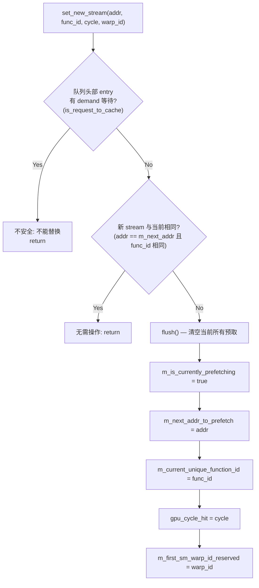

**安全检查**：如果队列头部的 entry 有 demand 请求在等待（`is_request_to_cache = true`），则拒绝替换。这防止了丢失已承诺的预取结果。

#### do_prefetch() — 预取引擎

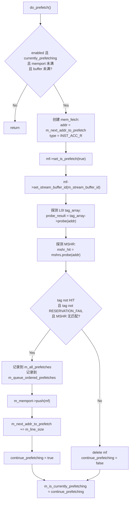

**预取停止条件**：
- cache tag_array 中已有该地址（HIT）— 无需预取
- tag_array 返回 RESERVATION_FAIL — 缓存资源不足
- MSHR 中已有该地址 — 正在处理中
- memport 满 — 无法发送请求
- buffer 满 — 达到最大预取 entry 数

#### fill() — 预取响应处理

```cpp
bool fill(mem_fetch *mf, unsigned time) {
    auto it = m_all_prefetches.find(mf->get_addr());
    if (it != m_all_prefetches.end()) {
        it->second.is_ready = true;
        return false;  // 正常处理
    }
    return true;  // 地址未找到（已被 flush）
}
```

返回 `true` 表示该预取 entry 已不存在（可能被 flush 了），调用者应丢弃此响应。

#### send_to_cache() — 从 stream buffer 到 L0I

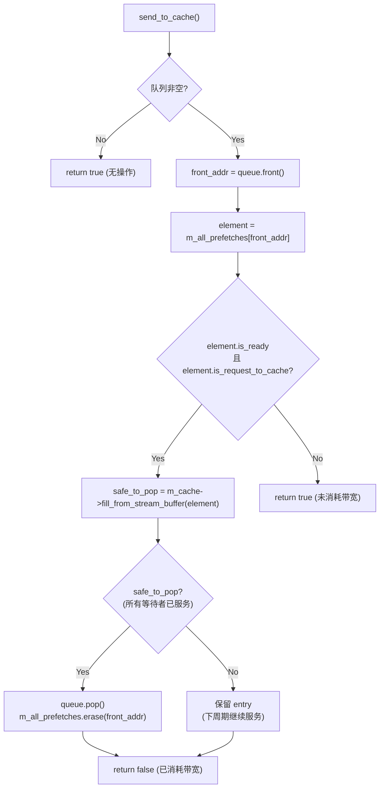

**返回值语义**：
- `false`：执行了 send_to_cache 操作，消耗了 L0I 的 fill port 带宽
- `true`：未执行操作（条件不满足或队列为空）

#### set_waiting_fill_in_cache() — 注册等待

当 demand 请求在 stream buffer 中找到匹配时，注册等待关系：

```cpp
void set_waiting_fill_in_cache(new_addr_type base_addr, new_addr_type request_addr,
                                unsigned int warp_id) {
    auto &element = m_all_prefetches[base_addr];
    element.is_request_to_cache = true;
    // IB coalescing 模式
    element.waiting_addrs_of_the_block.insert(request_addr);
    // 非 coalescing 模式
    element.waiting_warp_ids_and_its_addrs[warp_id].insert(request_addr);
}
```

### 5.6.3 multiple_stream_buffers 详细设计

#### 存储结构

| 字段 | C++ 类型 | 位宽/大小 | 说明 |
|---|---|---|---|
| `m_is_enabled` | `bool` | 1 bit | 预取子系统总开关 |
| `m_num_stream_buffers` | `unsigned int` | 32 bit | stream buffer 总数 |
| `m_max_size_per_stream_buffer` | `unsigned int` | 32 bit | 每个 buffer 的最大容量 |
| `m_max_num_prefetches_per_cycle` | `unsigned int` | 32 bit | 每周期最大预取数 |
| `m_line_size` | `unsigned int` | 32 bit | cache line 大小 |
| `m_next_sb_send_request` | `unsigned int` | 32 bit | Round-robin 指针 |
| `m_stream_buffers` | `vector<single_stream_buffer*>` | 动态 | stream buffer 实例数组 |

#### search() — 搜索逻辑

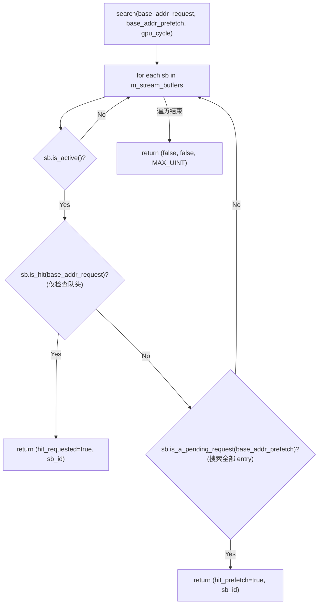

**搜索优先级**：
1. 优先匹配 demand 地址（`is_hit`）— 检查队头
2. 其次匹配 prefetch 地址（`is_a_pending_request`）— 搜索全部 entry

#### set_new_stream() — LRU 替换策略

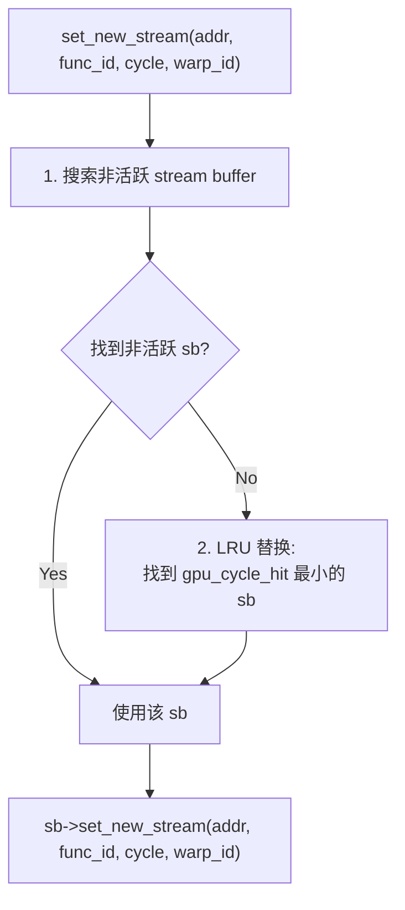

**LRU 替换**：当所有 stream buffer 都处于活跃状态时，选择 `gpu_cycle_hit` 最小的（最久未被命中的）进行替换。

#### cycle() — 周期行为

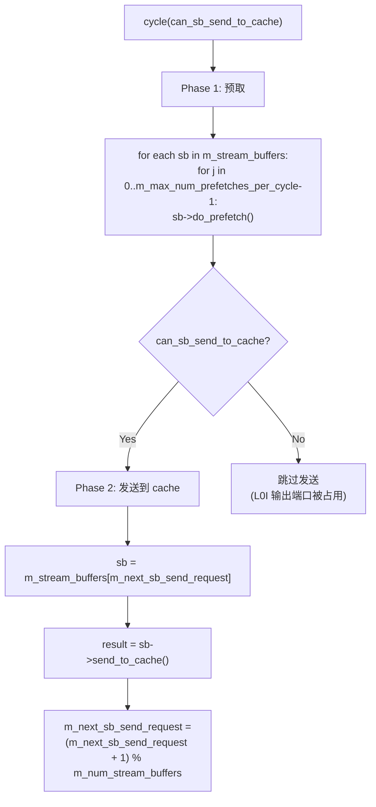

**Round-robin 调度**：`send_to_cache()` 在多个 stream buffer 间轮转，每周期只尝试一个 buffer 的发送。这避免了单个 stream buffer 独占 L0I 的 fill port。

#### fill() — 路由响应

```cpp
void fill(mem_fetch *mf, unsigned time) {
    unsigned sb_id = mf->get_stream_buffer_id();
    m_stream_buffers[sb_id]->fill(mf, time);
}
```

通过 `mem_fetch` 中携带的 `stream_buffer_id` 路由到正确的 stream buffer。

#### is_already_allocated() — 检查预取是否在途

```cpp
bool is_already_allocated(new_addr_type addr, unsigned long long cycle,
                          unsigned int sb_id) {
    return m_stream_buffers[sb_id]->is_a_pending_request(addr, cycle);
}
```

L0I 的 `waiting_for_fill()` 在 MSHR 中未找到匹配时，调用此方法检查是否在 stream buffer 中。

---

## 5.7 接口时序

### 5.7.1 Fetch 请求 → L0I Hit/Miss → L1I 访问时序

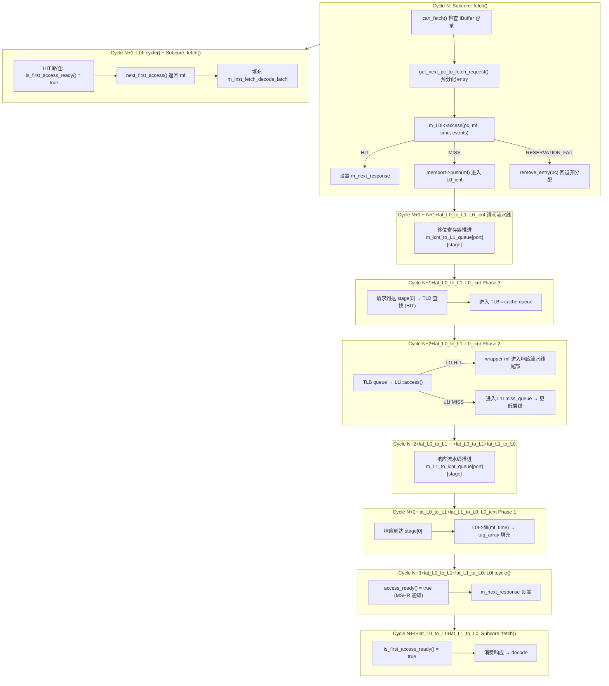

**总延迟分析（L0I miss + L1I hit）**：

| 阶段 | 周期数 | 说明 |
|---|---|---|
| L0I access | 0 | 同周期返回 MISS |
| L0_icnt 请求流水线 | `latency_L0_to_L1` | 移位寄存器传输 |
| TLB + L1I access | 1-2 | Phase 3 → Phase 2 |
| L0_icnt 响应流水线 | `latency_L1_to_L0` | 移位寄存器传输 |
| L0I fill + MSHR 通知 | 1 | Phase 1 + cycle() |
| Subcore 消费 | 1 | is_first_access_ready |
| **总计** | **3-4 + latency_L0_to_L1 + latency_L1_to_L0** | |

### 5.7.2 IBuffer Fill → Consume 时序

```
Cycle N (Subcore::fetch):
    条件: IBuffer.can_fetch() && !m_inst_fetch_decode_latch.m_valid
    动作:
      → get_next_pc_to_fetch_request(): 预分配 entry (valid=false)
      → L0I::access(pc): 假设 HIT → 设置 m_next_response

Cycle N+1 (L0I::cycle + Subcore::fetch):
    条件: is_first_access_ready() = true
    动作:
      → next_first_access(): 取出 mf
      → 设置 m_inst_fetch_decode_latch(pc, nbytes, warp_id)
      → delete mf

Cycle N+1 (Subcore::decode):
    条件: m_inst_fetch_decode_latch.m_valid = true
    动作:
      → 在 IBuffer deque 中查找 PC 匹配且 valid=false 的 entry
      → get_next_trace_inst(pc) → single_decode()
      → entry.m_valid = true, entry.m_inst = pI
      → m_inst_fetch_decode_latch.m_valid = false

Cycle N+2+ (Subcore::issue):
    条件: IBuffer.is_next_valid() = true 且 warp 被调度
    动作:
      → next_inst(): 返回队首指令
      → issued(): pop_front()
```

### 5.7.3 Stream Buffer 预取时序

```
Cycle N (L0I::access):
    条件: cache MISS 且 stream buffer 无匹配
    动作:
      → set_new_stream(addr + line_size): 启动新预取流
      → read_only_cache::access(): 处理原始请求 (MISS)

Cycle N+1 (stream_buffers::cycle):
    动作:
      → do_prefetch(): 创建预取 mem_fetch
      → memport->push(mf): 进入 L0_icnt 请求流水线

Cycle N+1+lat_L0_to_L1+lat_L1_to_L0:
    动作:
      → 预取响应返回
      → stream_buffer::fill(): is_ready = true

Cycle N+2+...:
    条件: is_ready && is_request_to_cache && can_sb_send_to_cache
    动作:
      → send_to_cache() → fill_from_stream_buffer()
      → tag_array 填充 + m_next_response 设置

下周期:
    → Subcore::fetch() 消费 m_next_response
```

---

> **续见** [05B-Fetch-Decode实现与源码锚点.md](./05B-Fetch-Decode实现与源码锚点.md)
