# 第 5 章（续B）：Fetch-Decode 实现与源码锚点

---

> **本文件是第 5 章的续篇**，覆盖 Subcore Fetch/Decode 阶段实现细节、关键电路描述、停顿条件汇总和源码锚点。
> - 前文见 [05-指令供给子系统设计.md](./05-指令供给子系统设计.md)
> - 中文见 [05A-L0互连与流式预取子系统设计.md](./05A-L0互连与流式预取子系统设计.md)

---

## 5.8 Subcore Fetch 阶段详细实现
<!-- anchor:fetch-implementation -->

### 5.8.1 Pipeline 执行顺序

Subcore 的 `cycle()` 方法中，各流水线阶段按**逆序执行**（从 writeback 到 fetch），以防止同周期内的组合旁路：

```cpp
void Subcore::cycle() {
    if (m_num_active_warps_subcore > 0) {
        writeback(); execute(); read_rf();
        allocate(); control_stage();
        issue(); decode(); fetch();
        m_greedy_pointer_fetch = m_greedy_pointer_issue;
    }
    m_L0C_cache->cycle();  // L0 常量缓存始终推进
    m_L0I->cycle();         // L0 指令缓存始终推进
}
```

**关键点**：即使没有活跃 warp（`m_num_active_warps_subcore == 0`），L0I 和 L0C 的 `cycle()` 仍然执行。这确保了 cache 的 miss queue 排空和 stream buffer 的预取推进。

### 5.8.2 Fetch 阶段两步骤

Fetch 阶段由两个独立步骤组成，仅当 `m_inst_fetch_decode_latch.m_valid == false`（decode 锁存器空闲）时执行：

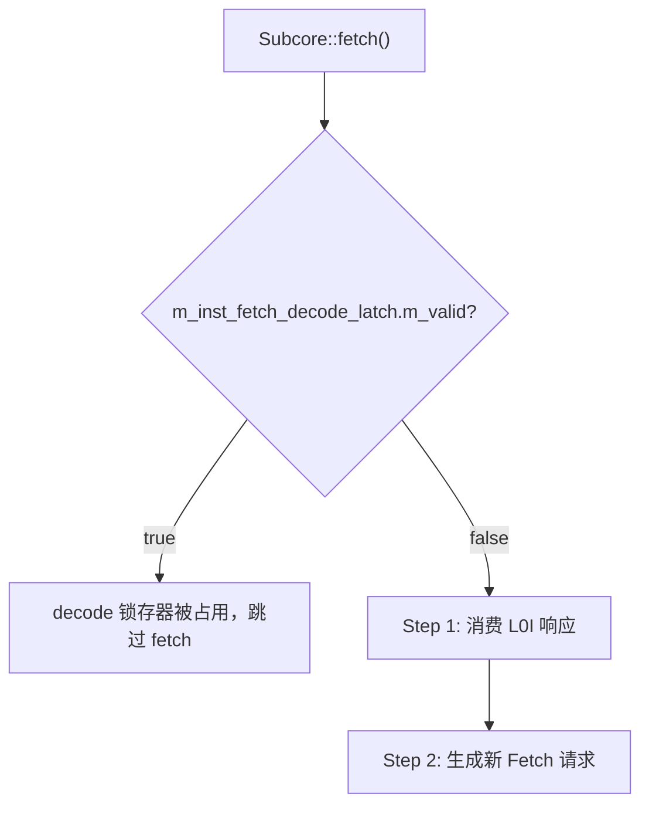

#### Step 1：消费 L0I 响应

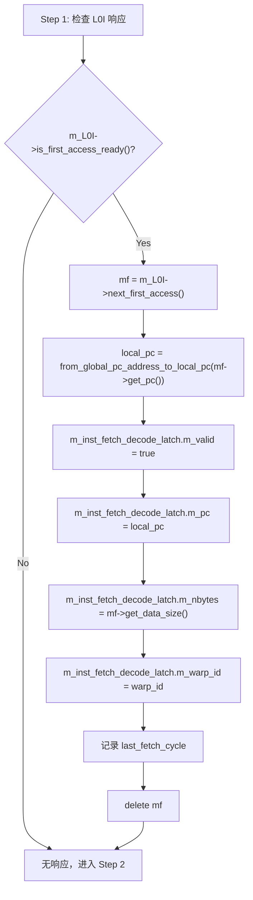

#### PC 地址转换

指令在内存中使用全局 PC 地址（以 `PROGRAM_MEM_START = 0xF0000000` 为基址），但 trace 和 decode 使用局部 PC 地址：

```cpp
// 局部 → 全局
address_type from_local_pc_to_global_pc_address(address_type local_pc) {
    return local_pc + PROGRAM_MEM_START;
}

// 全局 → 局部
address_type from_global_pc_address_to_local_pc(address_type global_pc) {
    return global_pc - PROGRAM_MEM_START;
}
```

#### Step 2：生成新 Fetch 请求

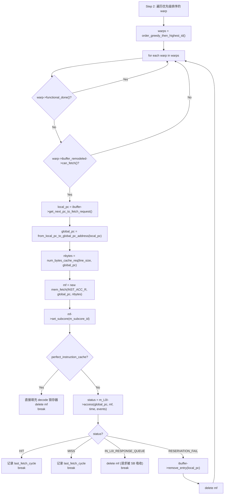

**Warp 选择策略：`order_greedy_then_highest_id()`**

1. 将 `m_greedy_pointer_fetch` 指向的 warp 排在最前
2. 其余 warp 按 dynamic warp ID 降序排列（最近启动的优先）
3. 跳过已完成（`functional_done`）和正在等待的 warp

**每周期最多发起一个 fetch 请求**：无论 `fetch_decode_width` 是多少，fetch 阶段在成功发起一次 L0I 访问后即 `break`，等待下周期继续。唯一例外是 `RESERVATION_FAIL`，此时回退并尝试下一个 warp。

### 5.8.3 完美指令缓存模式

当 `perfect_instruction_cache = true` 或 `perfect_inst_const_cache = true` 时：
- 跳过 L0I 访问
- 直接将 fetch 结果填充到 decode 锁存器
- 所有 fetch 请求在同周期完成（零延迟）
- 用于基准测试和性能上限分析

### 5.8.4 ifetch_buffer_t 锁存器

Fetch-to-Decode 流水线锁存器结构：

| 字段 | 类型 | 说明 |
|---|---|---|
| `m_valid` | `bool` | 是否有有效数据 |
| `m_pc` | `address_type` | 指令 PC（局部地址） |
| `m_nbytes` | `unsigned` | 数据大小（字节） |
| `m_warp_id` | `unsigned` | 发起 fetch 的 subcore warp ID |

该锁存器是 fetch 和 decode 之间的**唯一通道**，每周期最多传递一条 fetch 响应。decode 消费后将 `m_valid` 置为 `false`，释放锁存器供下次 fetch 使用。

---

## 5.9 Subcore Decode 阶段详细实现
<!-- anchor:decode-implementation -->

### 5.9.1 Decode 入口条件

```cpp
void Subcore::decode(SM *shared_sm) {
    if (!m_inst_fetch_decode_latch.m_valid) return;  // 无数据可解码
    // ... 解码逻辑 ...
    m_inst_fetch_decode_latch.m_valid = false;  // 解码完成，释放锁存器
}
```

### 5.9.2 IB Coalescing 解码模式

当 `config->ibuffer_coalescing = true` 时：

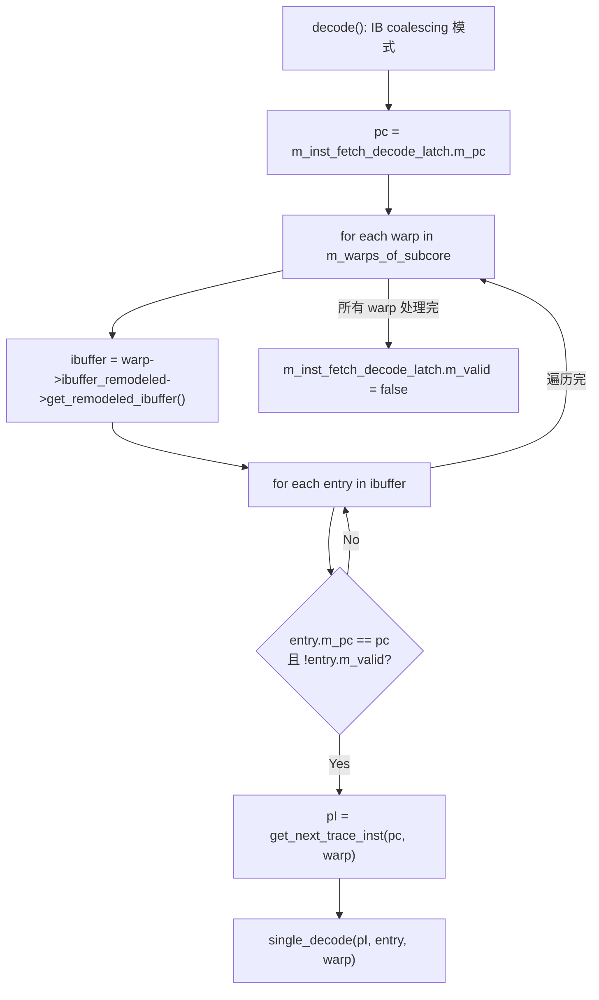

**关键行为**：遍历**所有** warp 的 IBuffer，只要有 entry 的 PC 与当前 fetch 返回的 PC 匹配且未被解码，就同时进行解码填充。这实现了跨 warp 的指令共享——一条 cache line 的返回可以同时服务多个 warp 的相同 PC。

### 5.9.3 非 Coalescing 解码模式

当 `config->ibuffer_coalescing = false` 时：

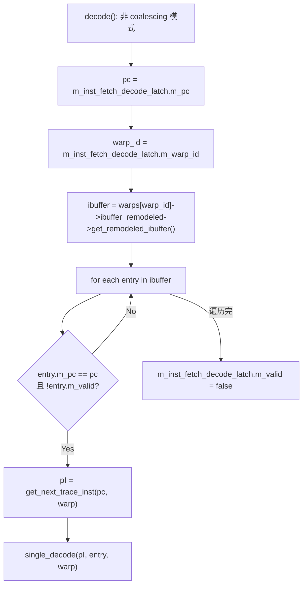

仅解码**发起 fetch 请求的 warp** 的 IBuffer entry。

### 5.9.4 single_decode() 详细步骤

`single_decode()` 对单条指令进行解码并填充到 IBuffer entry：

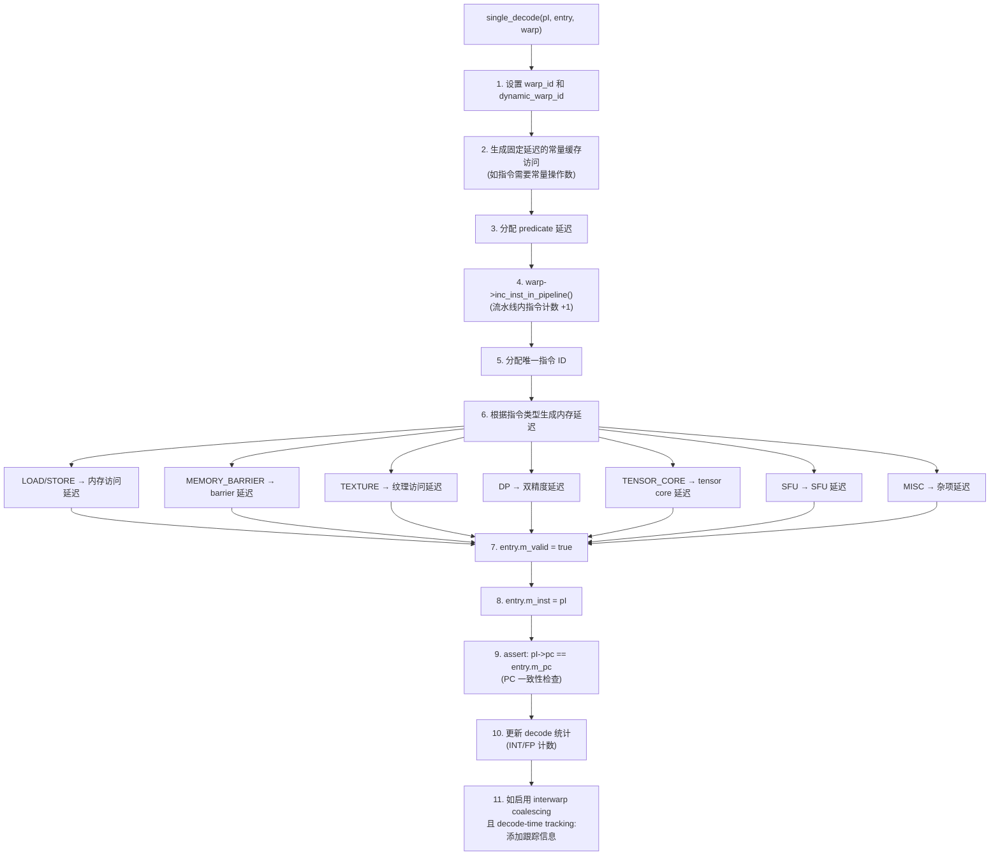

**PC 一致性断言**：解码后的指令 PC 必须与 IBuffer entry 中预分配时记录的 PC 完全匹配。这是正确性的核心不变量，确保 fetch 预分配和 decode 填充的地址一致性。

---

## 5.10 关键电路描述

### 5.10.1 L0I Tag 比较逻辑

L0I 的 tag 比较继承自 `read_only_cache` → `baseline_cache` → `tag_array::probe()`：

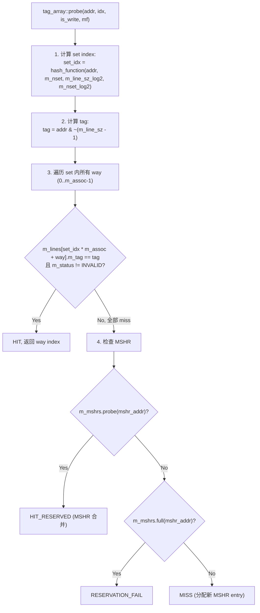

**地址分解**：
- `set_index = hash(addr >> m_line_sz_log2) % m_nset`
- `tag = addr & ~(m_line_sz - 1)` — 即 `mshr_addr()` 的实现，对齐到 cache line 边界
- `offset = addr & (m_line_sz - 1)` — cache line 内偏移

### 5.10.2 Stream Buffer 预取触发逻辑

预取触发在 `first_level_instruction_cache::access()` 中实现：

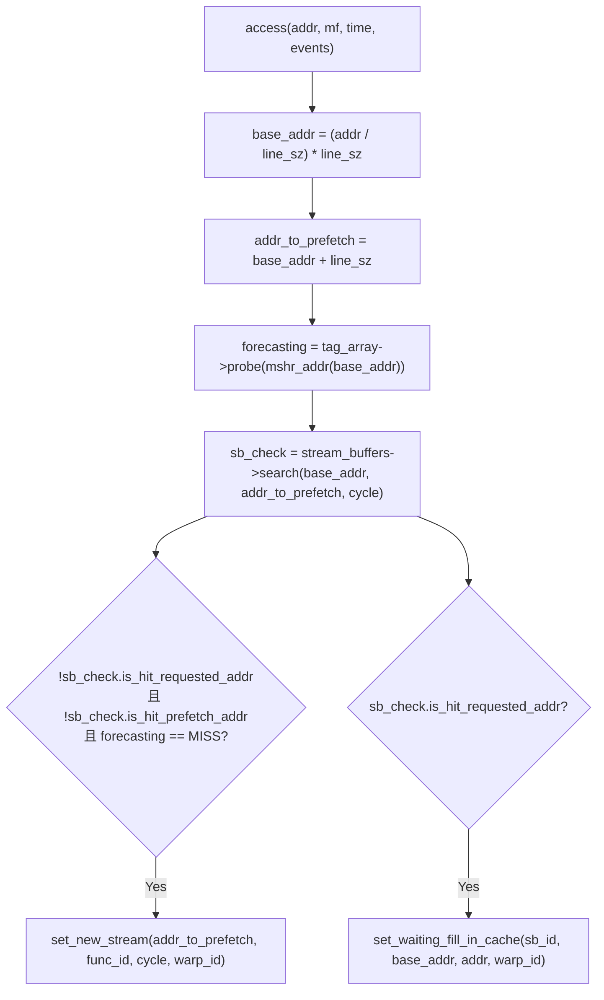

**预取触发三条件**（全部满足时启动新 stream）：
1. 请求地址不在任何 stream buffer 的队头（`!is_hit_requested_addr`）
2. 下一行地址不在任何 stream buffer 中（`!is_hit_prefetch_addr`）
3. 请求地址在 cache tag_array 中为 MISS（`forecasting == MISS`）

### 5.10.3 Stream Buffer 搜索逻辑

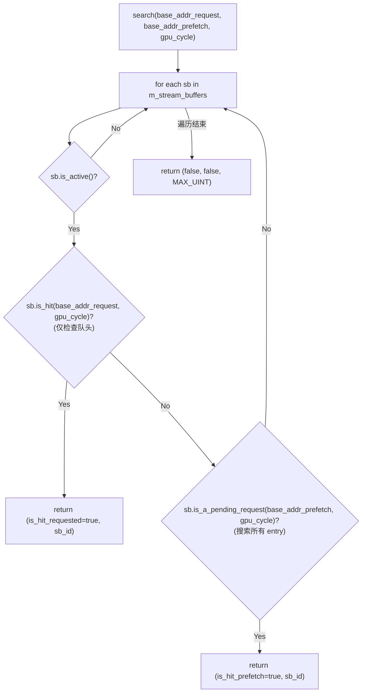

### 5.10.4 IBuffer Coalescing 逻辑

当 `is_IB_coalescing_enabled=true` 时，L0I 使用地址级合并：

```mermaid
flowchart TD
    subgraph Coalescing["合并模式 #40;is_IB_coalescing_enabled=true#41;"]
        A["m_regular_access_status_with_IB_coalescing"]
        A --> A1["key: new_addr_type #40;地址#41;"]
        A1 --> A2["第一个请求创建 entry"]
        A2 --> A3["后续相同地址请求 → is_regular_request_found = true"]
        A3 --> A4["status 保持 IN_L0I_RESPONSE_QUEUE"]
        A4 --> A5["L0I 响应时，一次 fill 服务所有等待者"]
    end

    subgraph NonCoalescing["非合并模式 #40;is_IB_coalescing_enabled=false#41;"]
        B["m_regular_access_status_without_IB_coalescing"]
        B --> B1["key: #40;warp_id, addr#41;"]
        B1 --> B2["每个 warp 独立跟踪"]
        B2 --> B3["同一地址的不同 warp 请求独立处理"]
        B3 --> B4["各自等待自己的 cache 响应"]
    end
```

### 5.10.5 num_bytes_cache_req() 边界处理

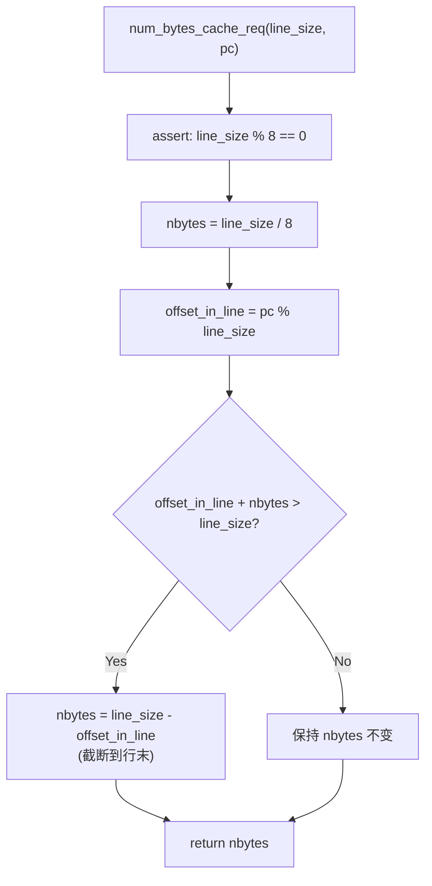

此函数处理指令请求跨越 cache line 边界的情况。当 PC 位于 cache line 尾部时，请求的字节数被截断到当前行的剩余部分。

---

## 5.11 停顿条件汇总

### 5.11.1 Fetch 阶段停顿条件

| 编号 | 停顿条件 | 检查表达式 | 影响 |
|---|---|---|---|
| F1 | Decode 锁存器被占用 | `m_inst_fetch_decode_latch.m_valid == true` | 整个 fetch 阶段跳过 |
| F2 | L0I 输出端口无响应 | `!m_L0I->is_first_access_ready()` | Step 1 无数据可消费 |
| F3 | 所有 warp 已完成 | 全部 `functional_done()` | Step 2 无 warp 可 fetch |
| F4 | 所有 warp IBuffer 满 | 全部 `!can_fetch()` | Step 2 无空间可预分配 |
| F5 | L0I RESERVATION_FAIL | `access()` 返回 RESERVATION_FAIL | 回退预分配，尝试下一个 warp |
| F6 | L0_icnt 请求端口满 | `m_memport->full()` | L0I miss 无法发出 |

### 5.11.2 Decode 阶段停顿条件

| 编号 | 停顿条件 | 检查表达式 | 影响 |
|---|---|---|---|
| D1 | 无数据可解码 | `!m_inst_fetch_decode_latch.m_valid` | decode 阶段跳过 |

Decode 阶段本身不产生背压——一旦锁存器有效，解码在同周期完成。

### 5.11.3 IBuffer 停顿条件

| 编号 | 停顿条件 | 检查表达式 | 影响 |
|---|---|---|---|
| IB1 | Buffer 满 | `m_num_max_entries - m_num_entries < m_fetch_decode_width` | 阻止新的 fetch 预分配 |
| IB2 | RET 已到达 | `m_is_ret_reached == true` | 永久停止 fetch（直到 flush） |
| IB3 | 队首未解码 | `!front().m_valid` | Issue 阶段无法消费 |

### 5.11.4 L0I 停顿条件

| 编号 | 停顿条件 | 检查表达式 | 影响 |
|---|---|---|---|
| L1 | MSHR 满 | `m_mshrs.full()` | access() 返回 RESERVATION_FAIL |
| L2 | 输出端口忙 | `m_next_response != nullptr` | 无法设置新响应 |
| L3 | Fill 端口忙 | `fill_port_busy()` | 无法接收 L1I 返回数据 |
| L4 | Miss queue 满 | miss_queue 超限 | miss 请求排队等待 |
| L5 | memport 满 | `m_memport->full()` | miss 请求无法发往 L0_icnt |

### 5.11.5 L0_icnt 停顿条件

| 编号 | 停顿条件 | 阶段 | 影响 |
|---|---|---|---|
| IC1 | 请求端口满 | push() | L0I/L0C 的 miss 请求无法进入 |
| IC2 | TLB 缓冲满 | Phase 3 | 请求停留在 stage[0] |
| IC3 | L1I RESERVATION_FAIL | Phase 2 | TLB queue 不弹出 |
| IC4 | L1I data port 忙 | Phase 2 | 无法发起 L1I 访问 |
| IC5 | 响应流水线尾部满 | Phase 4 | L1I 响应无法注入 |
| IC6 | L0 fill port 忙 | Phase 1 | 响应阻塞在 stage[0] |

### 5.11.6 Stream Buffer 停顿条件

| 编号 | 停顿条件 | 检查表达式 | 影响 |
|---|---|---|---|
| SB1 | memport 满 | `m_memport->full()` | 预取请求无法发出 |
| SB2 | Buffer 满 | entry 数达到 `m_max_size` | 停止预取 |
| SB3 | 地址已在 cache | tag_array HIT | 停止预取（无需重复） |
| SB4 | 地址已在 MSHR | MSHR hit | 停止预取（已在处理中） |
| SB5 | L0I 输出端口忙 | `!can_sb_send_to_cache` | send_to_cache() 被推迟 |
| SB6 | 头部未就绪 | `!is_ready` | 预取数据尚未返回 |

---

## 5.12 统计计数器

Fetch/Decode 阶段相关的统计计数器（通过 `m_sm_stats.m_stats_map` 记录）：

| 计数器名 | 触发时机 | 说明 |
|---|---|---|
| `total_num_cycles_issue_stage_stall_no_valid_instruction` | Issue 阶段 | IBuffer 队首未解码导致的 issue stall 周期 |
| L0I cache stats | `read_only_cache` 基类 | HIT/MISS/RESERVATION_FAIL 次数 |
| L1I cache stats | `read_only_cache` 基类 | HIT/MISS/RESERVATION_FAIL 次数 |

---

## 参考文档

| 文档/资源 | 说明 |
|---|---|
| MICRO 2025 论文 | GPU 指令缓存层次与预取策略的逆向工程分析 |
| `ibuffer_remodeled.h` / `ibuffer_remodeled.cc` | IBuffer_Remodeled 类定义与实现 |
| `first_level_instruction_cache.h` / `first_level_instruction_cache.cc` | L0I 指令缓存实现 |
| `stream_buffer.h` / `stream_buffer.cc` | Stream Buffer 预取器实现 |
| `l0_icnt.h` / `l0_icnt.cc` | L0↔L1 互连实现 |
| `subcore.h` / `subcore.cc` | Subcore 流水线实现（fetch/decode 阶段） |
| `gpu-cache.h` / `gpu-cache.cc` | 通用缓存基类（`read_only_cache`、`tag_array`、`cache_config`） |
| `shader.h` | `shader_core_config` 配置参数定义 |
| `abstract_hardware_model.h` | `address_type`、`new_addr_type`、`cache_request_status` 等基础类型定义 |
| `constants.h` | `PROGRAM_MEM_START`、`MAX_SRC`、`MAX_DST` 等常量定义 |
| 第 2 章：SM 顶层设计 | SM::cycle() 阶段顺序，L0_icnt 在 Phase 1 执行 |
| 第 3 章：Subcore 流水线设计 | Subcore::cycle() 逆序执行模式，流水线锁存器语义 |

---

## 源码锚点

所有源文件位于 `simulator-remodeled/gpu-simulator/gpgpu-sim/src/gpgpu-sim/remodeling/` 目录。

### IBuffer_Remodeled

| 文件 | 函数/类 | 说明 |
|---|---|---|
| `ibuffer_remodeled.h` | `struct IBuffer_Entry` | entry 结构定义 |
| `ibuffer_remodeled.h` | `class IBuffer_Remodeled` | IBuffer 类定义，所有成员变量和接口声明 |
| `ibuffer_remodeled.cc` | `IBuffer_Remodeled::IBuffer_Remodeled()` | 构造函数，包含 `fetch_decode_width <= ibuffer_remodeled_size` 断言 |
| `ibuffer_remodeled.cc` | `IBuffer_Remodeled::can_fetch()` | 容量检查 + RET 检查 |
| `ibuffer_remodeled.cc` | `IBuffer_Remodeled::get_next_pc_to_fetch_request()` | fetch 预分配，首次调用初始化 PC |
| `ibuffer_remodeled.cc` | `IBuffer_Remodeled::remove_entry()` | RESERVATION_FAIL 回退 |
| `ibuffer_remodeled.cc` | `IBuffer_Remodeled::issued()` | issue 弹出 + 分支检测 |
| `ibuffer_remodeled.cc` | `IBuffer_Remodeled::flush()` | 完整清空，含资源释放 |
| `ibuffer_remodeled.cc` | `IBuffer_Remodeled::print()` | 调试输出 |

### L0I 指令缓存

| 文件 | 函数/类 | 说明 |
|---|---|---|
| `first_level_instruction_cache.h` | `struct response_element` | 响应元素定义 |
| `first_level_instruction_cache.h` | `struct status_element` | 请求状态元素定义 |
| `first_level_instruction_cache.h` | `class first_level_instruction_cache` | L0I 类定义 |
| `first_level_instruction_cache.cc` | `first_level_instruction_cache::access()` | 核心访问逻辑，含预取触发和 IB coalescing |
| `first_level_instruction_cache.cc` | `first_level_instruction_cache::cycle()` | 周期推进，含 MSHR 响应检查和 stream buffer cycle |
| `first_level_instruction_cache.cc` | `first_level_instruction_cache::fill()` | fill 路由（普通 vs 预取） |
| `first_level_instruction_cache.cc` | `first_level_instruction_cache::fill_from_stream_buffer()` | stream buffer → cache 填充 |
| `first_level_instruction_cache.cc` | `first_level_instruction_cache::is_first_access_ready()` | 单 entry 输出端口就绪检查 |
| `first_level_instruction_cache.cc` | `first_level_instruction_cache::next_first_access()` | 取出响应并释放输出端口 |
| `first_level_instruction_cache.cc` | `first_level_instruction_cache::invalidate()` | kernel 切换时全清空 |
| `first_level_instruction_cache.cc` | `first_level_instruction_cache::initiate_stream_buffers()` | 创建 stream buffer 实例 |

### Stream Buffer

| 文件 | 函数/类 | 说明 |
|---|---|---|
| `stream_buffer.h` | `struct stream_buffer_search_result` | 搜索结果结构 |
| `stream_buffer.h` | `struct prefetch_element` | 预取 entry 元数据 |
| `stream_buffer.h` | `class single_stream_buffer` | 单个 stream buffer |
| `stream_buffer.h` | `class multiple_stream_buffers` | 多 stream buffer 管理器 |
| `stream_buffer.cc` | `single_stream_buffer::is_hit()` | 队头命中判断 |
| `stream_buffer.cc` | `single_stream_buffer::is_a_pending_request()` | 全 entry 搜索 |
| `stream_buffer.cc` | `single_stream_buffer::set_new_stream()` | 启动新预取流（含安全检查） |
| `stream_buffer.cc` | `single_stream_buffer::do_prefetch()` | 预取引擎（含 tag/MSHR 探测） |
| `stream_buffer.cc` | `single_stream_buffer::fill()` | 预取响应到达 |
| `stream_buffer.cc` | `single_stream_buffer::send_to_cache()` | 从 SB 发送到 L0I cache |
| `stream_buffer.cc` | `multiple_stream_buffers::search()` | 跨 SB 搜索 |
| `stream_buffer.cc` | `multiple_stream_buffers::set_new_stream()` | LRU 替换选择 |
| `stream_buffer.cc` | `multiple_stream_buffers::cycle()` | 预取推进 + round-robin 发送 |

### L0_icnt

| 文件 | 函数/类 | 说明 |
|---|---|---|
| `l0_icnt.h` | `class L0_icnt` | L0↔L1 互连类定义（extends `mem_fetch_interface`） |
| `l0_icnt.h` | `num_bytes_cache_req()` | cache line 边界对齐计算 |
| `l0_icnt.h` | `get_pc_of_request()` | 全局→局部 PC 转换 |
| `l0_icnt.cc` | `L0_icnt::L0_icnt()` | 构造函数，初始化移位寄存器 |
| `l0_icnt.cc` | `L0_icnt::full()` | 请求端口满检查 |
| `l0_icnt.cc` | `L0_icnt::push()` | 请求注入 + 优先级更新 |
| `l0_icnt.cc` | `L0_icnt::cycle()` | 四阶段流水线核心逻辑 |
| `l0_icnt.cc` | `L0_icnt::flush()` | 清空所有流水线状态 |

### Subcore Fetch/Decode

| 文件 | 函数/类 | 说明 |
|---|---|---|
| `subcore.h` | `class Subcore` | Subcore 类定义，含 `m_L0I`、`m_inst_fetch_decode_latch` |
| `subcore.cc` | `Subcore::cycle()` | 主循环，逆序执行 8 阶段 + L0 cache cycle |
| `subcore.cc` | `Subcore::fetch()` | fetch 阶段：两步骤（消费响应 + 生成请求） |
| `subcore.cc` | `Subcore::decode()` | decode 阶段：IB coalescing / 非 coalescing 两路径 |
| `subcore.cc` | `Subcore::single_decode()` | 单指令解码：延迟分配 + entry 填充 |
| `subcore.cc` | `Subcore::create_L0s()` | 创建 L0I 和 L0C 缓存实例 |
| `subcore.cc` | `Subcore::order_greedy_then_highest_id()` | warp fetch 优先级排序 |

### 基础设施

| 文件 | 函数/类 | 说明 |
|---|---|---|
| `gpu-cache.h` | `enum cache_request_status` | HIT / MISS / RESERVATION_FAIL / IN_L0I_RESPONSE_QUEUE |
| `gpu-cache.h` | `class tag_array` | tag 比较和状态管理 |
| `gpu-cache.h` | `class mshr_table` | MSHR 表 |
| `gpu-cache.h` | `class baseline_cache` | 缓存基类 |
| `gpu-cache.h` | `class read_only_cache` | 只读缓存（L0I 和 L1I 的直接父类） |
| `shader.h` | `class shader_core_config` | 所有配置参数定义 |
| `constants.h` | `PROGRAM_MEM_START` | `0xF0000000`，指令地址空间起始 |
| `sm.h` | pipeline 延迟常量 | `MAXIMUM_LATENCY_READ_FIXED_LATENCY_INST = 6` 等 |
