# 第 6 章：执行资源设计

---

## 术语说明

| 缩写/术语 | 全称 | 说明 |
|---|---|---|
| FU | Functional Unit | 功能单元，执行算术/逻辑/访存等操作的硬件单元 |
| RF | Register File | 寄存器文件，存储 warp 的通用寄存器数据 |
| RF Bank | Register File Bank | 寄存器文件分 bank 结构，每个 bank 有独立的读/写端口 |
| RF Cache | Register File Cache | 寄存器文件读缓存，per-operand-position per-bank 的 1-entry 直接映射缓存 |
| SP | Streaming Processor | 标量处理器，执行 FP32/INT/PREDICATE 指令 |
| SFU | Special Function Unit | 特殊函数单元，执行超越函数（sin/cos/rsqrt 等） |
| DP | Double Precision | 双精度浮点单元 |
| TENSOR | Tensor Core | 张量核心，执行矩阵乘加运算 |
| Pipeline Depth | Pipeline Depth | FU 内部流水线级数，决定指令执行延迟 |
| Initiation Interval | Initiation Interval | 发射间隔，两条连续指令进入同一 FU 的最小周期间隔 |
| `occupied` | Occupied Bitset | FU 的 latency 预留位图，`bitset<512>` 类型 |
| `m_dispatch_reg` | Dispatch Register | FU 入口的单 entry 分发寄存器 |
| `m_pipeline_reg` | Pipeline Register | FU 内部流水线寄存器数组 |
| `m_rf_write_queue` | RF Write Queue | 固定延迟 FU 的结果写回队列 |
| WAR | Write After Read | 写后读依赖，RF cache 需要处理的数据冒险类型 |

---

## 设计规格

| 规格项 | 参数名 | 类型/来源 | 说明 |
|---|---|---|---|
| RF Bank 数量 | `gpgpu_num_reg_banks` | `shader_core_config` | 全局 RF bank 总数，每个 subcore 分配 `gpgpu_num_reg_banks / num_subcores` 个 bank |
| RF 每 bank 读端口数 | `num_regular_register_file_read_ports_per_bank` | `shader_core_config` | 每个 bank 每周期可并行读取的端口数 |
| RF 每 bank 写端口数 | `num_regular_register_file_write_ports_per_bank` | `shader_core_config` | 每个 bank 每周期可并行写入的端口数 |
| RF 最大操作数数 | `max_operands_regular_register_file` | `shader_core_config` | RF cache 的第一维度大小（operand position 数） |
| RF 最大支持延迟 | `max_latency_regular_register_file_latency` | `shader_core_config` | RF bank 端口预留窗口大小 |
| RF Cache 使能 | `is_rf_cache_enabled` | `shader_core_config` | 是否启用 RF 读缓存 |
| RF Write Queue 大小 | `max_size_register_file_write_queue_for_fixed_latency_instructions` | `shader_core_config` | 固定延迟结果队列最大容量 |
| RF Write Queue 每周期弹出数 | `max_pops_per_cycle_register_file_write_queue_for_fixed_latency_instructions` | `shader_core_config` | 每周期从结果队列弹出的最大指令数 |
| SP 最大延迟 | `max_sp_latency` | `shader_core_config` | SP FU 流水线深度 |
| SFU 延迟 | `sfu_latency` | `shader_core_config` | SFU FU 流水线深度 |
| SFU Initiation | `sfu_initiation` | `shader_core_config` | SFU 发射间隔 |
| Tensor 延迟 | `tensor_latency` | `shader_core_config` | Tensor Core 流水线深度 |
| Tensor Initiation | `tensor_initiation` | `shader_core_config` | Tensor Core 发射间隔 |
| Branch 延迟 | `branch_latency` | `shader_core_config` | Branch FU 流水线深度 |
| Uniform 延迟 | `uniform_latency` | `shader_core_config` | Uniform FU 流水线深度 |
| Misc Queue 延迟 | `miscellaneous_queue_latency` | `shader_core_config` | MISC_QUEUE FU 流水线深度 |
| Misc No-Queue 延迟 | `miscellaneous_no_queue_latency` | `shader_core_config` | MISC_NO_QUEUE FU 流水线深度 |
| Misc Queue 大小 | `miscellaneous_queue_size` | `shader_core_config` | MISC_QUEUE FU 内部队列容量 |
| MEM Subcore Queue 大小 | `memory_subcore_queue_size` | `shader_core_config` | MEM FU 内部队列容量 |
| MEM 中间级数 | `memory_intermidiate_stages_subcore_unit` | `shader_core_config` | MEM FU 中间流水线级数 |
| DP Subcore Queue 大小 | `dp_subcore_queue_size` | `shader_core_config` | DP FU 内部队列容量 |
| DP 最大延迟 | `dp_subcore_max_latency` | `shader_core_config` | DP FU 流水线深度 |
| DP 中间级数 | `dp_shared_intermidiate_stages` | `shader_core_config` | DP FU 中间流水线级数 |
| FP32/INT 统一流水线 | `is_fp32_and_int_unified_pipeline` | `shader_core_config` | 是否将 INT/PREDICATE 合并到 SP 流水线 |
| DP 共享模式 | `is_dp_pipeline_shared_for_subcores` | `shader_core_config` | DP 是否使用 SM 共享结构 |
| MAX_ALU_LATENCY | 常量 512 | `functional_unit.h:98` | occupied 位图最大宽度 |

---

## 6.1 设计思路

### 6.1.1 Banked RF 的影响

Accel-Sim 假设寄存器文件具有无限读写端口，任何操作数都可以在同一周期内无冲突地读取。然而论文逆向工程发现真实硬件的 RF 是 **banked 结构**，每个 bank 具有有限的读/写端口。当多个操作数映射到同一 bank 时会发生端口冲突，指令需要等待。

论文对 RF banking 影响的量化分析：
- 对于**计算密集型**benchmark（如 MaxFlops、Cutlass/sgemm），RF bank 冲突导致显著的性能下降，是影响模拟精度的重要因素
- 对于**访存密集型**benchmark，RF 冲突的影响相对较小（访存延迟主导性能）
- Bank 映射规则简单：`bank_id = reg_id % num_banks`，这是硬件中最常见的低开销映射策略

### 6.1.2 RF Cache：以小缓存换大端口

论文发现仅 1 个读端口 + RF cache 的配置就能接近无限端口的平均性能。RF cache 的设计思想：

- **观察**：相邻指令的源操作数存在大量重复（尤其是在循环体中，base address 寄存器被反复读取）
- **机制**：per-operand-position、per-bank 的 1-entry 直接映射缓存。如果当前指令的源操作数与上一次同位置、同 bank 的读取匹配（相同 warp_id + reg_id），则 cache hit，不消耗 RF bank 读端口
- **量化效果**：在 sgemm 中，**35.9% 的静态指令**至少有一个操作数命中 RF cache

这一设计以极低的硬件开销（每个 operand position × 每个 bank 仅 1 个 cache entry）显著缓解了 RF bank 冲突。

### 6.1.3 FP32/INT 统一流水线

自 Turing 起，NVIDIA 将 INT 操作与 FP32 操作合并到同一 SP 流水线中执行（`is_fp32_and_int_unified_pipeline=true`）。论文验证了这一架构选择：
- Turing/Ampere 的 SP 单元同时处理 FP32 和 INT 指令，不存在独立的 INT FU
- 这意味着 INT 指令与 FP32 指令竞争同一发射资源，编译器通过 control bits 进行调度控制
- PREDICATE 指令也走 SP pipeline（它们本质上是整数比较操作）

### 6.1.4 固定延迟 vs 可变延迟的分流设计

论文揭示了两类 FU 的不同数据路径设计：

**固定延迟 FU**（SP/TENSOR/BRANCH/UNIFORM/MISC_NO_QUEUE）：
- 经过完整的 allocate → read_rf → FU pipeline 路径
- 需要在 allocate 阶段预留 RF 读端口和 FU latency 槽位
- 结果写入 `rf_write_queue`，由 writeback 阶段弹出
- 编译器可通过 stall count 精确覆盖这些指令的 RAW 依赖

**可变延迟 FU**（SFU/MISC_QUEUE/MEM/DP）：
- 在 control 阶段直接进入 FU 内部队列，跳过 allocate/read_rf
- 不经过 allocate 阶段的 RF 预留；读操作在 FU 内部按需检查与分配
- 结果通过 variable latency latch 或 SM 共享单元返回
- 编译器通过 wait barrier 覆盖这些指令的依赖（因为延迟不可静态预测）

这一分流设计的核心洞察：**固定延迟指令的依赖可由编译器通过 stall count 精确控制，不需要动态调度机制；可变延迟指令的依赖必须通过运行时 barrier 机制解决**。

---

## 6.2 模块接口概览

### Functional Unit 基类接口

| 端口/接口 | 方向 | 类型 | 说明 |
|---|---|---|---|
| `issue(source_reg)` | Input | `register_set_uniptr&` | 从 source_reg 移入 dispatch register |
| `can_issue(inst)` | Output | bool | 检查 FU 是否可接受新指令 |
| `cycle()` | Input | void | 每周期推进内部流水线 |
| `is_latency_available(target)` | Output | bool | 检查目标 latency 槽位是否空闲 |
| `reserve_latency(target)` | Input | void | 预留目标 latency 槽位 |
| `release_read_barrier(pipe_reg)` | Input | void | 释放 read barrier（产生 pending decrement） |
| `m_result_port` | Output | `register_set_uniptr*` | 主要用于发往 SM 共享结构的结果端口 |
| `m_rf_write_queue` | Output | `register_set_uniptr*` | FU 结果写回目标（固定延迟结果队列或 variable-latency latch） |

### 关键内部结构

| 成员 | 类型 | 说明 |
|---|---|---|
| `m_dispatch_reg` | `unique_ptr<warp_inst_t>` | dispatch 寄存器（1 条指令） |
| `m_pipeline_reg[0..depth-1]` | `vector<unique_ptr<warp_inst_t>>` | 执行流水线级 |
| `m_pipeline_extra_predicate_stages_reg` | `vector<unique_ptr<warp_inst_t>>` | 额外 predicate 流水线级 |
| `occupied` | `bitset<MAX_ALU_LATENCY>` | latency 预留位图（MAX_ALU_LATENCY=512） |

### 存储结构位宽表

#### functional_unit 关键字段表

| 字段 | C++ 类型 | 位宽/大小 | 说明 |
|---|---|---|---|
| `m_dispatch_reg` | `unique_ptr<warp_inst_t>` | 指针（64 bit） | dispatch 寄存器，单 entry |
| `m_pipeline_reg` | `vector<unique_ptr<warp_inst_t>>` | 动态，大小 = `m_pipeline_depth` | 主流水线寄存器数组 |
| `m_pipeline_extra_predicate_stages_reg` | `vector<unique_ptr<warp_inst_t>>` | 动态，大小 = `m_pipeline_extra_predicate_stages_depth` | 额外 predicate 流水线级 |
| `occupied` | `bitset<512>` | 512 bit | latency 预留位图，每 bit 对应一个 latency 槽位 |
| `m_pipeline_depth` | `unsigned int` | 32 bit | 主流水线深度 |
| `m_pipeline_extra_predicate_stages_depth` | `unsigned int` | 32 bit | 额外 predicate 流水线深度 |
| `m_active_insts_in_pipeline` | `unsigned int` | 32 bit | 当前流水线中活跃指令数 |
| `m_name` | `std::string` | 动态 | FU 名称标识 |
| `m_has_queue` | `bool` | 1 bit | 是否为带队列 FU |
| `m_is_sfu` | `bool` | 1 bit | 是否为 SFU 类型 |
| `m_has_to_go_to_shared_sm_structure` | `bool` | 1 bit | 结果是否发往 SM 共享结构 |
| `m_can_set_wait_barriers` | `bool` | 1 bit | 是否可设置 wait barrier |
| `m_max_queue_size` | `unsigned int` | 32 bit | 内部队列最大容量（仅带队列 FU） |
| `m_current_queue_size` | `unsigned int` | 32 bit | 当前队列占用数 |
| `m_dispatch_pending_reserved_cycles` | `unsigned int` | 32 bit | dispatch 延迟倒计时 |
| `m_num_intermediate_cycles_until_fu_execution` | `unsigned int` | 32 bit | dispatch 到执行的额外延迟周期数 |
| `m_rf_write_queue` | `register_set_uniptr*` | 指针（64 bit） | 固定延迟结果队列指针 |
| `m_max_size_rf_write_queue` | `unsigned int` | 32 bit | 结果队列最大容量 |
| `m_result_port` | `register_set_uniptr*` | 指针（64 bit） | 可变延迟/SM 共享结果端口 |
| `m_type_of_pipeline` | `operation_pipeline_t`（enum） | 32 bit | FU 所属流水线类型 |
| `m_result_queue_type` | `TraceEnhancedOperandType`（enum） | 32 bit | 结果队列的操作数类型 |
| `m_rf_read_width_per_operand` | `unsigned int` | 32 bit | 每操作数 RF 读宽度 |
| `m_rf_num_read_cycles` | `unsigned int` | 32 bit | RF 读取所需周期数 |

#### functional_unit_with_queue 额外字段表

| 字段 | C++ 类型 | 位宽/大小 | 说明 |
|---|---|---|---|
| `m_queue` | `queue<unique_ptr<warp_inst_t>>` | 动态，最大 `m_max_queue_size` | 指令等待队列 |
| `m_intermediate_stages` | `vector<functional_unit_with_queue_stage>` | 动态，大小 = `m_num_intermediate_stages` | 中间流水线级数组 |
| `m_num_intermediate_stages` | `int` | 32 bit | 中间级数量 |
| `m_num_cycles_to_wait_to_dispatch_another_inst_from_this_unit_to_sm_shared_pipeline` | `unsigned int` | 32 bit | SM 共享流水线调度间隔 |

#### functional_unit_with_queue_stage 字段表

| 字段 | C++ 类型 | 位宽 | 说明 |
|---|---|---|---|
| `inst` | `unique_ptr<warp_inst_t>` | 指针（64 bit） | 该级持有的指令 |
| `remaining_cycles` | `unsigned int` | 32 bit | 剩余执行周期数 |
| `valid` | `bool` | 1 bit | 该级是否有效 |
| `completed` | `bool` | 1 bit | 该级指令是否已完成 |

#### functional_unit_shared_sm_part 额外字段表

| 字段 | C++ 类型 | 位宽/大小 | 说明 |
|---|---|---|---|
| `m_result_ports` | `vector<register_set_uniptr*>` | 动态，大小 = `num_subcores` | 多个输出端口（每 subcore 一个） |
| `m_reception_ports` | `vector<register_set_uniptr*>` | 动态，大小 = `num_subcores + 1` | 多个输入端口（每 subcore + LDGSTS） |

#### Register_file_bank 字段表

| 字段 | C++ 类型 | 位宽/大小 | 说明 |
|---|---|---|---|
| `m_num_read_ports` | `unsigned int` | 32 bit | 每 bank 读端口数，来自 `num_regular_register_file_read_ports_per_bank` |
| `m_num_write_ports` | `unsigned int` | 32 bit | 每 bank 写端口数，来自 `num_regular_register_file_write_ports_per_bank` |
| `m_max_supported_latency` | `unsigned int` | 32 bit | 端口预留窗口大小，来自 `max_latency_regular_register_file_latency` |
| `m_num_used_read_ports` | `vector<unsigned int>` | 动态，大小 = `m_max_supported_latency` | 每个 latency 槽位已使用的读端口数 |
| `m_num_used_write_ports` | `vector<unsigned int>` | 动态，大小 = `m_max_supported_latency` | 每个 latency 槽位已使用的写端口数 |

#### Register_file 字段表

| 字段 | C++ 类型 | 位宽/大小 | 说明 |
|---|---|---|---|
| `m_num_banks` | `unsigned int` | 32 bit | 该 RF 实例的 bank 数 = `gpgpu_num_reg_banks / num_subcores` |
| `m_num_read_ports_per_bank` | `unsigned int` | 32 bit | 每 bank 读端口数 |
| `m_num_write_ports_per_bank` | `unsigned int` | 32 bit | 每 bank 写端口数 |
| `m_max_num_operands` | `unsigned int` | 32 bit | 最大操作数数（RF cache 维度） |
| `m_max_supported_latency` | `unsigned int` | 32 bit | 端口预留窗口大小 |
| `m_type` | `TraceEnhancedOperandType`（enum） | 32 bit | RF 类型：REG（regular）或 UREG（uniform） |
| `m_is_rf_cache_enabled` | `bool` | 1 bit | 是否启用 RF cache |
| `m_is_unlimited_reads_per_cycles` | `bool` | 1 bit | 是否无限读端口（uniform RF = true） |
| `m_is_unlimited_writes_per_cycles` | `bool` | 1 bit | 是否无限写端口（uniform RF = true） |
| `m_banks` | `vector<Register_file_bank>` | 动态，大小 = `m_num_banks` | bank 实例数组 |
| `m_rf_cache` | `Register_file_cache*` | 指针（64 bit） | RF cache 实例（仅 regular RF） |

#### Register_file_cache_entry 字段表

| 字段 | C++ 类型 | 位宽 | 说明 |
|---|---|---|---|
| `m_is_valid` | `bool` | 1 bit | 该 cache entry 是否有效 |
| `m_warp_id` | `unsigned int` | 32 bit | 缓存的 warp ID |
| `m_reg_id` | `unsigned int` | 32 bit | 缓存的寄存器 ID |

#### Register_file_cache 组织结构

| 字段 | C++ 类型 | 维度 | 说明 |
|---|---|---|---|
| `m_entries` | `vector<vector<Register_file_cache_entry>>` | [max_num_operands][num_banks] | 二维数组：每个 operand position × 每个 bank 一个 entry |
| `m_num_banks` | `unsigned int` | 32 bit | bank 数量 |
| `m_max_num_operands` | `unsigned int` | 32 bit | 操作数位置数量 |

---

## 6.3 FU 类层次

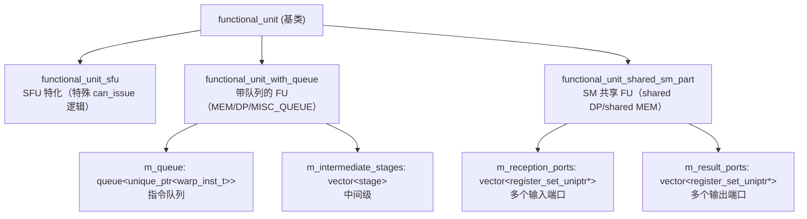

---

## 6.4 FU 创建映射（True-Path）

`Subcore::create_pipeline()` 在 True-Path 下创建的 FU 集合：

| FU 名 | 类 | Pipeline Depth | Has Queue | Queue Size | 结果去向 | 到 SM 共享 | Can Set Barriers |
|---|---|---|---|---|---|---|---|
| SP | `functional_unit` | `max_sp_latency` | No | - | `m_regular_fixed_latency_rf_write_queue` | No | Yes |
| UNIFORM | `functional_unit` | `uniform_latency` | No | - | `m_uniform_fixed_latency_rf_write_queue` | No | Yes |
| TENSOR | `functional_unit` | `tensor_latency` | No | - | `m_regular_fixed_latency_rf_write_queue` | No | Yes |
| BRANCH | `functional_unit` | `branch_latency` | No | - | `m_regular_fixed_latency_rf_write_queue` | No | Yes |
| SFU | `functional_unit_sfu` | `sfu_latency` | No | - | `m_EX_WB_sm_variable_latency_latch` | No | Yes |
| MISC_QUEUE | `functional_unit_with_queue` | `misc_queue_latency` | Yes | `misc_queue_size` | `m_EX_WB_sm_variable_latency_latch` | No | Yes |
| MISC_NO_QUEUE | `functional_unit` | `misc_no_queue_latency` | No | - | `m_regular_fixed_latency_rf_write_queue` | No | Yes |
| MEM | `functional_unit_with_queue` | 1 | Yes | `memory_subcore_queue_size` | `m_EX_MEM_shared_sm_reception_latch` | Yes | Yes |
| DP | `functional_unit_with_queue` | `dp_subcore_max_latency` | Yes | `dp_subcore_queue_size` | `m_EX_DP_shared_sm_reception_latch` | Yes | Yes |

注意：
- `is_fp32_and_int_unified_pipeline=true` 时不创建独立 INT FU，INT/PREDICATE 指令走 SP pipeline
- `is_dp_pipeline_shared_for_subcores=true` 时 DP 使用 `functional_unit_with_queue`，结果送 SM 共享

### 指令到 FU 的映射

| 指令类型 | 目标 FU | 说明 |
|---|---|---|
| `SP_OP` / `HALF_OP` | SP | FP32 和 FP16 |
| `INTP_OP` / `PREDICATE_OP` | SP | unified 模式下走 SP |
| `DP_OP` | DP | 双精度 |
| `SFU_OP` | SFU | 特殊函数 |
| `TENSOR_CORE_OP` | TENSOR | 张量核心 |
| `BRANCH_OP` | BRANCH | 分支 |
| `LOAD_OP` / `STORE_OP` / `MEMORY_BARRIER_OP` | MEM | 访存 |
| `UNIFORM_OP` | UNIFORM | 统一操作 |
| 其他 MISC 类 | MISC_QUEUE 或 MISC_NO_QUEUE | 根据指令特性 |

### 固定延迟 vs 可变延迟

| 类别 | FU | 路径 |
|---|---|---|
| 固定延迟 | SP, UNIFORM, TENSOR, BRANCH, MISC_NO_QUEUE | control → allocate → read_rf → FU → rf_write_queue → writeback |
| 可变延迟 | SFU, MISC_QUEUE | control → FU（直接 issue）→ variable_latency_latch → writeback |
| SM 共享 | MEM, DP | control → FU queue → intermediate stages → SM reception latch → SM 共享单元 → result port → writeback |

### 中间级与调度间隔（SM 共享 FU）

| FU | 中间级数 | 调度间隔 |
|---|---|---|
| MEM | `memory_intermidiate_stages_subcore_unit` | `num_cycles_to_wait_..._when_is_mem_inst` |
| DP | `dp_shared_intermidiate_stages` | `num_cycles_to_wait_..._when_is_dp_inst` |

---

## 6.5 FU 内部流水线推进（cycle()）

### 基类 functional_unit::cycle()

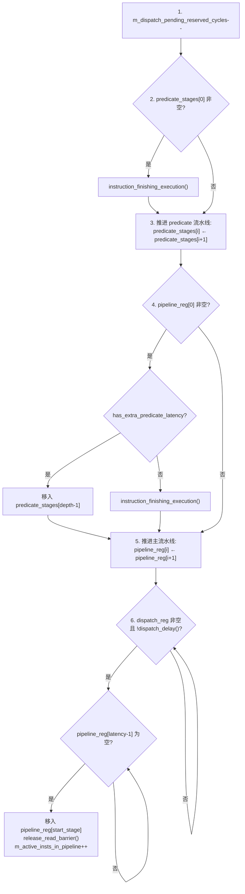

### functional_unit_with_queue::cycle()

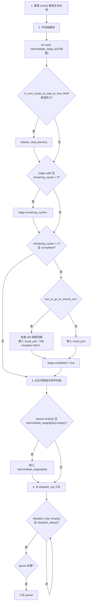

### 状态机描述

#### FU 流水线推进状态机

指令在 FU 内部的状态转换：

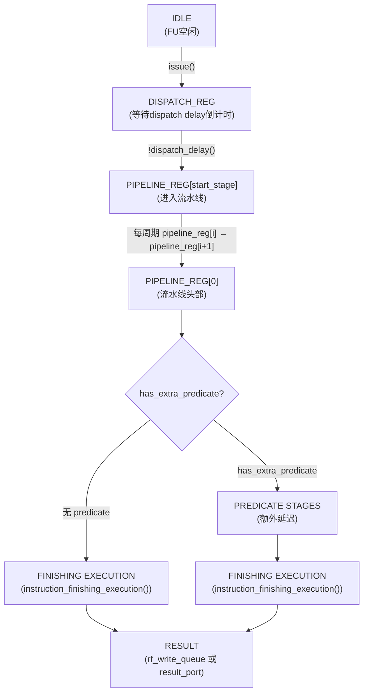

#### functional_unit_with_queue 指令流转状态机

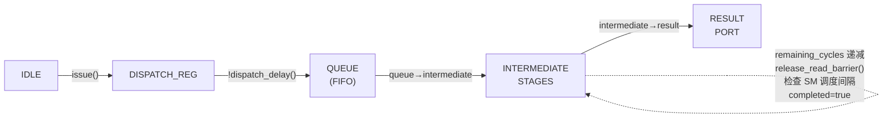

状态转换条件：

| 源状态 | 目标状态 | 触发条件 |
|---|---|---|
| IDLE | DISPATCH_REG | `issue()` 将指令从 source_reg 移入 `m_dispatch_reg` |
| DISPATCH_REG | QUEUE | `!dispatch_delay()` 且 queue 未满，指令入队 |
| QUEUE | INTERMEDIATE[last] | `!queue.empty()` 且 `intermediate_stages[last].empty()` |
| INTERMEDIATE | INTERMEDIATE[i-1] | `remaining_cycles` 递减到 0 且下一级为空 |
| INTERMEDIATE[0] | RESULT_PORT | `completed=false` 且 `has_to_go_to_shared_sm` 检查 SM 调度间隔通过 |

#### RF 读端口分配状态机

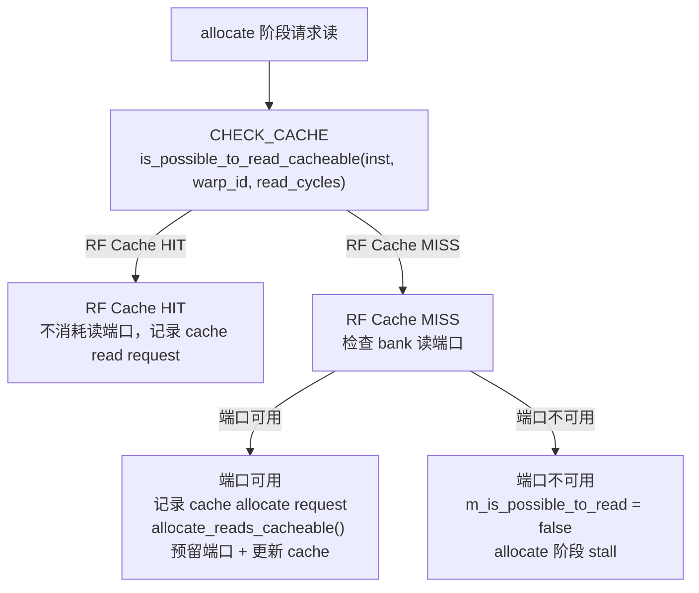

#### RF Cache Hit/Miss/Replace 状态机

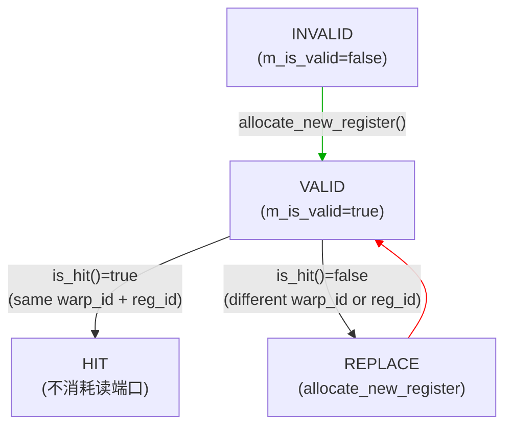

命中判定逻辑（源码 `register_file.h:101`）：
```cpp
bool Register_file_cache_entry::is_hit(unsigned int warp_id, unsigned int reg_id) {
  return m_is_valid && m_warp_id == warp_id && m_reg_id == reg_id;
}
```

---

## 6.6 Register_file Bank/Port 模型

### 模块接口

| 端口/接口 | 方向 | 说明 |
|---|---|---|
| `is_possible_to_read_cacheable(inst, warp_id, read_cycles)` | Output | 检查 RF 读端口是否可用（带 cache） |
| `is_possible_to_read_non_cacheable(inst, read_cycles)` | Output | 检查 RF 读端口是否可用（不带 cache） |
| `allocate_reads_cacheable(requests, inst, warp_id, read_cycles)` | Input | 预留读端口 + 更新 cache |
| `is_rf_bank_write_port_available_this_cycle(bank_id)` | Output | 检查写端口是否可用 |
| `allocate_rf_bank_write_port_this_cycle(bank_id)` | Input | 预留写端口 |
| `cycle()` | Input | 推进端口预留状态 |

### 结构

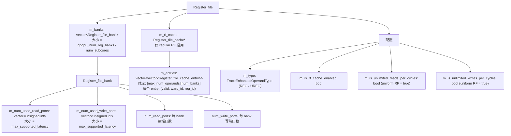

### Bank 映射

```cpp
unsigned int Register_file::calculate_target_bank(unsigned int reg_id) {
  return reg_id % m_num_banks;
}
```

### 读端口预留（cacheable 路径）

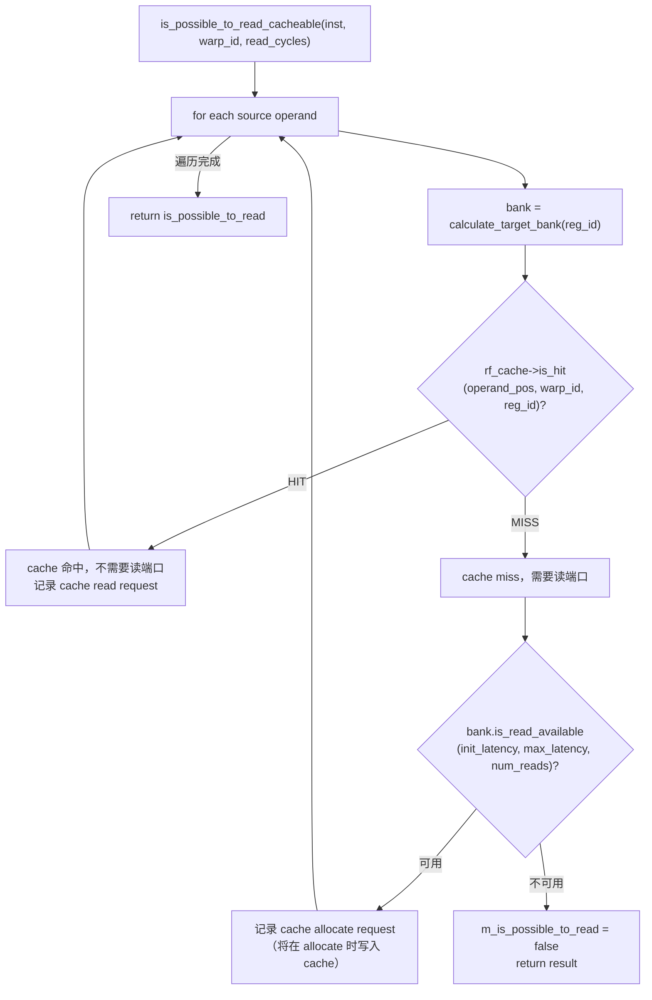

### 写端口检查（writeback 阶段）

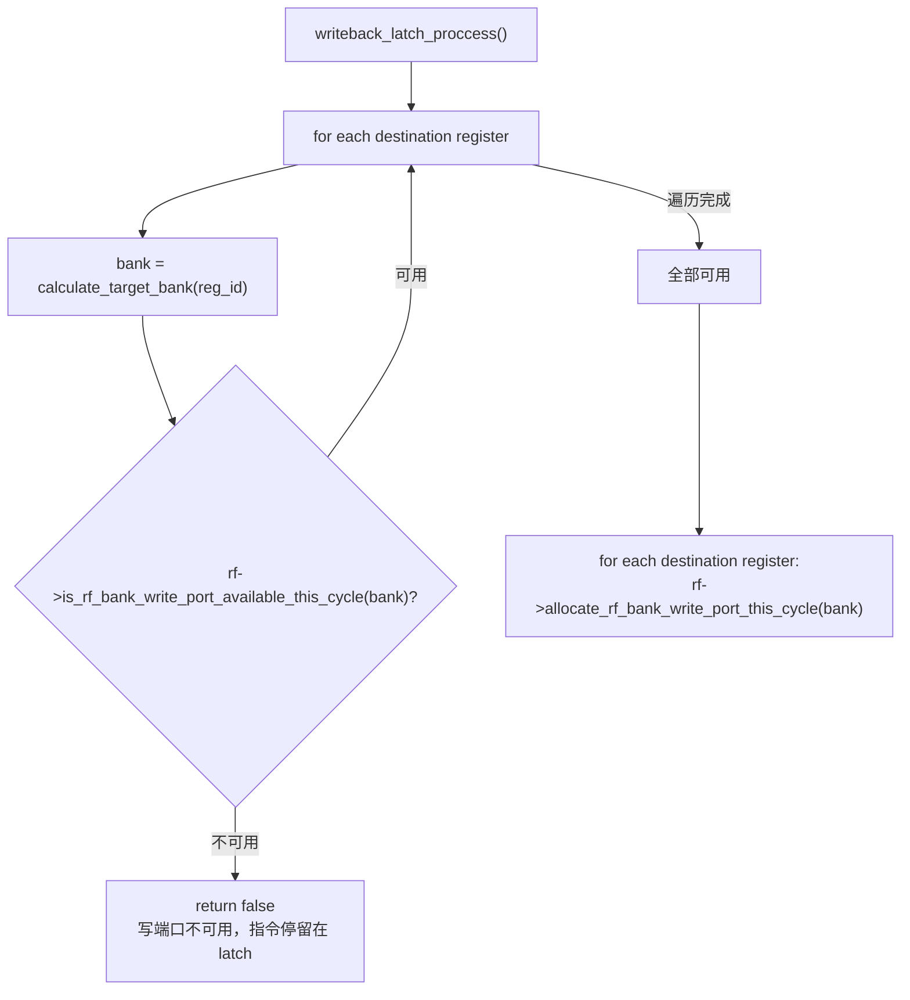

---

## 6.7 RF Cache 机制

RF Cache 是 regular RF 的读路径优化，per-operand-position per-bank 组织。

### 结构

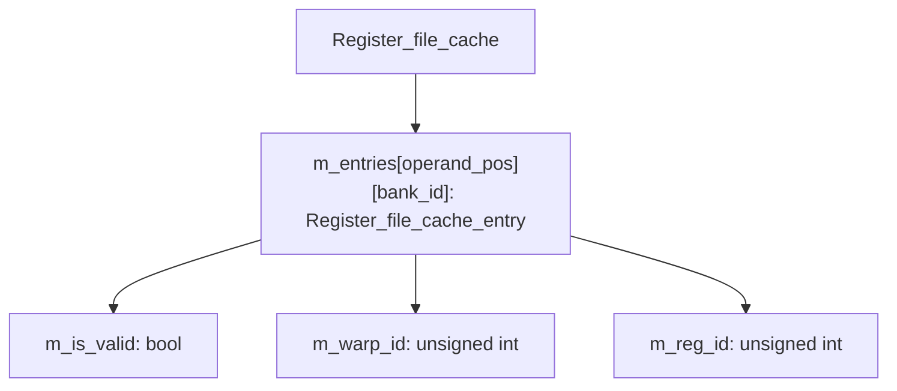

### 命中判定

```cpp
bool Register_file_cache_entry::is_hit(unsigned int warp_id, unsigned int reg_id) {
  return m_is_valid && m_warp_id == warp_id && m_reg_id == reg_id;
}
```

### 效果

- Cache 命中时：该操作数不消耗 RF bank 读端口
- Cache miss 时：消耗读端口，并在 allocate 时将 (warp_id, reg_id) 写入 cache entry
- 每个 operand position 在每个 bank 上有独立的 cache entry

---

## 6.8 Result Queue 与写回路径

### 固定延迟指令写回路径

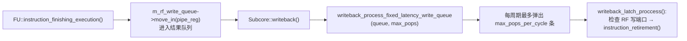

### 可变延迟指令写回路径

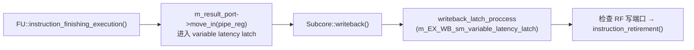

### SM 共享单元写回路径


---

## 6.9 接口时序

### RF 读请求 → Bank 仲裁 → 数据返回时序

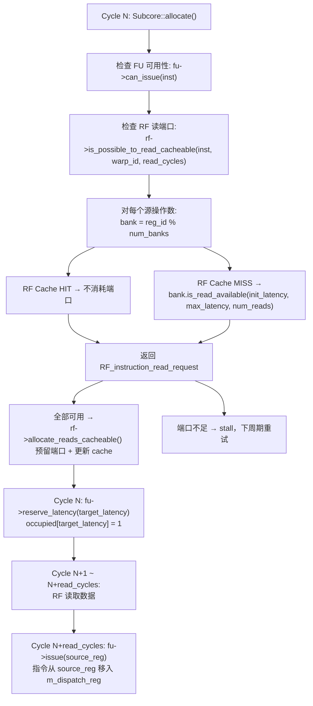

### FU Dispatch → Pipeline → Result 时序

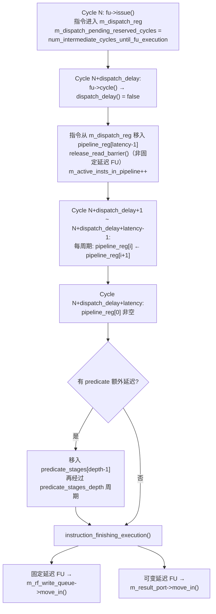

### RF 写队列弹出 → 写端口分配时序

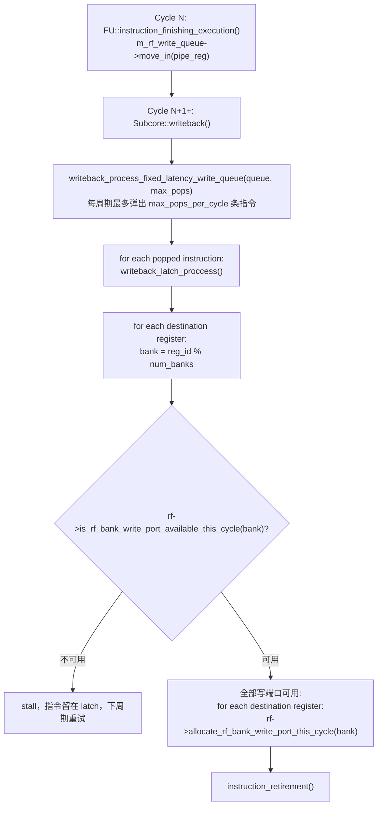

### SM 共享 FU（MEM/DP）完整时序

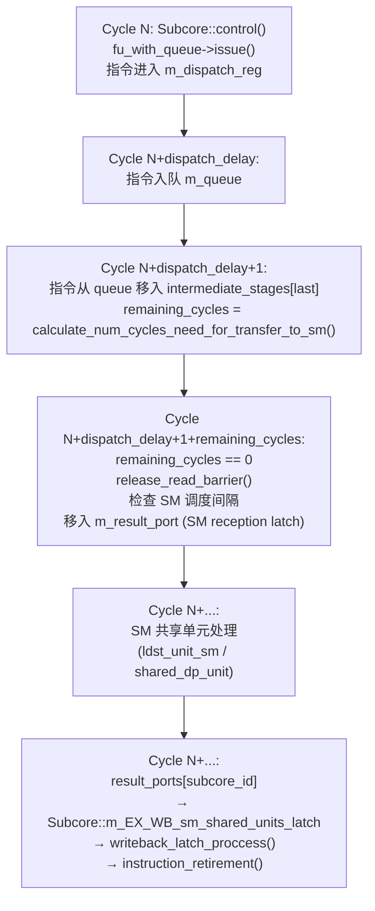

---

## 6.10 关键电路描述

### RF Bank Conflict 检测逻辑

Bank 映射规则（源码 `register_file.h:184`）：
```cpp
unsigned int Register_file::calculate_target_bank(unsigned int reg_id) {
  return reg_id % m_num_banks;
}
```

Bank 冲突检测在 `is_possible_to_read_cacheable()` / `is_possible_to_read_non_cacheable()` 中实现：

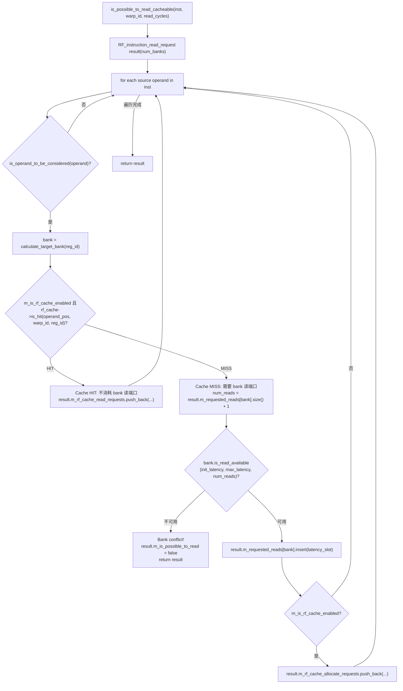

### RF Cache Hit 判定逻辑

RF Cache 采用 per-operand-position per-bank 的直接映射组织：

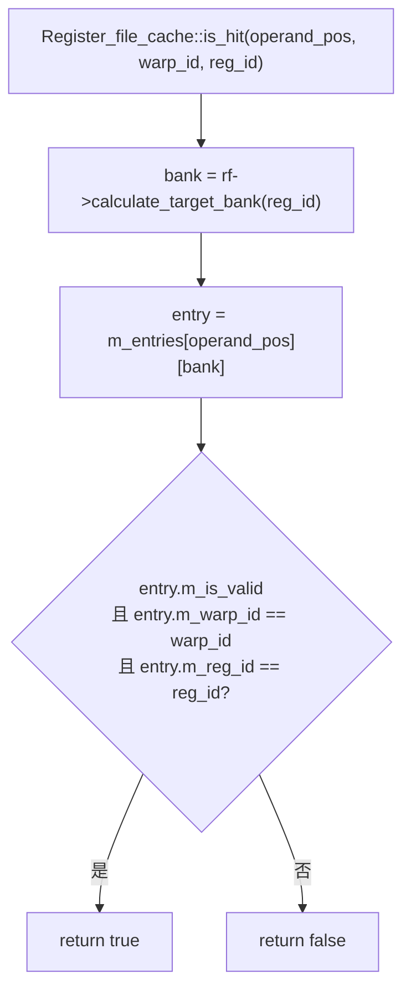

Cache 总容量 = `max_num_operands × num_banks` 个 entry，每个 entry 仅存储 `(valid, warp_id, reg_id)` 三元组。

### FU Occupied 位图检查逻辑（Initiation Interval 检查）

`occupied` 位图用于检查 FU 在目标 latency 槽位是否已被占用：

```mermaid
flowchart TD
    A["is_latency_available(target_latency)"]
    A1["return !occupied[target_latency]<br/>bitset&lt;512&gt; 的单 bit 检查"]
    B["reserve_latency(target_latency)"]
    B1["occupied[target_latency] = 1<br/>预留该槽位"]
    C["add_extra_cycle_initiation_interval()"]
    C1["在 occupied 位图中额外标记<br/>确保两条指令之间有足够间隔"]

    A --> A1
    B --> B1
    C --> C1
```

Allocate 阶段通过 `is_latency_available()` 检查目标 latency 是否空闲，若已被占用则 stall。这实现了 initiation interval 的硬件约束：同一 FU 在 `initiation_interval` 周期内不能接受新指令。

### 固定延迟结果队列槽位预留逻辑

固定延迟 FU（SP/TENSOR/BRANCH/UNIFORM/MISC_NO_QUEUE）在 allocate 阶段预留结果队列槽位：

```mermaid
flowchart TD
    START["Subcore::allocate()"]
    CALC["计算指令完成时的目标 latency:<br/>target_latency = current_cycle + fu_latency + read_cycles + ..."]
    CHECK_FU{"fu->is_latency_available(target_latency)?"}
    STALL_FU["stall（结构冒险）"]
    CHECK_Q{"rf_write_queue is full?"}
    STALL_Q["stall"]
    RESERVE["全部通过后预留:<br/>fu->reserve_latency(target_latency)<br/>指令进入 FU 流水线"]

    START --> CALC --> CHECK_FU
    CHECK_FU -->|"不可用"| STALL_FU
    CHECK_FU -->|"可用"| CHECK_Q
    CHECK_Q -->|"已满"| STALL_Q
    CHECK_Q -->|"未满"| RESERVE
```

这种预留机制确保固定延迟指令的结果在确定的周期到达 RF write queue，编译器可通过 stall count 精确覆盖 RAW 依赖。

---

## 参考文档

| 文档/资源 | 说明 |
|---|---|
| MICRO 2025 论文 | Banked RF、RF Cache、FP32/INT 统一流水线的逆向工程分析 |
| `functional_unit.h` | FU 基类及派生类定义（`functional_unit`、`functional_unit_with_queue`、`functional_unit_sfu`、`functional_unit_shared_sm_part`） |
| `functional_unit.cc` | FU 流水线推进、指令完成、read barrier 释放等实现 |
| `register_file.h` | RF 类层次定义（`Register_file`、`Register_file_bank`、`Register_file_cache`、`Register_file_cache_entry`） |
| `register_file.cc` | RF 端口分配、cache 命中检查、bank 映射等实现 |
| `shader.h` | `shader_core_config` 中 FU/RF 相关配置参数定义 |
| `abstract_hardware_model.h` | `operation_pipeline_t`、`TraceEnhancedOperandType` 等枚举定义 |

---

## 源码锚点

| 文件 | 函数/类 | 说明 |
|---|---|---|
| `functional_unit.h` | `functional_unit` | FU 基类 |
| `functional_unit.h` | `functional_unit_with_queue` | 带队列 FU |
| `functional_unit.h` | `functional_unit_sfu` | SFU 特化 |
| `functional_unit.h` | `functional_unit_shared_sm_part` | SM 共享 FU |
| `functional_unit.cc` | `functional_unit::cycle()` | 基类流水线推进 |
| `functional_unit.cc` | `functional_unit::release_read_barrier()` | read barrier 释放 |
| `functional_unit.cc` | `functional_unit::instruction_finishing_execution()` | 执行完成处理 |
| `functional_unit.cc` | `functional_unit_with_queue::cycle()` | 队列 FU 推进 |
| `register_file.h` | `Register_file` | RF 类定义 |
| `register_file.h` | `Register_file_bank` | RF bank |
| `register_file.h` | `Register_file_cache` | RF cache |
| `register_file.cc` | `Register_file::is_possible_to_read_cacheable()` | cacheable 读检查 |
| `register_file.cc` | `Register_file::cycle()` | RF 端口状态推进 |
| `subcore.cc` | `Subcore::create_pipeline()` | FU 创建 |
