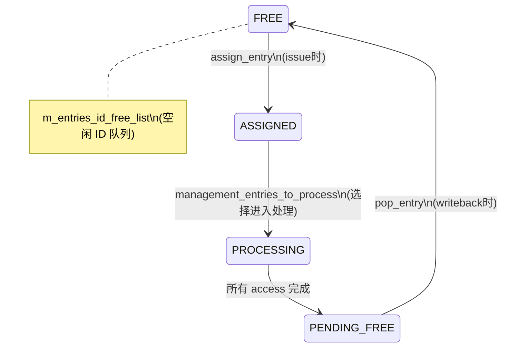
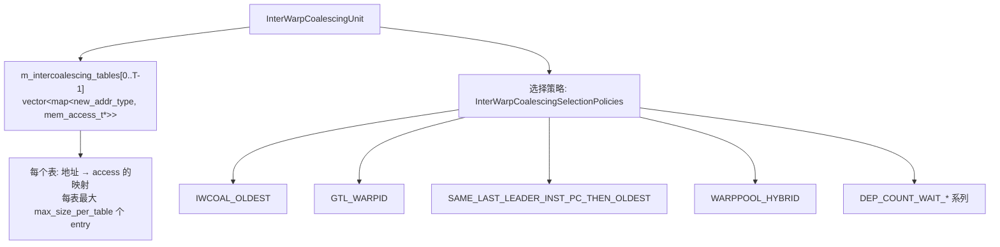
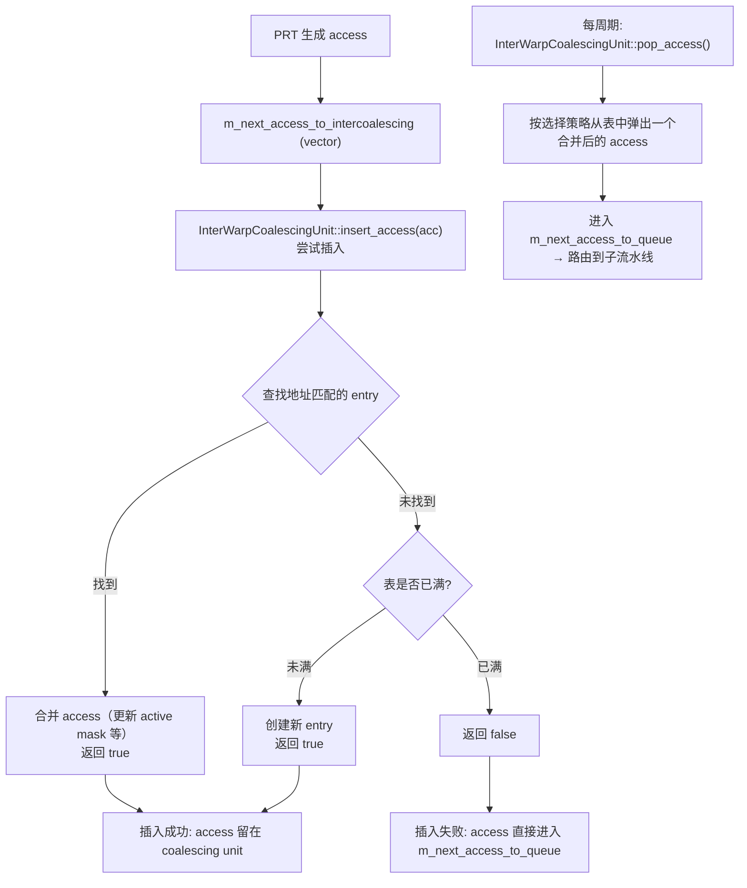
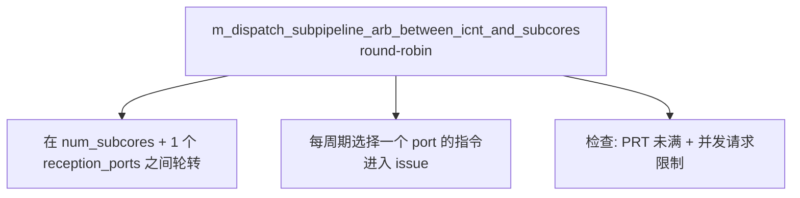
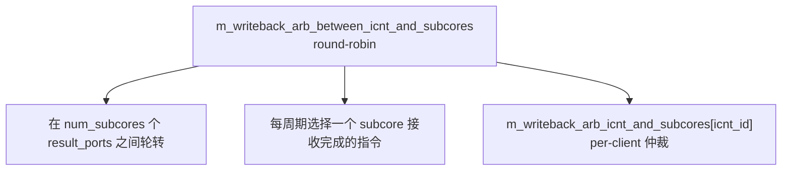

# 第 7 章：共享访存单元设计

---

## 术语说明

| 缩写/术语 | 全称 | 说明 |
|---|---|---|
| PRT | Pending Request Table | 访存指令跟踪表，每条访存指令占一个 entry，跟踪其所有 pending memory access |
| PRT Entry | PendingRequestTableEntry | PRT 中的单个条目，包含指令指针、pending 计数、分配周期等 |
| InterWarp Coalescing | Inter-Warp Memory Access Coalescing | 不同 warp 对同一 cache line 的访存请求在进入 L1D 前合并 |
| AccessQueue | Access Queue | 子流水线入口队列，按内存空间分类路由 access |
| L1D | Level-1 Data Cache | SM 级共享的一级数据缓存 |
| L1C | Level-1 Constant Cache | SM 级共享的一级常量缓存 |
| L1T | Level-1 Texture Cache | SM 级共享的一级纹理缓存 |
| SHMEM | Shared Memory | SM 级共享内存，固定延迟访问 |
| ICNT | Interconnect Network | 互连网络，连接 SM 与 L2/DRAM |
| LDGSTS | Load Global Store Shared | 异步全局加载 + 共享存储指令（Ampere+） |
| `ldst_unit_sm` | Load/Store Unit (SM-level) | SM 级共享访存单元，继承 `functional_unit_shared_sm_part` |
| `mem_access_t` | Memory Access | 单个内存访问请求，由指令的 coalescing 拆分产生 |
| `mem_fetch` | Memory Fetch | 内存请求的完整封装，包含地址、大小、类型等 |
| Round-Robin | Round-Robin Arbitration | 轮转仲裁策略，公平分配访问机会 |
| TLB | Translation Lookaside Buffer | 地址翻译缓冲，L1D 访问需经过 preTLB → postTLB |
| Bank Conflict | Bank Conflict | 共享内存 bank 冲突，增加额外延迟 |

---

## 设计规格

| 规格项 | 参数名 | 类型/来源 | 说明 |
|---|---|---|---|
| PRT 最大 entry 数 | `memory_sm_prt_size` | `shader_core_config` | SM 能同时处理的访存指令数量上限 |
| L1D 队列深度（per bank） | `sm_memory_unit_l1d_access_queue_size` | `shader_core_config` | L1D 子流水线 preTLB/postTLB 队列容量 |
| L1C 队列深度 | `sm_memory_unit_l1c_access_queue_size` | `shader_core_config` | 常量 cache 子流水线队列容量 |
| L1T 队列深度 | `sm_memory_unit_l1t_access_queue_size` | `shader_core_config` | 纹理 cache 子流水线队列容量 |
| SHMEM 队列深度 | `sm_memory_unit_shmem_access_queue_size` | `shader_core_config` | 共享内存子流水线队列容量 |
| Bypass L1D 队列深度 | `sm_memory_unit_bypass_l1d_directly_go_to_l2_access_queue_size` | `shader_core_config` | 绕过 L1D 直接到 L2 的队列容量 |
| 杂项队列深度 | `sm_memory_unit_miscellaneous_access_queue_size` | `shader_core_config` | 杂项访问队列容量 |
| InterWarp Coalescing 表数量 | `num_interwarp_coalescing_tables` | `shader_core_config` | 合并表数量 |
| 每表最大 entry 数 | `max_size_interwarp_coalescing_per_table` | `shader_core_config` | 每个合并表的最大容量 |
| L1D bank 数 | `m_L1D_config.l1_banks` | `cache_config` | L1D 的 bank 数量 |
| L1D latency queue 深度 | `maximum_l1d_latency_at_sm_structure` | `shader_core_config` | L1D 延迟队列深度 |
| SHMEM 流水线深度 | `maximum_shared_memory_latency_at_sm_structure` | `shader_core_config` | 共享内存流水线级数 |
| L1C latency queue 深度 | `constant_cache_latency_at_sm_structure` | `shader_core_config` | 常量 cache 延迟队列深度 |
| 每 bank 每周期最大 L1D 查找数 | `memory_l1d_max_lookups_per_cycle_per_bank` | `shader_core_config` | L1D 每 bank 每周期的最大访问次数 |
| SHMEM 最小延迟 | `memory_shared_memory_minimum_latency` | `shader_core_config` | 共享内存最小访问延迟 |
| L1D 最小延迟 | `memory_l1d_minimum_latency` | `shader_core_config` | L1D 最小访问延迟 |
| SHMEM 最大并发请求 | `memmory_max_concurrent_requests_shmem_per_sm` | `shader_core_config` | SM 级共享内存最大并发请求数 |
| 标准最大并发请求 | `memmory_max_concurrent_requests_standard_per_sm` | `shader_core_config` | SM 级标准访存最大并发请求数 |
| PRT 选择策略 | `prt_selection_policy` | `PRTSelectionPolicies` enum | PRT entry 选择策略 |
| InterWarp Coalescing 选择策略 | `interwarp_coalescing_selection_policy` | `InterWarpCoalescingSelectionPolicies` enum | 合并表弹出策略 |
| Subcore 数量 | `num_subcores_in_SM` | `shader_core_config` | SM 内 subcore 数量，决定输入/输出端口数 |
| LDGSTS 全局共享延迟 | `memory_global_shared_latency_for_ldgsts` | `shader_core_config` | LDGSTS 指令的全局共享延迟 |

---

## 7.1 设计思路

### 7.1.1 SM 级共享访存单元的架构动机

论文揭示了 NVIDIA GPU 访存流水线的一个关键设计：**L1D cache、shared memory、texture cache 等访存资源在 SM 级共享**，而非每个 sub-core 独立拥有。这意味着：

- 所有 sub-core 的访存指令必须**竞争**同一组 cache 端口和带宽
- 需要**仲裁机制**（round-robin）在 sub-core 之间分配访问机会
- 访存指令从 sub-core 发出到完成之间存在**跨模块延迟**（subcore → SM reception latch → ldst_unit_sm → result port → subcore writeback）

这一设计的硬件动机是 cache 面积共享：L1D cache 的面积开销远大于 RF，如果每个 sub-core 独立拥有 L1D，总面积会翻 4 倍。共享设计以调度复杂性换取面积效率。

### 7.1.2 PRT 的设计动机

PRT（Pending Request Table）是访存指令在 ldst_unit_sm 中的核心跟踪结构。论文分析了其存在的必要性：

- 每条访存指令可能产生**多个 memory access**（例如 uncoalesced load 会拆分为多个 cache line 请求）
- 这些 access 可能有不同的 cache 行为（hit/miss/bypass），完成时间不同
- PRT 为每条访存指令维护一个 entry，跟踪其所有 pending access 的完成状态
- 只有当所有 access 都完成时，指令才能退休（通过 `is_pending_to_receive_requests()` 和 `accessq_empty()` 双重检查）

PRT 的大小（`memory_sm_prt_size`）直接决定了 SM 能同时处理的访存指令数量上限，是访存吞吐量的关键瓶颈之一。

### 7.1.3 InterWarp Coalescing 的设计思想

论文发现的一个重要微架构特性：**不同 warp 对同一 cache line 的访问可以在进入 L1D 前合并**。

传统的 warp 内 coalescing（intra-warp）将同一 warp 中不同线程对相邻地址的访问合并为一次 cache line 请求，这是 GPU 编程模型的基础优化。而 InterWarp Coalescing 进一步将**不同 warp** 对同一地址的请求合并，减少 L1D cache 的访问次数。

合并的条件：
- 不同 warp 的 access 目标地址落在同一 cache line
- access 类型兼容（如多个 load 可以合并，load 和 store 通常不合并）

论文的评估显示，InterWarp Coalescing 在访存密集型 benchmark（多个 warp 遍历同一数据结构）上显著减少 L1D 冲突，提升带宽利用率。合并后的 access 携带所有参与 warp 的 PRT ID，完成时同时递减所有相关 PRT entry 的 pending 计数。

### 7.1.4 子流水线路由的设计

论文发现 ldst_unit_sm 内部按**内存空间**路由到不同的子流水线：

| 内存空间 | 子流水线 | 设计原因 |
|---|---|---|
| Global/Local | L1D（per-bank 队列） | 需要 TLB 翻译 + cache lookup，延迟最长且可变 |
| Shared Memory | 固定延迟流水线 | 地址已知、无 cache miss，但可能有 bank conflict |
| Constant | L1C 专用路径 | 只读且高命中率，独立端口避免与 global 竞争 |
| Texture | L1T 专用路径 | 空间局部性优化，独立 cache 层次 |
| Bypass L1D | 直接到 ICNT | 编译器标记不经 L1D 的请求（如 streaming access）直接发往 L2 |

这种按内存空间分离的子流水线设计，使得不同类型的访存不会相互阻塞（例如 shared memory 访问不会被 global memory miss 所阻塞）。

---

## 7.2 模块接口概览

### ldst_unit_sm

#### Input Ports

| 端口名 | 类型 | 数量 | 宽度 | 来源 | 说明 |
|---|---|---|---|---|---|
| `m_reception_ports[0..N-1]` | `register_set_uniptr*` | `num_subcores` | 1 inst/port | 各 Subcore 的 `m_memory_unit_subcore` | 访存指令从 subcore 进入 |
| `m_reception_ports[N]` | `register_set_uniptr*` | 1 | 1 inst | LDGSTS 内部通路 | LDGSTS store 阶段重新进入 |
| `m_response_fifo` | FIFO | - | - | ICNT/L2 | 访存响应从互连网络返回 |

#### Output Ports

| 端口名 | 类型 | 数量 | 宽度 | 去向 | 说明 |
|---|---|---|---|---|---|
| `m_result_ports[0..N-1]` | `register_set_uniptr*` | `num_subcores` | 1 inst/port | 各 Subcore 的 `m_EX_WB_sm_shared_units_latch` | 完成的指令返回 subcore |
| `m_icnt->push(mem_fetch*)` | 函数调用 | - | - | 互连网络 | 访存请求发往 L2/DRAM |

#### 关键配置参数

| 参数 | 说明 |
|---|---|
| `memory_sm_prt_size` | PRT 最大 entry 数 |
| `sm_memory_unit_l1d_access_queue_size` | L1D 子流水线队列深度（per bank） |
| `sm_memory_unit_l1c_access_queue_size` | L1C 子流水线队列深度 |
| `sm_memory_unit_l1t_access_queue_size` | L1T 子流水线队列深度 |
| `sm_memory_unit_shmem_access_queue_size` | 共享内存子流水线队列深度 |
| `sm_memory_unit_bypass_l1d_directly_go_to_l2_access_queue_size` | Bypass L1D 队列深度 |
| `sm_memory_unit_miscellaneous_access_queue_size` | 杂项队列深度 |
| `num_interwarp_coalescing_tables` | InterWarp Coalescing 表数量 |
| `max_size_interwarp_coalescing_per_table` | 每表最大 entry 数 |
| `m_L1D_config.l1_banks` | L1D bank 数 |
| `maximum_l1d_latency_at_sm_structure` | L1D latency queue 深度 |
| `maximum_shared_memory_latency_at_sm_structure` | 共享内存流水线深度 |
| `constant_cache_latency_at_sm_structure` | 常量 cache latency queue 深度 |
| `memory_l1d_max_lookups_per_cycle_per_bank` | 每 bank 每周期最大 L1D 查找数 |

---

## 7.3 ldst_unit_sm 总体架构

```mermaid
graph TD
    ROOT["ldst_unit_sm<br/>(继承 functional_unit_shared_sm_part)"]

    ROOT --> A["输入仲裁"]
    A --> A1["m_reception_ports[0..N]<br/>num_subcores + 1 个输入端口"]
    A --> A2["m_dispatch_subpipeline_arb_between_icnt_and_subcores<br/>分发仲裁（round-robin）"]
    A --> A3["m_writeback_arb_between_icnt_and_subcores<br/>写回仲裁（round-robin）"]

    ROOT --> B["PRT (PendingRequestTable)"]
    B --> B1["m_entries[0..max-1]<br/>PRT entry 数组"]
    B --> B2["m_entries_id_free_list<br/>空闲 entry ID 队列"]
    B --> B3["m_entries_id_pending_list_to_process<br/>待处理 entry 队列"]
    B --> B4["m_entries_id_pending_list_to_free[0..N]<br/>per-subcore 待释放队列"]
    B --> B5["m_current_entries_id_being_processed<br/>当前正在处理的 entry 集合"]

    ROOT --> C["InterWarp Coalescing"]
    C --> C1["m_intercoalescing_unit: InterWarpCoalescingUnit*"]
    C1 --> C1a["m_intercoalescing_tables[0..T-1]<br/>T 个合并表"]
    C1 --> C1b["每表: map&lt;address, mem_access_t*&gt;<br/>最大 max_size_per_table 个 entry"]
    C --> C2["m_next_access_to_intercoalescing<br/>vector&lt;mem_access_t*&gt;"]

    ROOT --> D["子流水线队列"]
    D --> D1["m_access_queue_to_l1d_preTLB[0..banks-1]<br/>L1D pre-TLB 队列（per bank）"]
    D --> D2["m_access_queue_to_l1d_postTLB[0..banks-1]<br/>L1D post-TLB 队列（per bank）"]
    D --> D3["m_access_queue_to_l1c<br/>L1C 队列"]
    D --> D4["m_access_queue_to_l1t<br/>L1T 队列"]
    D --> D5["m_access_queue_to_shmem<br/>共享内存队列"]
    D --> D6["m_access_queue_to_bypass_to_l2<br/>Bypass L1D 队列"]
    D --> D7["m_access_queue_to_miscellaneous<br/>杂项队列"]

    ROOT --> E["Cache 与 Latency Queue"]
    E --> E1["m_L1D: l1_cache*"]
    E --> E2["m_L1C: read_only_cache*"]
    E --> E3["m_L1T: tex_cache*"]
    E --> E4["l1d_latency_queue[bank][latency]<br/>L1D 延迟队列"]
    E --> E5["m_shmem_pipeline[0..latency-1]<br/>共享内存流水线"]
    E --> E6["constant_cache_l1_latency_queue[0..latency-1]<br/>常量 cache 延迟队列"]

    ROOT --> F["输出"]
    F --> F1["m_result_ports[0..N-1]<br/>返回各 subcore"]
    F --> F2["m_pending_wbs_per_subcore[0..N-1]<br/>per-subcore 待写回缓冲"]
```



### 存储结构位宽表

#### PendingRequestTableEntry 完整字段表

| 字段 | C++ 类型 | 位宽/大小 | 说明 |
|---|---|---|---|
| `m_inst` | `shared_ptr<warp_inst_t>` | 指针（64 bit + 引用计数） | 关联的访存指令共享指针 |
| `m_id` | `unsigned int` | 32 bit | PRT entry 的唯一 ID |
| `m_num_pending_accesses_to_solve` | `unsigned int` | 32 bit | 当前未完成的 memory access 数量 |
| `m_is_free` | `bool` | 1 bit | 该 entry 是否空闲 |
| `m_assignation_cycle` | `unsigned long long` | 64 bit | entry 被分配时的 GPU 周期数（用于 OLDEST 策略排序） |
| `m_total_num_accesses_to_do` | `unsigned int` | 32 bit | 该指令需要完成的总 access 数量（仅对 global memory 有效） |

#### PendingRequestTable 完整字段表

| 字段 | C++ 类型 | 位宽/大小 | 说明 |
|---|---|---|---|
| `m_max_num_entries` | `unsigned int` | 32 bit | PRT 最大容量，来自 `memory_sm_prt_size` |
| `m_max_num_entries_to_process_concurrently` | `unsigned int` | 32 bit | 同时处理的最大 entry 数 |
| `m_entries` | `vector<PendingRequestTableEntry>` | 动态，大小 = `m_max_num_entries` | PRT entry 数组 |
| `m_entries_id_free_list` | `queue<unsigned int>` | 动态 | 空闲 entry ID 队列（FIFO） |
| `m_entries_id_pending_list_to_process` | `vector<unsigned int>` | 动态 | 待处理 entry ID 列表 |
| `m_entries_id_pending_list_to_free` | `vector<queue<unsigned int>>` | 动态，大小 = `num_subcores + 1` | per-subcore 待释放 entry ID 队列 |
| `m_current_entries_id_being_processed` | `vector<unsigned int>` | 动态 | 当前正在处理的 entry ID 集合 |
| `m_entries_id_finishing_processed` | `vector<unsigned int>` | 动态 | 已完成处理的 entry ID 集合 |
| `m_selection_policy` | `PRTSelectionPolicies`（enum） | 32 bit | PRT 选择策略 |
| `m_last_warp_id` | `unsigned int` | 32 bit | 上次选择的 warp ID（用于 SAME_LAST_WARP_ID 策略） |
| `m_last_pc` | `address_type` | 64 bit | 上次选择的 PC（用于 SAME_LAST_PC 策略） |

#### InterWarpCoalescingUnit 完整字段表

| 字段 | C++ 类型 | 位宽/大小 | 说明 |
|---|---|---|---|
| `m_intercoalescing_tables` | `vector<map<new_addr_type, mem_access_t*>>` | 动态，大小 = `m_num_tables` | 合并表数组，每表为地址→access 的映射 |
| `m_num_tables` | `unsigned int` | 32 bit | 合并表数量 |
| `m_max_size_per_table` | `unsigned int` | 32 bit | 每表最大 entry 数 |
| `m_selection_policy` | `InterWarpCoalescingSelectionPolicies`（enum） | 32 bit | 全局选择策略 |
| `m_warppool_current_policy` | `InterWarpCoalescingSelectionPolicies`（enum） | 32 bit | WarpPool 混合模式下的当前策略 |
| `m_last_greedy_warp_id` | `unsigned int` | 32 bit | 上次贪心选择的 warp ID |

#### AccessQueue 字段表

| 字段 | C++ 类型 | 位宽/大小 | 说明 |
|---|---|---|---|
| `m_accesses` | `queue<mem_access_t*>` | 动态 | access 指针队列 |
| `m_max_size` | `unsigned int` | 32 bit | 队列最大容量 |

#### AccessQueue 深度参数表

| 队列 | 参数名 | 实例化方式 | 说明 |
|---|---|---|---|
| `m_access_queue_to_l1d_preTLB[bank]` | `sm_memory_unit_l1d_access_queue_size` | per-bank，共 `l1_banks` 个 | L1D pre-TLB 队列 |
| `m_access_queue_to_l1d_postTLB[bank]` | `sm_memory_unit_l1d_access_queue_size` | per-bank，共 `l1_banks` 个 | L1D post-TLB 队列 |
| `m_access_queue_to_l1c` | `sm_memory_unit_l1c_access_queue_size` | 单实例 | L1C 队列 |
| `m_access_queue_to_l1t` | `sm_memory_unit_l1t_access_queue_size` | 单实例 | L1T 队列 |
| `m_access_queue_to_shmem` | `sm_memory_unit_shmem_access_queue_size` | 单实例 | 共享内存队列 |
| `m_access_queue_to_bypass_to_l2` | `sm_memory_unit_bypass_l1d_directly_go_to_l2_access_queue_size` | 单实例 | Bypass L1D 队列 |
| `m_access_queue_to_miscellaneous` | `sm_memory_unit_miscellaneous_access_queue_size` | 单实例 | 杂项队列 |

#### L1D Latency Queue 结构

| 字段 | C++ 类型 | 维度 | 说明 |
|---|---|---|---|
| `l1d_latency_queue` | `vector<deque<shared_ptr<l1d_queue_element>>>` | [l1_banks][maximum_l1d_latency] | per-bank 的延迟队列，每个 slot 可容纳多个 mem_fetch |
| `l1d_queue_element.mfs` | `deque<mem_fetch*>` | 动态 | 单个 latency slot 中的 mem_fetch 列表 |

#### 共享内存流水线结构

| 字段 | C++ 类型 | 维度 | 说明 |
|---|---|---|---|
| `m_shmem_pipeline` | `mem_access_t**` | [maximum_shared_memory_latency] | 固定延迟流水线，每级一个 access 指针 |

#### 常量 Cache 延迟队列结构

| 字段 | C++ 类型 | 维度 | 说明 |
|---|---|---|---|
| `constant_cache_l1_latency_queue` | `deque<mem_fetch*>` | 最大 `constant_cache_latency_at_sm_structure` | 常量 cache 延迟队列 |

#### ldst_unit_sm 仲裁器字段表

| 字段 | C++ 类型 | 位宽/大小 | 说明 |
|---|---|---|---|
| `m_dispatch_subpipeline_arb_between_icnt_and_subcores` | `unsigned int` | 32 bit | 分发仲裁 round-robin 指针 |
| `m_writeback_arb_between_icnt_and_subcores` | `unsigned int` | 32 bit | 写回仲裁 round-robin 指针（subcore 间） |
| `m_writeback_arb_icnt_and_subcores` | `vector<unsigned>` | 动态，大小 = `num_subcores` | per-subcore 写回仲裁 round-robin 指针 |
| `m_num_icnt_and_subcores_clients` | `unsigned int` | 32 bit | 总客户端数 = `num_subcores + 1` |
| `m_reserved_idx_icnt_to_shmem` | `unsigned int` | 32 bit | LDGSTS 专用的 ICNT 到 SHMEM 索引 |

#### ldst_unit_sm 其他关键字段表

| 字段 | C++ 类型 | 位宽/大小 | 说明 |
|---|---|---|---|
| `m_pending_wbs_per_subcore` | `vector<unique_ptr<warp_inst_t>>` | 动态，大小 = `num_subcores` | per-subcore 待写回缓冲 |
| `m_evaluating_wb_icnt_and_subcores` | `vector<warp_inst_t>` | 动态 | 正在评估写回的指令 |
| `m_response_fifo` | `list<mem_fetch*>` | 动态 | ICNT 响应 FIFO |
| `m_next_access_to_queue` | `queue<mem_access_t*>` | 动态 | 待路由到子流水线的 access 队列 |
| `m_next_access_to_intercoalescing` | `vector<mem_access_t*>` | 动态 | 待插入 InterWarp Coalescing 的 access 列表 |
| `m_num_reserved_associativity_currently_processing` | `int` | 32 bit | 当前已预留的 L1D associativity 数量（防死锁） |
| `is_already_dispatched_to_shared_mem_this_cycle` | `bool` | 1 bit | 本周期是否已分发到共享内存 |
| `is_already_dispatched_to_texture_mem_this_cycle` | `bool` | 1 bit | 本周期是否已分发到纹理 cache |
| `is_already_dispatched_to_constant_mem_this_cycle` | `bool` | 1 bit | 本周期是否已分发到常量 cache |
| `m_ldgsts_icnt_between_ldg_and_sts_part1` | `unique_ptr<warp_inst_t>` | 指针 | LDGSTS load→store 中间缓冲 part1 |
| `m_ldgsts_icnt_between_ldg_and_sts_part2` | `unique_ptr<warp_inst_t>` | 指针 | LDGSTS load→store 中间缓冲 part2 |

---

## 7.4 ldst_unit_sm::cycle() 执行流程

该函数是共享访存单元的主循环，在 `SM::cycle()` 步骤 4 中被调用。

在每个周期，源码中的主顺序如下（与“逻辑阶段图”不同，`writeback` 在前）：

**1. 全局共享延迟队列 + Writeback 仲裁（优先）**
* `global_shared_latency_queue_cycle()`
* 按 round-robin 遍历客户端执行 `writeback(icnt_id)`，将可写回指令送回 subcore 或 LDGSTS 内部通路

**2. 处理 cache ready 返回**
* `solve_next_missed_access(m_L1T/m_L1C/m_L1D)`，对已 ready 的 cache 结果执行完成处理（含 `pending_access_logic()`）

**3. 处理 `m_response_fifo`（ICNT 响应）**
* 消费 FIFO 头部响应并执行填充/旁路/ack 处理
* 必要时调用 `pending_access_logic()` 递减相关 PRT pending 计数

**4. 推进 cache 与内部流水线**
* `cache_cycles()`：推进 SHMEM、L1T/L1C/L1D、L1D latency queue
* 重置本周期分发标志：`reset_is_this_l1d_bank_allocated_this_cycle()`

**5. 消费已路由的 AccessQueue**
* `postTLB -> L1D` 分发（每 bank 每周期受 `memory_l1d_max_lookups_per_cycle_per_bank` 限制）
* L1C/L1T 分发
* `dispatch_access_directly_to_l2()`、`execute_miscellaneous_dispatch()`、`shared_dispatch()`

**6. preTLB 推进 + 新 access 路由**
* `m_access_queue_to_l1d_preTLB[bank] -> postTLB[bank]`
* 从 `m_next_access_to_queue` 路由到 L1D/L1C/L1T/SHMEM/Bypass/Misc 对应队列

**7. PRT 管理 + InterWarp Coalescing**
* `m_prt->management_entries_to_process()` 选择 entry 进入 processing
* Coalescing unit 执行 pop/insert
* 由 PRT 生成新 access（`get_accesses_to_coalescing()` 或 `get_access_to_next_stage()`）

**8. 输入仲裁 + Issue**
* 先处理 LDGSTS 特殊内部通路（若存在）
* 再在 subcore reception ports 上按 round-robin 仲裁，检查 PRT 容量、并发请求上限和 shared pipeline 发送条件后调用 `issue(...)`

---

## 7.5 PendingRequestTable 生命周期

PRT 是访存指令在 ldst_unit_sm 中的核心跟踪结构。每条访存指令占一个 PRT entry，跟踪其所有 pending memory access。

### PRT Entry 状态机



### 详细生命周期

**1. Assign（`ldst_unit_sm::issue()` 时）**：
* 从 `m_entries_id_free_list` 取一个空闲 ID
* `PendingRequestTableEntry::assign_entry(inst)`：
  * 存储指令 shared_ptr
  * `m_is_free = false`
  * `m_num_pending_accesses_to_solve = 0`
  * `m_total_num_accesses_to_do = inst->accessq_count()`
* 将 ID 加入 `m_entries_id_pending_list_to_process`

**2. Select for Processing（`management_entries_to_process()`）**：
* 从 `m_entries_id_pending_list_to_process` 中按策略选择 entry
* 选中的 entry 加入 `m_current_entries_id_being_processed`
* 对 L1D 目标的 entry：预留 L1D associativity

**3. Generate Accesses（`get_next_processed_access()`）**：
* 从指令的 `accessq` 中逐个弹出 `mem_access_t`
* 每弹出一个 access：`increment_num_pending_accesses_to_solve()`
* 设置 L1D bank、bypass flag 等属性
* 最后一个 access 弹出时标记 `is_last_access`

**4. Solve Access（`pending_access_logic()` → `PRT::solve_access()`）**：
* `decrement_num_pending_accesses_to_solve()`
* 检查是否完成：`!is_pending_to_receive_requests() && accessq_empty()`
  * `is_pending_to_receive_requests()`：`m_num_pending_accesses_to_solve > 0`
* 完成时：将 entry ID 加入 `m_entries_id_pending_list_to_free[subcore_id]`

**5. Pop/Release（`writeback()` → `PRT::pop_entries()`）**：
* 从 `m_entries_id_pending_list_to_free[icnt_id]` 取出完成的 entry
* `pop_entry(icnt_id)`：
  * 取出指令 shared_ptr
  * Store 指令或 skip_wb 指令：直接调用 `SM::instruction_retirement()` 退休
  * LDGSTS load 阶段：保留 PRT entry 供 store 阶段复用
  * 普通 load 指令：释放 entry，ID 返回 `m_entries_id_free_list`
* 将指令放入 `m_pending_wbs_per_subcore[icnt_id]`
* 最终移入 `m_result_ports[icnt_id]` 返回 subcore

---

## 7.6 AccessQueue 子流水线

每个内存空间有独立的 AccessQueue，控制 access 进入对应 cache/pipeline 的速率。

### AccessQueue 结构

```cpp
class AccessQueue {
  std::queue<mem_access_t*> m_accesses;
  unsigned int m_max_size;  // 队列容量
};
```

### 各子流水线

| 子流水线 | 队列 | Cache/Pipeline | 说明 |
|---|---|---|---|
| L1D | `m_access_queue_to_l1d_preTLB[bank]` → `postTLB[bank]` | `m_L1D` + `l1d_latency_queue` | per-bank 队列，经 TLB 后进入 latency queue |
| Shared Memory | `m_access_queue_to_shmem` | `m_shmem_pipeline[latency]` | 固定延迟流水线，bank conflict 增加延迟 |
| L1C (Constant) | `m_access_queue_to_l1c` | `m_L1C` + `constant_cache_l1_latency_queue` | 常量 cache |
| L1T (Texture) | `m_access_queue_to_l1t` | `m_L1T` | 纹理 cache |
| Bypass L1D | `m_access_queue_to_bypass_to_l2` | 直接 → ICNT | 绕过 L1D 直接访问 L2 |
| Miscellaneous | `m_access_queue_to_miscellaneous` | - | 杂项访问 |

---

## 7.7 InterWarp Coalescing 机制

在 `is_interwarp_coalescing_enabled=true` 下，来自不同 warp 的访存 access 在进入子流水线前尝试合并。

### 结构



### 工作流程



### 合并效果

- 多个 warp 访问同一 cache line 的 access 被合并为一个
- 合并后的 access 携带所有参与 warp 的 PRT ID，完成时递减所有相关 PRT entry 的 pending 计数
- 减少 L1D 访问次数，提高带宽利用率

---

## 7.8 仲裁策略
<!-- anchor:prt-selection-strategies -->

### 输入仲裁（Dispatch）



### 输出仲裁（Writeback）



### PRT 选择策略

| 策略 | 说明 |
|---|---|
| `OLDEST` | 选择最老的 entry（按分配周期） |
| `SAME_LAST_WARP_ID_THEN_OLDEST` | 优先选择与上次相同 warp 的 entry，否则最老 |
| `SAME_LAST_INST_PC_THEN_OLDEST` | 优先选择与上次相同 PC 的 entry，否则最老 |
| `WARPID_N_CLUSTERS_WITH_OLDEST` | 16 个 cluster，cluster 间轮转，cluster 内最老 |
| `DEP_COUNT_WAIT_GENERIC_THEN_OLDEST` | 按依赖计数排序，否则最老 |
| `DEP_COUNT_WAIT_CHECKING_WARP_ID_THEN_OLDEST` | 按依赖计数 + warp ID 排序 |

---

## 7.9 LOOG + VPREG 对 pending writes key 的影响

在 `is_loog_enabled=true` 和 `is_vpreg_enabled=true` 下：

* **Pending writes first key**：使用 `m_cu_rrs_id`（LOOG 提供的资源 ID）
* **Pending writes second key**：使用 `vpreg_virtual_out[idx]`（VPREG 提供的虚拟寄存器输出）

这两个 key 影响 PRT 中 pending write 的匹配和合并逻辑。

---

## 接口时序

### 指令到达→PRT 分配→Access 生成→路由→完成→Writeback 全流程时序

```
Cycle 0:  Subcore MEM FU → m_reception_ports[subcore_id] (指令到达)
Cycle 1:  ldst_unit_sm::cycle() 步骤 8: 输入仲裁 (round-robin)
          → issue(): PRT assign_entry(inst), 指令进入 m_entries_id_pending_list_to_process
Cycle 2:  步骤 7: management_entries_to_process() 按策略选择 entry 进入 processing
          → get_next_processed_access(): 从 accessq 弹出 mem_access_t
          → InterWarp Coalescing insert 或直接进入 m_next_access_to_queue
Cycle 3:  步骤 6: 路由到子流水线 (L1D/L1C/L1T/SHMEM/Bypass)
          → L1D: m_access_queue_to_l1d_preTLB[bank]
Cycle 4:  步骤 6: preTLB → postTLB
Cycle 5:  步骤 5: postTLB → L1D cache access (受 max_lookups_per_cycle_per_bank 限制)
          → Hit: 进入 l1d_latency_queue[bank]
          → Miss: 发往 ICNT (m_icnt->push)
Cycle 5+N: L1D latency queue 推进 (N = memory_l1d_minimum_latency)
          → pending_access_logic(): decrement_num_pending_accesses_to_solve()
          → 若所有 access 完成: entry 进入 m_entries_id_pending_list_to_free[subcore_id]
Cycle 5+N+1: 步骤 1: writeback() round-robin 仲裁
          → pop_entry(): 取出指令, 放入 m_result_ports[subcore_id]
          → 指令返回 Subcore 的 m_EX_WB_sm_shared_units_latch
```

### L1D 访问时序（per-bank）

```
Cycle 0: access 进入 m_access_queue_to_l1d_preTLB[bank]
Cycle 1: preTLB → postTLB (TLB 翻译)
Cycle 2: postTLB → cache_access (受 max_lookups_per_cycle_per_bank 限制)
         → Hit:  进入 l1d_latency_queue[bank][0]
         → Miss: 生成 mem_fetch, push 到 ICNT
         → Reserved: 进入 l1d_latency_queue 等待 fill
Cycle 2+L: l1d_latency_queue 推进 (L = memory_l1d_minimum_latency)
         → 到达队尾: pending_access_logic() 递减 PRT pending 计数
```

### 共享内存访问时序

```
Cycle 0: access 进入 m_access_queue_to_shmem
Cycle 1: shared_dispatch(): access 进入 m_shmem_pipeline[0]
         (每周期仅一个 access, is_already_dispatched_to_shared_mem_this_cycle 标志)
Cycle 1+L: m_shmem_pipeline 推进 (L = memory_shared_memory_minimum_latency)
         → bank conflict 时额外增加延迟
         → 到达队尾: pending_access_logic() 递减 PRT pending 计数
```

### Writeback 仲裁时序

```
每周期 ldst_unit_sm::cycle() 步骤 1:
  for icnt_id in round_robin(m_writeback_arb_between_icnt_and_subcores, num_subcores):
    if m_entries_id_pending_list_to_free[icnt_id] 非空:
      pop_entry(icnt_id) → 取出完成的指令
      → Store/skip_wb: 直接 SM::instruction_retirement()
      → Load: 放入 m_pending_wbs_per_subcore[icnt_id]
    if m_pending_wbs_per_subcore[icnt_id] 非空 && m_result_ports[icnt_id] 有空位:
      移入 m_result_ports[icnt_id] → 返回 Subcore
```

---

## 关键电路描述

### PRT 选择策略逻辑

`PendingRequestTable::management_entries_to_process()` 从 `m_entries_id_pending_list_to_process` 中按策略选择 entry：

```
OLDEST:
  遍历所有 pending entry, 选择 m_assignation_cycle 最小的

SAME_LAST_WARP_ID_THEN_OLDEST:
  1. 优先选择 warp_id == m_last_warp_id 的 entry
  2. 若无匹配, 回退到 OLDEST

SAME_LAST_INST_PC_THEN_OLDEST:
  1. 优先选择 PC == m_last_pc 的 entry
  2. 若无匹配, 回退到 OLDEST

WARPID_N_CLUSTERS_WITH_OLDEST:
  1. 将 warp_id 映射到 16 个 cluster (warp_id % 16)
  2. cluster 间 round-robin 轮转
  3. cluster 内选择最老的 entry

DEP_COUNT_WAIT_*:
  1. 查询 InterWarp_Coalescing_Waiting_Dep_Counters 获取依赖计数
  2. 按依赖计数排序（计数越高优先级越高）
  3. 相同计数时回退到 OLDEST
```

### InterWarp Coalescing 地址比较逻辑

```cpp
// InterWarpCoalescingUnit::insert_access(acc)
new_addr_type block_addr = acc->get_addr() & ~(cache_line_size - 1);  // cache line 对齐
for (auto& table : m_intercoalescing_tables) {
    auto it = table.find(block_addr);
    if (it != table.end()) {
        // 地址匹配: 合并 access (更新 active mask, 添加 PRT ID)
        merge_access(it->second, acc);
        return true;
    }
}
// 未匹配: 若表未满则创建新 entry
```

硬件等效：cache line 地址的 CAM（Content-Addressable Memory）查找，每个表一个 CAM。

### 输入/输出仲裁器逻辑（Round-Robin）

```
输入仲裁 (m_dispatch_subpipeline_arb_between_icnt_and_subcores):
  ptr = (ptr + 1) % (num_subcores + 1)  // +1 for LDGSTS reentry port
  遍历 num_subcores+1 个端口, 从 ptr 开始
  选择第一个有指令且 PRT 未满的端口

输出仲裁 (m_writeback_arb_between_icnt_and_subcores):
  ptr = (ptr + 1) % num_subcores
  遍历 num_subcores 个端口, 从 ptr 开始
  选择第一个有完成指令的端口
```

### 访存空间路由逻辑

```
根据 mem_access_t 的 memory_space 路由到对应子流水线:

Global/Local memory → m_access_queue_to_l1d_preTLB[bank]
                      (bank = addr % l1_banks)
Shared memory      → m_access_queue_to_shmem
Constant memory    → m_access_queue_to_l1c
Texture memory     → m_access_queue_to_l1t
Bypass L1D         → m_access_queue_to_bypass_to_l2
其他               → m_access_queue_to_miscellaneous
```

---

## 参考文档

- [1] Rodrigo Huerta et al., "Demystifying NVIDIA GPU Internals to Enable Reliable GPU Simulation," MICRO 2025
- [2] NVIDIA Turing Architecture Whitepaper — Memory Subsystem 章节
- [3] NVIDIA Ampere Architecture Whitepaper — L1 Data Cache / Shared Memory 章节
- [4] 本项目 `docs/detailed-design/02-SM顶层设计.md` — SM::cycle() 步骤 4 调用 ldst_unit_sm
- [5] 本项目 `docs/detailed-design/03-Subcore流水线设计.md` — MEM FU 发射到共享访存单元

---

## 源码锚点

| 文件 | 函数/类 | 说明 |
|---|---|---|
| `ldst_unit_sm.h` | `ldst_unit_sm` | 共享访存单元类定义 |
| `ldst_unit_sm.h` | `PendingRequestTable` | PRT 类定义 |
| `ldst_unit_sm.h` | `PendingRequestTableEntry` | PRT entry |
| `ldst_unit_sm.h` | `InterWarpCoalescingUnit` | InterWarp Coalescing |
| `ldst_unit_sm.h` | `AccessQueue` | 子流水线队列 |
| `ldst_unit_sm.cc` | `ldst_unit_sm::cycle()` | 主循环 |
| `ldst_unit_sm.cc` | `ldst_unit_sm::issue()` | 指令接收 + PRT 分配 |
| `ldst_unit_sm.cc` | `ldst_unit_sm::writeback()` | 写回仲裁 |
| `ldst_unit_sm.cc` | `ldst_unit_sm::pending_access_logic()` | access 完成处理 |
| `ldst_unit_sm.cc` | `ldst_unit_sm::dispatch_to_memory_access_queue_l1Dcache()` | L1D 分发 |
| `ldst_unit_sm.cc` | `ldst_unit_sm::cache_cycles()` | cache 推进 |
| `ldst_unit_sm.cc` | `ldst_unit_sm::L1_latency_queue_cycle()` | L1D latency queue 推进 |
| `ldst_unit_sm.cc` | `PendingRequestTable::assign_entry()` | PRT 分配 |
| `ldst_unit_sm.cc` | `PendingRequestTable::solve_access()` | PRT access 完成 |
| `ldst_unit_sm.cc` | `PendingRequestTable::pop_entry()` | PRT 释放 |
| `ldst_unit_sm.cc` | `PendingRequestTable::management_entries_to_process()` | PRT 选择策略 |
